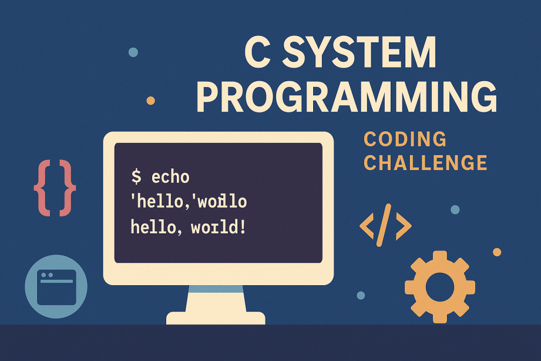

# Building Your Own Shell: A Fun Journey into System Programming

<div 
    class="text-center"
>
    
</div>


*Ever wondered what happens when you type `ls` and hit Enter? Let's satisfy that curiosity by building our own shell!*

## The "Why" Behind the Madness

Most developers spend years working with shells—Bash, Zsh—but rarely understand what's happening under the hood. Sure, we know about processes, file descriptors, and system calls, but the actual mechanics of how a shell works? That's often a black box.

The [codingchallenges.fyi shell challenge](https://codingchallenges.fyi/challenges/challenge-shell) provides the perfect opportunity to satisfy this curiosity. It's a chance to peel back the layers and understand the fundamentals that power every terminal session.

## What is a Shell, Really?

When you type `ls -la`, here's what happens:

1. **Read**: The shell reads your input from stdin
2. **Parse**: It breaks your command into tokens (`ls`, `-la`)
3. **Execute**: It finds the `ls` program and runs it with `-la` as arguments
4. **Wait**: It waits for the program to finish
5. **Repeat**: It shows a new prompt, ready for your next command

Simple, right? But the devil is in the details.

## The Journey Begins: [ccsh](https://github.com/Encryptioner/ccsh-shell)

This guide walks through building **ccsh** (Compact C Shell)—a minimal but functional Unix-like shell. Here's what you'll learn along the way:

## Why C?

C is the lingua franca of Unix systems. Every Linux distribution, macOS, and BSD variant comes with a C compiler. This means your shell can run anywhere without dependencies.

But more importantly, C gives you direct access to the system calls that power everything:
- `fork()` and `exec()` for process creation
- `pipe()` for inter-process communication  
- `dup2()` for file descriptor manipulation
- `waitpid()` for process synchronization
- `signal()` for handling interrupts

These are the same system calls that Bash, Zsh, and every other shell use under the hood.

## AI as Your Learning Partner

Here's the honest truth: **AI can generate most of your code, but you should understand every line.**

### How AI Can Help You:

- **Generated boilerplate code structure** - Don't start from scratch
- **Explained complex system calls** - When you're stuck on `fork()` vs `exec()`
- **Debugged memory management issues** - C's manual memory management is tricky
- **Suggested best practices** - Error handling, code organization, security considerations

### The Key Insight:

**AI is a tool, not a replacement.** Understanding the fundamentals is crucial. Here's what I learned:

- **80% understanding is enough** - If this isn't your core job, you don't need to memorize every system call
- **AI accelerates learning** - When you know the basics, AI can help you build faster
- **Fundamentals matter** - You still need to understand what `fork()` does, even if AI wrote the code

### Recommended Approach:

1. **Start with understanding** - Learn what each system call does conceptually
2. **Use AI for implementation** - Let AI handle the boilerplate and edge cases
3. **Review and modify** - Understand AI generated lines. If necessary, get clarification from alternate source
4. **Test and debug** - Break things to understand them better

*"AI can generate the code, but you should understand most of the lines. That's the sweet spot."*

## Building the Shell

This implementation uses a single `main.c` file for simplicity. Here's how to build it:

### What is a Makefile?

A Makefile is a configuration file that tells the [make](https://faculty.cs.niu.edu/~hutchins/csci480/make.htm) utility how to build your project. It's like a recipe that automates the compilation process. Instead of typing long gcc commands, you just run `make`.

### Simple Build
```bash
gcc -Wall -Wextra -std=c99 -g main.c -o ccsh -lreadline
```

**What each flag does:**
- `-Wall -Wextra`: Enable all warning messages
- `-std=c99`: Use C99 standard
- `-g`: Include debug symbols
- `-lreadline`: Link against the readline library (for command history)

### With Makefile
```makefile
# Compiler and flags
CC = gcc
CFLAGS = -Wall -Wextra -std=c99 -g
LDFLAGS = -lreadline

# Build target: ccsh depends on main.c
ccsh: main.c
	$(CC) $(CFLAGS) -o ccsh main.c $(LDFLAGS)

# Clean up build artifacts
clean:
	rm -f ccsh

# Install to system (optional)
install: ccsh
	cp ccsh ~/.local/bin/
```

**How it works:**
- `CC = gcc`: Define the compiler
- `CFLAGS`: Compiler flags for warnings and standards
- `LDFLAGS`: Linker flags for external libraries
- `ccsh: main.c`: Target `ccsh` depends on `main.c`
- `clean`: Remove built files

### Building and Running
```bash
# Build the shell
make

# Run the shell
./ccsh

# Clean up
make clean
```

## Cool Features to Implement

### 1. Built-in Commands
```bash
cd /path/to/directory    # Change directory
pwd                      # Print working directory
exit                     # Exit shell
jobs                     # List background jobs
fg %1                    # Bring job to foreground
help                     # Show help information
```

### 2. Alias System
```bash
alias ll="ls -lah"       # Create alias
alias                    # List all aliases
unalias ll               # Remove alias
```

### 3. Background Job Management
```bash
sleep 10 &               # Run in background
jobs                     # List background jobs
fg %1                    # Bring to foreground
```

### 4. I/O Redirection
```bash
ls > output.txt          # Redirect output
cat < input.txt          # Redirect input
echo "hello" >> log.txt  # Append output
```

### 5. Globbing Support
```bash
ls *.txt                 # List all .txt files
cp file?.txt backup/     # Copy files matching pattern
```

## The "Aha!" Moments

### Process Groups and Sessions
Understanding how `Ctrl+C` works becomes clear when you implement it. When you press `Ctrl+C`, the kernel sends a SIGINT to the entire process group. The shell needs to:
1. Create a new process group for each command
2. Handle signals appropriately
3. Restore the shell's process group when the command finishes

### Environment Variables
Most developers know about `PATH`, but seeing how the shell searches for executables is enlightening. It's just a simple loop through directories, checking if the file exists and is executable.

## Common Challenges You'll Face

### Memory Management Nightmares
C doesn't have garbage collection, so every `malloc()` needs a corresponding `free()`. With complex command parsing and multiple processes, memory leaks were a constant threat.

### Signal Handling Complexity
Getting `Ctrl+C` to work correctly was surprisingly tricky. The shell needs to:
- Ignore SIGINT for itself
- Forward SIGINT to child processes
- Restore signal handlers after child completion
- Handle signals during pipeline execution

### Cross-Platform Quirks
While C is portable, Unix systems have subtle differences:
- Different signal behavior between Linux and macOS
- Varying limits on file descriptors
- Different implementations of `readline`

## Deep Dive: How C Talks to the Operating System

Let's trace through what happens when you type `ls -la` in your shell:

### 1. The Fork-Exec Dance

```c
pid_t pid = fork();
if (pid == 0) {
    // Child process
    execvp(expanded[0], expanded);
    perror("execvp");
    exit(1);
} else if (pid > 0) {
    // Parent process
    if (background) {
        // Background job
        printf("[%d] %d\n", job_count, pid);
        add_job(pid, line);
    } else {
        // Foreground job - wait for completion
        int status;
        waitpid(pid, &status, 0);
    }
}
```

**What's happening:**
- `fork()` creates an exact copy of the current process
- The child gets a new process ID but identical memory
- `execvp()` replaces the child's memory with the `ls` program
- The parent waits for the child to finish

### 2. How Redirection Works

When you type `ls > output.txt`, here's what happens:

```c
/* Handle output redirection */
if (outfile) {
    int flags = O_WRONLY | O_CREAT;
    if (append) flags |= O_APPEND;
    else flags |= O_TRUNC;
    
    int fd = open(outfile, flags, 0644);
    if (fd == -1) { 
        perror("output"); 
        exit(1); 
    }
    dup2(fd, STDOUT_FILENO);
    close(fd);
}
```

The magic is `dup2(fd, STDOUT_FILENO)`. This makes file descriptor 1 (stdout) point to the same place as our file descriptor.

### 3. Globbing Implementation

For `ls *.txt`:

```c
void expand_globs(char** args, char** expanded_args, int* expanded_count) {
    *expanded_count = 0;
    glob_t results;
    results.gl_offs = 0;
    results.gl_pathc = 0;
    results.gl_pathv = NULL;

    for (int i = 0; args[i] != NULL; i++) {
        int flags = GLOB_TILDE;  /* Expand ~ to home directory */
        if (strchr(args[i], '*') || strchr(args[i], '?')) {
            /* Pattern contains glob characters */
            if (*expanded_count > 0) flags |= GLOB_APPEND;
            if (glob(args[i], flags, NULL, &results) != 0) {
                /* Glob failed, use original argument */
                expanded_args[(*expanded_count)++] = args[i];
            } else {
                /* Add all matched files */
                for (size_t j = 0; j < results.gl_pathc; j++) {
                    expanded_args[(*expanded_count)++] = results.gl_pathv[j];
                }
            }
        } else {
            /* No glob characters, use as-is */
            expanded_args[(*expanded_count)++] = args[i];
        }
    }
    expanded_args[*expanded_count] = NULL;
    
    /* Free the glob structure */
    if (results.gl_pathv != NULL) {
        globfree(&results);
    }
}
```

## What You'll Learn About Real Shells

Building your own shell gives you a new appreciation for tools like Bash and Zsh. They handle edge cases you might never consider:
- Complex quoting rules
- Job control with multiple background processes
- Signal handling in pipelines
- Performance optimizations
- Cross-platform compatibility

## The Takeaway

Building your own shell isn't just an academic exercise. It's a practical way to understand:
- **Process management**: How the OS handles processes
- **I/O systems**: File descriptors, pipes, redirection
- **Signal handling**: How programs communicate with the OS
- **System calls**: The interface between user and kernel space
- **Build systems**: How to create robust, portable software

## Try It Yourself

If you're interested in low-level programming, building a shell is highly recommended. Start simple:
1. Basic command execution
2. Add argument parsing
3. Implement I/O redirection
4. Add pipes
5. Build in job control

The [codingchallenges.fyi shell challenge](https://codingchallenges.fyi/challenges/challenge-shell) is an excellent starting point. You can also check:
- [Sample Shell Implementation](https://github.com/Encryptioner/ccsh-shell)
- [Unix Programming Manual](https://man7.org/linux/man-pages/)

## What's Next?

Consider adding these features to your shell:
- Tab completion
- Better error handling
- More built-in commands
- Scripting capabilities
- Performance optimizations

The learning experience is the real reward. Understanding how the tools you use daily actually work makes you a better engineer.

---

*The next time you type a command, take a moment to appreciate the complexity hidden behind that simple prompt. And maybe, just maybe, consider building your own shell to see what's really happening under the hood.*

*Happy coding! 🐚* 

## End:

That's all!

We hope you've found this guide useful. Try building your own shell if you haven't already. Feel free to share your thoughts in the comments below.

