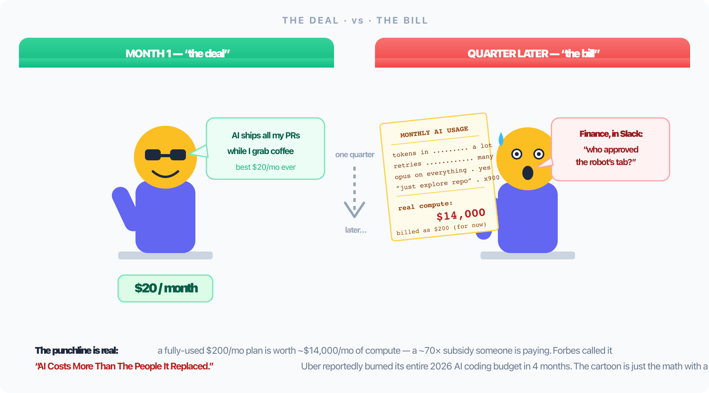
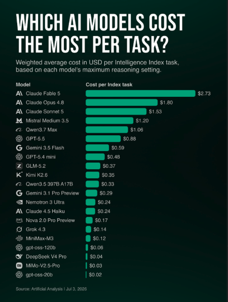

## Slide 1: Title Slide

# Token Economics
## Better Results, Fewer Tokens

**Presented by:** Mir Mursalin Ankur & Arafat Arafat Hossain
**Lead Software Engineer, Nerddevs — Now leading a team that ships more code through AI agents than by hand.**

*Every AI coding session has a meter running. Most teams never look at it until the bill arrives.*

---

## Slide 2: The Moment Most Teams Notice the Meter

# The Bill Nobody Saw Coming



*A $200/mo plan ≈ $14,000/mo of real compute — a ~70× subsidy someone is paying.*

Community estimates put a heavily-used $200/mo plan at **$14,000–35,000/mo of real compute** — estimates disagree 2×, but the shape holds: sticker and consumption aren't in the same order of magnitude. Someone is paying the difference.

**Forbes · Jul 2026:** "AI Costs More Than The People It Replaced." Uber reportedly burned its whole 2026 AI coding budget in **4 months**.

**GitHub Copilot, Reddit:** one developer who went from **~$39** subscription to pay-as-you-go got a bill of **~$47,000**.

---

## Slide 3: The Hidden Meter

# Every AI Session Has a Meter Running

- We watch output quality. We ignore the token counter.
- Then the monthly bill — or **"context limit reached"** — shows up.
- Token discipline isn't a personal habit — it's a **team cost lever**.

**The shift:** From "is the answer right?" → to "is the answer right, arrived at cheaply, on the first try?"

---

## Slide 4: The Real Cost Equation

# Cost ≠ Price Per Token

```
cost = (price per token) × (tokens per task) × (attempts)
# Factor 1 is the vendor's. Factors 2 & 3 are yours — and where the real money moves.
```

1. **Price / token** — Advertised. Vendor-controlled.
2. **Tokens / task** — Your prompt, context, scaffolding.
3. **Attempts** — Retries, re-asks, re-derivation.

**Factor 3 is bigger than it looks:** coding is the **#1 use case** for AI agents industry-wide, and "fixing errors" alone is **~10% of enterprise API traffic** (Anthropic Economic Index). A meaningful slice of the industry's token spend is *attempts* — paying again for something that didn't work the first time.

---

## Slide 5: Part Two — The Method

# Explore → Plan → Execute → Verify

- **Explore — scope it yourself.** Never "fix the payment bug"; point it at the component and store. Your codebase knowledge is free; the agent's exploration is not.
- **Plan — in read-only mode.** Plan Mode blocks write tools at the permission level. Reading a plan takes 2 minutes; reading a wrong 300-line diff takes 20.
- **Execute — only after you approve the approach.** A plan costs hundreds of tokens; a wrong implementation costs thousands — *twice-reviewed*.
- **Verify — the loop exits on green, not on confidence.** The judge is the test runner's output, never the model's opinion of itself.

**Ours, as files — skills/:** spec · grill · plan · grill · implement · verify · pre-review · fix
`plan`: "Never skip planning for changes touching two or more files."
`implement`: "Never batch all changes then verify at the end."

*Boris Cherny — the creator of Claude Code — starts most of his own sessions in Plan Mode. The people who built the tool don't trust it unplanned.*

---

## Slide 6: Grill

# Grill: The Agent That Attacks Your Plan

- A skill whose entire job is to be **hostile** to the work before it — a skeptical staff-engineer review.
- Severity ladder: **blocker · critical · major · minor**. Verdicts: pass · pass with conditions · needs rework · **reject** — and reject fires.
- **Non-optional:** `spec` and `plan` invoke it automatically. A critic you can skip is a critic you skip on the day you needed it.

**Why a separate invocation:** Asking the same session "is this plan good?" gets a yes — same model, same blind spots, looking at its own reasoning. **That's not a review. That's a mirror.**

*The cheapest attempt-killer we've built: a rejected plan costs 5 minutes; a rejected implementation costs an afternoon and two reviews.*

---

## Slide 7: Review Your Own Diff

# The Cheapest Reviewer Is Your Own Diff

Feature works? Don't raise the PR yet — run the agent over your own diff first.

```
Review git diff main against our checklist.
# reads only your changes, not the repo — edge cases, missed error paths, leftover debug logs
```

- **Private** — the embarrassing stuff gets caught before a colleague ever sees it.
- **Cheap** — input is a few thousand tokens of diff; and it kills most of the review-bounce cycle (attempts, at PR granularity) before it starts.
- **Consistent** — the checklist is a skill (`pre-review`) backed by an 800-line coding-standards doc the agent must read: versioned, PR-reviewed, executed identically by junior and senior. **Review culture, under version control.**

---

## Slide 8: Tests

# Tests: The Honesty Rules

**Rule 1:** Never let the agent write the tests and the implementation in the same session. An agent grading its own homework writes tests that certify its own bugs. Tests come first — from the spec, or a fresh session.

**Rule 2:** The loop exits on green, not on confidence — and feed the model *failures only*: the three tests that broke, not the four hundred that passed.

**The version that keeps us honest — FDA-regulated repo:** 21 test files carry `fda_task1–5` markers mapping to regulatory requirements. The first instruction file the agent reads: **do not delete or weaken any test with an fda marker.** A guardrail against the most natural thing an agent does when a test blocks it — make the test go away.

*Bonus for every 15-year-old codebase: characterization tests on legacy code — pin down current behavior before touching it. Used to be a week nobody would approve; now it's an afternoon.*

---

## Slide 9: The Cheap-Token Trap

# Cheaper Per Token ≠ Cheaper Per Task

**Per-token price says:** Gemini 3.5 Flash $1.50/M vs Gemini 3.1 Pro's ~$2.00/M — Flash looks like the win.

**Per-task cost says:** Flash **$1,552** vs Pro **~$887** on the same benchmark — **75% more expensive**. Cheap models burn more tokens per task.

And it's the whole field, not one vendor: **$2.73 per task** at the top (Claude Fable 5) down to cents for open-weight models — a spread of roughly two orders of magnitude, same benchmark, same month.



*Source: Artificial Analysis, Intelligence Index cost-per-task, Jul 3 2026.*

*The unit that matters is the completed task — in either direction: don't buy a Ferrari for the grocery run, don't buy per-token "savings" that triple the attempts.*

---

## Slide 10: Model Tiering

# Pay for Reasoning Only When Needed — Every Vendor Has a Ladder

| Model | Input | Output | Use for |
|---|---|---|---|
| Haiku 4.5 | $1/M | $5/M | Lookups, file discovery |
| Sonnet 5 | $2→3/M | $10→15/M | Daily implementation |
| Opus 4.8 | $5/M | $25/M | Architecture, hard debugging |
| Fable 5 | $10/M | $50/M | Above Opus — hardest reasoning |
| GPT-5.6 Luna/Terra/Sol | $1→$2.50→$5/M | $6→$15→$30/M | OpenAI's cheap→default→flagship |
| GLM-4.6 / MiniMax M2 / Kimi K2.6 (open-weight) | $0.26–$0.95/M | $1–$4/M | Cheap tier, self-hostable |

**Haiku 4.5 — the workhorse:** ~$0.13 spent per SWE-bench Pro point — cheapest correct-fix ratio of any current model.

**Our rule** (`~/.claude/rules/model-routing.md`): default to the mid tier, escalate to flagship only when reasoning depth justifies 5–25× the cost.

---

## Slide 11: Beyond One Vendor

# Same Arithmetic, Different Tools

| Tool | Access | The tradeoff |
|---|---|---|
| Claude Code / Codex CLI | One vendor | Predictable, but capped on heavy days |
| OpenCode (open-source) | 75+ providers, switch mid-session | One UI, any vendor's pricing underneath |
| OpenRouter | 300+ models, one key | Cross-vendor arbitrage; proxy hop for caching |
| Local (Ollama/LM Studio) | Whatever fits your hardware | **$0/token, but not free** — see the next slide |

Pick the tool for the constraint that binds: **data residency** → local · **flexibility** → OpenRouter/OpenCode · **out-of-the-box quality** → Claude Code/Codex.

---

## Slide 12: Device Cost

# The Bill Isn't Only Tokens

- Every parallel agent session is a concurrent process on the same CPU, RAM, and battery — a throttled laptop produces **worse agent output** long before the API bill is the bottleneck. Our fix: a guard that **skips heavy hooks when load > 50% of cores or free memory < 2GB**.
- **Local models shift the cost, not remove it:** $0/token trades for GPU/RAM hardware, electricity, and slower throughput — real money, just billed differently.

---

## Slide 13: Feed Less, Not More

# Bigger Window ≠ Better Recall

Accuracy drops as token count climbs — even well inside the limit. **Context rot** is real; the fix is a smaller haystack, not a bigger window.

- **On-demand retrieval:** our knowledge graph (`graphify` + `code-review-graph`) indexes 1,000+ files for **0 LLM tokens** (Tree-sitter → SQLite); skipping it burns ~20,000 tokens re-orienting every session.
- **Enforced, not requested:** a hook **intercepts every grep** the agent tries — if the graph can answer, the grep is *blocked*, and the refusal message prices it: graph ≈ 100 tokens vs. ≈ 1,500 for the search sweep — a rule in a hook is a constraint, not a request.
- **Subagents** with clean, disposable context — the transcript gets thrown away, only the conclusion survives.
- **Compact deliberately:** long session? Summarize and start fresh instead of replaying the whole transcript — same discount as caching, applied to session length.
- **Prompt caching** — big enough to get its own slide →

---

## Slide 14: Caching — The 90% Lever

# The Single Biggest Zero-Quality-Loss Lever

The provider already computed your static prefix last call. Keep it warm → reuse it at a fraction. Output is byte-identical; only the bill and latency change. ~90% off the cached input is the number all three majors converge on.

| Provider | TTL | Write | Read (hit) |
|---|---|---|---|
| **Claude** | 5 min / 1 hr | 1.25× (2.0×/1hr) | **0.10×** · 90% off |
| **GPT-5.x** | up to **24 h** | 1.0×, no fee | **0.50×** · 50% off |
| **Gemini 3.x** | 60 min | 1.0× + storage | **0.10×** · 90% off |


---

## Slide 15: Memory Compounds

# Reuse Beats Re-Derivation

One real session — this repo's own memory index.

- Reading 50 indexed observations: **23,909 tokens**
- Original work that produced them: **485,629 tokens**
- **95% fewer tokens** — same starting knowledge, reused instead of re-derived

**Same idea pointed backward:** mine your own chat logs and PR review comments for recurring corrections — same nit on three PRs is a pattern, not three nits. Encode it once in `CLAUDE.md`/rules; the model stops repeating the mistake, and "number of attempts" from Slide 4 stops multiplying.

**The infra that makes it systematic:** skills (Claude Code, OpenCode's plugin system) package a repeatable workflow instead of re-explaining it every time. Memory plugins persist facts and decisions *across sessions*, so a new conversation starts with what a prior one learned instead of from zero.

*Capture once. Read forever. Don't re-derive — forward or backward.*

---

## Slide 16: Make the Meter Visible

# You Can't Cut What You Can't See

Every agent writes local logs, so tracking is always possible. Pick the tracker that reads *your* agent's logs.

| Agent | Native | Logs | Tracker (with the con) |
|---|---|---|---|
| **Claude Code** | `/cost`, `/context`, SDK | local files | **ccusage** ✅ 5-hr-block view ❌ Claude-centric |
| **Codex CLI** | in-session totals (light) | `~/.codex/sessions/*.jsonl` | **tokscale** ✅ cross-agent ❌ newer |
| **OpenCode** | no tracking command | SQLite / JSON | **opencode-stats** ✅ 365-day ❌ OpenCode-only |
| **All / enterprise** | — | — | Dynatrace / Portkey ✅ governance ❌ overhead |

**The habit:** glance at usage *before* escalating to the flagship model · review the weekly report *before* fanning out 20 subagents · watch the 5-hour block on subscription tiers.

*Every cut on the next slide came from this — Headroom cut once device load was measured; the idle graph MCP pruned once its context tax was measured.*

---

## Slide 17: My Toolkit

# Marketing Shows the Pros. These Are the Cuts.

Three layers stack: **output** (write less) · **input** (read less) · **routing** (cheaper provider).

| Tool | Layer | Verdict — with the con |
|---|---|---|
| **Ponytail** | output / code | ✅ run — YAGNI ladder, shortest diff (6–20% lines, 23–53% cost) |
| **caveman** | output / prose | ✅ run — ~75% fewer tokens; overlaps Ponytail by design |
| **RTK** (rtk-ai/rtk) | input / shell | ✅ run — Rust, <10ms, 60–90% off Bash output; Read/Grep bypass |
| **Headroom** | input / files | ❌ cut — 60–95% off, byte-perfect, but ~600MB ML daemon = device-drag |
| **OmniRoute** | routing | ❌ cut — 237-provider gateway → quality drift + ToS-ban pattern |
| **graphify / CRG** | index | ⚠️ project-local only — behind resource guards; cut as global daemon |
| **branchdiff** (mine) | review | ✅ run — pipes just the diff, nth-time awareness skips re-raised nits |

**The rule that decided most of it:** ban risk lives on the wire — a tool only risks a ban if it sits between you and the provider **and** mutates the payload. Rule-injection (Ponytail) = zero. Proxies (Headroom, OmniRoute) = real. That's why my stack has **zero proxies**.

---

## Slide 18: Beyond the Bill

# Two Reasons This Isn't Only About Money

**⚡ Energy & water:** AI data centers alone: **945 TWh by 2030** — nearly triple Pakistan + Bangladesh + Nigeria's combined electricity use. Every wasted token is a real watt.

**📉 The subsidy is ending:** OpenAI reportedly spends ~**$2 per $1 earned** on inference — nobody sustains that as a strategy, only a land grab. Anthropic and GitHub Copilot already moved to usage-based billing in 2026; prices rise 30–50% within 12–24 months.

*"Won't tokens just get cheaper?" Cheaper shrinks factor 1, not factor 3 — a wrong implementation still costs two reviews. And cheaper never meant less: Jevons paradox.*

---

## Slide 19: The Subsidy Ending, Visualized

# How Did We Get So Poor


*The subsidy ending, visualized.*

---

## Slide 20: AI Output vs. Outcome and Impact

# Output ≠ Outcome ≠ Impact

AI's headline effect isn't better decisions — it's more **Output** (code, summaries, predictions, instantly). But Output, Outcome, and Impact are three different things, and AI only ever hands you the first one:

- **Output** — the immediate, direct result the model generates: a code snippet, a summarized document, a predictive score.
- **Outcome** — the observable shift in behavior or process *caused by* that output: a bug actually stops recurring, a report actually gets acted on.
- **Impact** — the ultimate business or strategic value that shift produces: lower support cost, higher revenue, a team that ships without burning out.

Ten AI-drafted PRs is Output, verifiable in seconds. Whether they cut defect rates is Outcome. Whether that's a calmer on-call rotation six months later is Impact. More Output doesn't automatically buy more Outcome, and more Outcome doesn't automatically buy more Impact — that gap is exactly where judgment lives.

---

## Slide 21: Checklist

# Apply This Week

- [ ] **Plan before you generate** — a plan costs hundreds of tokens; a wrong implementation costs thousands, twice-reviewed
- [ ] Let something **adversarial attack the plan** before code exists
- [ ] **Review your own diff** before the PR
- [ ] Never let an agent be the **sole reviewer** of agent-written code; never let it write the **tests and the implementation** in the same session
- [ ] Hard rules in **hooks, not prompts** — a prompt is a request, a hook is a constraint
- [ ] Route by task: **cheap tier** (Haiku, GLM, MiniMax, Kimi) → **mid tier** (default) → flagship
- [ ] Match the tool to the constraint that binds — local, OpenRouter/OpenCode, or Claude Code/Codex
- [ ] `CLAUDE.md` under ~200 lines; globbed rules for the rest
- [ ] Command hooks over prompt hooks for deterministic checks
- [ ] Index once (Tree-sitter), query on demand; reuse memory instead of re-deriving it
- [ ] Long session? Summarize and start fresh instead of replaying the whole transcript
- [ ] **Cache structured for the window** — static prefix front, dynamic state back, batch inside TTL, stagger your first parallel call
- [ ] Mine chat logs and PR review comments for recurring corrections; encode each one once
- [ ] Guard background jobs (CPU/memory + dedupe) before running multiple worktrees
- [ ] **Smallest correct diff, always** — it's a discount on every future session, every watt, every dollar
