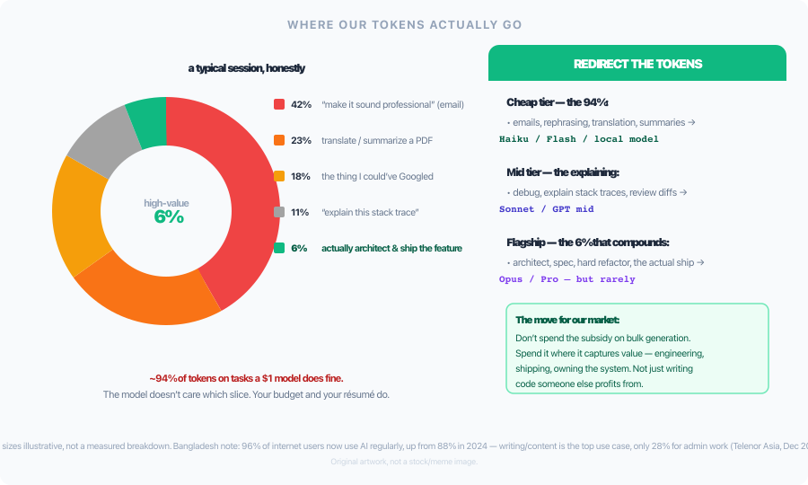

## Slide 1: Title Slide

# Token Economics
## Better Results, Fewer Tokens

**Presented by:** Ankur Mursalin
**Lead Software Engineer, Nerddevs — 7+ years in production TypeScript/Node, now leading a team that ships more code through AI agents than by hand**

*Every AI coding session has a meter running. Most teams never look at it until the bill arrives.*

---

## Slide 2: The Moment Most Teams Notice the Meter

# 🧾 The Bill Nobody Saw Coming


*A $200/mo plan is worth ~$14,000/mo of real compute — a ~70× subsidy someone is paying. Forbes (Jul 2026): "AI Costs More Than The People It Replaced." Uber reportedly burned its whole 2026 AI coding budget in 4 months.*

**It's not one vendor's quirk — it's the whole field.** Claude Fable 5 is the single most expensive model benchmarked at **$2.73 per Intelligence Index task** — 136× the cheapest model measured, gpt-oss-20b at $0.02.


*Source: Artificial Analysis, Intelligence Index cost-per-task, Jul 3 2026. Let's make the meter visible.*

---

## Slide 3: The Hidden Meter

# 🎯 Every AI Session Has a Meter Running

- We watch output quality. We ignore the token counter.
- Then the monthly bill — or "context limit reached" — shows up.
- Token discipline isn't a personal habit — it's a **team cost lever**.

---

## Slide 4: The Real Cost Equation

# 💰 Cost ≠ Price Per Token

```
cost = (price per token) × (tokens per task) × (attempts)
```

Vendors advertise factor 1. Factors 2 and 3 are yours to control — and where the real money moves.

Factor 3 is bigger than it looks: coding is the **#1 use case** for AI agents industry-wide, and "fixing errors" alone is ~10% of enterprise API traffic (Anthropic Economic Index). A meaningful slice of the industry's token spend is *attempts* — paying again for something that didn't work the first time.

---

## Slide 5: The Cheap-Token Trap

# ⚠️ Cheaper Per Token ≠ Cheaper Per Task

**Gemini 3.5 Flash:** $1.50/M input vs Gemini 3.1 Pro's ~$2.00/M — looks like the win

**Real cost to run Artificial Analysis's Intelligence Index (their own published eval):**
- Gemini 3.5 Flash: **$1,552**
- Gemini 3.1 Pro: **~$887**
- Gemini 3 Flash (predecessor, same suite): **~$282**

Cheaper per token → 75% *more expensive* per workload — 3× pricier per token than its own predecessor, plus more input tokens from longer agentic turns. Both factors stack.

*As one viral comment on this same chart put it: paying flagship prices for a task the cheap tier could handle is buying a Ferrari to drive to the grocery store.*


*Source: Artificial Analysis, "Gemini 3.5 Flash: the new leader in intelligence versus speed," May 19, 2026.*

---

## Slide 6: Model Tiering

# 🎛️ Pay for Reasoning Only When Needed — Every Vendor Has a Ladder

| Model | Input | Output | Use for |
|---|---|---|---|
| Haiku 4.5 | $1/M | $5/M | Lookups, file discovery |
| Sonnet 5 | $2→3/M | $10→15/M | Daily implementation |
| Opus 4.8 | $5/M | $25/M | Architecture, hard debugging |
| Fable 5 | $10/M | $50/M | Above Opus — hardest reasoning |
| GPT-5.6 Luna/Terra/Sol | $1→$2.50→$5/M | $6→$15→$30/M | OpenAI's cheap→default→flagship |
| GLM-4.6 / MiniMax M2 / Kimi K2.6 (open-weight) | $0.26–$0.95/M | $1–$4/M | Cheap tier, self-hostable |

**Haiku 4.5:** ~$0.13 spent per SWE-bench Pro point — cheapest correct-fix ratio of any current model.

**Our rule** (`~/.claude/rules/model-routing.md`): default to the mid tier, escalate to flagship only when reasoning depth justifies 5–25× the cost.

---

## Slide 7: Where Your Tokens Actually Go

# 📊 ~94% Cheap Tasks, ~6% Real Value



For a working developer, the split isn't abstract: syntax lookups, rephrasing a Slack message, translating a stack trace, formatting a commit — none of it needs the flagship model. Bangladesh note (Anthropic Economic Index): ranks 116th of 121 tracked countries on Claude.ai usage relative to population — usage index 0.11. But the distinctive topics skew technical and developer-shaped: Math and CS theory (2.4×), Web front-end (1.8×), software development (1.8×), AI app building (1.6×) — ahead of homework and self-presentation writing.

**The move:** cheap tier for the 94% (Haiku, GLM, MiniMax, local), flagship only for the 6% that compounds — architecture, hard refactors, actually shipping.

---

## Slide 8: Beyond One Vendor

# 🧰 Same Arithmetic, Different Tools

| Tool | Access | The tradeoff |
|---|---|---|
| Claude Code / Codex CLI | One vendor | Predictable, but capped on heavy days |
| OpenCode (open-source) | 75+ providers, switch mid-session | One UI, any vendor's pricing underneath |
| OpenRouter | 300+ models, one key | Cross-vendor arbitrage; proxy hop for caching |
| Local (Ollama/LM Studio) | Whatever fits your hardware | **$0/token, but not free** — see the device-cost slide |

Pick the tool for the constraint that binds: data residency → local; flexibility → OpenRouter/OpenCode; out-of-the-box quality → Claude Code/Codex.

---

## Slide 9: Harness Beats Horsepower

# 🔧 Scaffolding Matters as Much as the Model

- Claude Opus 4.8 on its own scaffolding: **69.2%** SWE-bench Pro
- Scale AI's SEAL leaderboard, *identical* scaffolding for every model: best score is **59.1%**
- **10 points of "capability" that was actually harness** — same benchmark, same tasks, only the scaffolding changed
- Frontier LLMs reliably follow ~150–200 instructions total — Claude Code's system prompt spends ~50 before your `CLAUDE.md` even loads

**Two rules from this repo's `.claude/` setup:**
- `CLAUDE.md` under ~200 lines; globbed `rules/*.md` for file-specific patterns
- Command hooks (0 tokens, deterministic) over prompt hooks (cost tokens every call)

*Source: Scale AI SEAL leaderboard, SWE-bench Pro (standardized scaffolding).*

---

## Slide 10: One Laptop, Many Agents

# 💻 Multi-Worktree Has a Device Cost Too

Real example, this repo's graphify hook — no guard: **3 rebuild processes at 65–73% CPU each, load average 12+, RAM saturated.**

Fix: skip the rebuild if CPU load >50% of cores or free memory <2GB, plus process dedupe. Same problem, any vendor:

- Every parallel worktree = a concurrent process on the same CPU/RAM/battery
- A throttled laptop produces worse agent output long before the API bill is the bottleneck

**Local models sharpen this, in numbers:** an 8–14B model wants 8–12GB VRAM/unified memory and fits one active session comfortably. Open two or three worktree sessions on the same box and you're splitting 16–32GB of RAM/VRAM three ways, battery draining faster than any spec sheet implies. A weaker local model needing three retries has spent more wall-clock than the "expensive" API call did in one — even at $0 marginal token cost. The real win with local isn't price; it's that nothing leaves the device.

---

## Slide 11: Make the Meter Visible

# 📊 You Can't Cut What You Can't See — Across Every Agent

Every agent writes local logs, so tracking is always possible. The built-in command is uneven — pick the tracker that reads *your* agent's logs:

| Agent | Native | Logs | Tracker (with the con) |
|---|---|---|---|
| **Claude Code** | `/cost`, `/context`, `/usage-credits`, SDK | local files | **ccusage** ✅ 5-hr-block view ❌ Claude-centric |
| **Codex CLI** | in-session token totals (light) | `~/.codex/sessions/*.jsonl` | **tokscale** ✅ cross-agent ❌ newer |
| **OpenCode** | totals in session; **no tracking command** | SQLite / JSON | **opencode-stats** ✅ 365-day stats ❌ OpenCode-only |
| **All / enterprise** | — | — | Dynatrace / Portkey ✅ governance ❌ overhead |

**The habit:** glance at usage *before* escalating to the flagship model · review the weekly report *before* fanning out 20 subagents · watch the 5-hour block (or your agent's equivalent) on subscription tiers.

*Every cut on the next slide came from this — Headroom cut once device load was measured; the idle graph MCP pruned once its context tax was measured.*

---

## Slide 12: My Toolkit — What I Run, What I Cut

# 🧰 Marketing Shows the Pros. These Are the Cuts.

Three layers stack, they don't compete: **output** (write less) · **input** (read less) · **routing** (cheaper provider).

| Tool | Layer | Verdict — with the *con* |
|---|---|---|
| **Ponytail** | output/code | ✅ run — YAGNI ladder, shortest diff (6–20% lines, 23–53% cost) |
| **caveman** | output/prose | ✅ run — ~75% fewer tokens; overlaps Ponytail by design |
| **RTK** (rtk-ai/rtk) | input/shell | ✅ run — Rust, <10ms, 60–90% off Bash output; Read/Grep bypass |
| **Headroom** | input/files | ❌ **cut** — 60–95% off, byte-perfect, *but* ~600MB ML daemon = the device-drag failure |
| **OmniRoute** | routing | ❌ **cut** — 237-provider gateway → quality drift + ToS-ban pattern |
| **graphify / CRG** | index | ⚠️ **project-local only** — used behind resource guards; cut as a global always-on daemon (idle MCP = 30+ schemas taxed every turn) |
| **branchdiff** (mine) | review | ✅ run — pipes *just the diff*, nth-time awareness skips re-raised nits |

**The rule that decided most of it:** ban risk lives on the wire — a tool only risks a ban if it sits between you and the provider *and* mutates the payload. Rule-injection (Ponytail) = zero. Proxies (Headroom, OmniRoute) = real. That's why my stack has zero proxies.

*The cuts are the talk. READMEs only ship the pros.*

---

## Slide 13: Feed Less, Not More

# 🌊 Bigger Window ≠ Better Recall

Accuracy drops as token count climbs — even well inside the limit. **Context rot** is real; the fix is a smaller haystack, not a bigger window.

- **On-demand retrieval:** our knowledge graph (`graphify` + `code-review-graph`) indexes 1,000+ files for **0 LLM tokens**; skipping it burns ~20,000 tokens re-orienting every session
- **Subagents** with clean, disposable context — the transcript gets thrown away, only the conclusion survives
- **Compact deliberately:** when a session's context gets long, summarize and start fresh instead of replaying the whole transcript — same discount as caching, applied to session length
- **Prompt caching** — big enough to get its own slide →

---

## Slide 14: Caching — The 90% Lever

# 🧊 The Single Biggest Zero-Quality-Loss Lever

The provider already computed your static prefix last call. Keep it warm → reuse it at a fraction. Output is byte-identical; only the bill and latency change. ~90% off the cached input is the number all three majors converge on.

| Provider | TTL | Write | Read (hit) |
|---|---|---|---|
| **Claude** | 5 min / 1 hr | 1.25× (2.0×/1hr) | **0.10×** · 90% off |
| **GPT-5.x** | up to **24 h** | 1.0×, no fee | **0.50×** · 50% off |
| **Gemini 3.x** | 60 min | 1.0× + storage | **0.10×** · 90% off |


---

## Slide 15: Cache or Crash

# ⚠️ The Break-Even Math

Write costs **1.25×** normal input; each hit after costs **0.10×** — a 0.90× saving per read. Cover the 0.25 extra you paid on the write: 0.25 ÷ 0.90 ≈ **1.4 reads to break even.** Fewer hits than that inside the window, and caching cost you money — a 20K-token prefix hit ~1.1×/5-min is a real example of a cache actively losing money.

**The 5-minute cliff:** Anthropic dropped Claude's TTL 60min → 5min in early 2026. Savings fell ~84% → ~52% — every call past 300s became a fresh write.

**Hold the cache warm:**
- **Batch within the window** — tight bursts, not a slow drip
- **Keep-alive ping** — a light read every ~4 min resets the TTL
- **Static-prefix-first** — dynamic state at the *back*, never the front (one byte change ahead of the cache invalidates the whole prefix)
- **Batch API** for overnight jobs — first item writes, the rest read at 10% + ~50% batch off

*Same instinct, interactive sessions: iterate in tight bursts, keep turns close, don't let the file cache go cold across a meeting.*

---

## Slide 16: Memory Compounds

# 🧠 Reuse Beats Re-Derivation

One real session, this repo's own memory index:

- Reading 50 indexed observations: **23,909 tokens**
- Original work that produced them: **485,629 tokens**
- **95% fewer tokens** — same starting knowledge, reused instead of re-derived

**Same idea pointed backward:** mine your own chat logs and PR review comments for recurring corrections — same nit on three PRs is a pattern, not three nits. Encode it once in `CLAUDE.md`/rules; the model stops repeating the mistake, and "number of attempts" from Slide 4 stops multiplying.

**The infra that makes it systematic:** skills (Claude Code, OpenCode's plugin system) package a repeatable workflow instead of re-explaining it in prose each time. Memory plugins persist facts and decisions *across sessions*, so a new conversation starts with what a prior one learned instead of from zero.

Capture once. Read forever. Don't re-derive — forward *or* backward.

---

## Slide 17: Less Code, Less to Reload

# ✂️ Every Line Written Is a Line Reloaded Later

Benchmark medians, lean-by-default vs. no constraint (5 tasks, 3 models):

| Metric | No constraint | Lean-by-default |
|---|---|---|
| Lines of code | 100% | 6–20% |
| Cost | 100% | 23–53% |
| Speed | 1× | 3–6× |

Fewer lines today = a standing token discount on every future session that touches the file.

*Jeff Atwood, 2007: **"the best code is no code at all."** Every line is a line that has to be debugged, read, and supported — technical debt in its most literal form. In the AI-agent era it compounds twice: maintenance burden, and a token bill every future session pays to load the file.*

---

## Slide 18: Beyond the Bill

# 🌍 Two Reasons This Isn't Only About Money

**Energy & water:** AI data centers alone are projected to draw **945 TWh by 2030** — nearly triple Pakistan + Bangladesh + Nigeria's combined electricity use. 2025 baseline: ~33–80M tons of CO2, ~313–765 billion liters of water. Every wasted token is a real watt and a real drop.

**The subsidy is ending:** OpenAI spends ~$2 per $1 earned on inference — $14B in 2026 losses. A $200 ChatGPT Pro plan would cost ~$14,000/mo at real API rates (70× gap). Anthropic moved enterprise customers to usage-based billing in April 2026; GitHub Copilot follows June 1 — same $10 Pro price, now buying metered credits instead of an unlimited allotment, no more fallback for heavy users. Prices rise 30–50% within 12–24 months.

---

## Slide 19: Judgment, Not Just a Checklist

# 🧭 Output → Outcome → Impact

AI's headline effect isn't better decisions — it's more **Output** (code, summaries, predictions, instantly). But Output ≠ **Outcome** (the actual behavior/process shift) ≠ **Impact** (the long-term business value) — and AI only ever hands you the first one.

Ten AI-drafted PRs is Output, verifiable in seconds. Whether they cut defect rates is Outcome. Whether that's a calmer on-call rotation six months later is Impact. AI doesn't decide that gap — judgment does.

| Output | Outcome | Impact |
|---|---|---|
| Route to cheap tier instead of flagship | Task costs 5–25× less | Team absorbs the subsidy unwind |
| Structure for caching | Repeated reads cost 90% less | Same budget covers new work |
| Prune the idle graph MCP daemon | ~30 fewer tool schemas/session | Laptop stays responsive across worktrees |

**None of these picks itself.** Engineering judgment (what will break) and business judgment (what's worth paying for) decide — not the model, not a checklist.

---

## Slide 20: Checklist

# ✅ Apply This Week

- [ ] Route by task: cheap tier (Haiku, GLM, MiniMax, Kimi) → mid tier (default) → flagship
- [ ] Match the tool to the constraint that binds — local, OpenRouter/OpenCode, or Claude Code/Codex
- [ ] `CLAUDE.md` under ~200 lines; globbed rules for the rest
- [ ] Command hooks over prompt hooks for deterministic checks
- [ ] Index once (Tree-sitter), query on demand; reuse memory instead of re-deriving it
- [ ] Long session? Summarize and start fresh instead of replaying the whole transcript
- [ ] **Cache structured for the window** — static prefix front, dynamic state back, batch reads inside TTL (break-even ≈1.4 reads/write)
- [ ] Mine chat logs and PR review comments for recurring corrections; encode each one once, don't re-correct it every time
- [ ] Guard background jobs (CPU/memory + dedupe) before running multiple worktrees
- [ ] Smallest correct diff, always — it's a discount on every future session, every watt, every dollar
