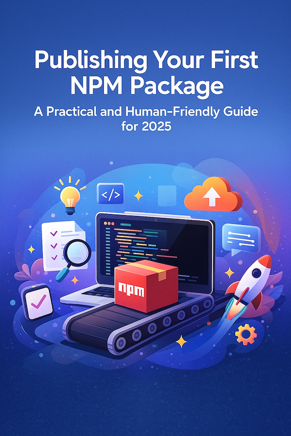
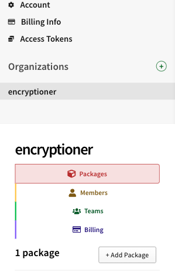
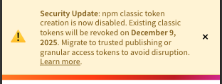

# Publishing Your First NPM Package: A Real-World Guide That Actually Helps

<p align="center">
  
</p>

---

You know that feeling when you've written a utility function for the third time across different projects and think, "There's gotta be a better way"? That's exactly where NPM packages come in.

Let me tell you about turning a simple *HTML-to-PDF generator* into a proper *NPM package*. The process was exciting and journey of learning. A little difficult — but totally worth it.

Here's the thing: most tutorials out there are outdated. NPM deprecated classic tokens, changed their UI, and updated how organizational scoped packages work. So this guide is different. It's the real deal — actual steps, real mistakes, and the stuff nobody tells you until you're already stuck.

---

## Why Even Bother Publishing a Package?

Publishing a package does three magical things:

- **Reusability**: Stop copy-pasting code between projects
- **Helping others**: Someone out there is fighting the same problem right now
- **Learning**: You'll dive into open-source workflow, versioning, CI/CD, and documentation

Plus, there's something genuinely satisfying about typing `npm install your-package-name` and seeing your own work install. It's a tiny piece of software craftsmanship that feels really good.

---

## Understanding Scopes and Naming (Before You Start)

NPM packages can be:

- **Unscoped**: `your-package-name`
- **Scoped**: `@yourname/your-package-name`

Here's what matters: if your *NPM username *is `cooldev`, then `@cooldev/anything` is automatically your namespace. You don't need to create an organization unless your scope differs from your username.

Check if a name is available:

```bash
npm view @yourname/your-package-name
# 404 means it's free to use
```

---

## Step 1: Set Up the Project Structure

Start fresh. Create a clean directory and initialize it:

```bash
mkdir your-package-name
cd your-package-name
git init
npm init -y
```

Keep things organized with a `src/` folder for your code.

---

## Step 2: Bring in Your Source Files

Copy your working code into the new package structure:

```bash
mkdir -p src
cp -r /path/to/your-project/src/lib/your-library/* src/
```

This isolation keeps your package clean and focused.

---

## Step 3: Configure Your package.json

This is the heart of your package. Update these critical fields:

```json
{
  "name": "@yourname/your-package-name",
  "version": "1.0.0",
  "main": "dist/index.js",
  "types": "dist/index.d.ts",
  "repository": {
    "type": "git",
    "url": "https://github.com/yourname/your-package-name.git"
  },
  "bugs": {
    "url": "https://github.com/yourname/your-package-name/issues"
  },
  "homepage": "https://github.com/yourname/your-package-name#readme"
}
```

Make sure:
- `name` is unique (check NPM first)
- `repository.url` points to your GitHub repo
- `bugs.url` gives people a place to report issues
- `homepage` links to documentation

---

## Step 4: Connect to GitHub

Get your code into version control:

```bash
git add .
git commit -m "Initial commit: My Library to NPM Package"
git branch -M master
git remote add origin https://github.com/yourname/your-package-name.git
git push -u origin master
```

---

## Step 5: Test Your Build Locally

Before publishing anything, make sure it actually works:

```bash
npm run build
```

Here's the secret weapon most beginners don't know about — test your package locally:

```bash
npm pack
```

This creates a `.tgz` file — the exact same file that would go to NPM.

Now test it in another project:

```bash
npm install /path/to/your-package-1.0.0.tgz
```

This catches so many issues. Seriously, multiple problems only showed up after testing in a fresh environment.

---

## Step 6: Login to NPM Account

<p align="center">
  
</p>

You can login to npm from any browser by going to [npmjs.com](https://www.npmjs.com/login). Login is also straightforward by command line:

```bash
npm login
```

You'll be prompted for:
- Username
- Password
- Email
- One-time password (if you have 2FA enabled)

## Step 7: Choose Your Publishing Strategy

You have two ways to publish your package:

1. **Manual Publishing** - Quick start, publish from command line
2. **Automated CI/CD** - Professional, publish on git tag (recommended)

Let's start with manual to get you published quickly, then set up automation.

### Manual Publishing (Quick Start)

Login to NPM from your terminal then publish:

```bash
npm login
npm publish --access public
```

The `--access public` flag is required for scoped packages (like `@yourname/package-name`).

That's it. Your package is live on NPM!

But here's the thing: manual publishing is error-prone. You might forget to build, or push the wrong version, or skip tests. Let's set up automation.

---

## Step 8: Set Up Automated Publishing (Recommended)

Here's where it gets interesting. **Classic NPM tokens are deprecated** — many old tutorials still reference them, which is confusing. You need to create a **Granular Access Token** instead. Then use github `CI/CD` workflow to publish the changes to `npm`

<p align="center">
  
</p>

### Creating a Granular Access Token

This token lets GitHub Actions publish your package automatically. Here's how:

**1. Go to [npmjs.com](https://www.npmjs.com/login) and login**

Navigate to your profile → **Access Tokens** → **Generate New Token** → Select **Granular Access Token**

**2. Configure the token:**

```
Token Name: GitHub Actions CI/CD
Expiration: 90 days (or your preference)
```

**3. Set permissions:**

Under "Packages and scopes":
- Select **Read and write**
- Choose either:
  - "All packages" (easier), OR
  - Select your specific package `@yourname/your-package-name`

**4. Copy the token immediately**

You won't be able to see it again! It starts with `npm_...`

**5. Add to GitHub Secrets:**

Go to your GitHub repository:
- `Settings` → `Secrets and variables` → `Actions`
- Click "New repository secret"
- Name: `NPM_TOKEN`
- Value: Paste your token
- Click "Add secret"

Now GitHub Actions can publish on your behalf.

---

## Step 9: Understanding Semantic Versioning

Before we automate, let's talk about versioning. It's not just numbers — it's a promise to your users:

| Command              | Example       | When to Use       |
| -------------------- | ------------- | ----------------- |
| `npm version patch`  | 1.0.0 → 1.0.1 | Bug fixes         |
| `npm version minor`  | 1.0.0 → 1.1.0 | New features      |
| `npm version major`  | 1.0.0 → 2.0.0 | Breaking changes  |

Here's the magic: each `npm version` command does three things:
1. Updates version in `package.json`
2. Creates a git commit
3. Creates a git tag (like `v1.0.1`)

That git tag is what triggers automated publishing.

---

## Step 10: Create the GitHub Actions Workflow

Now let's set up the automation. This workflow:
- Triggers when you push a version tag (like `v1.2.3`)
- Runs your tests and builds
- Verifies the version matches
- Publishes to NPM with provenance (security feature)
- Creates a GitHub release

Create `.github/workflows/publish.yml`:

```yaml
name: Publish to NPM

on:
  push:
    tags:
      - 'v*'

jobs:
  publish:
    runs-on: ubuntu-latest
    permissions:
      contents: write
      id-token: write

    steps:
      - uses: actions/checkout@v4
        with:
          fetch-depth: 0

      - uses: pnpm/action-setup@v4
        with:
          version: 9.0.0

      - uses: actions/setup-node@v4
        with:
          node-version: '18.20.0'
          registry-url: 'https://registry.npmjs.org'
          cache: pnpm

      - run: pnpm install --frozen-lockfile
      - run: pnpm run typecheck
      - run: pnpm run build

      - name: Verify version matches tag
        run: |
          TAG="${GITHUB_REF#refs/tags/}"
          VERSION="${TAG#v}"
          FILE_VERSION=$(node -p "require('./package.json').version")
          if [ "$VERSION" != "$FILE_VERSION" ]; then
            echo "Version mismatch: tag=$VERSION, package.json=$FILE_VERSION"
            exit 1
          fi

      - name: Publish to NPM
        env:
          NODE_AUTH_TOKEN: ${{ secrets.NPM_TOKEN }}
        run: pnpm publish --access public --provenance
```

**Important notes about this workflow:**
- `permissions: id-token: write` enables NPM provenance (proves your package came from your GitHub repo)
- The version verification step prevents accidental publishes with mismatched versions
- `--frozen-lockfile` ensures consistent installs
- Adjust `pnpm` to `npm` if you're not using pnpm

---

## Step 11: Publishing with the Automated Workflow

Now that automation is set up, here's your new publishing workflow:

**1. Make sure all changes are committed:**
```bash
git status
git add .
git commit -m "feat: add new feature"
git push origin master
```

**2. Create and push a version tag:**
```bash
# For a patch release (bug fixes)
npm version patch
git push origin master --tags

# For a minor release (new features)
npm version minor
git push origin master --tags

# For a major release (breaking changes)
npm version major
git push origin master --tags
```

**3. Watch it happen:**
- Go to your GitHub repository → "Actions" tab
- You'll see the workflow running
- Within a few minutes, your package is published!
- GitHub automatically creates a release too

**Pro tip:** The moment you push the tag, GitHub Actions takes over. No manual `npm publish` needed.

---

## Step 12: Control What Gets Published

Want to see exactly what goes into your package?

```bash
npm pack --dry-run
```

Typically you want:
- `dist/` (your compiled code)
- `README.md`
- `LICENSE`
- `package.json`

Use `.npmignore` to exclude:
- Source files (`src/`)
- Tests
- Config files
- `.github/`
- Development dependencies

---

## Step 13: Write Documentation That Actually Helps

Your README is the first thing people see. Make it count:

**Must-haves:**
- Quick installation command
- Basic usage example (copy-paste ready)
- API reference
- Common problems and solutions

**Nice-to-haves:**
- Advanced examples
- Browser vs Node.js differences
- Performance tips
- Contribution guidelines

Good documentation increases adoption way more than perfect code does.

---

## Step 14: Licensing and Collaboration

**Choose a license:** MIT is the most permissive and common for open-source libraries.

**Enable collaboration:**
- Add `CONTRIBUTING.md` with guidelines
- Use GitHub Issues for bug reports
- Consider GitHub Discussions for questions
- Tag releases properly

**Note on releases:**
With GitHub Actions set up, you don't need to manually create releases. The workflow automatically creates a GitHub release when you push a version tag. But you can still edit the release notes afterward to add detailed changelogs.

If it is important to create `Releases` manually, follow this:
1. Go to your repo's "Releases" tab
2. Click "Create new release"
3. Tag it as `v1.x.x`
4. Add a changelog describing what changed
5. Publish

Once the tag is pushed, GitHub Actions takes over and handles publishing.
---

## Step 15: When Things Go Wrong

Yes, mistakes happen. Accidentally published version 1.1.0 instead of 1.0.3? Been there.

**Within 24 hours:**

```bash
npm unpublish @scope/package@version
```

**After 24 hours:**
NPM won't let you unpublish for safety reasons. Instead:

```bash
npm deprecate @scope/package@version "Broken release, use 1.0.4 instead"
```

Then publish the correct version and update your changelog.

Wait a minute or two after unpublishing — NPM's cache takes time to update.

Lesson learned: always double-check before tagging and pushing.

---

## Bonus: One-Command Publishing Scripts

Want to make publishing even easier? Create these helper scripts that combine versioning and pushing in one command:

**publish-patch.sh:**
```bash
#!/bin/bash
npm version patch
git push origin master --tags
```

**publish-minor.sh:**
```bash
#!/bin/bash
npm version minor
git push origin master --tags
```

**publish-major.sh:**
```bash
#!/bin/bash
npm version major
git push origin master --tags
```

Make them executable:
```bash
chmod +x publish-*.sh
```

Now publishing is as simple as:
```bash
./publish-patch.sh
```

The script bumps the version, creates the tag, and pushes it. GitHub Actions sees the tag and handles the rest — testing, building, and publishing to NPM automatically.

---

## Best Practices Checklist

**Before Publishing:**
- ✅ Test with `npm pack` and install locally
- ✅ Run all tests and type checks
- ✅ Update README with latest features
- ✅ Add or update CHANGELOG

**Package Quality:**
- ✅ Include TypeScript types (if applicable)
- ✅ Add a LICENSE file
- ✅ Set up CI/CD for automated testing
- ✅ Use `.npmignore` to keep package lean
- ✅ Include usage examples in README

**Maintenance:**
- ✅ Respond to issues promptly
- ✅ Tag releases with semantic versions
- ✅ Keep dependencies updated
- ✅ Document breaking changes clearly

---

## Real-World Example: From Hobby Project to Published Package

This guide is based on a real-world transformation: turning an HTML-to-PDF generator from a single-application solution into a framework-agnostic package that any developer can use.

**The package:** [`@encryptioner/html-to-pdf-generator`](https://www.npmjs.com/package/@encryptioner/html-to-pdf-generator)

**What it does:** Modern multi-page PDF generator from HTML content with smart pagination and styling support.

**The transformation journey:**
- Started as tightly coupled code in a single project
- Extracted the core logic into a standalone library
- Made it framework-agnostic (works with React, Vue, vanilla JS, Node.js)
- Added proper TypeScript types
- Set up automated publishing with GitHub Actions
- Documented everything in a useful README

**The outcome:**
A package that solves a real problem for developers who need to generate clean, multi-page PDFs from HTML without fighting with browser print dialogs or complex PDF libraries.

Installation:
```bash
npm install @encryptioner/html-to-pdf-generator
```

This transition from "code that works for one project" to "code that works for everyone" demonstrates what successful package publishing looks like. The technical steps matter, but the mindset shift matters more — thinking about edge cases, documentation, and user experience.

---

## Final Thoughts

Publishing your first NPM package is a rite of passage. It's messy, confusing, and occasionally frustrating — but incredibly rewarding.

The moment you see someone install your package, report a bug, or (even better) contribute a feature — it all clicks. You're not just writing code anymore. You're building something that helps others build things.

Don't wait for the perfect moment or the perfect code. Start with something useful, document it well, and iterate. The tools are better than ever, and the community is welcoming.

And when something breaks at 2 AM (it will), don't panic. Unpublish within 24 hours, fix it, document what happened, and keep going.

The open-source world needs more builders. So go ahead — publish that package you've been thinking about.

Happy publishing! 🚀

---

## Let's Connect

I'm always excited to hear about what you're building! If you found this guide helpful, have questions, or just want to share your NPM publishing journey:

- **Website**: [encryptioner.github.io](https://encryptioner.github.io)
- **LinkedIn**: [Mir Mursalin Ankur](https://www.linkedin.com/in/mir-mursalin-ankur)
- **GitHub**: [@Encryptioner](https://github.com/Encryptioner)
- **X (Twitter)**: [@AnkurMursalin](https://twitter.com/AnkurMursalin)
- **Technical Writing**: [Nerddevs](https://nerddevs.com/author/ankur/)

Drop a message if you publish your first package using this guide — I'd love to check it out!