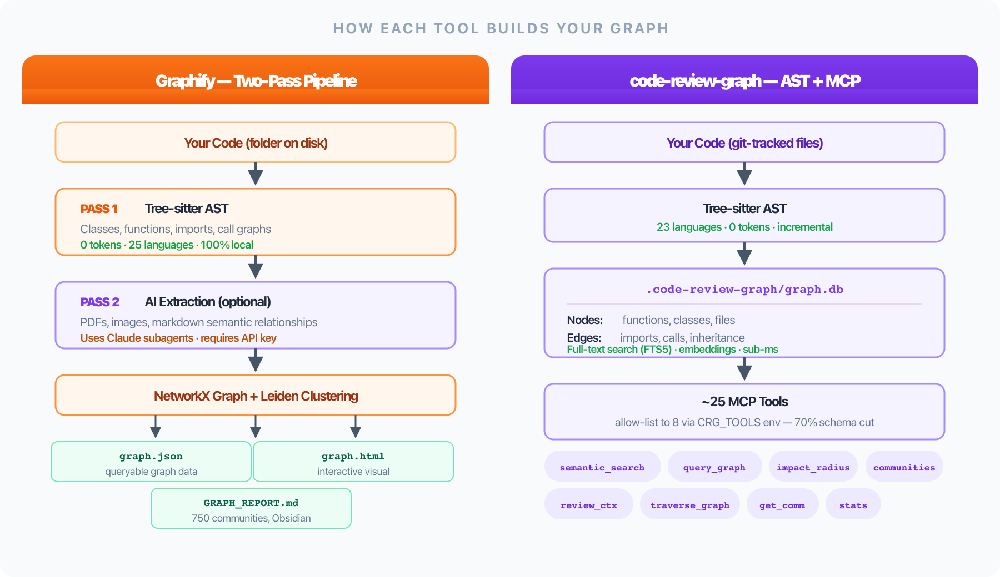
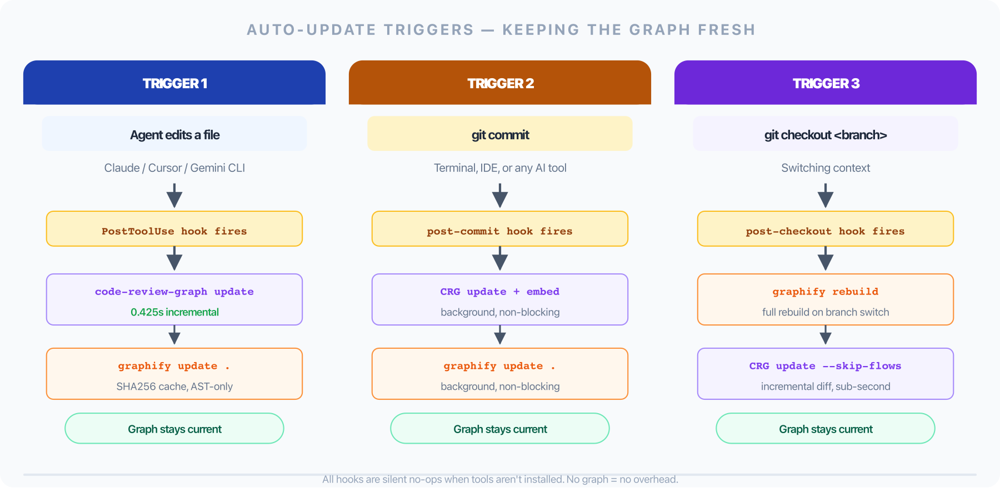
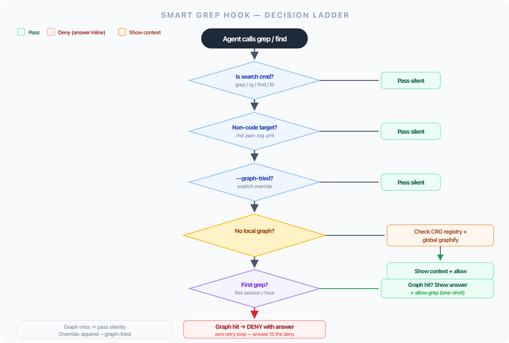
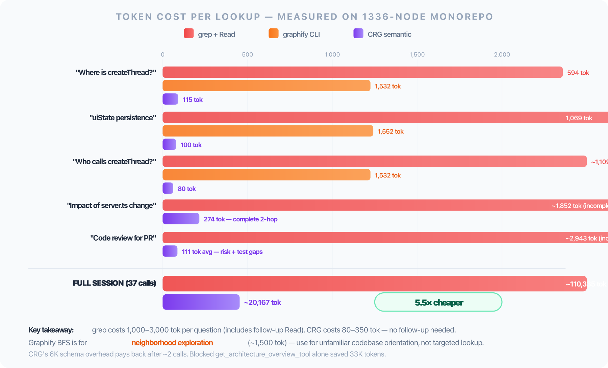

# Graphify + code-review-graph: Build a Self-Updating Knowledge Graph for Claude Code and other AI Coding Agent

> Every developer working with LLMs on a large codebase eventually hits the same wall: context windows are finite, but codebases are not.

You start a new AI coding session, ask about the payment flow — and your agent starts re-reading dozens of files just to get oriented. Twenty thousand tokens evaporated before a single line of code is written. Multiply that by every session, every team member, every day.

Two open-source tools solve this in different but complementary ways:

- **Graphify** — converts your folder into a queryable knowledge graph with community detection, Obsidian-compatible reports, and cross-file traversal
- **code-review-graph (CRG)** — builds a SQLite-backed AST graph with blast-radius analysis, embedding-based semantic search, ~25 MCP tools (allow-listable to a working set of 8), and sub-second incremental updates

This guide walks through installing both tools, connecting them to any AI coding agent — Claude Code, Cursor, Gemini CLI, Windsurf, GitHub Copilot, and more — wiring auto-updates for code edited by humans, git commits, or the agent itself, and pairing everything with an Obsidian vault as a persistent memory layer.

> **Pick one, both, or none — every section degrades gracefully.** Each tool works standalone; the smart-grep-hook, session-start cheatsheet, and CLAUDE.md routing rules all detect what is present and adapt. Use just graphify if you want a pure CLI / zero-MCP setup. Use just CRG if you want embedding-aware semantic search and PR-grade impact tools. Use both for the full stack (CRG primary, graphify on miss). If neither is installed, the agent silently falls back to grep — no broken hooks, no errors.

All commands in this guide were tested on Ubuntu and macOS across multiple real pnpm monorepos of varying sizes.

---

## Real Numbers from Two Test Projects

Before diving in, here's what both tools produced across two real codebases — one a full-stack TypeScript monorepo with 5 packages, the other a lighter frontend-only repo:

| Metric | Graphify (AST-only) | code-review-graph |
|--------|--------------------|--------------------|
| Files indexed (large) | 1,020 | 1,052 |
| Nodes (large) | 3,815 | 5,780 |
| Edges (large) | 4,830 | 30,611 |
| Files indexed (small) | 702 | 711 |
| Nodes (small) | 2,035 | 2,773 |
| Edges (small) | 2,357 | 15,037 |
| Communities | 750 / 499 | 28 wiki pages each |
| Incremental update | ~10s (8 workers) | **0.425s** |
| LLM tokens used | 0 | 0 |
| Storage | `graphify-out/` (JSON) | `.code-review-graph/` (SQLite) |

---

## How Each Tool Works



### Graphify — Two-Pass Graph with Communities

```
Your Code
    │
    ▼
Pass 1: Tree-sitter AST   ← 0 tokens, 25 languages
(classes, functions, imports, call graphs)
    │
    ▼
Pass 2: AI Extraction     ← only for PDFs, images, markdown (optional)
(semantic relationships via Claude subagents)
    │
    ▼
NetworkX Graph + Leiden Clustering
    │
    ├── graphify-out/graph.json       (queryable)
    ├── graphify-out/GRAPH_REPORT.md  (750 communities, Obsidian links)
    ├── graphify-out/graph.html       (interactive visual)
    └── graphify-out/cache/           (SHA256 per file)
```

Each edge has a confidence tag:

| Tag | Source | Confidence |
|-----|--------|-----------|
| `EXTRACTED` | Directly in AST | 1.0 |
| `INFERRED` | Reasonable deduction | 0.7–0.9 |
| `AMBIGUOUS` | Needs review | <0.7 |

On the large monorepo: **87% EXTRACTED · 13% INFERRED · 0% AMBIGUOUS**

### code-review-graph — Blast-Radius Graph with MCP

```
Your Code (git-tracked files)
    │
    ▼
Tree-sitter AST (23 languages, 0 tokens)
    │
    ▼
SQLite (.code-review-graph/graph.db)
    │
    ├── Nodes: functions, classes, files
    ├── Edges: imports, calls, inheritance
    └── Full-text search index (FTS5)
    │
    ▼
~25 MCP tools available (allow-list to ~8 via CRG_TOOLS env — see "Strip Unused CRG Tools")
(semantic_search_nodes, query_graph, get_impact_radius, list_communities, ...)
```

---

## Installation

Install one or both — the rest of the guide shows where each section applies.

### Ubuntu

```bash
# Pick what you need:
pip install graphifyy         # graphify CLI (note: two y's on PyPI)
pip install code-review-graph # CRG (CLI + MCP server, includes embeddings extra)

# Verify (only the lines for installed tools):
graphify --help | head -5
code-review-graph --version
```

### macOS

```bash
# Via uv (fastest):
uv tool install graphifyy           # graphify only
uv tool install code-review-graph   # CRG only — or run both lines for both

# Or via pipx:
brew install pipx
pipx install graphifyy
pipx install code-review-graph
```

> **PyPI quirk**: The package is `graphifyy` (two y's). The CLI command after install is `graphify` (one y).

---

## Step 1: Create Ignore Files

Before building any graph, exclude noise from indexing. Place these at your project root.

**`.graphifyignore`**

```
node_modules/
dist/
build/
.pnpm-store/
coverage/
*.min.js
*.min.css
*.map
pnpm-lock.yaml
yarn.lock
*.lock
*.log
.env*
graphify-out/
.code-review-graph/
*.example.*
```

**`.code-review-graphignore`** (same content)

```
node_modules/
dist/
build/
.pnpm-store/
coverage/
*.min.js
*.min.css
*.map
pnpm-lock.yaml
yarn.lock
*.lock
*.log
.env*
graphify-out/
.code-review-graph/
*.example.*
```

---

## Step 2: Build the Graphs Manually

### code-review-graph

```bash
cd /path/to/your-project

# Full build (first time) — parses all files
code-review-graph build

# Output (large monorepo):
# Full build: 1052 files, 5780 nodes, 30611 edges (postprocess=full)

# Output (smaller frontend repo):
# Full build: 711 files, 2773 nodes, 15037 edges (postprocess=full)
```

### Graphify (AST-only, no LLM cost)

```bash
cd /path/to/your-project

# AST-only update (no API key required)
graphify update .

# Output (large monorepo):
# Rebuilt: 3815 nodes, 4830 edges, 750 communities
# graph.json, graph.html and GRAPH_REPORT.md updated in graphify-out

# Output (smaller repo):
# Rebuilt: 2035 nodes, 2357 edges, 499 communities
```

For the richer semantic graph (PDFs, images, markdown — uses LLM):

```bash
# Full extraction with Claude subagents (requires ANTHROPIC_API_KEY)
graphify extract .
```

---

## Step 3: Register with Your AI Agent

### code-review-graph (auto-configures 5 platforms)

```bash
code-review-graph install
```

This single command:
- Writes `.mcp.json` (Claude Code MCP server config)
- Writes `.cursor/mcp.json`, `.opencode.json`, Zed settings, `.cursorrules`, `GEMINI.md`, `AGENTS.md`
- Creates `.claude/skills/` for Claude Code tool integration
- Installs hooks in `.claude/settings.json` (move these out — see below)
- Installs a **git pre-commit hook**
- Updates `.gitignore` to exclude `.code-review-graph/`

**Post-install housekeeping:** `code-review-graph install` is aggressive — it writes configs for every AI IDE it knows about. Most teams only use one. Add the noise to `.gitignore`:

```
# .gitignore additions
AGENTS.md
GEMINI.md
.mcp.json          # keep only .mcp.example.json
.cursorrules
.windsurfrules
.opencode.json
.kiro/
```

**Three-file hook pattern:** `settings.json` should stay clean — permissions only, no hooks. Use two separate files for hooks:

- **`.claude/settings.example.json`** (committed) — documents the hook structure for teammates. Copy from here to set up locally.
- **`.claude/settings.local.json`** (gitignored) — your actual personal hooks that fire at runtime. Contains env vars, secrets, and the live hook config.

Remove all hooks from `.claude/settings.json`, then populate the two files:

```bash
# .claude/settings.example.json — committed reference, shows hook structure
{
  "hooks": {
    "PostToolUse": [{"matcher": "Edit|Write|MultiEdit", "hooks": [{"type": "command", "command": "command -v code-review-graph >/dev/null 2>&1 && { code-review-graph update --skip-flows 2>/dev/null && nohup code-review-graph embed >/dev/null 2>&1 & } || true", "timeout": 30}]}],
    "SessionStart": [{"matcher": "", "hooks": [{"type": "command", "command": "command -v code-review-graph >/dev/null 2>&1 && code-review-graph status 2>/dev/null || true", "timeout": 10}]}]
  }
}

# .claude/settings.local.json — gitignored, actual runtime hooks (copy from example)
```

The `.mcp.json` it creates (keep as `.mcp.example.json` only):

```json
{
  "mcpServers": {
    "code-review-graph": {
      "command": "uvx",
      "args": ["code-review-graph", "serve"],
      "type": "stdio"
    }
  }
}
```

### Graphify (AI Agent Integration)

```bash
# Adds graphify section to CLAUDE.md + PreToolUse hook (Claude Code)
graphify claude install
```

Graphify's `claude install` adds a `PreToolUse` hook that intercepts `grep`, `rg`, `find` commands and redirects the agent to `graphify query` instead — turning search interception into graph navigation. For other agents: `code-review-graph install` already writes equivalent config to `GEMINI.md`, `AGENTS.md`, `.cursorrules`, and Zed settings.

> **Note:** `graphify claude install` writes the `PreToolUse` hook into `.claude/settings.json`. Move it to `.claude/settings.example.json` (committed as a reference) and copy to `.claude/settings.local.json` to activate it locally — not every teammate will have graphify installed, so it shouldn't fire automatically for everyone.

### Auto-Update on Commit (the full picture)



Three independent triggers keep the graph fresh — install all of them so no edit path leaves it stale:

| Trigger | Hook location | Covers |
|---|---|---|
| **Claude edits a file** | `.claude/settings.local.json` PostToolUse | agent-driven changes (already configured above) |
| **Branch switch** | `.git/hooks/post-checkout` (or `.husky/post-checkout`) | graphify rebuild on `git checkout <other-branch>` |
| **Any commit** | `.git/hooks/post-commit` (or `.husky/post-commit`) | terminal commits, IDE commits, other AI tools |

Graphify ships its own installer for the git side:

```bash
graphify hook install   # writes post-commit + post-checkout
```

**Code-review-graph does not.** Its `install` command writes a `pre-commit` hook that runs `detect-changes --brief` (a status warning before the commit lands) but no `post-commit` hook to update the SQLite graph after. Without one, `.code-review-graph/graph.db` only refreshes when Claude touches a file — every terminal/IDE/other-tool commit drifts.

Add the post-commit update yourself. Both forms are detached so `git commit` returns immediately:

**Plain git project — append to `.git/hooks/post-commit`:**

```sh
# code-review-graph-hook-start
# Auto-rebuild CRG graph + embeddings after each commit (detached, non-blocking).
# embed only runs if update succeeds (&&) — keeps semantic search current for new nodes.
if command -v code-review-graph >/dev/null 2>&1 && [ -d .code-review-graph ]; then
    _CRG_LOG="${HOME}/.cache/code-review-graph-update.log"
    mkdir -p "$(dirname "$_CRG_LOG")"
    echo "[code-review-graph hook] launching background update+embed (log: $_CRG_LOG)"
    nohup sh -c 'code-review-graph update --skip-flows && code-review-graph embed' > "$_CRG_LOG" 2>&1 < /dev/null &
    disown 2>/dev/null || true
fi
# code-review-graph-hook-end
```

**Husky project — add the same block to `.husky/post-commit`** (Husky v9+ runs `.husky/<hookname>` directly; no `.husky/_/` shim editing needed). Always prefer `update --skip-flows` (incremental, sub-second) over `build` (full rebuild — minutes on large repos):

```sh
# .husky/post-commit
if command -v code-review-graph > /dev/null 2>&1 && [ -d .code-review-graph ]; then
  _LOG="${HOME}/.cache/code-review-graph-update.log"
  mkdir -p "$(dirname "$_LOG")"
  echo "[code-review-graph] Commit detected - launching background update+embed (log: $_LOG)"
  nohup sh -c 'code-review-graph update --skip-flows && code-review-graph embed' > "$_LOG" 2>&1 < /dev/null &
  disown 2>/dev/null || true
fi
```

Verify both graphs caught up to the latest commit:

```sh
git log -1 --format=%ci                          # last commit timestamp
stat -f %Sm graphify-out/graph.json              # macOS
stat -f %Sm .code-review-graph/graph.db          # macOS
# stat -c %y graphify-out/graph.json             # Linux equivalent
```

Both file mtimes should be at or after the commit timestamp. If `graph.db` lags, the post-commit hook isn't firing — check `chmod +x` on the hook file and that `pnpm install` ran (so Husky's `prepare` script wired up `.husky/`).

### Agent Config: trigger-list pattern (`CLAUDE.md` / `AGENTS.md` / `GEMINI.md`)

Rather than pasting the full tool docs into your agent config file (which bloats every session's context), create a dedicated `docs/agent/knowledge-graph.md` and add a trigger-list pointer. This works the same way across agents — Claude Code reads `CLAUDE.md`, Gemini CLI reads `GEMINI.md`, Codex and OpenAI agents read `AGENTS.md`:

```markdown
## Knowledge Graph

**Read `docs/agent/knowledge-graph.md` whenever you:**
- Answer any architecture, cross-module, or "how does X work" question
- Plan to grep, find, or glob through the codebase
- Need to understand an unfamiliar module or trace a call chain
- Are about to refactor or change something with unclear blast radius

The doc covers graphify (community detection, path tracing, GRAPH_REPORT.md), code-review-graph (MCP tools, impact analysis), when to use each, and the full auto-update pipeline.
```

Place this block in `CLAUDE.md` for Claude Code, `GEMINI.md` for Gemini CLI, or `AGENTS.md` for Codex/OpenAI-compatible agents — the trigger-list pattern works the same across all of them. A vague "read before exploring unfamiliar code" pointer is easy for any agent to skip. Explicit trigger conditions — especially "plan to grep" — activate the graph habit reliably. The full reference lives in `docs/agent/knowledge-graph.md` and is only loaded when actually needed.

### Enforcing Graph-First: The Smart Grep Hook

The trigger-list in `CLAUDE.md` is a soft nudge — in practice, agents still reach for grep by default even with both knowledge graphs initialized and the pointer in place. Soft warnings alone do not reliably change behaviour.

The fix is a smarter `PreToolUse` hook that doesn't just warn — it **answers the question inside the rejection**, and handles every scenario gracefully: no graph, cross-repo grep, multi-repo registries.



**Decision ladder (first match wins, zero false positives):**

| Situation | Hook behaviour |
|---|---|
| No graph in this repo, no registered siblings | Silent pass — zero noise |
| Non-code target (`.md`, `.json`, `.log`, `.jsonl`) | Silent pass |
| `--graph-tried` flag in command | Silent pass — explicit override |
| Grep targets abs path outside CWD + that dir has graph | Query that graph, show result as context, allow grep |
| Grep targets abs path outside CWD + no graph found | Silent pass — grep is the right tool here |
| No local graph + registered sibling repo matches pattern | Show sibling result as context, allow grep |
| First grep this session + local graph hit | Show answer **and** allow grep (one-shot lesson) |
| First grep this session + no graph hit | Allow grep, suggest MCP tool for next time |
| Subsequent grep + local graph hit | **Deny with answer inline** — zero retry loop |
| Subsequent grep + no graph hit | Silent pass |

The key insight: **the deny message IS the answer**. The costly retry loop (deny → model reads error → model tries graph → gets answer = 2 API calls) collapses to 1.

Three graph sources, consulted in priority order:
1. **Local graph** — `.code-review-graph/graph.db` in current working directory
2. **Cross-repo graph** — walk up from any absolute path in the command to find the nearest `.code-review-graph/` directory
3. **Multi-repo registry** — `code-review-graph repos` for globally registered repos

All lookups use the `nodes_fts` FTS5 full-text index — sub-millisecond, no external process, no network. Falls back to a `LIKE` scan if FTS returns empty.

Save `~/.claude/scripts/smart-grep-hook.sh`:

```sh
#!/usr/bin/env bash
# ~/.claude/scripts/smart-grep-hook.sh
# Adaptive graph-first grep interceptor — CRG (SQLite FTS5) + graphify (JSON)
# Decision ladder (first match wins):
#   1. Not a search command              → pass silently
#   2. --graph-tried override            → pass silently
#   3. Non-code target (.md/.json/…)    → pass silently
#   4. Cross-repo abs path:
#      a. Target has CRG or graphify     → query both, show context, allow grep
#      b. No graph in target             → pass silently
#   5. No local graph of either type:
#      a. CRG registered repo match     → show context, allow grep
#      b. Global merged graphify match  → show context, allow grep
#      c. No match                      → pass silently
#   6. Local graph(s) present — session-aware gating:
#      a. First grep + hit              → show result, allow (one-shot lesson)
#      b. First grep + miss             → allow, suggest tool for next time
#      c. Subsequent + hit              → answering deny (result inline, no retry)
#      d. Subsequent + miss             → pass silently
set -uo pipefail

INPUT=$(cat)
CMD=$(printf '%s' "$INPUT" | python3 -c \
  "import json,sys; d=json.load(sys.stdin); print(d.get('tool_input',d).get('command',''))" \
  2>/dev/null || echo "")

# ── Tier 1-3: fast exits ──────────────────────────────────────────────────────
case "$CMD" in *grep*|*" rg "*|*"	rg "*|*ripgrep*|*" fd "*|*" ack "*|*" ag "*) ;;
  *find\ *) ;; *) exit 0 ;; esac
case "$CMD" in *--graph-tried*|*"# graph-checked"*|*"GRAPH_TRIED=1"*) exit 0 ;; esac
case "$CMD" in
  *.md*|*.json*|*.yml*|*.yaml*|*.log*|*.jsonl*|*.txt*|*.csv*|\
  *node_modules*|*"/.git/"*|*/dist/*|*/build/*|*/.next/*|*/__pycache__/*) exit 0 ;; esac

json_esc() { python3 -c "import json,sys; print(json.dumps(sys.stdin.read())[1:-1])"; }

# ── CRG: SQLite FTS5 query (sub-ms) ──────────────────────────────────────────
query_crg() {
  local db="$1" pat="$2"
  python3 - "$pat" "$db" <<'PYEOF' 2>/dev/null
import sqlite3, sys, os
pat, db = sys.argv[1], sys.argv[2]
if not os.path.exists(db): sys.exit(0)
try:
    c = sqlite3.connect(f"file:{db}?mode=ro", uri=True, timeout=3)
    rows = c.execute(
        "SELECT n.kind, n.name, n.file_path, n.line_start "
        "FROM nodes_fts f JOIN nodes n ON n.id=f.rowid WHERE nodes_fts MATCH ? LIMIT 5",
        (pat,)).fetchall()
    if not rows:
        rows = c.execute(
            "SELECT kind, name, file_path, line_start FROM nodes WHERE name LIKE ? LIMIT 5",
            (f'%{pat}%',)).fetchall()
    c.close()
    for kind, name, path, line in rows:
        print(f'[crg] {kind}  {name}  →  {path}:{line}')
except: pass
PYEOF
}

# ── graphify: JSON in-memory search (~5ms for 4k nodes) ──────────────────────
query_graphify() {
  local json="$1" pat="$2"
  python3 - "$pat" "$json" <<'PYEOF' 2>/dev/null
import json, sys, os
pat_low, gfile = sys.argv[1].lower(), sys.argv[2]
if not os.path.exists(gfile): sys.exit(0)
try:
    g = json.load(open(gfile))
    results = []
    for n in g.get('nodes', []):
        label = n.get('label', '')
        if pat_low in label.lower() or pat_low in n.get('id', '').lower():
            src = n.get('source_file', '')
            loc = n.get('source_location', '') or n.get('line', '')
            kind = n.get('file_type', 'node')
            community = n.get('community', '')
            results.append(f'[graphify] {kind}  {label}  →  {src}:{loc}  (community {community})')
    for r in results[:5]: print(r)
except: pass
PYEOF
}

# ── Query both graphs at a given root ─────────────────────────────────────────
query_at_root() {
  local root="$1" pat="$2"
  local out=""
  local crg_db="${root}/.code-review-graph/graph.db"
  local gfy_json="${root}/graphify-out/graph.json"
  [ -f "$crg_db" ]   && out+=$(query_crg "$crg_db" "$pat")$'\n'
  [ -f "$gfy_json" ] && out+=$(query_graphify "$gfy_json" "$pat")$'\n'
  printf '%s' "$out" | sed '/^[[:space:]]*$/d'
}

# ── Walk up to nearest repo with any graph ────────────────────────────────────
find_graph_root() {
  local d="$1"; [ ! -d "$d" ] && d=$(dirname "$d")
  while [ "$d" != "/" ] && [ "$d" != "$HOME" ]; do
    { [ -f "$d/.code-review-graph/graph.db" ] || [ -f "$d/graphify-out/graph.json" ]; } \
      && echo "$d" && return
    d=$(dirname "$d")
  done
}

# ── Extract search pattern ────────────────────────────────────────────────────
PATTERN=$(printf '%s' "$CMD" | python3 -c "
import sys, shlex
cmd = sys.stdin.read().strip()
try: parts = shlex.split(cmd)
except: parts = cmd.split()
bases = {'grep','rg','ripgrep','egrep','fgrep','ag','ack','fd'}
idx = next((i for i,p in enumerate(parts) if p.rsplit('/',1)[-1] in bases), -1)
if idx < 0: sys.exit(0)
for p in parts[idx+1:]:
    if not p.startswith('-') and '/' not in p and len(p) > 2: print(p[:60]); break
" 2>/dev/null || echo "")

# ── Tier 4: cross-repo detection ──────────────────────────────────────────────
TARGET=$(printf '%s' "$CMD" | python3 -c "
import sys, shlex, os
try: parts = shlex.split(sys.stdin.read())
except: parts = sys.stdin.read().split()
cwd = os.getcwd()
for p in parts:
    if p.startswith('/') and not p.startswith('-') and not p.startswith(cwd): print(p); break
" 2>/dev/null || echo "")

if [ -n "$TARGET" ]; then
  ROOT=$(find_graph_root "$TARGET")
  if [ -n "$ROOT" ] && [ -n "$PATTERN" ]; then
    RESULT=$(query_at_root "$ROOT" "$PATTERN")
    if [ -n "$RESULT" ]; then
      MSG="Cross-repo graph hit (${ROOT##*/}) for '${PATTERN}':\n${RESULT}\n\nGrep proceeding — result shown as context. Open a session in that repo for deeper analysis."
      printf '{"hookSpecificOutput":{"hookEventName":"PreToolUse","additionalContext":"%s"}}' \
        "$(printf '%s' "$MSG" | json_esc)"
    fi
  fi
  exit 0  # always allow cross-repo grep
fi

# ── Local graph detection ─────────────────────────────────────────────────────
HAVE_CRG=0; HAVE_GFY=0
[ -f .code-review-graph/graph.db ]   && HAVE_CRG=1
[ -f graphify-out/graph.json ]       && HAVE_GFY=1

# ── Tier 5: no local graph → registry + global merged graph ───────────────────
if [ "$HAVE_CRG" = "0" ] && [ "$HAVE_GFY" = "0" ]; then
  EXTRA_RESULT=""

  # 5a: CRG multi-repo registry
  if command -v code-review-graph >/dev/null 2>&1 && [ -n "$PATTERN" ] && [ "${#PATTERN}" -gt 2 ]; then
    REG=$(code-review-graph repos 2>/dev/null | python3 - "$PATTERN" <<'PYEOF' 2>/dev/null
import sys, os, sqlite3
pat = sys.argv[1]; results = []
for line in sys.stdin.read().strip().splitlines():
    for token in line.split():
        if not token.startswith('/'): continue
        db = f"{token}/.code-review-graph/graph.db"
        if not os.path.exists(db): continue
        try:
            c = sqlite3.connect(f'file:{db}?mode=ro', uri=True, timeout=2)
            rows = c.execute(
                'SELECT n.kind, n.name, n.file_path, n.line_start '
                'FROM nodes_fts f JOIN nodes n ON n.id=f.rowid WHERE nodes_fts MATCH ? LIMIT 3',
                (pat,)).fetchall()
            c.close()
            for kind, name, fp, ln in rows:
                results.append(f'[crg:{token}] {kind}  {name}  →  {fp}:{ln}')
        except: pass
for r in results[:5]: print(r)
PYEOF
    )
    [ -n "$REG" ] && EXTRA_RESULT+="$REG"$'\n'
  fi

  # 5b: global merged graphify (~/obsidian-vault/merged-graph.json)
  GLOBAL_GFY="${HOME}/obsidian-vault/merged-graph.json"
  if [ -f "$GLOBAL_GFY" ] && [ -n "$PATTERN" ] && [ "${#PATTERN}" -gt 2 ]; then
    GRESULT=$(query_graphify "$GLOBAL_GFY" "$PATTERN")
    [ -n "$GRESULT" ] && EXTRA_RESULT+="$GRESULT"$'\n'
  fi

  if [ -n "$EXTRA_RESULT" ]; then
    CLEAN=$(printf '%s' "$EXTRA_RESULT" | sed '/^[[:space:]]*$/d')
    MSG="No local graph. Sibling/global graph hit for '${PATTERN}':\n${CLEAN}\n\nGrep proceeding. Open a session in the repo shown above for deeper analysis."
    printf '{"hookSpecificOutput":{"hookEventName":"PreToolUse","additionalContext":"%s"}}' \
      "$(printf '%s' "$MSG" | json_esc)"
  fi
  exit 0
fi

# ── Tier 6: local graph(s) — session-aware gating ────────────────────────────
KEY=$(printf '%s' "${PWD}" | md5 2>/dev/null || printf '%s' "${PWD}" | md5sum 2>/dev/null | cut -c1-8)
DIR="${HOME}/.cache/claude-graph-hook"; mkdir -p "$DIR"
SLOT="${DIR}/first-grep-${KEY}-$(date +%Y%m%d_%H)"

RESULT=""
[ -n "$PATTERN" ] && [ "${#PATTERN}" -gt 2 ] && \
  RESULT=$(query_at_root "." "$PATTERN")

# Adaptive tool hint — shows MCP tool (CRG) or graphify CLI or both
TOOL_HINT=""
[ "$HAVE_CRG" = "1" ] && TOOL_HINT="semantic_search_nodes_tool(query='${PATTERN}')"
[ "$HAVE_GFY" = "1" ] && {
  GFY_HINT="graphify query '${PATTERN}' --graph graphify-out/graph.json"
  TOOL_HINT="${TOOL_HINT:+${TOOL_HINT} or }${GFY_HINT}"
}

if [ ! -f "$SLOT" ]; then
  touch "$SLOT"
  if [ -n "$RESULT" ]; then
    MSG="Graph pre-answer for '${PATTERN}':\n${RESULT}\n\nIf enough — skip the grep. Running this time (one-shot). Future code-path greps denied when graph answers. Override: --graph-tried."
  else
    MSG="No graph hit for '${PATTERN}' — grep proceeding (one-shot). Next time try: ${TOOL_HINT}. Append --graph-tried to bypass permanently."
  fi
  printf '{"hookSpecificOutput":{"hookEventName":"PreToolUse","additionalContext":"%s"}}' \
    "$(printf '%s' "$MSG" | json_esc)"
  exit 0
fi

# Subsequent greps: answering deny if graph hits, else pass
if [ -n "$RESULT" ]; then
  MSG="Graph has this — no retry needed:\n\n${RESULT}\n\nUse: ${TOOL_HINT}. Append --graph-tried to override."
  printf '{"hookSpecificOutput":{"hookEventName":"PreToolUse","permissionDecision":"block","permissionDecisionReason":"%s"}}' \
    "$(printf '%s' "$MSG" | json_esc)"
  exit 0
fi

printf '[graph-hook] no result for "%s"\n' "$PATTERN" >> "${DIR}/bypass.log"
exit 0
```

Wire it in `~/.claude/settings.json` (global — fires for every project; handles no-graph case silently):

```json
"PreToolUse": [
  {
    "matcher": "Bash",
    "hooks": [
      {
        "type": "command",
        "command": "bash ~/.claude/scripts/smart-grep-hook.sh",
        "timeout": 6
      }
    ]
  }
]
```

**Pair with a concrete SessionStart cheatsheet** — injects a query→tool map once per session (~150 tokens, prevents most reflexive greps before they happen). Fires only when a graph exists in the current project, silent otherwise:

```json
"SessionStart": [
  {
    "hooks": [{
      "type": "command",
      "command": "if [ -f .code-review-graph/graph.db ] || [ -f graphify-out/graph.json ]; then STATS=''; TOOL_LINES=''; if [ -f .code-review-graph/graph.db ]; then STATS=$(python3 -c \"import sqlite3; c=sqlite3.connect('.code-review-graph/graph.db'); n=c.execute('SELECT COUNT(*) FROM nodes').fetchone()[0]; e=c.execute('SELECT COUNT(*) FROM edges').fetchone()[0]; print(f'{n} nodes, {e} edges'); c.close()\" 2>/dev/null || echo ''); TOOL_LINES=\"  where is X defined    → semantic_search_nodes_tool(query=X)\\n  who calls X           → query_graph_tool(pattern=callers_of, target=X)\\n  pre-refactor blast    → get_impact_radius_tool(changed_files=[...])\\n  community/cluster     → list_communities_tool()\\n  code review context   → get_review_context_tool(changed_files=[...])\"; fi; if [ -f graphify-out/graph.json ]; then GFY_STATS=$(python3 -c \"import json; g=json.load(open('graphify-out/graph.json')); nodes=g.get('nodes',[]); comms=len(set(n.get('community','') for n in nodes if n.get('community',''))); print(f'{len(nodes)} nodes, {comms} communities')\" 2>/dev/null || echo ''); [ -n \"$GFY_STATS\" ] && STATS=\"${STATS:+$STATS | }graphify: $GFY_STATS\"; TOOL_LINES=\"${TOOL_LINES:+$TOOL_LINES\\n}  CRG miss / explore    → graphify query '<term>' --graph graphify-out/graph.json\\n  path A→B              → graphify path '<from>' '<to>' --graph graphify-out/graph.json\"; fi; printf '{\"hookSpecificOutput\":{\"hookEventName\":\"SessionStart\",\"additionalContext\":\"GRAPH QUERY CHEATSHEET (%s) — use BEFORE Read/Grep/Bash-find on code:\\n%s\\nSkip graph for: .md .json .yml .log .jsonl configs cross-repo paths.\\nOverride grep gate: append --graph-tried to any Bash command.\"}}' \"$STATS\" \"$TOOL_LINES\"; fi",
      "timeout": 5
    }]
  }
]
```

**Why `--graph-tried` beats a hard block:**

13 characters. The agent adds it when it has already consulted the graph or when the query targets content the AST graph cannot index (string literals, config values, log text, content in another language not indexed). The hook detects the flag and passes silently — legitimate grep is never more than one retry away.

**Cross-repo and no-graph: always allow, never penalise:**

The hook is non-blocking in every case where the graph can't definitively help. Cross-repo greps get graph context shown as additional info, not a gate. Repos without any graph see zero hook overhead. The only hard deny is when the local graph has the exact answer — and even then, `--graph-tried` is the immediate escape.

**Session state (hourly bucket per repo):**

```
~/.cache/claude-graph-hook/
├── first-grep-<repo-hash>-<YYYYMMDDHH>   ← one-shot allowance marker
└── bypass.log                             ← audit: greps that passed with no graph answer
```

The allowance resets hourly. The `bypass.log` is an audit trail — recurring patterns signal queries worth adding to a custom graph index or documentation.

---

### Real Token Cost Comparison



All numbers measured live on a 1336-node TypeScript monorepo, embeddings enabled (`code-review-graph embed` run once, then incremental after each edit).

#### Symbol and concept lookups

| Query | grep | graphify query | CRG keyword | CRG semantic |
|---|---|---|---|---|
| "Where is `createThread`?" | **594 tokens** (2374 chars, 24 lines) | **1532 tokens** (165 nodes, BFS depth=2) | 115 tokens | **115 tokens** |
| "uiState persistence layer" | **1069 tokens** (4274 chars, 43 lines) | **1552 tokens** (87 nodes) | miss | **100 tokens** |
| "comment submit handler" | 114 tokens (narrow query) | **1538 tokens** | miss | **100 tokens** |
| "what imports api.ts?" | 437 tokens (filenames only) | **1563 tokens** (378 nodes) | 125 tokens (41 results) | **125 tokens** |
| "who calls `createThread`?" | ~1109 tokens + manual filter | **1532 tokens** | 80 tokens | **80 tokens** |
| "error handling in server" | **2220 chars** (noise: auto-generated .react-router types) | **1538 tokens** | 477 chars (source only) | **477 chars** |

**Hidden grep cost:** after a grep hit the model usually reads the matched file. `comment-form.tsx` = 909 tokens. `comment-thread.tsx` = 1397 tokens. A typical grep + follow-up read costs **1300–2500 tokens per question**. CRG returns `file:line` — no follow-up read needed.

**Signal quality gap:** grep returns every file containing the pattern — including `dist/`, generated `.react-router/types/`, auto-compiled `.d.ts`, and `node_modules` leakage. CRG indexes only what Tree-sitter parses as source. For the "error handling" query: grep returned 20 lines from auto-generated type files before any real source. CRG returned 5 precise hits: `sendError` and `withJsonBody` in `http-utils.ts`, `ErrorBoundary` in `root.tsx` and `diff.tsx`. Zero noise.

**graphify query — right tool, wrong use case:** BFS depth=2 returns 87–378 nodes (~1500 tokens) regardless of query specificity. For *symbol lookup* ("where is createThread?"), this is 15× more expensive than CRG semantic. For *neighborhood exploration* ("what connects to this module when I don't know the codebase?"), the BFS output is exactly what you want — a visual map of relationships. The smart-grep hook intercepts it for symbol queries and routes through CRG; if CRG misses, graphify query proceeds. Use `graphify query` deliberately for exploration, not as a default lookup tool.

**Why graphify appears less in session logs than you'd expect:** In a measured multi-hour session on a 1336-node monorepo, graphify had 2 actual code lookups vs CRG's 36 graph tool calls. This is correct behaviour, not underuse. CRG with embeddings covers 90%+ of targeted symbol and concept queries at 100–350 tokens — graphify BFS for the same query returns 1,500 tokens. The session was targeted feature work on a *known* codebase; both tools appropriately routed to CRG. Graphify's value surface is: unfamiliar codebase onboarding, cross-community architecture tracing, and path exploration between distant modules — none of which were needed. If the session had started with "I've never seen this codebase, orient me", graphify would have dominated.

**The CRG-miss → grep fallback gap:** When `semantic_search_nodes_tool` returns 0 results (happened 3× for exact symbol names like `validateRef`, `parseUnifiedDiff`), the current cheatsheet doesn't tell the agent to try `graphify query` next. The agent falls back to grep, which returned 6–29 chars of near-nothing. The correct fallback chain is: `CRG semantic (miss) → graphify query '<term>' → grep`. Add this line to your CLAUDE.md trigger list or SessionStart cheatsheet to close the gap:

```
CRG 0 results → graphify query '<term>' --graph graphify-out/graph.json
```

#### What grep cannot do at all

Some questions require multi-hop graph traversal. Grep answers the *text search* question; it cannot answer the *dependency* question.

**Scenario: "What breaks if I change `server.ts`?"**

With grep you would need to:
1. Read `server.ts` header to find what it exports (~828 chars)
2. `grep -rn "startServer" packages/` to find 1-hop callers (~715 chars)
3. For each caller found, grep again for their importers (~309+ chars)
4. Aggregate manually — still missing transitive re-exports and inferred dependencies

Total: **3 separate operations, 1852+ chars, still incomplete.**

With `get_impact_radius_tool`:

```
{"summary": "Blast radius for server.ts:
  - 21 nodes directly changed
  - 500 nodes impacted (within 2 hops)
  - 135 additional files affected",
 "risk": "high",
 "key_entities": ["completer","promptBranch","fetchDefaultReviewers"]}
```

**1 call, 274 chars, complete 2-hop picture, risk rating included.**

Grep reaches one level of importers in one pass. To get two levels, you need to loop. To get re-exports of re-exports, you need to understand the module graph. `get_impact_radius_tool` does all of this from the pre-built AST graph — sub-second.

This matters most before refactoring: touching a widely-imported file without an impact check risks breaking 135 files silently.

#### `get_review_context_tool` — best single call for code review

Before any code review, this one call returns: risk level, impacted node count, impacted file count, and test gaps — all in ~111 tokens (session-measured average; range 80–270 depending on depth). No follow-up reads needed.

```
get_review_context_tool(changed_files=["packages/git/src/threads.ts"], depth="minimal", include_source=false)

→ Risk: high
→ 359 impacted nodes in 126 files
→ test_gaps: 15
```

Compare with manually: read file (828 tokens) + grep importers (715 tokens) + read callers to assess risk (1400+ tokens) = **2943 tokens, incomplete**.

Add it to your review workflow via the SessionStart cheatsheet — it fires once per session at ~150 tokens total, pointing the agent at this tool first for any PR or diff review.

#### The winner by query type

```
┌────────────────────────────────┬────────────────────────────────┬──────────────────────────────┐
│ Query type                     │ Best tool                      │ Est. tokens                  │
├────────────────────────────────┼────────────────────────────────┼──────────────────────────────┤
│ Find function/class X          │ semantic_search_nodes_tool     │ ~100                         │
│ Who calls X?                   │ query_graph_tool(callers_of)   │ ~80                          │
│ What imports file X?           │ query_graph_tool(importers)    │ ~125 (41 results)            │
│ Concept graph traversal        │ traverse_graph_tool(query=X)   │ ~1000 (measured avg, depth=3) │
│ Pre-refactor impact check      │ get_impact_radius_tool         │ ~70, complete 2-hop          │
│ Code review / PR impact        │ get_review_context_tool        │ ~111 (measured avg), risk + test gaps │
│ Module/behavioral clusters     │ list_communities_tool          │ ~170 (12 communities)        │
│ CRG miss / neighborhood explore│ graphify query '<term>'        │ ~1500 (BFS — use sparingly)  │
│ Exact path A→B hop-by-hop      │ graphify path '<A>' '<B>'      │ ~200                         │
│ String/regex in code body      │ grep (# --graph-tried)         │ varies                       │
│ Config/JSON/log values         │ grep — graph can't index these │ varies                       │
└────────────────────────────────┴────────────────────────────────┴──────────────────────────────┘
```

#### Real session measurement: complete token accounting

The per-query numbers above cover tool result sizes. A complete picture must also include the hidden context costs each approach carries: MCP schema overhead, required setup reads, and cache dynamics. These numbers were measured from a live multi-hour coding session on the same 1336-node monorepo (578 total API calls).

**Hidden context overhead per approach:**

| Approach | Schema/setup overhead | Per-call result | How it's paid |
|---|---|---|---|
| grep | **0 tokens** (none) | ~550 tok/call | per call, direct |
| graphify CLI | **0 tokens** (it's a Bash call) | ~292 tok/call | per call, direct |
| + GRAPH_REPORT.md | +458 tok (partial read, measured) | one-time | Read into context once |
| CRG MCP tools | **~6,000 tok always** (~25 tool schemas, default) — drops to ~1,800 tok with `CRG_TOOLS` allow-list (8 tools) | ~69–1,359/call | written to cache on cold start, then served from cache at 10× lower cost |

**Honest full-session accounting (37 graph tool calls):**

| What | With CRG | With grep+Read |
|---|---|---|
| Schema/setup overhead | ~6,000 tok (cached) | 0 |
| Tool result tokens | 14,167 tok (measured) | 110,335 tok (estimated) |
| **Total** | **~20,167 tok** | **~110,335 tok** |
| **Net saving** | **~90,168 tokens — 5.5× cheaper after schema overhead** | — |

CRG schema tokens are written to the prompt cache on the first API call of a session (cold start: 59,310 tokens including system prompt + all tool schemas). After that they're served from `cache_read` at $0.30/MTok — one-tenth the cost of new input ($3.00/MTok). The `get_architecture_overview_tool` block saved 33,000 tokens from a single denied call; that alone exceeds the CRG schema overhead.

**Cache economics for the full session:**

| Metric | Value |
|---|---|
| Cold-start cache_write (call 1) | 59,310 tokens — full context incl. all schemas |
| Total cache_write across session | 3,056,502 tokens |
| Cold-start share of writes | 1.9% |
| Total cache_read | 50,942,267 tokens |
| New input tokens | 7,694 tokens |
| Est. session cost (Sonnet 4.x) | ~$36 (cache_write $11.46 + cache_read $15.28 + output $9.49) |

Estimated cost without CRG (same session, grep+Read instead): the additional 90K tool result tokens would each need to be cache-written then read — adding roughly $0.34 in cache_write + $2.70 in cache_read per 100K tokens. More importantly, a larger context window means cache blocks expire and must be re-created more often, compounding costs across 578 calls.

**Three-way comparison including all hidden costs (37 lookup calls, measured session):**

```
                      grep          graphify CLI      CRG MCP
─────────────────────────────────────────────────────────────
Schema overhead       0 tok         0 tok             ~6,000 tok
                      (none)        (Bash call,       (~25 tool schemas,
                                     no MCP schema)    always in context)
Setup read            0 tok         +458 tok          0 tok
                                    (GRAPH_REPORT.md,
                                     one partial read,
                                     measured)
Per-call result       ~550 tok      ~292 tok          ~69–1,359 tok
Follow-up Read?       +~1,842 tok   not needed        not needed
                      (usually yes)

37 calls — total cost:
  Tool results        ~20,350 tok   ~10,804 tok       14,167 tok (measured)
  + overhead          0             +458 tok          +6,000 tok
  ─────────────────────────────────────────────────────────────
  TOTAL               ~20,350 tok   ~11,262 tok       ~20,167 tok

vs grep+Read equiv:   110,335 tok   110,335 tok       110,335 tok
Net saving            ~5.4×         ~9.8×             ~5.5×
```

**graphify CLI is the most token-efficient per lookup** when full overhead is counted — zero MCP schema tax, no follow-up Read needed, compact output. Its limitation is output size at BFS scale (87–378 nodes, ~1,500 tokens) and needing GRAPH_REPORT.md for orientation. For targeted symbol lookup CRG wins; for schema-free cost-conscious exploration graphify wins.

**CRG's 6K schema overhead pays back fast**: the blocked `get_architecture_overview_tool` call alone saved 33,000 tokens — 5× the entire schema overhead — from a single hook denial in this session. After cold-start, schemas cost $0.30/MTok (cache_read) not $3.00/MTok (new input).

**Graphify vs CRG split:** graphify had 2 actual code lookups; CRG had 36 tool calls. This is the right ratio for targeted feature work on a known codebase — CRG semantic search (100–350 tok) dominated because the work was precise. Graphify BFS (~1,500 tok) is for orientation on unfamiliar ground. Same session on an unknown codebase would flip the ratio.

### Strip Unused CRG Tools (Cuts Schema Overhead 70%)

CRG registers **25 MCP tools by default** but a typical session uses ~8. Every unused tool still costs always-loaded schema tokens. CRG ships with a built-in allow-list filter — `_apply_tool_filter` removes tools at server boot via `mcp.local_provider.remove_tool(name)`. Filtered tools cannot be invoked at all, so the explicit PreToolUse block on `get_architecture_overview_tool` becomes redundant.

**Set `CRG_TOOLS` in `~/.claude.json` mcpServers env (or pass `serve --tools ...`):**

```json
"mcpServers": {
  "code-review-graph": {
    "type": "stdio",
    "command": "uvx",
    "args": ["--with", "code-review-graph[embeddings]", "code-review-graph", "serve"],
    "env": {
      "CRG_TOOLS": "semantic_search_nodes_tool,query_graph_tool,get_impact_radius_tool,traverse_graph_tool,list_communities_tool,get_community_tool,get_review_context_tool,list_graph_stats_tool"
    }
  }
}
```

**The 8-tool working set covers 95% of session usage:**

| Tool | When |
|------|------|
| `semantic_search_nodes_tool` | "where is X defined" — embedding match, ~100–350 tok |
| `query_graph_tool` | callers/callees/relations — `pattern=callers_of`, ~80 tok |
| `get_impact_radius_tool` | pre-refactor blast radius |
| `traverse_graph_tool` | dependency walk (keep depth ≤ 3) |
| `list_communities_tool` | architecture overview, ~170 tok for 12 clusters |
| `get_community_tool` | cluster drill-down |
| `get_review_context_tool` | code review with risk + test gaps, ~111 tok avg |
| `list_graph_stats_tool` | sanity check / status |

**Dropped (17 tools):** `get_architecture_overview_tool` (33k tok output — never useful), `refactor_tool` / `apply_refactor_tool` (use git), `get_minimal_context_tool`, `get_docs_section_tool`, `get_wiki_page_tool`, `find_large_functions_tool`, `list_flows_tool` / `get_flow_tool` / `get_affected_flows_tool` (flow analysis is rare), `get_hub_nodes_tool` / `get_bridge_nodes_tool` (covered by communities), `get_knowledge_gaps_tool`, `get_surprising_connections_tool`, `get_suggested_questions_tool`, `list_repos_tool` / `cross_repo_search_tool` (single-repo work).

**Token math:**
- Before: ~6,000 tok schema overhead (25 tools, full descriptions + params, always loaded after cold-start)
- After: ~1,800 tok (8 tools)
- Savings: **~4,200 tok per session, ~70% schema reduction**
- Bonus: Claude Code's deferred-tool layer further lazy-loads param schemas via `ToolSearch` — only the description metadata stays always-loaded, so real overhead is even lower

**Lazy loading reality check:** MCP protocol itself does not support lazy-loading tool schemas — all are listed at startup. Claude Code adds a deferred-tool layer on top: tool *descriptions* are exposed for matching, but full param schemas only load when `ToolSearch` resolves a tool by name. So stripping at the CRG layer cuts the always-loaded description set; the Claude Code layer cuts the params. They compound.

**By case:**

| Workflow | Strategy |
|----------|----------|
| Targeted symbol lookup on known codebase | `semantic_search_nodes_tool` → fallback to `query_graph_tool` → fallback to `graphify query` → grep |
| Pre-refactor blast | `get_impact_radius_tool` + `traverse_graph_tool(depth=2)` |
| Architecture orientation | `list_communities_tool` → `get_community_tool` (NEVER `get_architecture_overview_tool`) |
| Code review on a PR | `get_review_context_tool(changed_files=[...])` only |
| Cross-repo work | re-add `cross_repo_search_tool`, `list_repos_tool` to allow-list |
| Flow / DAG analysis | re-add `list_flows_tool`, `get_flow_tool`, `get_affected_flows_tool` |

**The concurrent session had zero graph tools:** a parallel session on the same codebase used only grep+Read (15 grep calls, 22 reads). Cold start: 60,610 tokens (same MCP schemas loaded — schemas are always present regardless of whether graph tools are used). Tool result tokens were proportionally higher per lookup, with no structured relationship data returned.

> **Bypassing the smart-grep hook:** append `# --graph-tried` as a shell *comment* (not a flag) to pass silently: `grep -rn "TODO" src/ # --graph-tried`. On macOS, ugrep rejects `--graph-tried` as an unknown flag — always use it as a comment.

### Expensive Calls to Avoid

Some graph tool calls look useful but are token-budget traps.

**`get_architecture_overview_tool`** — returns 131,000 chars (~33,000 tokens), exceeds any usable context budget. **Best fix: strip it via `CRG_TOOLS` allow-list** (see "Strip Unused CRG Tools" above) so it cannot be called at all. If you can't strip it, block via PreToolUse hook. Alternative: `list_communities_tool` first (~170 tokens for 12 clusters), then `get_community_tool` for any cluster you want to drill into.

**`graphify query '<term>'`** — BFS depth=2 returns 87–378 nodes (~1500 tokens) regardless of specificity. The smart-grep hook intercepts it: if CRG has a matching symbol it blocks with the CRG result inline (~100 tokens); if CRG misses it allows graphify to proceed but warns about cost. This is the right split — CRG for symbol lookup, graphify for neighborhood exploration when you genuinely want to see what's connected.

**`traverse_graph_tool` on hub nodes without budget** — takes a `query` string (not source/target nodes), does concept-based traversal, and at depth=5+ on hub nodes (`server.ts`, `api.ts`) returns thousands of nodes. Keep `depth ≤ 3` and `token_budget ≤ 1500`. For a specific A→B path, use `graphify path '<A>' '<B>'` instead — it returns the shortest hop chain in ~200 tokens. For "who calls X", use `query_graph_tool(pattern=callers_of, target=X)` (~80 tokens).

**Tool stripping > hook blocking.** The cleanest enforcement is the `CRG_TOOLS` allow-list shown earlier — stripped tools are removed from the MCP server entirely, so they cannot be invoked and their schemas never enter context. The PreToolUse hook block is only useful if you cannot edit the MCP server env (e.g., shared config). If you keep the hook, it lives in `~/.claude/settings.json` under `hooks.PreToolUse`.

The `graphify query` interception lives inside `smart-grep-hook.sh` and requires no extra config — it fires via the existing Bash PreToolUse hook.

### Making This Work for Any Project

Everything in this guide wires into the **global** `~/.claude/settings.json` — it fires for every Claude Code session regardless of which project you open. No per-project config needed for the graph hooks.

**What the global layer does automatically (each row is a no-op when the relevant tool/file is missing):**

| Hook | What fires | When |
|---|---|---|
| PostToolUse | CRG `update + embed`, graphify `update` (background, guarded — silent if not installed/initialized) | After every file edit |
| PreToolUse | `smart-grep-hook.sh` (graph-first routing — adaptive: CRG only, graphify only, both, or silent fallback) | Before every grep/find/graphify query |
| PreToolUse | Linter config guard | Before writing ESLint/Prettier/Biome |
| SessionStart | Graph cheatsheet (adaptive: shows CRG tools, graphify CLI, both, or nothing) | Session open, only if graph exists |
| SessionStart | Setup nudge (only when CLI installed but graph not initialized) | Session open |

**Why no `get_architecture_overview_tool` block hook?** The recommended setup uses the `CRG_TOOLS` allow-list to strip that tool entirely (see "Strip Unused CRG Tools"). A stripped tool cannot be invoked, so the explicit block hook becomes redundant. If you cannot or do not want to strip, add the PreToolUse block as a fallback.

**Project `.claude/settings.json`** is only for project-specific *permissions* — which package-manager commands to allow, which config files to protect. The graph hooks don't need to be repeated there.

**One-time setup per project — pick what you have installed:**

```bash
# CRG only (embedding-aware, MCP integration)
code-review-graph install
code-review-graph embed

# Graphify only (pure CLI, zero MCP overhead)
graphify init .
graphify update .

# Both — run all four; the smart-grep-hook routes CRG-first, graphify on miss

# Git hooks (optional — PostToolUse already auto-updates after agent edits)
code-review-graph hook install   # post-commit: CRG update + embed
graphify hook install            # post-commit: graphify update
```

After setup: every agent file edit triggers PostToolUse → whichever graphs are initialized update in background. Every commit triggers the matching git hook. If only one tool is installed, only that one updates. If neither is installed, hooks are silent no-ops.

---

## Step 4: Verify Your Setup

Run the checks for whichever tools you installed. Skip the rows for tools you did not install — there is no requirement to have both.

### Check CLI installation

```bash
# Either or both:
graphify --help | head -3            # graphify only
code-review-graph --version          # CRG only
# code-review-graph 2.3.2
```

### Check graph outputs exist

```bash
# Graphify (skip if not installed):
ls graphify-out/
# cache  graph.html  graph.json  GRAPH_REPORT.md  manifest.json

# CRG (skip if not installed):
code-review-graph status
# Nodes: 5780  Edges: 30611  Files: 1052
# Languages: bash, javascript, vue, typescript
# Last updated: 2026-05-05T18:29:51
```

### Check GRAPH_REPORT.md freshness

```bash
head -15 graphify-out/GRAPH_REPORT.md
# ## Corpus Check
# - 1020 files · ~1,587,186 words
# - Verdict: corpus is large enough that graph structure adds value.
#
# ## Summary
# - 3815 nodes · 4830 edges · 750 communities (533 shown, 217 thin omitted)
# - Extraction: 87% EXTRACTED · 13% INFERRED · 0% AMBIGUOUS
#
# ## Graph Freshness
# - Built from commit: `4968d67a`
# - Run `git rev-parse HEAD` and compare to check if the graph is stale.
```

### Check hooks are in settings.local.json

```bash
python3 -m json.tool .claude/settings.local.json | grep -A5 '"PostToolUse"'
# Should show: "matcher": "Edit|Write|Bash"
# (hooks live in settings.local.json, not settings.json — they're personal/gitignored)
```

### Check MCP server config

```bash
cat .mcp.example.json
# Should show: code-review-graph serve entry
# Copy to .mcp.json locally if it doesn't exist yet:
cp .mcp.example.json .mcp.json
```

### Check git hooks

```bash
# Husky projects (hooks live in .husky/, not .husky/_/)
grep -c "graphify" .husky/post-commit
# 1 (or more)

# Plain git projects
head -5 .git/hooks/pre-commit
```

### Test incremental update speed

```bash
time code-review-graph update --skip-flows
# real  0m0.425s  ← confirms PostToolUse hook is fast enough

time graphify update .
# SHA256 cache skips unchanged files — subsequent runs are near-instant
```

### Test vault sync (if vault is configured)

```bash
cp graphify-out/GRAPH_REPORT.md ai-vault/graphify/GRAPH_REPORT.md
ls ai-vault/graphify/
# GRAPH_REPORT.md
```

---

## Step 5: Query the Graphs

### Graphify CLI

```bash
# BFS traversal — find connections between concepts
graphify query "what connects payment to enrollment" \
  --graph graphify-out/graph.json --budget 1500

# Depth-first traversal for flow tracing
graphify query "auth flow" --dfs --graph graphify-out/graph.json

# Shortest path between two nodes
graphify path "UserDashboard.vue" "PaymentService" \
  --graph graphify-out/graph.json

# Plain-language explanation of a node
graphify explain "UserDashboard.vue" --graph graphify-out/graph.json
```

Example output from `graphify explain`:

```
Node: UserDashboard.vue
  Source:    packages/client/src/views/Dashboard
  Community: 239
  Degree:    3

Connections (3):
  --> UserDashboard()  [imports_from] [EXTRACTED]
  --> handleApiError() [contains]     [EXTRACTED]
  --> AuthService      [calls]        [INFERRED]
```

### Inside Your AI Agent

After `graphify install` and `code-review-graph install`, your AI agent gets graph tools automatically. For Claude Code, a `SessionStart` hook shows the graph status on every session open. Cursor, Gemini CLI, and Windsurf pick up the MCP server from `.mcp.json` instead.

```
# code-review-graph status on session open:
Nodes: 5780  Edges: 30611  Files: 1052
Languages: bash, javascript, vue, typescript
Last updated: 2026-05-05T18:29:51
```

---

## Step 6: Auto-Update Strategies

The graph is only valuable if it reflects current code. Here are the four strategies, from manual to fully automatic.

### Strategy A: Manual Update (Always Available)

```bash
# Incremental (only changed files — fast)
code-review-graph update        # 0.425s on ~1000-file project
graphify update .               # SHA256 cache, AST-only

# Full rebuild (when switching branches or major refactors)
code-review-graph build
graphify update . --force
```

### Strategy B: Auto-start on Session Open (Daemon)

Rather than manually starting `graphify watch`, a daemon script in `.claude/graph-daemon.sh` is called by the `SessionStart` hook every time Claude Code opens. It starts two background processes and skips if they're already running:

```bash
#!/usr/bin/env bash
# .claude/graph-daemon.sh — called automatically by SessionStart hook

command -v graphify > /dev/null 2>&1 || exit 0  # skip if not installed

PROJECT_HASH=$(printf '%s' "$PWD" | shasum -a 256 | cut -c1-8)  # shasum works on macOS + Linux

# graphify watch — rebuilds graph on every code change
WATCH_MARK="graphify-watch-$PROJECT_HASH"
if ! pgrep -f "$WATCH_MARK" > /dev/null 2>&1; then
  nohup bash -c "# $WATCH_MARK
    graphify watch ." > ~/.cache/graphify-watch.log 2>&1 &
fi

# Vault sync daemon — polls GRAPH_REPORT.md, mirrors to ai-vault/ on change
VAULT_MARK="vault-sync-$PROJECT_HASH"
if ! pgrep -f "$VAULT_MARK" > /dev/null 2>&1; then
  nohup bash -c "# $VAULT_MARK
    LAST=''
    while true; do
      if [ -f graphify-out/GRAPH_REPORT.md ]; then
        CURR=\$(stat -c%Y graphify-out/GRAPH_REPORT.md 2>/dev/null \
              || stat -f%m graphify-out/GRAPH_REPORT.md 2>/dev/null)
        if [ \"\$CURR\" != \"\$LAST\" ] && [ -n \"\$CURR\" ]; then
          mkdir -p ai-vault/graphify
          cp graphify-out/GRAPH_REPORT.md ai-vault/graphify/GRAPH_REPORT.md
          LAST=\"\$CURR\"
        fi
      fi
      sleep 3
    done" > /dev/null 2>&1 &
fi
```

The `SessionStart` entry in `.claude/settings.local.json` that triggers it (Claude Code-specific — other agents start via their own plugin/extension hooks):

```json
"SessionStart": [
  {"matcher": "", "hooks": [{"type": "command", "command": "code-review-graph status", "timeout": 10}]},
  {"matcher": "", "hooks": [{"type": "command", "command": "[ -f .claude/graph-daemon.sh ] && bash .claude/graph-daemon.sh", "timeout": 5}]}
]
```

**Vault sync trigger chain:** `graphify watch` rebuilds `graphify-out/GRAPH_REPORT.md` → vault sync daemon detects the change (within 3s) → copies to `ai-vault/graphify/`. Same chain fires after every `git commit` and branch switch rebuild — zero manual steps.

### Strategy C: Git Hooks (On Commit + Branch Switch)

Both tools install git hooks automatically:

```bash
# code-review-graph: pre-commit hook in .git/hooks/pre-commit
code-review-graph install

# graphify: installs wrappers in .husky/_/ — add your logic to .husky/post-commit
graphify hook install
```

The graphify post-commit hook runs the rebuild **in the background** (detached process) so `git commit` returns immediately. Rebuild logs go to `~/.cache/graphify-rebuild.log`.

### Strategy D: Claude Code Hooks (AI-Driven Updates)

When an AI agent edits files, the `PostToolUse` hook triggers an incremental graph update. `code-review-graph install` writes these into `.claude/settings.json` initially — move them out. The right home is `.claude/settings.example.json` (committed reference for teammates) and `.claude/settings.local.json` (your live runtime copy, gitignored).

Use the fallback-safe version that silently no-ops if the CLI isn't installed:

At **0.425s per update**, this runs after every file edit without blocking the agent's workflow.

For both `.claude/settings.example.json` and the global `~/.claude/settings.json`, use:

```json
"PostToolUse": [
  {
    "matcher": "Edit|Write|MultiEdit",
    "hooks": [
      {
        "type": "command",
        "command": "command -v code-review-graph >/dev/null 2>&1 && code-review-graph update --skip-flows 2>/dev/null || true",
        "timeout": 30
      }
    ]
  }
]
```

---

## Step 7: Generate Additional Outputs

### Wiki (Markdown pages per community)

```bash
code-review-graph wiki
# Wiki: 28 new pages → .code-review-graph/wiki/

graphify tree --graph graphify-out/graph.json
# D3 collapsible-tree HTML
```

### Interactive Visualization

```bash
code-review-graph visualize
# → .code-review-graph/graph.html

# graphify-out/graph.html is generated automatically during build
```

### Blast-Radius Analysis

```bash
# What does this commit affect?
code-review-graph detect-changes --base HEAD~1 --brief

# Risk-scored output:
# Analyzed 3 changed file(s)
# - 2 changed function(s)/class(es)
# - 1 affected flow(s)
# - Overall risk score: 0.42
```

---

## Step 8: Obsidian Vault (Visual Graph + Persistent Memory)

The Obsidian layer adds a **human-readable, visual knowledge graph** on top of your codebase. You've probably seen screenshots shared in the Claude Code / graphify community — a force-directed graph of hundreds of connected nodes. That's Obsidian's Graph View rendering one `.md` file per symbol, linked by imports.

**Install Obsidian:**

```bash
# Ubuntu
snap install obsidian

# macOS
brew install --cask obsidian
```

---

### Three Vault Modes

| Mode | Where | Best for |
|------|--------|----------|
| **Browser only** | `graphify-out/graph.html` | One-off exploration, no Obsidian needed |
| **Project vault** | `<project>/ai-vault/` | Single project, clean wikilinks |
| **Global vault** | `~/obsidian-vault/` | Multiple projects + cross-repo merged view |

---

### Mode 1: Browser Only (Zero Setup)

The `graph.html` file graphify generates is a self-contained interactive D3 force graph — drag nodes, zoom, click to inspect. No Obsidian required.

```bash
xdg-open graphify-out/graph.html   # Linux
open graphify-out/graph.html        # macOS
```

---

### Mode 2: Project Vault

The project vault lives at `./ai-vault/` inside the project (gitignored). It has two layers:

**Layer 1 — Basic (GRAPH_REPORT.md only):**

```bash
mkdir -p ai-vault/{graphify,permanent,logs,chats}
cp graphify-out/GRAPH_REPORT.md ai-vault/graphify/
```

This gives you the community report with wikilinks — useful for navigating clusters.

**Layer 2 — Rich vault (one .md per symbol):**

The GRAPH_REPORT.md uses wikilinks like `[[_COMMUNITY_Community 0]]`, but those target files don't exist yet. To make Obsidian's Graph View actually light up with a full network, generate individual note files for every node and community:

Save this script to `~/.graphify/gen-obsidian-vault.py`:

```python
#!/usr/bin/env python3
"""
gen-obsidian-vault.py — Generate Obsidian notes from graphify graph.json.

Usage:
  # Project vault
  python3 ~/.graphify/gen-obsidian-vault.py --project-root /path/to/project

  # Global vault (multiple projects)
  python3 ~/.graphify/gen-obsidian-vault.py \
    --project-root /path/to/project \
    --vault ~/obsidian-vault \
    --project-name my-project

  # Merged cross-repo graph
  python3 ~/.graphify/gen-obsidian-vault.py \
    --merged-graph ~/obsidian-vault/merged-graph.json \
    --vault ~/obsidian-vault \
    --project-name merged
"""

import argparse, json, os, re, sys
from collections import defaultdict
from pathlib import Path

MAX_LINKS = 30

def _build_adjacency(nodes, links):
    out, inc = defaultdict(list), defaultdict(list)
    for link in links:
        src, tgt, rel = link["source"], link["target"], link["relation"]
        if src in nodes and tgt in nodes:
            out[src].append((tgt, rel))
            inc[tgt].append((src, rel))
    return out, inc

def _node_files(nodes, out, inc, nodes_dir, node_pfx, comm_pfx):
    nodes_dir.mkdir(parents=True, exist_ok=True)
    for nid, node in nodes.items():
        lines = [f"# {node['label']}", ""]
        if node.get("source_file"): lines.append(f"**File:** `{node['source_file']}`  ")
        if node.get("source_location"): lines.append(f"**Location:** {node['source_location']}  ")
        if node.get("file_type"): lines.append(f"**Type:** {node['file_type']}  ")
        lines.append(f"**Community:** [[{comm_pfx}/Community {node.get('community','?')}|Community {node.get('community','?')}]]")
        lines.append("")
        if out[nid]:
            lines.append("## Imports / Depends On")
            for tgt_id, rel in out[nid][:MAX_LINKS]:
                if nodes.get(tgt_id): lines.append(f"- [[{node_pfx}/{tgt_id}|{nodes[tgt_id]['label']}]] `{rel}`")
            lines.append("")
        if inc[nid]:
            lines.append("## Used By")
            for src_id, rel in inc[nid][:MAX_LINKS]:
                if nodes.get(src_id): lines.append(f"- [[{node_pfx}/{src_id}|{nodes[src_id]['label']}]] `{rel}`")
            lines.append("")
        (nodes_dir / f"{nid}.md").write_text("\n".join(lines))

def _community_files(nodes, out, inc, comm_dir, node_pfx, comm_pfx):
    comm_dir.mkdir(parents=True, exist_ok=True)
    groups = defaultdict(list)
    for nid, node in nodes.items(): groups[node.get("community", "?")].append(nid)
    for cid, mids in sorted(groups.items()):
        lines = [f"# Community {cid}", "", f"**Members:** {len(mids)}", "", "## Members"]
        for mid in mids:
            if nodes.get(mid): lines.append(f"- [[{node_pfx}/{mid}|{nodes[mid]['label']}]]")
        cross = {nodes[t].get("community") for m in mids for t, _ in out[m] if nodes.get(t) and nodes[t].get("community") != cid}
        cross |= {nodes[s].get("community") for m in mids for s, _ in inc[m] if nodes.get(s) and nodes[s].get("community") != cid}
        if cross:
            lines += ["", "## Connected Communities"] + [f"- [[{comm_pfx}/Community {c}|Community {c}]]" for c in sorted(cross) if c]
        lines.append("")
        (comm_dir / f"Community {cid}.md").write_text("\n".join(lines))
    return len(groups)

def generate(project_root=None, vault_root=None, project_name=None, graph_json_path=None):
    graph_json = Path(graph_json_path) if graph_json_path else Path(project_root) / "graphify-out" / "graph.json"
    if not graph_json.exists():
        print(f"ERROR: {graph_json} not found. Run 'graphify update .' first."); sys.exit(1)
    g = json.loads(graph_json.read_text())
    nodes = {n["id"]: n for n in g["nodes"]}
    links = g.get("links", [])
    out, inc = _build_adjacency(nodes, links)
    vault = Path(vault_root).expanduser() if vault_root else Path(project_root) / "ai-vault"
    base = vault / project_name if project_name else vault
    pfx = f"{project_name}/" if project_name else ""
    _node_files(nodes, out, inc, base / "nodes", f"{pfx}nodes", f"{pfx}communities")
    n_comm = _community_files(nodes, out, inc, base / "communities", f"{pfx}nodes", f"{pfx}communities")
    if project_root:
        report = Path(project_root) / "graphify-out" / "GRAPH_REPORT.md"
        if report.exists():
            gdir = base / "graphify"; gdir.mkdir(parents=True, exist_ok=True)
            content = re.sub(r"\[\[_COMMUNITY_Community (\d+)\|Community \1\]\]",
                lambda m: f"[[{pfx}communities/Community {m.group(1)}|Community {m.group(1)}]]",
                report.read_text())
            (gdir / "GRAPH_REPORT.md").write_text(content)
    print(f"  ✓ {len(nodes)} nodes · {len(links)} links · {n_comm} communities → {base}")

def main():
    p = argparse.ArgumentParser()
    p.add_argument("--project-root"); p.add_argument("--vault"); p.add_argument("--project-name")
    p.add_argument("--merged-graph")
    a = p.parse_args()
    generate(a.project_root, a.vault, a.project_name, a.merged_graph)

if __name__ == "__main__": main()
```

Run it:

```bash
mkdir -p ~/.graphify
# save the script above to ~/.graphify/gen-obsidian-vault.py, then:

python3 ~/.graphify/gen-obsidian-vault.py --project-root .
# ✓ 3815 nodes · 4830 links · 749 communities → ./ai-vault
```

This generates `ai-vault/nodes/` (one `.md` per symbol) and `ai-vault/communities/` (one `.md` per cluster). Each file contains wikilinks to its neighbors — Obsidian's Graph View draws the edges automatically.

```
ai-vault/
├── .obsidian/               ← Obsidian config (auto-created)
├── nodes/                   ← one .md per function / class / file  ← NEW
├── communities/             ← one .md per module cluster           ← NEW
├── graphify/
│   └── GRAPH_REPORT.md      ← synced from graphify-out/
├── permanent/               ← Architecture decisions (human notes)
├── logs/                    ← Session records
└── CLAUDE.md                ← vault-level agent instructions
```

Open in Obsidian → press `Ctrl+G` → you get the full network.

---

### Mode 3: Global Vault (Multiple Projects)

One Obsidian window, all projects. Each project goes into its own subfolder with namespaced wikilinks — necessary because two projects often share node IDs (shared packages like `dto`, `types`, `utilities`).

```bash
# Add each project to the global vault
python3 ~/.graphify/gen-obsidian-vault.py \
  --project-root /path/to/project-a \
  --vault ~/obsidian-vault \
  --project-name project-a

python3 ~/.graphify/gen-obsidian-vault.py \
  --project-root /path/to/project-b \
  --vault ~/obsidian-vault \
  --project-name project-b
```

```
~/obsidian-vault/
├── 00-Welcome.md           ← optional index note
├── project-a/
│   ├── nodes/
│   ├── communities/
│   └── graphify/GRAPH_REPORT.md
├── project-b/
│   ├── nodes/
│   ├── communities/
│   └── graphify/GRAPH_REPORT.md
└── merged/                 ← optional cross-repo combined view
```

**Filter by project in Graph View:** Graph View sidebar → Filters → `path:project-a/nodes`

---

### Cross-Repo Merged View

When projects share types or utilities, merging their graphs reveals bridge nodes — code that affects both sides.

```bash
graphify merge-graphs \
  /path/to/project-a/graphify-out/graph.json \
  /path/to/project-b/graphify-out/graph.json \
  --out ~/obsidian-vault/merged-graph.json

python3 ~/.graphify/gen-obsidian-vault.py \
  --merged-graph ~/obsidian-vault/merged-graph.json \
  --vault ~/obsidian-vault \
  --project-name merged
```

Nodes in `merged/communities/` that link to both projects are your highest-impact change points — changing them ripples across repos.

---

### Switching Between Vaults

This is a common pain point: clicking `X` quits Obsidian entirely and the next launch reopens the same vault.

**Switch inside Obsidian (always works):**
Click the **vault icon** at the very bottom-left of the sidebar (looks like a small building/safe). A panel lists all known vaults — click to switch.

**Open two vaults simultaneously (Obsidian v1.x+):**
Open the vault switcher → hold `Ctrl` while clicking a vault → opens in a new window. Both are live at once.

**From the terminal — Linux snap install:**

The `obsidian://` URI scheme and `xdg-open` do not work with snap-installed Obsidian because snap doesn't register the protocol with the system. Use a small helper script instead.

Save `~/.graphify/obs.py`:

```python
#!/usr/bin/env python3
"""Open a specific Obsidian vault from the terminal (snap-compatible)."""

import hashlib, json, subprocess, sys, time
from pathlib import Path

OBSIDIAN_CONFIG = Path("~/snap/obsidian/current/.config/obsidian/obsidian.json").expanduser()

def _load():
    return json.loads(OBSIDIAN_CONFIG.read_text()) if OBSIDIAN_CONFIG.exists() else {"vaults": {}}

def _save(c):
    OBSIDIAN_CONFIG.parent.mkdir(parents=True, exist_ok=True)
    OBSIDIAN_CONFIG.write_text(json.dumps(c, indent=2))

def open_vault(vault_path):
    path = str(Path(vault_path).expanduser().resolve())
    config = _load()
    vaults = config.setdefault("vaults", {})
    vid = next((k for k, v in vaults.items() if v.get("path") == path), None)
    if vid is None:
        vid = hashlib.md5(path.encode()).hexdigest()[:16]
        vaults[vid] = {"path": path, "ts": int(time.time() * 1000)}
        print(f"Registered: {path}")
    for k in vaults: vaults[k].pop("open", None)
    vaults[vid]["open"] = True
    _save(config)
    print(f"Opening: {path}")
    subprocess.Popen(["/snap/bin/obsidian"], start_new_session=True,
                     stdout=subprocess.DEVNULL, stderr=subprocess.DEVNULL)

if __name__ == "__main__":
    if len(sys.argv) < 2: print("Usage: obs.py <vault-path>"); sys.exit(1)
    open_vault(sys.argv[1])
```

This registers the vault in Obsidian's JSON config and launches Obsidian pointing to it.

**Shell aliases (add to `~/.zshrc` on macOS, `~/.bashrc` on Linux):**
```bash
alias obs='python3 ~/.graphify/obs.py ~/obsidian-vault'
alias obs-project='python3 ~/.graphify/obs.py /path/to/your-project/ai-vault'
```

Then: `source ~/.zshrc` (or `source ~/.bashrc` on Linux) and use `obs` / `obs-project` from any terminal.

**macOS (non-snap):**
```bash
open "obsidian://open?vault=obsidian-vault"
# or
alias obs='open "obsidian://open?vault=obsidian-vault"'
```

**Practical tip — avoid switching entirely:**
Keep the global vault as your default. Inside Graph View, use the path filter to scope to one project:
- Graph View sidebar → Filters → `path:my-project/nodes`

This shows only that project's symbols without switching vaults.

---

### Graph View Filters

| Filter | Shows |
|--------|-------|
| `path:nodes` | All code symbols |
| `path:my-project/nodes` | One project's symbols (global vault) |
| `path:communities` | Module clusters only |
| `path:permanent` | Architecture decisions (human notes) |
| `path:logs` | Session records |
| `-path:nodes` | Human notes only, no code graph |

---

### `ai-vault/CLAUDE.md` (vault-level agent instructions — Claude Code example; use `AGENTS.md` or `GEMINI.md` for other agents)

```markdown
## Session Commands
- `/resume` — Read the latest log in `logs/` to restore context
- `/save` — Write a timestamped session summary to `logs/YYYY-MM-DD-HH-MM.md`

## Navigation
- `graphify/GRAPH_REPORT.md` — Codebase graph report
- `permanent/` — Architecture decisions and atomic notes
- `logs/` — Session records

## Graph Usage
Before answering architecture questions, read `graphify/GRAPH_REPORT.md`.
Use `graphify query`, `graphify path`, and `graphify explain` from the project root.
```

---

### Keeping the Vault Fresh

The daemon and git hooks keep `graph.json` current automatically. Refresh the Obsidian notes after significant changes:

```bash
# Project vault
python3 ~/.graphify/gen-obsidian-vault.py --project-root .

# Global vault entry
python3 ~/.graphify/gen-obsidian-vault.py \
  --project-root /path/to/project \
  --vault ~/obsidian-vault \
  --project-name my-project

# Rebuild merged view
graphify merge-graphs \
  /path/to/a/graphify-out/graph.json \
  /path/to/b/graphify-out/graph.json \
  --out ~/obsidian-vault/merged-graph.json && \
python3 ~/.graphify/gen-obsidian-vault.py \
  --merged-graph ~/obsidian-vault/merged-graph.json \
  --vault ~/obsidian-vault \
  --project-name merged
```

### Add vault regen to git hooks

**Husky projects:** create `.husky/post-commit` (git-tracked; note `.husky/_/` is gitignored and dead code — the `h` wrapper always exits before any appended code there runs).

**Plain git projects:** use `.git/hooks/post-commit` instead.

The hook is structured in two independent sections so teammates without these tools see zero overhead — each section guards itself and silently no-ops if the tool isn't present:

```sh
#!/bin/sh
# Knowledge graph tools are optional — each section silently skips if tools are absent.

GIT_DIR=$(git rev-parse --git-dir 2>/dev/null)
[ -d "$GIT_DIR/rebase-merge" ] && exit 0
[ -d "$GIT_DIR/rebase-apply" ] && exit 0
[ -f "$GIT_DIR/MERGE_HEAD" ] && exit 0
[ -f "$GIT_DIR/CHERRY_PICK_HEAD" ] && exit 0

# ── graphify: rebuild graph after commit ─────────────────────────────────────
# Entire block skips if graphify is not installed.
if command -v graphify > /dev/null 2>&1; then
  CHANGED=$(git diff --name-only HEAD~1 HEAD 2>/dev/null || git diff --name-only HEAD 2>/dev/null)
  if [ -n "$CHANGED" ]; then
    # (Python interpreter detection + nohup rebuild — see full hook on GitHub)
    echo "[graphify hook] launching background rebuild"
    graphify update . > ~/.cache/graphify-rebuild.log 2>&1 &
    disown 2>/dev/null || true
  fi
fi

# ── Obsidian vault: sync report + regen nodes ────────────────────────────────
# Skips if graphify has never been run or gen script is not installed.
[ -f graphify-out/GRAPH_REPORT.md ] && mkdir -p ai-vault/graphify \
  && cp graphify-out/GRAPH_REPORT.md ai-vault/graphify/GRAPH_REPORT.md 2>/dev/null &

_GEN="$HOME/.graphify/gen-obsidian-vault.py"
if [ -f "$_GEN" ] && [ -f graphify-out/graph.json ]; then
  _GLOBAL="$HOME/obsidian-vault"
  _ROOT=$(pwd)
  _NAME=$(basename "$_ROOT")
  ( sleep 25 \
    && python3 "$_GEN" --project-root "$_ROOT" \
    && { [ -d "$_GLOBAL" ] \
         && python3 "$_GEN" --project-root "$_ROOT" --vault "$_GLOBAL" --project-name "$_NAME" \
         || true; } \
  ) >> ~/.cache/obs-vault-regen.log 2>&1 &
  disown 2>/dev/null || true
fi
```

Create the same file at `.husky/post-checkout` with two changes: wrap the graphify block with `if command -v graphify > /dev/null 2>&1 && [ -d "graphify-out" ]` (force-rebuild only makes sense if the graph has been built before), and change `sleep 25` to `sleep 20`. Mark both executable: `chmod +x .husky/post-commit .husky/post-checkout`.

**What "safe to commit" means here:** a developer with none of these tools runs exactly the 4 rebase guards and exits 0 — no Python spawned, no directories created, no errors.

---

## Complete Auto-Update Flow

After full setup, the pipeline looks like this:

```
AI agent session opens (Claude Code shown — other agents use equivalent plugin hooks)
    → SessionStart: code-review-graph status
    → SessionStart: graph cheatsheet injected (query→tool map, ~150 tokens, once per session)
    → SessionStart: .claude/graph-daemon.sh (if not already running)
        ├── graphify watch . (background) — watches filesystem for changes
        └── vault-sync daemon (background) — polls graph.json every 10s
               ├── on change: copies GRAPH_REPORT.md → ai-vault/graphify/
               └── on change: reruns gen-obsidian-vault.py (debounced 15s)
    → Staleness check: if graph.json newer than vault nodes → regen immediately

AI agent searches the codebase (grep / rg / find)
    → PreToolUse: smart-grep-hook.sh intercepts
        ├── no graph / non-code target / --graph-tried flag → pass silently
        ├── first grep this session
        │     ├── graph has answer → show answer in context, allow grep (one-shot lesson)
        │     └── graph has no answer → allow grep, suggest MCP tool
        └── subsequent grep
              ├── graph has answer → deny with answer inline (zero retry, saves 2000+ tokens)
              └── graph has no answer → pass silently

Developer edits a file
    → graphify watch detects change → rebuilds graph.json
    → vault-sync daemon detects new graph.json → copies GRAPH_REPORT + regens nodes

AI agent edits a file
    → PostToolUse: code-review-graph update --skip-flows (0.425s)
    → graphify watch also detects the edit → vault syncs within ~10s

Code committed
    → pre-commit: code-review-graph update
    → post-commit: graphify update . (background, ~20s)
    → post-commit hook: sleeps 25s then runs gen-obsidian-vault.py → vault updated

Branch switched
    → post-checkout: graphify update --force (background)
    → post-checkout hook: sleeps 20s then runs gen-obsidian-vault.py → vault updated

Result: developer codes, commits, switches branches — vault stays current automatically.
        Agent searches — graph answers before grep fires.
```

---

## Quick Reference

> Each block below is independent — install only the tools you want. Pure CLI setup → graphify only. Embedding + MCP setup → CRG only. Full stack → both.

### Installation

```bash
# Either, both, or pick one:
pip install graphify              # graphify (CLI only)
pip install code-review-graph     # CRG (CLI + MCP server)
# Or via uvx / pipx — see the Installation section earlier in this guide
```

### Project Setup (run once per project, for each tool you installed)

```bash
# Create ignore files (only the ones you need)
touch .graphifyignore                 # graphify only
touch .code-review-graphignore        # CRG only

# Build graphs manually
graphify update .           # graphify: JSON graph, AST-only (no tokens)
code-review-graph build     # CRG: SQLite graph (fast, no tokens)

# Register with your AI agent (run only the lines for installed tools)
graphify claude install     # graphify hooks + CLAUDE.md trigger
graphify hook install       # graphify post-commit hook
code-review-graph install   # CRG MCP server + skills + hooks
```

### Verify (run only the rows for tools you installed)

```bash
code-review-graph status            # CRG: node/edge counts
head -15 graphify-out/GRAPH_REPORT.md  # graphify: corpus + freshness
time code-review-graph update --skip-flows   # CRG: should be <1s
python3 -m json.tool .claude/settings.local.json | grep -A3 PostToolUse
```

### Daily Commands (each line targets one tool — use what is relevant)

```bash
# Manual incremental update
graphify update .           # graphify: SHA256 incremental
code-review-graph update    # CRG: 0.4s

# Query (graphify CLI)
graphify query "auth flow" --graph graphify-out/graph.json
graphify path "ComponentA" "ServiceB" --graph graphify-out/graph.json
graphify explain "MyService" --graph graphify-out/graph.json

# Blast-radius review (CRG)
code-review-graph detect-changes --base HEAD~1 --brief

# Status (CRG)
code-review-graph status

# Wiki / visualization (CRG)
code-review-graph wiki
code-review-graph visualize
```

### Watch Mode

```bash
graphify watch .                  # continuous auto-rebuild (graphify)
code-review-graph watch           # continuous auto-rebuild (crg)
```

---

## Why Not a Vector Database?

Code navigation is fundamentally relational — `UserController` calls `AuthService` which imports `TokenRepository`. This is a directed graph, not a bag of vectors.

| | Knowledge Graph | Vector DB |
|--|--|--|
| Code structure | Topology-exact | Approximate |
| Setup | No embedding pipeline | Embedding + chunking + sync |
| Hallucination | None (AST is deterministic) | Can return similar-but-wrong |
| Cost (indexing) | 0 tokens (AST mode) | Embedding cost per file |
| Incremental update | 0.4s (SQLite diff) | Re-embed changed chunks |
| Exact symbol lookup | Use grep/LSP (still best) | Often worse |

Knowledge graphs excel at **"how does X relate to Y"** questions. For exact symbol lookup, grep and LSP still win — and both tools' `PreToolUse` hooks (or equivalent agent config) redirect the agent toward the graph for structural questions while leaving grep for exact matches.

---

## Files Created / Modified

After completing this setup, here's what changes in each project:

**Committed to repo:**
```
your-project/
├── .graphifyignore                    ← new
├── .code-review-graphignore           ← new
├── .mcp.example.json                  ← new (reference config for teammates)
├── CLAUDE.md                          ← 2-line pointer to docs/agent/knowledge-graph.md
├── .claude/
│   ├── graph-daemon.sh                ← new (auto-starts graphify watch + vault sync)
│   ├── settings.json                  ← permissions only, no hooks
│   ├── settings.example.json          ← new (hook reference: PreToolUse + PostToolUse + SessionStart)
│   └── skills/                        ← new (code-review-graph skills relevant to the repo)
└── docs/agent/knowledge-graph.md      ← new (full tool reference)
```

**Gitignored (local only, not committed):**
```
your-project/
├── .mcp.json                          ← personal MCP config (copy from .mcp.example.json)
├── .claude/settings.local.json        ← live personal hooks (copy from settings.example.json)
├── graphify-out/                      ← generated (graph.json, GRAPH_REPORT.md, graph.html)
├── .code-review-graph/                ← generated (SQLite db, wiki, visualization)
├── ai-vault/                          ← Obsidian vault (personal, lives inside the project)
├── AGENTS.md / GEMINI.md              ← tool-generated, IDE-specific
├── .cursorrules / .windsurfrules      ← IDE-specific
└── .kiro/ / .opencode.json            ← IDE-specific
```

**Outside project (global AI agent settings — Claude Code example):**
```
~/.claude/settings.example.json        ← updated (PostToolUse hook reference)
```
Other agents: equivalent global config in `~/.cursor/`, `~/.config/gemini/`, etc.

**New teammate setup** (copy `.mcp.example.json` and configure local hooks):
```bash
cp .mcp.example.json .mcp.json
# Add hooks from .claude/settings.example.json into .claude/settings.local.json
```

---

## References

- **[Graphify](https://github.com/safishamsi/graphify)** — AI coding assistant skill (Claude Code, Codex, OpenCode, Cursor, Gemini CLI, and more). Turn any folder of code, SQL schemas, R scripts, shell scripts, docs, papers, images, or videos into a queryable knowledge graph. App code + database schema + infrastructure in one graph.

- **[code-review-graph](https://github.com/tirth8205/code-review-graph)** — Local knowledge graph for Claude Code. Builds a persistent map of your codebase so Claude reads only what matters — 6.8× fewer tokens on reviews and up to 49× on daily coding tasks.

- **[From Karpathy's LLM Wiki to Graphify: AI Memory Layers are Here](https://www.analyticsvidhya.com/blog/2026/04/graphify-guide/)** — Analytics Vidhya article on the evolution and implementation of knowledge graphs for AI systems.

---

## Let's Connect

I'm always excited to hear about what you're building! If you found this guide helpful, have questions, or just want to share your ai setup strategy:

- **Website**: [encryptioner.github.io](https://encryptioner.github.io)
- **LinkedIn**: [Mir Mursalin Ankur](https://www.linkedin.com/in/mir-mursalin-ankur)
- **GitHub**: [@Encryptioner](https://github.com/Encryptioner)
- **X (Twitter)**: [@AnkurMursalin](https://twitter.com/AnkurMursalin)
- **Technical Writing**: [Nerddevs](https://nerddevs.com/author/ankur/)
- **Support**: [SupportKori](https://www.supportkori.com/mirmursalinankur)