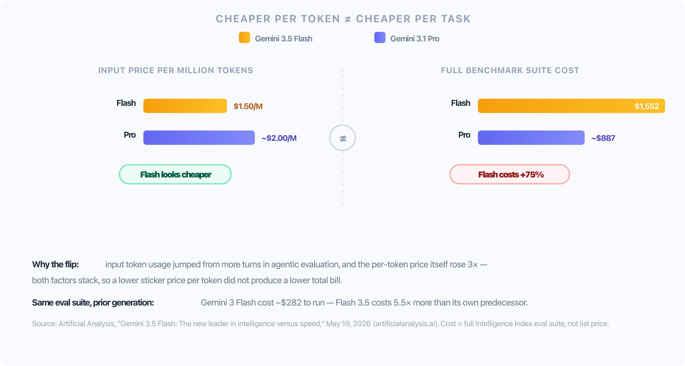
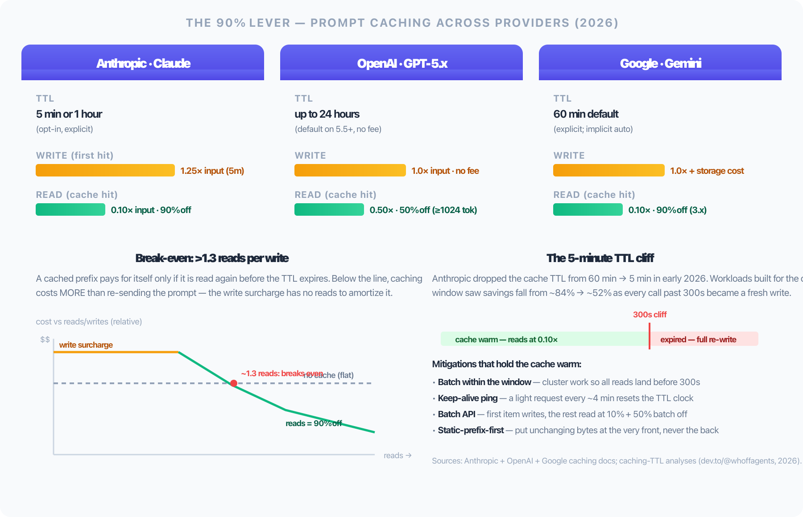

# Token Economics: Better Results, Fewer Tokens

> More tokens do not mean better answers. They mean a bigger bill and, past a point, a *worse* answer — because the model has to search harder for the signal in the noise.

I've spent 7+ years shipping production TypeScript and Node systems, and the last couple of those leading a team at Nerddevs that now writes more code through AI agents than by hand. The habits below aren't theory — they're what I run on my own side projects (this blog repo included) and what I've had to walk teammates back from when a session quietly burned through a day's token budget on a single "just look around the codebase first" request.

Every AI coding session has a hidden meter running. Most engineers watch the response quality and ignore the meter — until the monthly bill or the "context limit reached" wall shows up. This post is the meter, made visible: what actually drives token cost, why the cheapest-looking model is sometimes the most expensive, and the concrete configuration in this repo's own `.claude/` setup that keeps cost down without touching output quality.

The worked examples below use Claude Code because that's this repo's own daily driver — but the arithmetic (price × tokens × attempts) and the guard rails don't belong to one vendor. There's a dedicated section on Codex, OpenCode, OpenRouter, and local models further down, plus what changes on your laptop when you're running several of them at once across worktrees.

---

## The Real Cost Equation

Cost per task is not the sticker price per million tokens. It's:

```
cost = (price per token) × (tokens consumed per task) × (number of attempts)
```

Vendors advertise the first factor. The second and third factors are where the real money moves, and they're controlled by *your* setup — model choice, harness quality, context hygiene — not by the vendor.

**The cheap-per-token trap, with real numbers (verified, mid-2026):** Gemini 3.5 Flash prices input at $1.50/M tokens against Gemini 3.1 Pro's ~$2.00/M — on the sticker, a clear win. But according to Artificial Analysis's own published evaluation — they run every model through their Intelligence Index and report the total cost — running the **full suite cost $1,552 on Gemini 3.5 Flash versus ~$887 on Gemini 3.1 Pro**: the "cheaper" model came out 75% *more expensive* per workload. Artificial Analysis attributes this to two stacking factors, not one: Flash 3.5 is priced 3× higher per token than its own predecessor (Gemini 3 Flash, at $0.50/$3.00 vs the new $1.50/$9.00 per million), *and* it uses significantly more input tokens per evaluation because agentic runs now take more turns. Gemini 3 Flash itself cost only ~$282 to run the identical suite — so Flash 3.5 costs 5.5× more than its own prior generation, on top of costing more than the "expensive" Pro tier it's supposed to undercut.

The lesson: **price-per-token and cost-per-task are different numbers, and only one of them is on the pricing page.**

<div align="center">
  
  <br/>
  <sub>Source: <a href="https://artificialanalysis.ai/articles/gemini-3-5-flash-everything-you-need-to-know">Artificial Analysis — "Gemini 3.5 Flash: The new leader in intelligence versus speed"</a> (May 19, 2026). Chart built from their published figures — not a reproduction of their original graphic.</sub>
</div>

---

## Model Tiering: Pay for Reasoning Only When You Need It

Current Anthropic API pricing (July 2026), per million tokens:

| Model | Input | Output | Best for |
|---|---|---|---|
| Claude Haiku 4.5 | $1 | $5 | Lookups, file discovery, quick reformatting |
| Claude Sonnet 5 | $2 (intro, until Aug 31 '26) → $3 | $10 → $15 | Implementation, review, daily development |
| Claude Opus 4.8 | $5 | $25 | Architecture, complex debugging, spec writing |

Cached input runs up to **90% cheaper** than fresh input on all three.

That table is the reason `~/.claude/rules/model-routing.md` in this setup exists as a rule, not a suggestion — every subagent dispatch in this session picks a model deliberately:

```md
- Use haiku for: quick lookups, file discovery, simple reformatting
- Use sonnet for: implementation, testing, code review
- Use opus for: architecture decisions, complex debugging, spec writing
- Default to sonnet — only escalate to opus when reasoning depth matters
```

The benchmark data backs this up from the other direction: on SWE-bench Pro, **Haiku 4.5 solves problems for about $0.13 of spend per benchmark point** — the cheapest cost-per-correct-fix of any current model — while Opus 4.8 posts the highest score (69.2%) but at 5-25x the per-token price. Routing by task, not defaulting everything to the flagship model, is the single highest-leverage lever most teams never pull.

---

## Beyond One Vendor: Tools, Routing, and Local Models

Everything above happens to use Anthropic's price list, but none of it is Claude-specific. Here's the same arithmetic across the rest of the landscape, light touch — pick the tool for the constraint that actually binds, not the one with the loudest benchmark claim.

| Tool | Model access | Pricing shape | The real tradeoff |
|---|---|---|---|
| **Claude Code** | Anthropic only | $20/$100/$200 subscription tiers (~44K tokens per 5-hour window on the $20 plan), or pay-per-token API | Predictable, but heavy days hit the window cap |
| **OpenAI Codex CLI** | OpenAI only | Go $8 / Plus $20 / Pro $100–$200; GPT-5.4 API at $2.50 in / $15 out per MTok | OpenAI markets ~4× better token efficiency than Claude Code — a vendor claim, worth measuring on your own workload before trusting it |
| **OpenCode** (open-source) | 75+ providers — Claude, GPT, Gemini, local Ollama, switchable mid-session | Whatever the backing model charges | One terminal UI, any vendor's pricing tier underneath; built-in LSP integration feeds it real type signatures instead of the model guessing — fewer exploratory tokens spent either way |
| **OpenRouter** | 300+ models, one API key | Pass-through provider pricing (no markup) + 5.5% card-funding fee (min $0.80) + 5% BYOK fee over 1M req/month | Cross-vendor arbitrage without rewriting your harness per provider; supports prompt caching with "sticky routing" to keep cache hits high — but you're trusting a proxy hop to pass caching semantics through correctly |
| **Local (Ollama, LM Studio + open models)** | Whatever fits your hardware | $0 marginal cost per token | The token is free; the device isn't — see below |

**The local-model catch, in numbers:** Ollama's floor is 8 GB RAM with no GPU, but agentic coding is a different animal — the KV cache grows every turn, so even a model that fit comfortably at turn one gets pushed into slow CPU territory by turn twenty. Realistic targets: 16 GB RAM minimum, 32 GB recommended, 64 GB for comfortable headroom; 7–8B models want 8–12 GB of VRAM (or unified memory on Apple Silicon, which doesn't split between GPU and system RAM the way a Windows laptop with a discrete GPU does). None of that shows up on a per-token price comparison, and neither does the quality gap: a weaker local model that needs three retries to reach the same correct answer a hosted model gets in one has spent more *wall-clock* and dev attention than the "expensive" API call, even at $0 marginal token cost. Support follows the same pattern — community-only, no SLA, you own the updates and the security posture. The real win with local models isn't price; it's that nothing leaves the device, which is the actual deciding factor for regulated or offline work.

---

## Harness Beats Horsepower

Model choice gets all the attention. Scaffolding — the tools, prompts, and retrieval strategy wrapped around the model — often matters more, and there's a clean, verifiable example of exactly how much. Claude Opus 4.8 reports 69.2% on SWE-bench Pro using its own vendor scaffolding. Scale AI's SEAL lab runs the *same* benchmark with identical, standardized scaffolding across every model — no vendor tuning its own harness to the test — and on that leaderboard, the best score any model posts is 59.1%. That's a **10-point gap from harness alone**, on the same tasks, same benchmark, same scoring — the only variable that changed is who built the scaffolding around the model.

Two harness-level rules in this repo's config exist specifically to buy back that swing:

- **Instruction budget.** Frontier LLMs reliably comply with roughly 150–200 instructions total; Claude Code's own system prompt burns ~50 of those before a project's `CLAUDE.md` even loads. Every low-value rule in a project file degrades the following rate of every *other* rule, uniformly. Keeping `CLAUDE.md` under ~200 lines isn't tidiness — it's a token-and-compliance budget.
- **Rules over CLAUDE.md bloat.** `~/.claude/rules/*.md` files load only when a file matching their glob is touched (`*.ts,*.tsx` → TypeScript rules; `*.vue` → Vue conventions). A `CLAUDE.md` loads in full, every turn, regardless of relevance. Splitting file-specific patterns into globbed rules means the model isn't carrying Vue conventions while it edits a Python script.
- **Command hooks over prompt hooks.** A `command` hook runs a shell check directly — zero model tokens, deterministic. A `prompt` hook asks the model to *evaluate* a condition and decide whether to act — it costs tokens and reasoning on every single tool call it's attached to. Lint and type-check gates belong in command hooks; save prompt-based judgment for things that genuinely need judgment.

---

## Multi-Project, Multi-Worktree — One Laptop, Many Agents

Token cost isn't only an API bill. It's also whatever is left of your CPU, RAM, and battery once you've opened three worktrees to pair-review a `branchdiff` PR, keep a side project's agent running in another tab, and let a background hook update a knowledge graph on commit. I've had a MacBook fan spin up like a jet engine mid-standup because of exactly this — three agent-adjacent processes fighting for the same cores at once.

This repo's own graphify integration hit the same wall before it shipped a fix: without a guard, concurrent graph rebuilds piled up — **3 processes at 65–73% CPU each, load average past 12, RAM saturated** — because every worktree switch and every commit tried to rebuild at the same time. The fix wasn't a cheaper model; it was a resource check baked into the git hook itself: skip the rebuild if CPU load is above 50% of available cores or free memory drops under 2 GB, plus a `pgrep` dedupe so a second trigger can't stack a second process on top of the first.

That pattern is vendor-agnostic and it matters more, not less, as you multiply concurrent agents:

- **Every parallel worktree is a concurrent process**, whether it's a hosted tool's background hook, a subagent dispatch, or — sharpest of all — a local model's inference process competing for the same RAM your IDE and browser already claimed.
- **Guard background jobs, don't just schedule them.** A resource check (CPU + free-memory threshold) before any rebuild, index, or hook fires, plus process dedupe, is cheaper than the cleanup after three of them collide.
- **Serialize the heavy jobs across worktrees.** One graph rebuild running at a time beats one per open worktree — the git hook above already does this by design.
- **Local models need this rule doubled.** An 8–14B model fits one active session comfortably; open two or three worktree sessions on the same box and you're splitting the same 16–32 GB of RAM/VRAM three ways while your battery drains faster than any "up to 20 hours" spec sheet implies.

A laptop under load throttles, times out, and produces worse — slower, sometimes truncated — agent output long before the API bill becomes the bottleneck. Plan for concurrent device load the same deliberate way you plan for tokens-per-task.

---

## Feed Less, Not More

Bigger context windows solved one problem and created another: **context rot**. Accuracy degrades as token count climbs, even well inside the window limit — the model has more haystack to search for the same needle. The fix isn't a bigger window; it's a smaller haystack.

Three patterns do the heavy lifting:

1. **Agentic, on-demand retrieval instead of pre-loading everything.** This repo's knowledge-graph tooling (`graphify` + `code-review-graph`) builds its index with Tree-sitter — **0 LLM tokens** to parse 1,000+ files into a queryable graph. Every session that skips it re-reads dozens of files just to get oriented — one measured session lost "twenty thousand tokens evaporated before a single line of code is written." Querying the graph (`semantic_search_nodes`, `get_impact_radius`) costs a few hundred tokens instead of a fresh directory sweep.
2. **Subagents with clean context.** Dispatching research or exploration to a subagent means the main conversation gets a distilled answer back, not the transcript of every file it read to get there. The heavy lifting happens in a context that gets thrown away; only the conclusion survives.
3. **Prompt caching** — big enough to get its own section, below.

---

## Caching: The 90% Lever

Prompt caching is the single highest-leverage, zero-quality-loss technique in this whole post. The model already computed the attention values for your static prefix — system prompt, tool definitions, the unchanging file you're iterating on — on the last call. Instead of throwing that work away, the provider keeps it warm and charges you a fraction to reuse it. The output is byte-identical; only the bill and the latency change.

The headline number every provider converges on is **~90% off the cached portion of input**. The mechanics differ enough across the three majors that the strategy has to differ too:

| Provider | Cache TTL | Write (first hit) | Read (cache hit) | How to get it |
|---|---|---|---|---|
| **Anthropic (Claude)** | 5 min or 1 hour (opt-in) | **1.25×** standard input for 5 min, **2.0×** for 1 hour | **0.10× input** (90% off) | Explicit: mark `cache_control: { type: "ephemeral" }` on the prefix blocks you want cached |
| **OpenAI (GPT-5.x)** | up to **24 hours** (default on 5.5+, no fee) | 1.0× input, no surcharge | **0.50× input** (50% off, ≥1024 tok, 128-tok increments) | Automatic — routed to servers that recently computed the same prefix, no code change |
| **Google (Gemini 3.x)** | 60 min default (extensible) | 1.0× input + per-hour storage cost | **0.10× input** (90% off) | Implicit (auto, free) or explicit (declared, guaranteed discount) |

<div align="center">
  
  <br/>
  <sub>Sources: <a href="https://platform.claude.com/docs/en/build-with-claude/prompt-caching">Anthropic prompt-caching docs</a>, <a href="https://developers.openai.com/api/docs/guides/prompt-caching">OpenAI prompt-caching guide</a>, <a href="https://ai.google.dev/gemini-api/docs/caching">Gemini context caching docs</a>. Chart built from their published mechanics — not a reproduction of any vendor graphic.</sub>
</div>

### The break-even that determines whether caching is even worth it

Caching is not free money — there's a **write surcharge** on the first hit, and it only pays off if enough *reads* land before the prefix expires to amortize it. The rule of thumb, backed by the per-vendor pricing math: **you break even at roughly 1.3–1.4 reads per write.** Below that line, caching *increases* cost — you paid the 1.25× (or 2.0×) write tax and then never reused it. A 20,000-token system prompt that gets hit ~1.1 times per five-minute window genuinely costs *more* with caching turned on than off. The lever only works when there's repetition inside the window.

### The 5-minute TTL cliff (and how to not fall off it)

Anthropic quietly dropped the Claude cache TTL from 60 minutes down to **5 minutes** in early 2026, and it caught a lot of production workloads mid-stride: savings that were tracking ~84% fell to ~52% overnight, because every request that landed past the 300-second mark became a fresh write instead of a cheap read. If your batch job processes 200 items at 2 seconds each (400 seconds total), the cache dies around item 135 and *every call after that is a miss* — the 90% lever silently switches off mid-workflow.

Four mitigations hold the cache warm, and they generalize across providers:

- **Batch within the window.** Don't trickle requests in over an hour. Cluster the work so all the reads land before the TTL expires — turn a slow steady stream into a tight burst.
- **Keep-alive ping.** For a long session against high-value cached content, send a lightweight request roughly every 4 minutes. Accessing a cached block *resets* its TTL, so a cheap read keeps an expensive write alive indefinitely.
- **Static-prefix-first.** Cache matching is positional — it breaks the moment a single byte changes ahead of the cached segment. Put the unchanging bytes (system prompt, tool defs, reference docs) at the very front, and push anything dynamic (the current user message, working memory, the file you're actively editing) to the *back*. The most common reason a cache hit rate is stuck low is dynamic state living in the system prompt, invalidating the whole prefix every turn.
- **Batch API for overnight jobs.** When the window is too long to batch within, switch to the provider's Batch API: it processes requests with a shared prefix, so the *first* request in the batch pays the write cost and the rest pay the read cost (10%) — and Anthropic/Gemini stack a further ~50% batch discount on top, which can reach ~95% off the repeated portion for genuinely async work.

### My rule for sessions, not just servers

Most of that table is server-side API economics, but the same instinct applies to an interactive coding session: **work in tight bursts, not long drips.** If you're iterating on one file, keep the turns close together so the provider's cache for that file stays warm between requests — leave for a coffee and a meeting and you come back to a cold cache paying full write cost again. Bunch the exploration, the edits, and the review into the same window. It's the same "fewer tokens, fewer watts, fewer dollars" loop this whole post runs on, just timed.

---

## Memory Compounds — Reuse Beats Re-Derivation

The most expensive token is one spent re-discovering something already known. This project's own memory index made that concrete in a single session log:

> Loading 50 indexed observations cost **23,909 tokens to read**. The work that originally produced those observations — research, building, deciding — cost **485,629 tokens**. Reusing the index instead of re-deriving the same context: **95% fewer tokens**, for the same starting knowledge.

That's not a benchmark claim, it's one real number from one real session — but the mechanism generalizes: any time context is captured once (a memory file, a spec, a knowledge graph, a CLAUDE.md gotcha) and *read* on every subsequent occasion instead of *re-derived*, the savings compound across every future session that touches the same ground.

---

## Mine Your Own History — Stop Paying for the Same Mistake Twice

Every repeated correction is a hidden multiplier on the "number of attempts" term from the cost equation at the top of this post — the agent doesn't fail once, it fails the *same way* every time nobody tells it to stop. Two logs already sitting on disk are worth mining for exactly this, and most teams never look at either:

- **Session/chat logs.** This project's own auto-memory has a `feedback` category built for it: "any time the user corrects your approach... or confirms a non-obvious approach worked, save what is applicable to future conversations." This repo's memory index already has two live examples — a note that command hooks beat prompt hooks for deterministic checks, and one that skills should install globally, not per-project — corrections made once in a session, now loaded automatically at the start of every future one instead of being re-explained from scratch.
- **PR review comments.** If the same review comment shows up on three different PRs — a missing null check, an error message that isn't pulled from the constants file, an `any` type that should've been a real one — that isn't three isolated nits, it's a pattern the model will keep reproducing until someone tells it once, permanently. That's exactly what a `CLAUDE.md`'s "Critical Gotchas" or "PR Review Rules" section is for: recurring review feedback, distilled once, applied on every future session without a human retyping the same comment a fourth time.

The token math is the same "capture once, reuse forever" pattern as the memory index above — just pointed backward at your own mistake history instead of forward at new work. A correction re-explained in chat costs a few hundred tokens *every time it recurs*. The same correction encoded once in a rule costs those tokens once, then applies for free on every future turn where it's relevant.

---

## Write Less Code, Read Less Code Later

Every line of code written today is a line some future session has to load into context to understand, review, or modify. Fewer lines isn't just a maintainability win — it's a standing token discount on every future interaction with that file.

Benchmark medians across five everyday coding tasks (email validator, debounce, CSV sum, countdown timer, rate limiter) across three model tiers, comparing a YAGNI-first approach against no constraint:

| Metric | No constraint | Lean-by-default | Change |
|---|---|---|---|
| Lines of code | 100% | 6–20% | 80–94% less |
| Cost | 100% | 23–53% | 47–77% less |
| Speed | 1× | 3–6× | 3–6× faster |

Deletion beats addition, boring beats clever, and the smallest correct diff wins — not for aesthetic reasons, but because every unnecessary abstraction is context every future session pays to load.

---

## The Dev-Team Angle

Anthropic's own usage data shows coding isn't one use case among many — it's the dominant one. "Modifying software to correct errors" alone accounts for roughly 6% of consumer Claude.ai usage and **10% of enterprise API traffic**, and the top 10 tasks make up close to a fifth to a quarter of all conversations. Engineering teams are, structurally, the heaviest token consumers in most organizations that adopt AI coding tools.

That makes token discipline a team-economics lever, not a personal frugality habit. A 47–77% cost reduction on the highest-volume workload in the company (from the table above) moves a real line item — and it costs nothing in output quality, because every technique here is a routing, caching, or context-hygiene change, not a capability cut.

---

## Fewer Tokens, Fewer Watts

There's a dimension to this that never shows up on any invoice: electricity and water. Global data-center electricity demand was already an estimated 460–490 TWh in 2025; AI workloads are the reason it's projected to roughly double by 2030, with AI-specific data centers alone expected to draw **945 TWh** — nearly triple the combined annual electricity use of Pakistan, Bangladesh, and Nigeria, three countries home to 650M+ people. The same 2025 baseline carried an estimated **32.6–79.7 million tons of CO2** and **312.5–764.6 billion liters of water** for cooling. UN researchers are now measuring AI's footprint against entire countries, not companies.

None of that is on the pricing page either. Every unnecessary retry, every full-repo re-read that a knowledge graph could have answered in a few hundred tokens instead, every task upgraded to Opus that Haiku would have solved just as well — is a small amount of *real* electricity and *real* water spent on work that didn't need doing. That's not a guilt trip; it's just the honest scope of what "fewer tokens" actually means. Liquid cooling is cutting water use per data center 70–90% industry-wide, which helps — but the lever on our side of the API call is the same one this whole post has been making: do the same job in fewer tokens.

---

## The Subsidy Clock Is Running Out

One more reason today's prices aren't the real prices: **they're not real prices yet.** OpenAI, Anthropic, Google, and Meta are all pricing inference below what it costs them to serve it. OpenAI's own numbers show roughly $2 spent for every $1 earned on inference, with $14B in losses projected for 2026 and $44B in cumulative losses before profitability arrives — by their own timeline — in 2029. A fully-utilized $200/month ChatGPT Pro plan would cost close to **$14,000/month** at published API rates: a 70x subsidy gap that exists because labs are buying market share with venture capital, not because inference is actually that cheap.

That subsidy is already unwinding. Anthropic moved enterprise customers from flat-rate plans to usage-based billing tied to actual compute in April 2026; GitHub Copilot followed weeks later, after years of quietly absorbing usage up to 8x the subscription's value for heavy users. Analysts expect frontier API prices to rise within 12–24 months, and enterprise AI bills to land 30–50% above today's levels once pricing reflects real infrastructure cost. (The honest counterweight: Gartner still expects the underlying cost *per unit* of inference to keep falling from hardware and algorithmic efficiency — this isn't pure doom, it's a floor rising under a ceiling that's also dropping.)

Either way, the habits in this post stop being optional the moment the subsidy ends. A team that's already routing by task, caching aggressively, and keeping context lean barely notices the price hike when it lands. A team that's defaulted to the flagship model on every request — because it was cheap enough not to think about — is about to feel the whole 30–50% at once, with no muscle memory for absorbing it.

---

## Checklist — Apply This Week

- [ ] Route by task: haiku for lookups, sonnet as default, opus only when reasoning depth justifies 5–25x the cost
- [ ] Match the tool to the constraint that actually binds — data residency → local, cross-vendor flexibility → OpenRouter/OpenCode, out-of-the-box agent quality → Claude Code/Codex
- [ ] Keep `CLAUDE.md` under ~200 lines; move file-specific patterns into globbed `rules/`
- [ ] Replace prompt-based lint/type checks with command hooks
- [ ] Index the codebase once (Tree-sitter-based graph, not LLM-based) instead of re-reading it every session
- [ ] Dispatch exploration and research to subagents; keep the main thread to conclusions
- [ ] Turn on prompt caching — and structure for it: static prefix at the front, dynamic state at the back, batch reads inside the TTL window (break-even ≈1.3 reads/write)
- [ ] Guard any background job — hooks, rebuilds, local inference — with CPU/memory checks and process dedupe before running multiple worktrees or projects in parallel
- [ ] Capture decisions in memory/spec files once — read them, don't re-derive them
- [ ] Mine session logs and PR review comments for recurring corrections; encode each one once into `CLAUDE.md`/rules instead of re-correcting it every time it recurs
- [ ] Default to the smallest correct diff; every deleted line is a discount on every future session
- [ ] Treat an unnecessary token as a small real energy-and-water cost, not just a cent — the same discipline covers both
- [ ] Don't build workflows that assume today's subsidized price is permanent — these habits are the buffer for when usage-based billing lands on your desk

---

## The Bottom Line

Back to where this started: the reason I'm writing this checklist instead of reading someone else's is that I've watched a session quietly burn a day's token budget on one lazy "look around the codebase first" prompt, and I've heard a laptop fan scream through three worktrees all fighting for the same five minutes of CPU. Both are the same failure wearing a different costume — too many tokens spent finding what a smaller, sharper request would have found in one pass.

The cheapest model was never the one with the lowest price per token. It's the one that reaches the correct answer in the fewest tokens, on the first attempt, on a device that isn't already choking — and it's the only version of this that survives the subsidy clock running out. Model tiering, tool choice, harness quality, context hygiene, and device headroom each move the bill independently of each other and independently of output quality. Pull all five levers while they're still optional, not after usage-based billing makes them mandatory.

If one line in this pays off in your own repo, that's the whole point of writing it down. Open `~/.claude/rules/model-routing.md` — or whatever your tool calls it — tonight, and route one task to the cheapest model that can actually do it.

---

## References

**Pricing & Benchmarks (primary sources):**
- [Artificial Analysis — "Gemini 3.5 Flash: The new leader in intelligence versus speed"](https://artificialanalysis.ai/articles/gemini-3-5-flash-everything-you-need-to-know) (May 19, 2026) — source for the cheap-per-token-trap chart: $1,552 (Flash 3.5) vs ~$887 (3.1 Pro) vs ~$282 (Flash 3, predecessor) to run their Intelligence Index eval suite
- [Scale AI Leaderboards — SWE-bench Pro (SEAL, standardized scaffolding)](https://labs.scale.com/leaderboard/swe_bench_pro_commercial) — source for the 69.2% vendor-scaffold vs 59.1% standardized-scaffold gap
- [Anthropic — Introducing Claude Sonnet 5](https://www.anthropic.com/news/claude-sonnet-5)
- [Anthropic API Pricing — Claude Platform Docs](https://platform.claude.com/docs/en/about-claude/pricing)

**Pricing & Benchmarks (secondary aggregators, cross-checked):**
- [Best AI Model for Coding — SWE-bench Pro Score and Cost per Task](https://www.morphllm.com/best-ai-model-for-coding) — Haiku 4.5 cost-per-point figure
- [SWE-bench Pro Leaderboard (2026)](https://www.morphllm.com/swe-bench-pro) — explains the Scale SEAL vs vendor-scaffold methodology gap in plain terms
- [Codex vs Claude Code (July 2026) — Benchmarks, Subagents & Limits](https://www.morphllm.com/comparisons/codex-vs-claude-code)
- [OpenCode — the open source AI coding agent](https://opencode.ai/)
- [OpenRouter — Pricing](https://openrouter.ai/pricing) and [Prompt Caching guide](https://openrouter.ai/docs/guides/best-practices/prompt-caching)
- [Local LLM Hardware Requirements in 2026](https://overchat.ai/ai-hub/llm-hardware-requirements)

**Context Engineering:**
- [Anthropic — Context engineering: memory, compaction, and tool clearing (Claude Cookbook)](https://platform.claude.com/cookbook/tool-use-context-engineering-context-engineering-tools)
- [Don't Break the Cache: Prompt Caching for Long-Horizon Agentic Tasks](https://arxiv.org/pdf/2601.06007)

**Prompt Caching (primary docs — source for the caching chart & break-even):**
- [Anthropic — Prompt caching (1.25×/2.0× write, 0.10× read, 5-min/1-hr TTL)](https://platform.claude.com/docs/en/build-with-claude/prompt-caching)
- [OpenAI — Prompt caching (up to 24-hr default, 50% off ≥1024 tok, automatic)](https://developers.openai.com/api/docs/guides/prompt-caching)
- [Google — Gemini context caching (90% off, implicit vs explicit, 60-min TTL)](https://ai.google.dev/gemini-api/docs/caching)

**Caching strategy & the 5-minute TTL cliff (analysis, cross-checked against docs above):**
- [Claude Prompt Caching in 2026 — the 5-minute TTL change costing you money](https://dev.to/whoffagents/claude-prompt-caching-in-2026-the-5-minute-ttl-change-thats-costing-you-money-4363)
- [Prompt Caching Deep Dive — when it helps, when it hurts, the 270s cliff](https://dev.to/whoffagents/prompt-caching-deep-dive-when-it-helps-when-it-hurts-and-the-270s-cliff-291j)

**Usage Data:**
- [Anthropic Economic Index report: Cadences](https://www.anthropic.com/research/economic-index-june-2026-report)
- [Anthropic Economic Index report: Learning curves](https://www.anthropic.com/research/economic-index-march-2026-report)

**Environment & Subsidy Economics:**
- [UN News — AI's environmental costs threaten water, land and climate](https://news.un.org/en/story/2026/06/1167658)
- [AI Environment Statistics 2026 — power and water use](https://www.allaboutai.com/resources/ai-statistics/ai-environment/)
- [Model subsidies are ending. What do you do now? — Arize AI](https://arize.com/blog/ai-model-subsidies-ending-llm-inference-costs/)
- [AI Inference Cost Crisis 2026 — why OpenAI loses $1.35 per dollar earned](https://aiautomationglobal.com/blog/ai-inference-cost-crisis-openai-economics-2026)

**Related posts from this repo:**
- [Claude Code Configuration Blueprint - The Complete Guide for Production Teams](./Claude%20Code%20Configuration%20Blueprint%20-%20The%20Complete%20Guide%20for%20Production%20Teams.md)
- [Graphify + code-review-graph: Build a Self-Updating Knowledge Graph](./Graphify%20+%20code-review-graph:%20Build%20a%20Self-Updating%20Knowledge%20Graph%20for%20Claude%20Code%20and%20other%20AI%20Coding%20Agent.md)

---

## Let's Connect

Thank you for the time — genuinely. If you try any of this, I'd rather hear what broke than what worked:

- **Website**: [encryptioner.github.io](https://encryptioner.github.io)
- **LinkedIn**: [Mir Mursalin Ankur](https://www.linkedin.com/in/mir-mursalin-ankur)
- **GitHub**: [@Encryptioner](https://github.com/Encryptioner)
- **X (Twitter)**: [@AnkurMursalin](https://twitter.com/AnkurMursalin)
- **Technical Writing**: [Nerddevs](https://nerddevs.com/author/ankur/)
- **Support**: [SupportKori](https://www.supportkori.com/mirmursalinankur)
