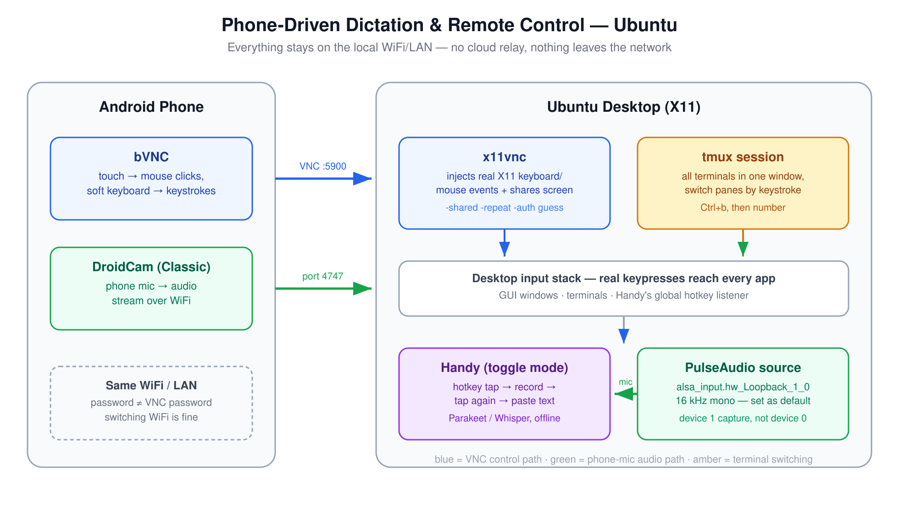

# Free, Offline Voice Dictation Anywhere — Driven From Your Phone Over VNC

> Typing rations context. You compress the message, drop the caveat, skip the background — then spend three turns re-adding what you cut. Speaking removes that tax.

Stanford puts dictation at roughly 3x typing speed, but the bigger win isn't speed. It's that you stop under-specifying. When talking costs nothing, you say the caveat instead of cutting it — whether that's a commit message, a Slack reply, a doc, an email, or a prompt to an AI agent like Claude Code. Prompting agents is one of the places this pays off fastest (context you'd normally trim is exactly what an agent needs), but it's one use case among many, not the point of the setup.

So I went looking for a dictation setup with a specific bar: **free, fully offline** (no cloud dependency, no subscription), **system-wide** (works inside a terminal, not just chat boxes), and light on disk/RAM on an 8 GB-class machine. Below is what I run — on Mac and on Ubuntu — plus a setup I didn't expect to need: controlling the whole desktop from my phone over the local network, no cloud relay. That second half turned out useful for more than dictation — switching between running apps, checking a build log, replying to something without walking to the desk.

---

## Picking a tool

| Tool | Free tier | Offline model | macOS | Ubuntu |
|---|---|---|---|---|
| superwhisper | Free (tiny/base, 3 modes cap); Pro $8.49/mo unlocks large-v3 | Yes | Native | No |
| **Handy** | 100% free, MIT, no tiers | whisper.cpp + Parakeet, unlimited | Native | Native |
| VoiceInk | $25–49 one-time (GPLv3, buildable free) | Local Whisper | Native | No |
| Whispering | Free OSS; local via Speaches/whisper.cpp | Yes | Yes | Yes |
| OpenWhispr | Free local; cloud tier adds paid quota | whisper.cpp + Parakeet | Yes | Yes |
| Wispr Flow | ~2,000 words/week free | **No offline mode** | Yes | No |

**[Handy](https://github.com/cjpais/Handy)** won: MIT-licensed, no model or mode caps, no account, runs on both machines I actually use (Mac daily, Ubuntu for a home box), and pastes into any focused app — including a terminal, which was the whole point.

One naming gotcha worth flagging up front: `apt search handy` on Ubuntu surfaces `libhandy-1-0`/`gir1.2-handy-1` first — that's an unrelated GTK widget library, same name, different project. The tool here always comes from `github.com/cjpais/Handy` releases directly.

---

## macOS install

- Official Homebrew cask: `brew install --cask handy` — confirmed it's maintained in the `homebrew-cask` repo itself, not a third-party tap, before running it.
- The app bundle is small, ~40 MB, before any model download.
- First launch asks for two one-time OS permissions (Microphone, Accessibility) — click-through, no config editing.
- It works system-wide by design: hold the shortcut, speak, release, text pastes wherever the cursor currently is. Terminal included.

### Model choice: multilingual (English + Bangla)

Handy's default model, Parakeet, only covers 25 European languages — no Bangla yet (an open feature request, unresolved). Whisper covers Bangla among 99 languages, from a single multilingual model file — no swapping per language, it detects (or can be pinned to) whichever one you're speaking.

- **Whisper Medium** (~492 MB) — good English quality, decent-enough Bangla for daily use. Set as default.
- **Whisper Large** (~1.1 GB) — a one-click model swap from Settings if Bangla accuracy needs it later, no reinstall.

Two decoding concepts worth knowing if you're picking a model yourself: **transcribe vs translate** — transcribe outputs the language you spoke, translate always outputs English regardless of input (skips a separate translation step, but Handy doesn't expose a UI toggle for it yet). And **auto-detect vs pinned language** — auto-detect guesses per clip (Whisper only; Parakeet-family models don't detect at all and silently default to English), pinning skips that step for speed and avoids misdetection on short clips.

### Speed fix: switch to a streaming model

Whisper Medium (picked for Bangla) felt slow for everyday English dictation. Handy added streaming model support in v0.9.0 — **Parakeet Unified EN (0.6B)** is the streaming-capable engine, now Handy's recommended default: English-only, ~160ms latency, live preview while you're still speaking. Set that as the daily driver, and switch to Whisper Medium/Large only for the occasional Bangla session — same one-click swap, no reinstall.

### Tuning that mattered

- **Custom vocabulary**: Settings → Advanced → Transcription → Custom Words — a `misheard → corrected` pair list for names and jargon the model gets wrong (e.g. "nerd devs" → "NerdDevs"). For cleanup beyond a fixed word list, Experimental → Post-Processing runs a second AI pass over the transcript, at the cost of a bit more latency.
- **RAM**: idle process measured **~823 MB RSS** with a model resident in memory. Noticeable if you keep it always-on on an 8 GB machine — Settings → Advanced → Unload Model frees that after a configurable idle timeout, at the cost of first-word latency on the next dictation.
- **Shortcut conflict**: default `Option+Space` clashed with Spotlight's own binding. Switched to Right Option held alone (not a macOS system action by itself, no collision). Alternative that's popular in Handy's own docs: hold `Fn`, with System Settings → Keyboard → "Press Globe key to…" → *Do Nothing* so its default tap-action doesn't also fire.

---

## Ubuntu install

Check the session type first — the Wayland notes below only apply if you're actually on Wayland:

```bash
echo $XDG_SESSION_TYPE   # "x11" or "wayland"
```

On Ubuntu 22.04 GNOME, logging in via the **"Ubuntu on Xorg"** option (still offered at the login screen) gives X11, and Handy needs none of the tuning below under X11 — it worked out of the box.

### Install (`.deb`, works on both X11 and Wayland)

```bash
curl -fL -o /tmp/Handy_amd64.deb \
  https://github.com/cjpais/Handy/releases/latest/download/Handy_0.9.5_amd64.deb
sudo apt install -y /tmp/Handy_amd64.deb
```

Swap `amd64` for `arm64` on ARM; `.rpm` and `.AppImage` builds are published too.

**Gotcha**: `apt` downloads/verifies as the unprivileged `_apt` user, which needs execute permission on every directory in the file's path. A `.deb` sitting in a locked-down tmp dir (e.g. `chmod 700`) fails with `couldn't be accessed by user '_apt'` even though the file itself is readable. Fix is downloading into a world-traversable path like `/tmp`, not loosening the original directory's permissions.

### If you're on Wayland (GNOME default, 22.04+)

Wayland breaks Handy's default paste/typing out of the box, with known fixes:

- `sudo apt install ydotool`, run the `ydotoold` daemon, then set **Advanced → Keyboard Implementation → ydotool** — Wayland blocks the default typing method entirely.
- **Advanced → Overlay Position → None** — the overlay steals focus from the target window under Wayland, breaking paste.
- **Paste method → Direct**.
- Avoid the `Handy Keys` backend on Wayland — it re-injects keystrokes via ydotool and can loop, flooding the focused window with garbage text.
- Avoid bare single-key shortcuts (F13, Fn alone) — they can silently fail to fire on Wayland. Use a modifier combo instead, e.g. `Ctrl+Alt+Space`. Right Alt is commonly reserved as AltGr on Linux layouts — use Right Ctrl if you're carrying over a Mac Right-Option habit.
- Escape hatch: log in via "Ubuntu on Xorg" instead — none of the above tuning is needed under X11.

Model choice carries over unchanged: Parakeet Unified EN as the daily default, Whisper for occasional Bangla.

---

## Remote control from a phone (Ubuntu — VNC + tmux + phone mic)

This part started as a convenience for dictation and turned into a general-purpose remote desktop: full mouse/keyboard control of the machine from the phone — switching between running apps, checking on a long build, dismissing a notification, replying to something — with dictation through the *phone's* mic as one capability riding on top, all over the local network, no cloud relay.

<div align="center">
  
  <br/>
  <sub>Two independent paths over the same LAN: VNC carries control (blue), DroidCam carries audio (green) — Handy never knows the input isn't local.</sub>
</div>

**A note on scope**: everything from here to "Daily use" below is the **Ubuntu** setup — that's the machine it was actually built and tested on, end to end. macOS has the pieces to do the same job, untested so far:

- **Screen sharing / remote control**: macOS's built-in Screen Sharing (`System Settings → General → Sharing → Screen Sharing`) speaks the same VNC protocol x11vnc does — a phone VNC client should be able to view/control a Mac with zero extra install, no x11vnc equivalent needed.
- **Phone mic, without the DroidCam/PulseAudio-loopback dance below**: Continuity Camera can already route an iPhone's mic into a Mac as a normal system input device natively — no Android-style ALSA loopback wiring, no wrong-device mirror bug to chase, because macOS treats it as a first-class audio input out of the box.
- **Dictation app**: same Handy install as the macOS section above — nothing changes there.

None of those three have been run end-to-end and verified the way the rest of this section was — treat them as the likely shape of a macOS equivalent, not a tested recipe. This section gets a real macOS walkthrough once it's actually been built and broken on a Mac the same way the Ubuntu instructions below were.

**Why plain SSH isn't enough on its own**: Handy has no always-listening mode — it needs a real keypress on its global hotkey to start recording, and that hotkey is a listener hooked into the desktop's own input stack (X11 here). An SSH text session never reaches that hook. VNC's remote keyboard/mouse *does* synthesize real input events on the desktop, so a VNC-triggered hotkey fires Handy exactly like a physical keypress would.

Handy also has no in-app microphone picker — it just uses whatever the OS default input device is. That's what makes swapping in the phone's mic possible without touching a single Handy setting.

### The pieces

- **x11vnc** — screen-shares the existing X11 session. Lets the phone both see the desktop and inject real keyboard/mouse events into it.
- **tmux** — alt-tabbing between separate GUI terminal windows by touch is fiddly on a phone. Keeping everything in one tmux session and switching panes/windows by keystroke (`Ctrl+b` + number) is far easier to drive from a soft keyboard.
- **DroidCam** (Android app + Linux client) — streams the phone's mic over WiFi into a virtual PulseAudio source on Ubuntu. Since Handy just follows the system default input device, setting that virtual source as default *is* the entire integration.

### Check what's already installed

Ubuntu ships `tmux` on some images but not others, and x11vnc is never preinstalled — check before assuming either way:

```bash
command -v tmux x11vnc || echo "missing one or both — install below"
```

### Install

```bash
sudo apt install -y x11vnc tmux
```

`droidcam` is **not** an apt package — it ships its own installer from dev47apps.com. Keep it in a separate command from apt installs: bundling a real package name with a nonexistent one fails the *whole* `apt install` transaction atomically.

```bash
cd /tmp && wget -O droidcam.zip https://files.dev47apps.net/linux/droidcam_2.1.5.zip
unzip -o droidcam.zip -d droidcam && cd droidcam
sudo ./install-client   # main app
sudo ./install-sound    # ALSA loopback — needed for mic-as-input-device
sudo ./install-video    # required even for audio-only, see below
```

Three gotchas here, in the order they'll actually bite:

1. **`install-video` isn't optional for mic-only use.** `droidcam-cli -a <ip> <port>` (audio-only flag) still hard-fails with `Error: Missing video device` without the `v4l2loopback-dc` kernel module — the client checks for a video device unconditionally, flags or not. Needs `linux-headers-$(uname -r)`, `gcc`, `make` (present on a normal desktop install).
2. **Flag order is not cosmetic.** `droidcam-cli <ip> <port> -a` (trailing flag) silently ignores `-a` — the parser stops scanning for flags at the first non-flag token and falls back to video-only. It prints `Video: /dev/video0`, no `Audio:` line, and exits clean — nothing *looks* wrong. Flags go **before** the IP: `droidcam-cli -a <ip> <port>`. Correct output for audio-only:
   ```
   Audio: hw:2,1,0
   ```
3. **Two DroidCam Android apps exist, only one works here.** "DroidCam Webcam (Classic)" is what `droidcam-cli` is built for. The OBS-companion variant connects fine for video but sends silent audio — the handshake answers, no mic samples ever flow. If both are installed, force-close both and open only Classic; they also fight over port 4747.

### Audio-only mode — worth it for phone battery

`-v` streams the camera continuously (capture, encode, WiFi upload) for the entire session, which drains the phone noticeably faster than audio alone — if all you want is the mic, skip it. `-a` alone is a *separate* code path in the client (its own `AudioThreadProc` thread, independent of the video path — confirmed reading `droidcam-cli.c`), so it doesn't need `-v` running alongside it to work:

```bash
droidcam-cli -a <phone-lan-ip> 4747
```

The `install-video` step from above is still required once at setup time regardless — the client checks that the `v4l2loopback-dc` kernel module exists at startup and refuses to run without it, even when you never pass `-v`. That's a one-time install-time dependency, not an ongoing battery cost — once the module's installed, `-a` alone never touches the camera or the video path at runtime. If `-a` alone doesn't produce audio on your setup after the loopback-source fix below, add `-v` back as a fallback (some app-version combinations reportedly need it to keep the mic thread alive) — but confirm with the `parecord`/`sox` check further down before assuming you need it.

### Wiring the mic through correctly

After `install-sound`, PulseAudio claims the new "Loopback" ALSA card in full duplex (`output:analog-stereo+input:analog-stereo`) — but `droidcam-cli` needs to open the playback side itself, so free it:

```bash
pactl list cards short   # find the loopback card's exact name
pactl set-card-profile alsa_card.platform-snd_aloop.0 input:analog-stereo
```

That fixes the connection — but not the audio. The PulseAudio source udev auto-creates for that card reads the *wrong* half of the loopback: `droidcam-cli` plays into ALSA device 0 playback, and `snd_aloop` cross-wires that onto device **1** capture, not device 0 capture (which is what the auto-created source listens to). Every recording from the wrong source measures a flat `0.000000` amplitude — connection and handshake both look healthy, the data just lands on a device nobody's reading. The fix is one line droidcam's own installer prints at the end (easy to miss, it scrolls past):

```bash
pactl load-module module-alsa-source device=hw:Loopback,1,0
pactl set-default-source alsa_input.hw_Loopback_1_0
```

The new source runs at 16 kHz mono — a useful tell that it's the right one (that's the phone-mic format). Verify before trusting it:

```bash
parecord --device=alsa_input.hw_Loopback_1_0 -d 5 /tmp/t.wav   # speak for the full 5s
sox /tmp/t.wav -n stat 2>&1 | grep -i amplitude                # > 0 means real audio
```

### Running x11vnc

```bash
tmux new -s vnc
x11vnc -display :<real-display-number> -auth guess -usepw -shared -repeat -forever
```

Find `<real-display-number>` with `who` (look for `<user>  :N  <date>`) from a terminal that's actually part of the graphical session.

- First run is interactive: no password file exists yet, so `-usepw` prompts you to set one. Always do this — never run x11vnc without auth.
- `-forever` keeps listening after the first client disconnects.
- **`-shared` matters.** Without it, x11vnc allows exactly one client at a time — a stale half-open connection from a WiFi blip or app switch makes every reconnect fail with `refusing new client ... Not shared & existing client` until you restart the server. With it, reconnects just work.
- **`-repeat` matters too.** x11vnc turns *off* the X server's key autorepeat by default while a client keyboard is active — its log even says so (`active keyboard: turning X autorepeat off`). Without this flag, holding an arrow key (or any key) from the phone does nothing beyond the first tap — no repeat, one character per touch, forever. `-repeat` keeps autorepeat on so a held key behaves like a physical one. Only drop it if your specific client does its own repeat and you start seeing doubled characters.
- **`-auth guess`** (x11vnc ≥0.9.9) finds the right Xauthority cookie itself. Modern GNOME/gdm sessions often keep it at `/run/user/<uid>/gdm/Xauthority`, not the default `~/.Xauthority` — hardcoding the default path is a common source of a silent auth failure.
- There's no `-localhost=no` flag — that's not real; `-localhost` (no value) *restricts* to loopback, and passing `=no` gets rejected as unrecognized. Allowing LAN connections is the default when you omit the flag entirely.
- Scope the port to your LAN: `sudo ufw allow from <your-subnet> to any port 5900` — never expose it to the internet. If you've never touched `ufw` before and only use SSH *outbound* to other machines (not inbound into this one), you don't need `sudo ufw allow OpenSSH` — that rule only matters for a device that accepts incoming SSH connections; ufw's default policy already allows all outbound traffic regardless of any inbound rule you add.

**What the VNC password actually is** — easy to conflate with the WiFi password, but it's a separate thing: it's set by you via `x11vnc -storepasswd` (not your router), it controls who can drive *this* desktop once already on the network (not who can join the network), and it doesn't change when you switch WiFi networks — phone and desktop just need to be on the *same* network at connection time, whichever one that is.

**Persisting across reboots — the actual autostart file**: there's no separate script to write here — GNOME (and most desktops) autostarts anything dropped as a `.desktop` file in `~/.config/autostart/`, once per graphical login, which is the earliest point a display actually exists to serve. Set the password once first (`x11vnc -storepasswd`), then create this file:

```ini
# ~/.config/autostart/x11vnc.desktop
[Desktop Entry]
Type=Application
Name=x11vnc
Exec=x11vnc -display :<N> -auth guess -rfbauth /home/<you>/.vnc/passwd -shared -repeat -forever
X-GNOME-Autostart-enabled=true
```

`<N>` is your real display number from `who` (see above); `<you>` is your Linux username — `Exec=` needs the absolute path, `~` isn't expanded there. `X-GNOME-Autostart-enabled=true` is what actually flips it on; a `.desktop` file without that line sits inert. Verify it's live any time with `pgrep -af x11vnc` after a fresh login — no separate "did it start" step needed beyond that.

The corrected PulseAudio source needs the same treatment, since `pactl load-module` doesn't survive a restart either — add it to `~/.config/pulse/default.pa`:

```
# ~/.config/pulse/default.pa
.include /etc/pulse/default.pa
set-card-profile alsa_card.platform-snd_aloop.0 input:analog-stereo
load-module module-alsa-source device=hw:Loopback,1,0
```

(A user `default.pa` *replaces* the system one, so the `.include` line matters. On systems running PipeWire instead, this file is ignored — check `pactl info | grep -i server`.)

### tmux, if you've never used it

Everything below starts with the prefix `Ctrl+b`, released, *then* the next key — it's tapped in sequence, not held together.

| Want to... | Keys |
|---|---|
| New named session | `tmux new -s <name>` |
| Reattach later | `tmux attach -t <name>` |
| List sessions | `tmux ls` |
| **Detach** (leave running) | `Ctrl+b` then `d` |
| New window | `Ctrl+b` then `c` |
| Switch to window N | `Ctrl+b` then `<number>` |
| Next / previous window | `Ctrl+b` then `n` / `p` |
| Split pane | `Ctrl+b` then `%` (vertical) / `"` (horizontal) |
| **Close a pane/window** | `exit` or `Ctrl+d` — an ordinary shell command, not a tmux shortcut |
| **Kill a whole session** | `tmux kill-session -t <name>` |
| Scroll back | `Ctrl+b` then `[`, arrow keys, `q`/`Esc` to exit |

The thing that trips people up: there's no tmux-specific "close" shortcut. You close a pane exactly like you'd close a normal terminal. `Ctrl+b`-prefixed shortcuts only *navigate* — they never end a session.

Scrolling by typing `Ctrl+b [` on a touch keyboard is annoying — turn on mouse mode instead so the VNC client's own two-finger swipe scrolls the pane directly:

```bash
tmux set -g mouse on          # or add "set -g mouse on" to ~/.tmux.conf permanently
```

---

## Using the phone once connected

On the phone, any VNC client works — **bVNC** on Android, VNC Viewer/RealVNC on iOS. Connect to `<ubuntu-lan-ip>:5900`, password is the one from `x11vnc -storepasswd` — a separate password from your WiFi, tied to this x11vnc install, unaffected by switching networks.

VNC just mirrors real mouse and keyboard input — there's no VNC-specific "select an app" step, it behaves exactly like sitting at the desktop:

- **Focus a window**: tap it directly in the mirrored screen — a real click.
- **Type**: tap the field to focus it, tap the keyboard icon to bring up the phone's soft keyboard. Everything typed sends as real keystrokes — no special "VNC mode."
- **Modifier combos** (Ctrl+key, Alt+key — including Handy's own hotkey): use the client's extra-keys toolbar, the row of dedicated `Ctrl`/`Alt`/`Shift`/`Esc`/`Tab` buttons you tap to hold, then tap the other key.

### Switching between applications

Three ways, in the order actually worth trying on a phone:

- **GNOME hot corner (no keys needed at all)**: tap the very top-left pixel of the mirrored screen, just under where "Activities" would show. GNOME opens the overview with every open window as a thumbnail — tap the one you want. This is the one to reach for first: it needs no modifier key, works even if your VNC client's extra-keys toolbar doesn't expose `Tab` (some builds don't), and is one tap instead of a hold-plus-tap combo.
- **Alt+Tab, if your client has both keys**: hold `Alt` and tap `Tab` from the extra-keys toolbar to cycle, same as at a physical keyboard — same toggle-then-tap mechanism as the `Super+A` example above. Falls back to the hot corner if `Tab` isn't in your toolbar's default row.
- **Between terminals/shells specifically**: don't alt-tab or hot-corner between separate GUI terminal windows at all if you can help it — hunting for the right thumbnail among several is more taps than it's worth. Keep everything inside one tmux session instead and switch panes/windows by keystroke (`Ctrl+b` + number, see the cheat sheet above) — this is why tmux is one of the three pieces of this setup, not just a convenience.

All three are the same underlying trick as dictation: VNC sends real input events, so every desktop-level shortcut or gesture you'd use at the keyboard works identically from the phone.

### Multi-key shortcuts, e.g. `Super+A`

A touchscreen can't physically hold two keys down at once, so bVNC's extra-keys toolbar buttons don't work like a normal press-and-release key — they're **toggles**. Tapping a modifier arms it (it stays visually pressed/highlighted); tapping the next key sends both together as one combo, and the modifier releases automatically right after.

To fire `Super+A` (or any modifier combo — `Ctrl+Shift+T`, `Alt+F4`):

1. Open the extra-keys toolbar (the keyboard/gear icon in bVNC's in-session toolbar).
2. Tap the **Super**/**Win** key icon (labeled `Super`, `Win`, or shown as a ⊞-style icon depending on client version) — it stays highlighted, armed.
3. Tap `A` on the soft keyboard — the combo fires as `Super+A`, and Super releases on its own.

Same mechanism for stacking more than one modifier — tap `Ctrl`, tap `Shift`, then tap the letter key, and all three go through together. If the client's default extra-keys row doesn't show a Super/Win button, check its settings for a toolbar/keys customization option before assuming the key isn't supported — most VNC clients that expose Ctrl/Alt as toggles expose Super the same way.

### Where's the Enter/Backspace key in bVNC?

They're not special bVNC buttons — they're just the ordinary **Enter** and **Backspace** keys on Android's own soft keyboard, same as any other key you tap. bVNC's extra-keys toolbar (the icon strip you open from the in-session toolbar) exists specifically for keys a *normal* mobile keyboard doesn't have — Ctrl, Alt, Esc, Tab, arrows — because you can't reach those any other way from touch. Enter and Backspace are already on the standard keyboard, so there's nothing extra to add: type into the focused field/terminal and use them like you would in any Android app.

One thing this setup depends on getting right: **Handy has to be in toggle mode, not push-to-talk.** A VNC soft keyboard sends every key as an instant press+release — it physically cannot *hold* a key down. In push-to-talk mode, Handy sees the tap, flickers its recording indicator for a split second, and stops before anything is captured. Switch Handy's recording style to toggle (press once to start, press again to stop and transcribe) and single taps from the phone work exactly like a physical hold-and-release would.

**Editing text in a terminal** (faster than arrow-key nudging on touch): standard readline bindings work over VNC exactly like they do locally — `Ctrl+A`/`Ctrl+E` jump to line start/end, `Ctrl+W` deletes the last word, `Ctrl+U` clears back to cursor.

**Mouse gestures** (bVNC and similar): tap = left-click, long-press = right-click, drag = click-and-drag.

---

## Troubleshooting

**"Connection refused"** — port 5900 has nothing listening, x11vnc either never started or died on launch:

```bash
pgrep -af x11vnc     # nothing = not running
ss -tln | grep 5900  # nothing = nothing listening
```

If it's not running, re-run it and actually read what it prints. x11vnc fails fast on a bad flag or auth error and drops straight back to a clean-looking shell prompt — nothing visually distinguishes "crashed instantly" from "idle and fine" unless you read the output (`tmux capture-pane -p -t <session>` if it's not currently on screen). The two causes that hit here:

- **Wrong display number.** `-display :0` failed with an Xauthority error on a session that was actually `:1`. Check with `who` (`<user>  :1  <date>` — the number after the colon) from a terminal that's part of the actual graphical session, not an unrelated SSH shell.
- **Xauthority not at the default path.** Modern GNOME/gdm often keeps it at `/run/user/<uid>/gdm/Xauthority` instead of `~/.Xauthority`. `-auth guess` finds it automatically; the explicit fallback is `-auth /run/user/<uid>/gdm/Xauthority`.

If it's still refused after that: check `ufw status verbose` actually shows the port-5900 rule as active, confirm phone and desktop are on the *same* WiFi (not a guest network or mobile data), and re-check the desktop's LAN IP hasn't drifted from a DHCP re-lease (`ip -4 -o addr show scope global`).

**"Busy with another client" right after restarting droidcam**: the phone holds the old connection open for a few seconds after the desktop client is killed. Kill it, wait ~5s, reconnect.

---

## Daily use

Everything below assumes x11vnc autostarts at login and the corrected PulseAudio source is already in `default.pa` — only DroidCam needs a manual start each session. Rather than retyping the two commands every time, save them as a script:

```bash
# ~/bin/dictation-remote-start.sh
#!/usr/bin/env bash
set -euo pipefail

PHONE_IP="${1:?Usage: dictation-remote-start.sh <phone-lan-ip>}"

if ! pgrep -x x11vnc >/dev/null; then
  echo "x11vnc isn't running — start it manually first (see 'Running x11vnc' above)"
  exit 1
fi

tmux has-session -t dc 2>/dev/null && tmux kill-session -t dc   # clear a stale session first
tmux new -d -s dc
tmux send-keys -t dc "droidcam-cli -a ${PHONE_IP} 4747" Enter
sleep 3

if pactl list sources short | grep -q "Loopback.*RUNNING"; then
  pactl set-default-source alsa_input.hw_Loopback_1_0
  echo "phone mic live — connect bVNC and dictate"
else
  echo "loopback source not RUNNING yet — check: tmux capture-pane -p -t dc"
fi
```

```bash
chmod +x ~/bin/dictation-remote-start.sh
~/bin/dictation-remote-start.sh <phone-lan-ip>
```

Open the Classic DroidCam app on the phone *before* running it. The script's own check covers the same verification you'd otherwise do by hand — the loopback can look connected while silently dead, which is why it greps for `RUNNING`, not just presence:

```bash
pactl list sources short | grep Loopback   # want: alsa_input.hw_Loopback_1_0 ... 16000Hz ... RUNNING
```

**Dictate**: connect from the phone's VNC client → focus a text field → tap Handy's hotkey (toggle: tap to start, tap to stop) → speak into the phone → tap again → text pastes at the cursor.

**Switch mic, phone ↔ desktop** — both exist as PulseAudio sources side by side; Handy just uses whichever is currently default:

```bash
pactl set-default-source alsa_input.hw_Loopback_1_0                    # phone mic
pactl set-default-source alsa_input.pci-0000_2d_00.4.analog-stereo     # desktop mic
```

Find the desktop mic's exact name with `pactl list sources short` — it's the `pci-...` one, not a `.monitor`. `pavucontrol` → Input Devices gives the same switch with a click instead of a command.

**Stop cleanly:**

```bash
# ~/bin/dictation-remote-stop.sh
#!/usr/bin/env bash
set -euo pipefail

DESKTOP_MIC="${1:?Usage: dictation-remote-stop.sh <desktop-mic-source-name>}"

tmux kill-session -t dc 2>/dev/null || true
pactl set-default-source "${DESKTOP_MIC}"
echo "phone mic session stopped, desktop mic restored"
```

```bash
chmod +x ~/bin/dictation-remote-stop.sh
~/bin/dictation-remote-stop.sh alsa_input.pci-0000_2d_00.4.analog-stereo
```

DroidCam's phone app stops streaming on its own once the client disconnects.

---

## Where this landed

Full chain confirmed working over LAN: bVNC view/control from the phone (window switching, multi-key shortcuts, full keyboard access), phone-mic audio reaching the desktop as a real PulseAudio source (16 kHz mono, verified non-silent), Handy pointed at that source in toggle mode. Ubuntu is confirmed on X11 — still untested on an actual Wayland session, where I'd fall back to **nerd-dictation** or **Vocalinux** if Handy proves too fiddly.

The setup is more moving parts than a typical dictation write-up — a phone-mic relay and a remote desktop protocol is a lot of infrastructure for a keyboard shortcut. But each piece is free, each piece is offline, and what it buys is a full second input surface for the desktop: dictate into anything — a commit message, a Slack reply, a doc, an AI agent prompt — or just drive the machine outright, switch apps, run a shortcut, check on something, all from whatever's in your pocket, without a subscription and without a cloud service listening in.

---

## Let's Connect

Thank you for the time — genuinely. If you try any of this, I'd rather hear what broke than what worked:

- **Website**: [encryptioner.github.io](https://encryptioner.github.io)
- **LinkedIn**: [Mir Mursalin Ankur](https://www.linkedin.com/in/mir-mursalin-ankur)
- **GitHub**: [@Encryptioner](https://github.com/Encryptioner)
- **X (Twitter)**: [@AnkurMursalin](https://twitter.com/AnkurMursalin)
- **Technical Writing**: [Nerddevs](https://nerddevs.com/author/ankur/)
- **Support**: [SupportKori](https://www.supportkori.com/mirmursalinankur)
