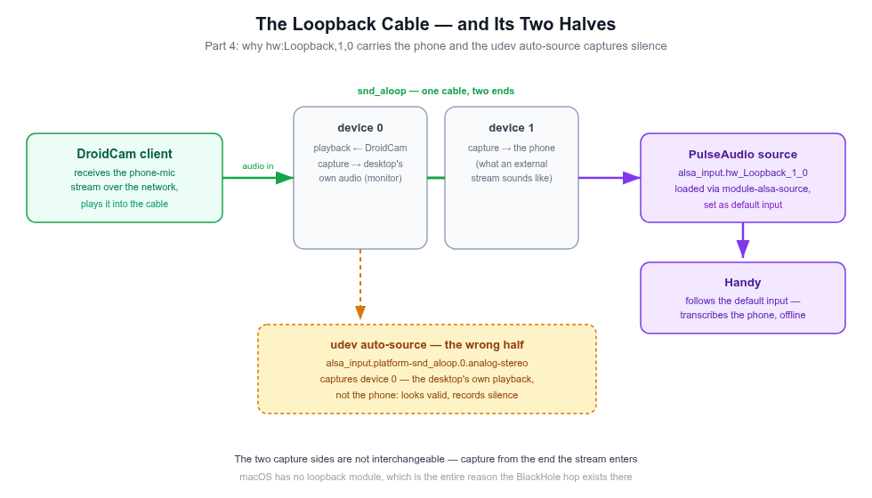

# Run Your Desk From Anywhere — Free Remote Control + Voice Dictation Over the Internet

[Part 1](./Run%20Your%20Desk%20From%20the%20Couch%20-%20Free%20Remote%20Control%20%2B%20Voice%20Dictation%20From%20Your%20Phone.md) of this series got the rig working: the phone drives the desktop over VNC, the phone's mic feeds a local dictation engine, everything stays on the home WiFi. This is the sequel, and it answers the question that shows up the moment you actually taste that setup:

> *"Wait — this only works on my WiFi. What if I'm at a coffee shop? What if the desktop is at home and I'm not?"*

Two parts, same rule as before — everything claimed here is either verified live on the actual rig or explicitly marked as not-yet-tested. Part 3 was run live end-to-end for this post: a phone on **mobile data** (not home WiFi) drove the desktop over VNC and streamed its mic into the rig's dictation source, both through the tailnet, on a direct WireGuard path. Still untested here: the macOS side of the tailnet and the escape-hatch alternatives. Part 4's internals are documented from the working rig itself.

1. **Part 3 — Off the LAN.** Why "just port-forward 5900" is the wrong answer (and often an impossible one), what a mesh VPN actually does, and the Tailscale build that swaps every LAN IP in the Part 1–2 rig for a tailnet IP — x11vnc, ufw, DroidCam, RealVNC Viewer all unchanged in shape.
2. **Part 4 — The deep dive.** How the rig actually works under the hood: the RFB protocol and why the VNC password stops at 8 characters, why VNC input triggers global hotkeys when an SSH session can't, the two halves of an ALSA loopback device, and what WireGuard/NAT traversal is doing in Part 3.

---

# Part 3 — Off the LAN: the same rig over the internet

## First, the check most people skip: can you even port-forward?

The traditional answer to "reach my home machine from outside" is: open the router's admin panel, forward port 5900 to the desktop, point the phone at your public IP. Before considering that path, run a five-minute check — because on a large share of modern connections it's dead on arrival:

1. Open the router admin panel (usually `192.168.1.1` or `192.168.0.1` — your gateway address) and note its **WAN IP**.
2. From the desktop, ask the internet what IP it sees: `curl ifconfig.me`.
3. Compare. **Same address** → your connection has a real public IP; port-forwarding is at least *possible*. **Different address**, or the router's WAN IP somewhere in `100.64.0.0`–`100.127.255.255` → you're behind **CGNAT** (Carrier-Grade NAT): your router's "public" side is itself a private address inside your ISP's shared NAT layer. Inbound port-forwards simply won't route to you — no router configuration changes that, because the NAT layer that drops the traffic belongs to the ISP, not you.

CGNAT is now standard on many fiber and 5G home connections, which is exactly why "just forward the port" advice from 2010 blog posts fails silently today: everything on your side is configured correctly, and the packets still never arrive.

## Even if you can port-forward, don't — not raw VNC

Suppose the check comes back clean and you *do* have a real public IP. Port 5900 open to the whole internet is still the wrong move:

- **Classic VNC auth is a single shared password** — no usernames, no rate limiting, no second factor, no lockout. A 1990s-era protocol assumption wearing modern exposure.
- **5900 is a top-tier scanning target.** Internet-wide scanners map the whole IPv4 space continuously; an open VNC port gets probed within hours. Every probe is a password-guess against an 8-character-effective secret (Part 4 explains the cap).
- **One password = one blast radius.** The VNC password doesn't just "view the screen" — it drives the desktop. A correct guess is a full remote session, as if the attacker sat down at your keyboard.

So the real goal was never "forward port 5900." It's this:

> **Put the phone and the desktop on the same private network no matter where either of them physically is — and let VNC and DroidCam keep believing they're on a LAN, exactly like Parts 1–2.**

## The candidate approaches

| Approach | Setup effort | Ongoing cost | Survives CGNAT | Exposes anything raw to the internet |
|---|---|---|---|---|
| **Tailscale (mesh VPN)** | Low — install, log in, done | Free (personal plan) | Yes — NAT traversal built in, falls back to encrypted relay | No — nothing public-facing, no opened router ports |
| WireGuard, self-hosted rendezvous | Medium-high — you run a reachable relay yourself | Free if you own a suitable always-on box; else a cheap VPS | Only if the relay has a real public IP | The relay host does |
| SSH reverse tunnel to a VPS | Medium | ~$4–6/mo VPS or a free-tier instance | Yes — desktop initiates outbound | The VPS's SSH port (harden it) |
| Cloudflare Tunnel | Low-medium | Free tier | Yes — `cloudflared` runs outbound | No inbound port, but traffic transits Cloudflare's edge |
| Port forward + DDNS | Low *if* CGNAT check passes | Free | **No** — the one CGNAT kills outright | Yes, directly — the whole point of the approach |

The rest of Part 3 builds the first row. The alternatives get a short honest treatment at the end ("Escape hatches") — they're worth knowing even if you never need them.

## Tailscale: what it is and why it fits

Tailscale is a **mesh VPN built on WireGuard**. You install it on each device, log them into the same account (a "tailnet"), and every device gets a stable private address in the `100.x.y.z` range. That address doesn't change when the device moves networks — laptop on café WiFi, phone on mobile data, desktop at home: same tailnet IPs, as if they were all plugged into one switch in your living room.

The properties that matter for this rig:

- **NAT traversal is handled for you.** Tailscale tries to establish a direct peer-to-peer WireGuard tunnel first (even through NAT layers); when no direct path can be punched — double-NAT on both ends, strict firewalls — it transparently relays through **DERP servers**, Tailscale's encrypted relays. Relayed traffic is still end-to-end encrypted; the relay carries ciphertext it cannot read.
- **Nothing is publicly exposed.** No router ports open, no public IP needed, inbound scanning finds nothing. The desktop's VNC port stays reachable only from inside the tailnet.
- **The protocols don't change.** VNC on 5900, DroidCam on 4747 — the rig's software never learns a VPN exists. This is a networking-layer swap; Part 1–2's setup survives untouched.

**The honest trade-off:** the LAN-only rig was "no cloud dependency" in the strictest sense. Tailscale adds a third-party *coordination* service — its control plane handles identity and connection setup. In the common direct-connection case, no VNC pixels and no dictation audio ever touch Tailscale's servers; in the relay-fallback case their servers carry it, encrypted, unreadable in transit. If that trade-off ever stops being acceptable, [Headscale](https://github.com/juanfont/headscale) — the self-hosted, open-source control-plane replacement — is a documented exit that keeps everything else identical.

<div align="center">
  
  <br/>
  <sub>Part 3 in one picture: the tailnet replaces "same WiFi" — x11vnc and DroidCam keep believing they're on a LAN.</sub>
</div>

### Is Tailscale safe to trust?

This deserves its own answer, not a hand-wave — the rig's VNC password would be one tailnet membership away from the desktop. The case, from [Tailscale's own security documentation](https://tailscale.com/security) and its public record:

- **The crypto is WireGuard's, not a home-rolled protocol.** Peer-reviewed, formally verified primitives (Curve25519 key exchange, ChaCha20-Poly1305); traffic is end-to-end encrypted between *your two devices only*. Private keys never leave the device they belong to — the coordination server only ever exchanges public keys, so neither Tailscale Inc nor their relays can decrypt what flows between your phone and desktop. Relay fallback carries ciphertext, by construction.
- **The parts that touch your data are open source.** Every client (Linux, macOS, Android, iOS, Windows) and even the DERP relay server code are on GitHub — auditable and forkable. The closed piece is the coordination/control plane, which sees metadata (which nodes exist, who connects to whom), never payloads.
- **Professionally audited, repeatedly.** Recurring third-party security reviews by [Latacora](https://www.latacora.com/), SOC 2 Type II certified, public security bulletins when issues surface — the disclosure pattern you want to see, not silence.
- **Publicly used at serious scale.** Millions of daily users across personal and enterprise tailnets; named customers include Duolingo, Instacart, Retool, Mercury, and Mercari. A two-device hobby rig is the smallest possible use of infrastructure battle-tested far beyond it.
- **The account side is defensible by default.** SSO/MFA on your identity provider, per-device approval, ACLs, and tailnet lock (pin which devices may join). The 8-character VNC password is no longer your outer wall — the tailnet is, and it's a modern one.

The remaining honest caveat is the one from the trade-off above: coordination is a third-party closed service. If that ever bothers you, Headscale swaps it for your own server and nothing else changes.

### On the desktop

Ubuntu and macOS both get the same one-liner or installer:

```bash
# Ubuntu
curl -fsSL https://tailscale.com/install.sh | sh
sudo tailscale up
# prints a login URL → open it → authenticate with your account
tailscale ip -4   # note this: the desktop's permanent 100.x.y.z address
```

macOS: install from the Mac App Store or `brew install --cask tailscale` (or `brew install tailscale` for the CLI variant), log in from the menu-bar app, read the address from the menu bar or `tailscale ip -4`.

Then one firewall change. The Part 1 rule was LAN-scoped:

```bash
sudo ufw allow from 192.168.68.0/24 to any port 5900 proto tcp   # LAN-only (Part 1)
```

The tailnet version keeps the same *shape* — port 5900 reachable only from a network the phone is on — just against Tailscale's address space:

```bash
sudo ufw allow from 100.64.0.0/10 to any port 5900 proto tcp     # any tailnet device
# or tighter, once the phone's tailnet IP is stable:
sudo ufw allow from 100.<phone-tailnet-ip> to any port 5900 proto tcp
```

(That `100.64.0.0/10` range is CGNAT address space by spec, which is exactly why Tailscale picked it — those addresses are never routable on the public internet, so tailnet traffic can't collide with anything real.)

`x11vnc` itself: **no change.** Same command, same flags, same `~/.vnc/passwd`. macOS Screen Sharing: **no change.** Same toggle, same VNC password.

### On the phone

1. Install **Tailscale** from the Play Store, log into the same account, toggle it on. Read the phone's tailnet IP from the app (or the admin console).
2. **RealVNC Viewer**: edit the saved connection, point it at the desktop's **tailnet IP** instead of the LAN IP. Port still 5900 (or implied). Same VNC password. (bVNC on the Ubuntu machine: same swap.)
3. **DroidCam** app: no change on the phone side — the *desktop* client is what points at the phone. Update `droidcam-cli -a <phone-tailnet-ip> 4747` to use the phone's tailnet IP (mind the flag order gotcha from Part 2 — `-a` before the address).

## What changes, what doesn't

| Piece | Part 1–2 (LAN) | Part 3 (internet) |
|---|---|---|
| x11vnc / Screen Sharing | running | **unchanged** |
| VNC port | 5900 | **unchanged** |
| VNC password | `~/.vnc/passwd` / Screen Sharing setting | **unchanged** |
| Phone client | RealVNC Viewer (bVNC optional on Ubuntu) | **unchanged app** — new target IP |
| Desktop address phone dials | LAN IP, re-check after router re-leases | **tailnet IP — permanent** |
| ufw rule | `allow from 192.168.x.0/24` | `allow from 100.64.0.0/10` (or the phone's tailnet IP) |
| DroidCam target | phone's WiFi IP | phone's tailnet IP |
| Handy, tmux, hotkeys, everything else | working | **unchanged** |

The one-line summary: **Part 3 is a re-addressing, not a rebuild.** Two new apps (Tailscale on each end), one firewall rule, two edited IPs.

## Dictation over the internet: tested from cellular

The audio path was the piece with a genuine unknown — LAN latency is single-digit milliseconds, and dictation over a real internet path had never been exercised here. It has now, end to end: phone on **mobile data** (WiFi off), DroidCam streaming to the desktop's tailnet IP, audio captured from the rig's usual `16 kHz` virtual source.

- **Connection quality**: `tailscale ping` to the phone answered in ~66 ms on a **direct** WireGuard path — not even the DERP relay was needed on a carrier network.
- **Audio quality**: the capture came back non-silent with speech-level amplitudes — clean enough to transcribe, with no perceptible buffering delay for dictation-shaped use (speak a sentence, then transcribe).
- **What's still honest to say**: this was one session on one carrier. Sustained use on a congested network is where jitter would show up — and if dictation ever turns garbled off-LAN, check `tailscale status` first: a fallback to `relay "..."` plus packet loss is the transport degrading, not the rig breaking.

**When you verify it on your networks, verify the audio, not just the connection.** "It connected" is not the test. Re-run Part 2's sanity check from the off-LAN network — record from the virtual source and check it's non-silent, clean audio:

```bash
parecord --device=alsa_input.hw_Loopback_1_0 --file-format=wav /tmp/mic-check.wav
# speak a sentence from the phone, Ctrl+C, then:
play /tmp/mic-check.wav   # or: sox /tmp/mic-check.wav -n stat
```

Flat amplitude or garble = the transport is degrading audio; check `tailscale status` for a relayed path, try again somewhere with better signal, and file the result.

## Security recap for Part 3

- The VNC port is now reachable from **wherever your phone is** — the tailnet replaces "same WiFi" as the trust boundary. Keep the tailnet small: personal Tailscale plans allow a limited number of users and devices; use them for your devices only, not as a shared VPN for acquaintances.
- Tailscale's **ACLs** can pin it further: phone may talk to desktop on 5900/4747, nothing else, nobody else. Locking a two-device tailnet down to exactly two rules is an afternoon's reading, not a project.
- Still true from Part 1: VNC auth is one shared password. Over the tailnet that's acceptable to many people — an attacker needs tailnet membership *first*, which means your Tailscale account, which has MFA and device approval. Layered, the 8-character cap stops being the outer wall.
- And the classic still applies: **never** port-forward 5900 on the router to "make Tailscale unnecessary." You'd be re-opening exactly what Part 3 closed.

## Escape hatches: if Tailscale ever isn't the answer

- **SSH reverse tunnel to a VPS** — the fallback that removes the VPN vendor entirely: `ssh -R 5900:localhost:5900 -R 4747:localhost:4747 user@your-vps` (or a persistent `autossh`/systemd unit). Outbound-only, so CGNAT is irrelevant; the phone dials the VPS. Costs a VPS (~$4–6/mo or free tier), needs key-only SSH and careful `GatewayPorts`, and adds a box you must keep alive.
- **Headscale** — self-hosted Tailscale control plane, same clients, your server, your rules. The "nothing outside my control" property, at the price of running the coordination layer yourself.
- **Cloudflare Tunnel** — `cloudflared` outbound from the desktop; supports raw TCP (VNC included). Viable, but it's HTTP-shaped infrastructure repurposed for TCP, needs a domain and Access policies, and its trust model is "transits Cloudflare's edge." For two personal devices, Tailscale is the better-fitting tool.

---

# Part 4 — Deep dive: how the rig actually works

Part 1–2 said "trust me, taps become real keystrokes" and "trust me, the wrong loopback half is silent." This part cashes those checks. Nothing here is new setup — it's the working rig, opened up.

## The wire protocol: RFB, and the 8-character password

VNC speaks **RFB** (Remote Framebuffer). A session is a short fixed conversation, and knowing its shape explains several behaviors you met in Part 1 without explanation:

1. **Version handshake** — client and server exchange `RFB 003.008`-style strings and agree on a version.
2. **Security negotiation** — the server lists the auth types it will accept; the client picks one. This is where macOS offers *two at once* — Mac-account (Apple's ARD-style handshake) and the legacy VNC password — and where a client that can only speak one of them (bVNC picking Apple's DH handshake and failing to complete it) dies with a rejected-correct-password loop. It negotiated the wrong door, not the wrong key.
3. **Auth, then framebuffer negotiation** — pixel format, encodings, and from there a stream of framebuffer updates (server → client) and pointer/key events (client → server).

The 8-character cap: classic VNC authentication is a **DES challenge-response**. The server sends a 16-byte challenge; the client encrypts it with DES using the *password itself* as the key — and DES keys are 8 bytes. Whatever you type beyond 8 characters never enters the computation. Every VNC implementation that speaks classic auth inherits the cap: the Mac's Screen Sharing password (Part 1's "first 8 are the real password" gotcha) and x11vnc's `-rfbauth` file alike. It's not a bug in either — it's the protocol wearing its age on its sleeve.

## Why VNC triggers hotkeys when SSH can't

Part 1's rule was: "global hotkeys fire from the phone." Here's the mechanism underneath.

When the phone's keyboard commits text, RealVNC Viewer sends RFB key events. On the desktop, x11vnc turns those into calls to **XTEST** — the X11 extension written for automated testing that injects input at the *server* level, upstream of any application. XTEST-synthesized events enter the X server's input stream and are dispatched exactly like events from the physical keyboard driver: same keycodes, same grabs, same global hotkey listeners.

That's the whole trick the rig rests on:

- A terminal sees keystrokes → typing works.
- The window manager sees key combos → `Super`-shaped shortcuts work.
- Handy's global hotkey hook sees a real key event → dictation toggle fires from the phone.
- SSH, by contrast, delivers bytes to *one process's stdin*. Nothing about an SSH keystroke is a keyboard event as far as the OS is concerned — no window manager, no listeners, no GUI. That's "the second reason this rig is VNC-based, not SSH-based" from Part 2, now with its gears visible.

macOS runs the same play with different plumbing: Screen Sharing injects events through the window server's event path — equivalent to a physical event to every listener, which is why the same hotkey rule held on the Mac (verified live in Part 2's dictation round-trip).

## The audio path, end to end — and the wrong-half bug

Part 2 told you the fix (`hw:Loopback,1,0`, not the udev auto-source) without the full picture. Here it is.

An **ALSA loopback** device (`snd_aloop`) is a virtual cable with **two ends**: device `0` and device `1`, each with a playback side and a capture side. Whatever is played into one end's playback side comes out the other end's capture side. The ends are not interchangeable — they're opposite sides of the same pipe:

<div align="center">
  
  <br/>
  <sub>The wrong-half bug in one picture: both capture sides look like microphones; only device 1 is wired to the phone.</sub>
</div>

- **Device 0 capture** is what a local app would hear from the system (the "monitor the desktop's output" end).
- **Device 1 capture** is the far end of an external stream *into* the machine — where DroidCam's audio from the phone is written.

DroidCam's Linux client plays the incoming phone-mic stream into the loopback's **device 0 playback** side; it therefore appears on **device 1's capture** side — `hw:Loopback,1,0`. That source, loaded into PulseAudio with:

```bash
pactl load-module module-alsa-source device=hw:Loopback,1,0
```

is the `alsa_input.hw_Loopback_1_0` source Part 2 sets as default, so Handy (which follows the system default input) transcribes the phone.

The wrong-half bug, then, in one sentence: the udev rule auto-creates a source for the *other end* of the cable (`alsa_input.platform-snd_aloop.0.analog-stereo` — device 0), which records the desktop's own playback, not the phone's stream — so it sits there capturing silence while you speak. Both sources look plausible side by side in `pactl list`; only one is wired to the phone. Hence Part 2's rule: *if the source name says `platform-snd_aloop.0`, that's the wrong half — apply the `load-module` fix.*

Why macOS needs the BlackHole hop for the same job: Linux has a loopback module in the kernel; macOS has no built-in "virtual audio cable" at all. BlackHole is a third-party driver that creates one — a 2-channel virtual device whose playback side and capture side play the same device-0/device-1 game (AudioRelay plays into it, its input side appears to the system as a normal microphone). The Mac route (AudioRelay → BlackHole → default input) and the Ubuntu route (DroidCam → snd_aloop → module-alsa-source → default input) are the *same architecture* with different brand names on the cable.

## What Handy does with the audio

Once the phone is the system default input, Handy's job is the same as with any desk microphone: when its global hotkey fires (a real key event — see above), it records from the default source, runs the clip through a local speech-to-text model (Parakeet or Whisper, running on the machine's own CPU/GPU — no network), and pastes the transcription as synthesized input into whatever is focused. The rig's whole trick is that "the default input" is now a phone on a WiFi, and "whatever is focused" is now decided by VNC taps — Handy itself needed zero remote-specific features.

## Part 3's layer: WireGuard, NAT traversal, and DERP

The internet build adds one more layer to trace, and its mental model is small:

- **WireGuard** is the encryption: each pair of tailnet devices shares cryptographic keys; traffic between them is a sealed UDP envelope no relay can open.
- **NAT traversal** is the connection problem: both endpoints are (usually) behind NATs that reject unsolicited inbound packets. Tailscale's coordination plane tells each side what the other's observable address:port is, and the two sides simultaneously send packets *at each other* — each side's outbound packet opens the pinhole in its own NAT that the other's inbound packets then slip through. That's "direct connection," and it's the common case.
- **DERP** is the fallback for when no pinhole works (symmetric NAT on both ends, hostile firewalls): encrypted packets relayed through Tailscale's servers. Slower — an extra hop, and hop distance matters — but the payload stays end-to-end encrypted, so the relay is a post office, not a listener.

You can see which path you're on: `tailscale status` on the desktop prints, per peer, `direct` or `relay "..."` — worth checking once when you set up, because it explains the latency you feel.

## Failure-mode map

Symptoms → layer, so a broken rig debugs in the right order:

| Symptom | Suspect layer | Check |
|---|---|---|
| Phone can't connect to desktop at all | Tailnet | `tailscale status` both devices — is each online and showing the other? Then `tailscale ping <desktop-tailnet-ip>` |
| Tailnet up, VNC refuses | Firewall / server | Is x11vnc running? Does the ufw rule cover `100.64.0.0/10`? `tailscale ping` works but 5900 times out = firewall |
| VNC connects, password rejected | Auth | 8-character DES cap (first 8 are real); Mac: VNC password, username blank |
| Control works, dictation silent | Audio wiring | `pactl list sources short` — is `hw_Loopback_1_0` there and RUNNING? Wrong-half source present = Part 4's loopback bug |
| Dictation garbled only off-LAN | Transport | `tailscale status` — relayed? Re-run the `parecord`/`sox stat` audio check, not just "did it connect" |
| Everything connects, nothing types | Client keyboard plumbing | Does the client send key events for text (IME commits)? RealVNC Viewer does (tested live); a client that injects nothing won't — try its key panel |

---

# Where the series lands

- **Part 1** (B-24): control — the phone drives the desktop over VNC, both macOS and Ubuntu, one client app.
- **Part 2** (B-24): dictation — the phone's mic becomes the desktop's input, Handy transcribes locally, any app receives the text.
- **Part 3** (this post): reach — the same rig works from any network, via a mesh VPN, with no port ever exposed to the internet.
- **Part 4** (this post): understanding — RFB and the 8-char password, XTEST and why hotkeys fire, loopback halves and the silence bug, WireGuard's envelopes and pinholes.

The progression is deliberate: each part removed exactly one constraint — *the desk* (Part 1), *the keyboard* (Part 2), *the building* (Part 3) — and Part 4 repaid the "trust me" notes accumulated along the way.

## Tools & licenses

| Tool | Role | License / cost |
|---|---|---|
| [Tailscale](https://tailscale.com/) | Mesh VPN (Part 3) | Free personal plan; open clients ([Android](https://github.com/tailscale/tailscale-android), [iOS](https://github.com/tailscale/tailscale-ios), [macOS/CLI](https://github.com/tailscale/tailscale)); coordination service is closed; WireGuard end-to-end, SOC 2 Type II |
| [Headscale](https://github.com/juanfont/headscale) | Self-hosted control plane (escape hatch) | Open source, BSD-3 |
| [x11vnc](https://github.com/LibVNC/x11vnc) | VNC server, Ubuntu | GPL-2.0 |
| macOS Screen Sharing | VNC server, macOS | Built-in |
| [RealVNC Viewer](https://www.realvnc.com/en/connect/download/viewer/) | Phone client, both OSes | Free for personal use |
| [Handy](https://github.com/cjpais/Handy) | Local dictation | MIT |
| [DroidCam](https://www.dev47apps.com/) | Phone-mic streamer, Ubuntu | Client free; Android app free/`$` ad-free tier |
| [BlackHole](https://github.com/ExistentialAudio/BlackHole) | Virtual audio cable, macOS | GPL-3.0 (MIT-licensed builds available) |

---

*Built and documented from a real, working rig. Parts 1–2 verified live on it; Part 3 verified live from a phone on mobile data — VNC control and mic audio both, over a direct WireGuard path. The macOS tailnet route and the escape-hatch alternatives remain designs until run; the checks in "Dictation over the internet" are how to verify them.*
