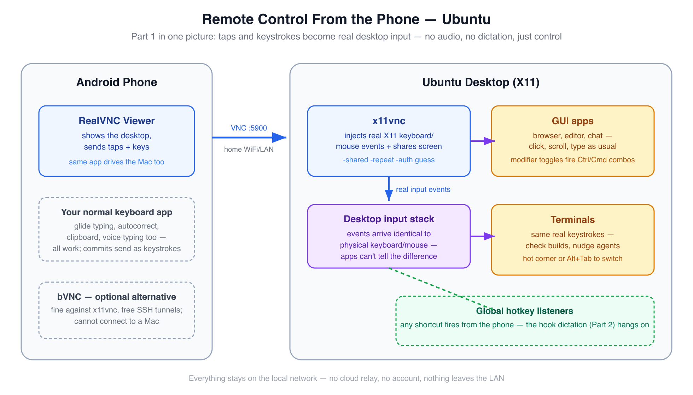

# Run Your Desk From the Couch — Free Remote Control + Voice Dictation From Your Phone

> The gap between having a thought worth acting on and acting on it shouldn't cost a walk to the desk.

A build's running upstairs. You're on the couch, not working, mostly resting — and a thought worth acting on shows up: reply to that message, nudge the agent that's mid-task, check whether the tests actually passed. None of that needs you to get up and sit back down at a desk. It needs a phone, pointed at a machine that's already on.

That's the actual shape of this setup once it's running: **occasional, light touches on real work, from wherever you already are** — another room, the couch, bed, mid-chore. Not a full workstation replacement, not "work from anywhere all day." Just the ability to act on a thought without that gap costing you a walk every time. And once you can *drive* the machine from the phone, dictating into it is a natural second step — speaking at roughly 3x typing speed, into any app, without compressing the message down to what's bearable to thumb-type.

This post has two parts, in that order:

- **Part 1 — Remote control.** The phone becomes a real screen + keyboard + mouse for your desktop, over your home network. One VNC client app on the phone (`RealVNC Viewer`), works against both macOS and Ubuntu. This is the part to set up first; everything else builds on it.
- **Part 2 — Voice dictation.** The phone's mic becomes a real input device on the desktop, so a local dictation engine ([Handy](https://github.com/cjpais/Handy)) transcribes your voice into any focused app — terminal included — with no cloud speech service involved.

**The setup cost is a weekend, once. The payoff doesn't expire.** Everything below is free, runs on your local network, and — once wired — needs nothing further from you: no subscription to keep paying, no cloud account to manage, no model to retrain. Set it up on a Saturday, and every day after that, the couch is a valid place to get something done.

## Topic flow

Each Part below splits in two: **build it** — read straight through, in order — then **Reference**, where the troubleshooting tables, gotchas, and security notes live. Skip straight to Reference when something breaks; skip it entirely on a first read.

```
PART 1 — REMOTE CONTROL (set up first)      PART 2 — VOICE DICTATION (builds on Part 1)
────────────────────────────────────        ──────────────────────────────────────────
Why VNC, not SSH                            Handy — the dictation engine (macOS/Ubuntu)
 ├─ macOS machine: Screen Sharing             ├─ hotkey + toggle-mode tuning
 └─ Ubuntu machine: x11vnc                    ├─ Ubuntu mic relay: DroidCam + loopback
Phone client: RealVNC Viewer (one app,        └─ macOS mic relay: AudioRelay + BlackHole
 both machines; bVNC optional for Ubuntu)       (or an iPhone's Continuity mic)
Driving the desktop: gestures, modifiers,   Reference — troubleshooting, daily
 tmux cheat sheet                            scenarios, teardown
Reference — troubleshooting & security
────────────────────────────────────        ──────────────────────────────────────────
             └──► WHAT'S NEXT: same rig off the home network (Part 3) + how it all
                  works inside — protocols on the wire (Part 4)
```

Read Part 1 fully, then your own OS's subsections in Part 2, and skip the other OS wherever you like — each machine's route is self-contained.

## What it actually looks like

- **Mid-rest, an AI agent needs a nudge.** Tap the phone, type "looks good, continue" — or dictate it (Part 2) — and it lands as a real keypress in the real terminal, same as if you'd walked over and typed it.
- **A build's running, you want to know without getting up.** Pull up the phone, glance at the terminal on the mirrored screen, done. No SSH session to remember, no separate monitoring app.
- **A reply is worth sending now, not in twenty minutes.** Type it from the phone's keyboard — or dictate it into Slack, an email, a commit message, at roughly 3x typing speed, without the usual tax of compressing the thought to make typing it bearable.
- **You're doing something else entirely** — cooking, stretching, half-watching something — and a stray thought about the code is worth capturing before it's gone. Speak it. It's text on the screen before you've even sat back down.
- **Something needs a click, not a sentence.** Dismiss a dialog, pause a download, check a setting, switch a song — full mouse and keyboard, in your pocket.

Two tools make this work, both free: a **VNC remote-control rig** (built from what your OS already ships, plus one phone app) for seeing and driving the desktop, and **Handy** for the voice-to-text part. How each gets wired — once — is the rest of this post.

---

## The route this post takes

1. **Part 1 — Remote control from the phone.** Why VNC (not SSH), then per-OS server setup: macOS's built-in Screen Sharing, Ubuntu's `x11vnc`. One phone client — **RealVNC Viewer** — for both. Then the phone-side skills: gestures, modifier keys, typing with your normal mobile keyboard, and a tmux cheat sheet for thumb-friendly terminals.
2. **Part 2 — Voice dictation.** Handy on both OSes (models, hotkey tuning, the Wayland question), plus wiring the phone's mic in as a system input: DroidCam + PulseAudio loopback on Ubuntu, AudioRelay + BlackHole (or an iPhone's Continuity mic) on macOS. Start/stop scripts and troubleshooting close it out.

Read Part 1 fully, then *your* machine's subsection in Part 2 — skip the other OS wherever you like; each route is self-contained.

The one table worth internalizing before anything else — **the same phone app drives both machines**, one saved entry per box:

| The job | Ubuntu machine | macOS machine |
|---|---|---|
| Share + control the screen | x11vnc | built-in Screen Sharing |
| Phone VNC client | **RealVNC Viewer** (Android/iOS) | **RealVNC Viewer** — same app, second entry |
| Phone mic → system input *(Part 2)* | DroidCam + PulseAudio loopback | AudioRelay + BlackHole — or iPhone Continuity mic |
| Switch default input *(Part 2)* | `pactl set-default-source` | `SwitchAudioSource -t input -s …` or Sound settings |
| Terminals by keystroke | tmux | tmux — same reasoning, no Mac-specific parts |

Security and license notes for every tool close the post.

---

# Part 1 — Remote control from the phone

## Why VNC, and not just SSH

If you've remoted into a machine before, it was probably SSH — and SSH can't do this job. An SSH session drops you into a *new* text shell: it can't show you the desktop you left running, can't click anything, can't type into the apps already open, and can't fire global hotkeys (which Part 2's dictation engine depends on). It's a parallel door into the basement.

VNC is a mirror plus a hand: the phone sees the actual desktop, and every tap and keystroke is injected as a **real input event** — indistinguishable, to every app and every hotkey listener, from sitting at the keyboard. That single property is what makes the whole rig work: switch apps, run shortcuts, check a build, and later trigger dictation, all with the same mechanism.

Both halves are standard: macOS and Ubuntu can each serve VNC with either built-in or one-command-free tooling, and any standards-compliant client can connect. That's why one phone app is enough for both machines.

## The macOS machine: Screen Sharing, already installed

The Mac ships with the VNC server — this is mostly a matter of turning it on. This route was shaken down live on a Sequoia Mac with an Android phone in hand: Screen Sharing answering on port 5900, a phone client driving the screen, everything below marked "tested live" came off that machine.

<div align="center">
  
  <br/>
  <sub>The macOS control path — the server is already installed; one toggle and a VNC password turn it on.</sub>
</div>

1. **System Settings → General → Sharing → Screen Sharing** — flip it on. Keep it plain Screen Sharing: if **Remote Management** is the enabled one instead, legacy-VNC clients get served the login window even while you're logged in, and typing into that over VNC drops focus (tested live — Remote Management off, Screen Sharing on, and the phone landed straight on the desktop; logging in over VNC works too, for the after-reboot case).
2. For a *third-party* client (RealVNC Viewer — anything not Apple's own Screen Sharing app), click the ⓘ next to Screen Sharing and enable **"VNC viewers may control screen with password"**, then set that password. Without it, macOS expects Apple's own authentication handshake and most phone clients fail to connect at all.
3. Connect from the phone to `<mac-lan-ip>:5900`, password = the VNC password from step 2. Same separate-from-WiFi-password logic as below on Ubuntu — it controls who can drive the Mac, not who can join the network.

Or skip the GUI for step 1: `sudo launchctl load -w /System/Library/LaunchDaemons/com.apple.screensharing.plist` — but step 2 has no equally clean CLI path, so most of this toggle lives in System Settings either way. There's also a CLI for the whole thing (`.../ARDAgent.app/Contents/Resources/kickstart -activate -configure -access -on -clientopts -setvnclegacy -vnclegacy yes -setvncpw <pw> -restart -agent -privs -all`), but on Sequoia it sets privileges and the password while **refusing to actually open the service** — it prints *"Screen Sharing or Remote Management must be enabled from System Settings or via MDM"* and the port stays closed until you flip the GUI toggle once. Count on ending in System Settings regardless.

Three auth behaviors worth knowing before a phone client rejects a correct-looking password:

- **The VNC password is effectively 8 characters.** System Settings happily accepts a longer one, but legacy VNC auth is a [DES challenge-response](https://datatracker.ietf.org/doc/html/rfc6143#section-7.2.2) capped at 8 — if the client keeps rejecting the password you set, the first 8 characters are the password. (Part 4 of this series opens up the mechanism, for the curious.)
- **macOS serves two auth types side by side**: Mac account auth (a username + your Mac login password, Apple's ARD-style handshake) *and* the legacy VNC password. A client looping on "enter VNC credentials" is often answering the wrong one — the server offers both, and which one you get depends on the client's negotiation. Note Screen Sharing and Remote Management each have their **own** VNC-password setting; only the one for the service you actually enabled is consulted.
- **Client choice matters — tested live.** **RealVNC Viewer** connects with the plain VNC password, username blank. **bVNC** (another popular Android client) fails against a Mac — see the troubleshooting table in the Reference section below.

What you *don't* need, relative to Ubuntu below: no display-number hunting, no Xauthority chase, no autostart file, no reconnect/key-repeat flag tuning — Apple's server handles those correctly by default. And one genuine upgrade: Screen Sharing is a system daemon that serves the **login window** too, so after a reboot you can VNC in and log in remotely — the Ubuntu route can't do that (x11vnc only starts after a graphical login).

## The Ubuntu machine: x11vnc

x11vnc shares and drives the **existing** desktop session — the one you're actually logged into, with your apps already open — rather than spawning a fresh virtual one. It's in the standard repos:

<div align="center">
  
  <br/>
  <sub>The Ubuntu control path — x11vnc turns the desktop session you're already logged into into a VNC server.</sub>
</div>

```bash
sudo apt install -y x11vnc tmux
```

(`tmux` rides along here because it's part of making terminals phone-drivable — see the cheat sheet further down. Ubuntu ships it on some images but not others.)

### Run it

```bash
tmux new -s vnc
x11vnc -display :<real-display-number> -auth guess -usepw -shared -repeat -forever
```

Find `<real-display-number>` with `who` (look for `<user>  :N  <date>`) from a terminal that's actually part of the graphical session.

- First run is interactive: no password file exists yet, so `-usepw` prompts you to set one. Always do this — never run x11vnc without auth.
- `-forever` keeps listening after the first client disconnects.
- **`-shared` matters.** Without it, x11vnc allows exactly one client at a time — a stale half-open connection from a WiFi blip or app switch makes every reconnect fail with `refusing new client ... Not shared & existing client` until you restart the server. With it, reconnects just work.
- **`-repeat` matters too.** x11vnc turns *off* the X server's key autorepeat by default while a client keyboard is active — its log even says so (`active keyboard: turning X autorepeat off`). Without this flag, holding an arrow key (or any key) from the phone does nothing beyond the first tap — no repeat, one character per touch, forever. `-repeat` keeps autorepeat on so a held key behaves like a physical one. Only drop it if your specific client does its own repeat and you start seeing doubled characters.
- **`-auth guess`** (x11vnc ≥0.9.9) finds the right Xauthority cookie itself. Modern GNOME/gdm sessions often keep it at `/run/user/<uid>/gdm/Xauthority`, not the default `~/.Xauthority` — hardcoding the default path is a common source of a silent auth failure.
- There's no `-localhost=no` flag — that's not real; `-localhost` (no value) *restricts* to loopback, and passing `=no` gets rejected as unrecognized. Allowing LAN connections is the default when you omit the flag entirely.
- Scope the port to your LAN: `sudo ufw allow from <your-subnet> to any port 5900` — never expose it to the internet. If you've never touched `ufw` before and only use SSH *outbound* to other machines (not inbound into this one), you don't need `sudo ufw allow OpenSSH` — that rule only matters for a device that accepts incoming SSH connections; ufw's default policy already allows all outbound traffic regardless of any inbound rule you add.

**What the VNC password actually is** — easy to conflate with the WiFi password, but it's a separate thing: it's set by you via `x11vnc -storepasswd` (not your router), it controls who can drive *this* desktop once already on the network (not who can join the network), and it doesn't change when you switch WiFi networks — phone and desktop just need to be on the *same* network at connection time, whichever one that is. Like the Mac's, it's capped at 8 effective characters by the classic VNC auth protocol.

### Persist across reboots — the autostart file

There's no separate script to write here — GNOME (and most desktops) autostarts anything dropped as a `.desktop` file in `~/.config/autostart/`, once per graphical login, which is the earliest point a display actually exists to serve. Set the password once first (`x11vnc -storepasswd`), then create this file:

```ini
# ~/.config/autostart/x11vnc.desktop
[Desktop Entry]
Type=Application
Name=x11vnc
Exec=x11vnc -display :<N> -auth guess -rfbauth /home/<you>/.vnc/passwd -shared -repeat -forever
X-GNOME-Autostart-enabled=true
```

`<N>` is your real display number from `who` (see above); `<you>` is your Linux username — `Exec=` needs the absolute path, `~` isn't expanded there. `X-GNOME-Autostart-enabled=true` is what actually flips it on; a `.desktop` file without that line sits inert. Verify it's live any time with `pgrep -af x11vnc` after a fresh login — no separate "did it start" step needed beyond that.

One consequence of the after-login design: if the machine reboots (or loses power) and sits at a lock screen, nothing's listening yet — someone has to log in locally once before the phone can reach it. The Mac's Screen Sharing doesn't have that limitation; this is the one thing it does better.

## The phone client: RealVNC Viewer (one app, both machines)

**[RealVNC Viewer](https://www.realvnc.com/en/connect/download/viewer/)** (free on Android and iOS) is the client this post standardizes on, for one reason that matters more than any feature list: **it speaks the classic VNC authentication that both servers above serve**, so the same app — the same UI, the same gestures, the same saved-entries list — drives the Mac and the Ubuntu box. Two entries, one muscle memory. On the Mac side that's live-tested end to end; against x11vnc it's the same standard handshake (the one `x11vnc -storepasswd` sets), so it connects the same way — and if your phone-side app ever refuses, the fallback below is proven on Ubuntu.

Worth knowing where the line sits: RealVNC the *company* sells a cloud-connected ecosystem (account, device list, "connect from anywhere"). None of that is needed here — the Viewer app connects **directly**, machine-to-machine over your LAN, with no account and nothing routed through anyone's cloud. Don't sign in; just add an address and connect. The same company's download page markets a comparison table implying classic direct connections to third-party servers are unsupported — the Mac test above (direct LAN, third-party… well, Apple's server, plain VNC password) says otherwise, and that's the configuration this post uses.

**bVNC — the optional Ubuntu-only alternative.** Before standardizing on RealVNC Viewer, this rig ran on [bVNC](https://github.com/iiordanov/remote-desktop-clients) (free, GPL, Android), and it's a solid client against x11vnc — every Ubuntu-side behavior in this post was verified through it. It stays a fine choice if you prefer its gesture modes, or want free built-in SSH tunneling. Two reasons it's demoted to optional: it **cannot** connect to the Mac (the DH-handshake failure covered in Reference below — no security-type override in its UI), and its right-click needs a learned two-finger gesture rather than RealVNC's dedicated mouse mode. If you use one phone for both machines, one client that reaches both beats two clients to remember.

| | RealVNC Viewer | bVNC (optional) |
|---|---|---|
| Connects to Ubuntu (x11vnc) | ✅ standard VNC auth | ✅ tested daily driver |
| Connects to macOS (Screen Sharing) | ✅ live-tested | ❌ DH-handshake failure |
| Right-click | dedicated mouse mode | hold + second-finger tap (learnable) |
| Account / cloud anything | not needed — direct connect | none |
| Extras | — | SSH/TLS tunneling built in, GPL |

(On iOS, RealVNC's VNC Viewer app is the equivalent client for either machine.)

**Try it now — first win.** Server on (either machine), Viewer installed: add an entry with the machine's LAN IP and port `5900`, connect, enter the VNC password with the username blank. Your desktop should fill the phone's screen, and a tap anywhere should move the real cursor. If it does, the rig works — everything left in this part is technique. If it doesn't, the Reference section's troubleshooting tables are ordered by likelihood; start at the top.

## Driving the desktop from the phone

Everything here is VNC-client behavior, not OS behavior — it works the same against the Ubuntu machine and the Mac. Client-specific bits are labeled. The connection details, in one place:

| | Ubuntu machine | macOS machine |
|---|---|---|
| Client | **RealVNC Viewer** | **RealVNC Viewer** — same app |
| Address | `<ubuntu-lan-ip>:5900` | `<mac-lan-ip>:5900` |
| Password | the `x11vnc -storepasswd` one | the 8-character VNC password |

Both passwords are separate from your WiFi password and unaffected by switching networks — phone and desktop just need to be on the *same* network at connection time, whichever one that is.

VNC just mirrors real mouse and keyboard input — there's no VNC-specific "select an app" step, it behaves exactly like sitting at the desktop:

- **Focus a window**: tap it directly in the mirrored screen — a real click.
- **Type**: tap the field to focus it, tap the keyboard icon to bring up the phone's soft keyboard. Everything typed sends as real keystrokes — no special "VNC mode."
- **Modifier combos** (Ctrl+key, Alt+key, Cmd+key): use the client's extra-keys toolbar, the row of dedicated `Ctrl`/`Alt`/`Shift`/`Esc`/`Tab` buttons you tap to hold, then tap the other key.

### Switching between applications

Three ways, in the order actually worth trying on a phone:

- **The desktop's hot corner (no keys needed at all)**: on GNOME, tap the very top-left pixel of the mirrored screen, just under where "Activities" would show — the overview opens with every open window as a thumbnail; tap the one you want. macOS has the same feature: System Settings → Desktop & Dock → Hot Corner (e.g. top-left → Mission Control). This is the one to reach for first: it needs no modifier key, works even if your VNC client's extra-keys toolbar doesn't expose `Tab` (some builds don't), and is one tap instead of a hold-plus-tap combo.
- **Alt+Tab / Cmd+Tab, if your client has both keys**: hold `Alt` (or `Cmd` on the Mac) and tap `Tab` from the extra-keys toolbar to cycle, same as at a physical keyboard — same toggle-then-tap mechanism as the multi-key shortcuts below. Falls back to the hot corner if `Tab` isn't in your toolbar's default row.
- **Between terminals/shells specifically**: don't alt-tab or hot-corner between separate GUI terminal windows at all if you can help it — hunting for the right thumbnail among several is more taps than it's worth. Keep everything inside one tmux session instead and switch panes/windows by keystroke (`Ctrl+b` + number, see the cheat sheet below). Works identically on the Mac.

All three are the same underlying trick: VNC sends real input events, so every desktop-level shortcut or gesture you'd use at the keyboard works identically from the phone.

### Multi-key shortcuts, e.g. `Super+A`

A touchscreen can't physically hold two keys down at once, so the extra-keys toolbar buttons don't work like a normal press-and-release key — they're **toggles**. Tapping a modifier arms it (it stays visually pressed/highlighted); tapping the next key sends both together as one combo, and the modifier releases automatically right after.

To fire `Super+A` (or any modifier combo — `Ctrl+Shift+T`, `Alt+F4`, `Cmd+Q` on the Mac):

1. Open the extra-keys toolbar (the keyboard/gear icon in the client's in-session toolbar).
2. Tap the **Super**/**Win**/**Cmd** key icon (labeled `Super`, `Win`, `Cmd`, or shown as a ⊞-style icon depending on client) — it stays highlighted, armed.
3. Tap `A` on the soft keyboard — the combo fires as `Super+A`, and the modifier releases on its own.

Same mechanism for stacking more than one modifier — tap `Ctrl`, tap `Shift`, then tap the letter key, and all three go through together. If the client's default extra-keys row doesn't show a Super/Win button, check its settings for a toolbar/keys customization option before assuming the key isn't supported — most VNC clients that expose Ctrl/Alt as toggles expose Super the same way.

### Right-click, and where Enter/Backspace live

**Right-click** in RealVNC Viewer: switch the session to its mouse-pointer mode (in-session toolbar), and a real right-button tap works — plus most builds offer a long-press as right-click in touch mode. In **bVNC** it's the one gesture people assume and get wrong — right-click is *not* a plain long-press:

1. **Press and hold** one finger on the target (keep it down).
2. **Tap anywhere else** on the screen with a second finger.
3. Lift both — the right-click fires where the first finger sits, and the menu opens.

That hold-then-second-finger-tap gesture is bVNC's documented right-click in its default input modes (hold and *swipe* instead of tapping and you get a right-drag). Alternatives, in order of usefulness: **Single-Handed input mode** (long-press pops a small panel with a dedicated **right** button), **touchpad-style modes** (two fingers together = right-click, three = middle), or a **Bluetooth mouse** (actual right button just works). Gestures aren't gated behind bVNC Pro — full per-mode reference lives in-app: Menu → More → Input Mode Help.

**Enter and Backspace** — not special VNC buttons, just the ordinary keys on Android's own soft keyboard, same as any other key you tap. The extra-keys toolbar exists specifically for keys a *normal* mobile keyboard doesn't have — Ctrl, Alt, Esc, Tab, arrows.

### Editing text in a terminal

Faster than arrow-key nudging on touch, works on both machines: standard readline bindings work over VNC exactly like they do locally — `Ctrl+A`/`Ctrl+E` jump to line start/end, `Ctrl+W` deletes the last word, `Ctrl+U` clears back to cursor.

### Typing on the desktop with your phone keyboard

The soft keyboard that appears when you tap the keyboard icon is your phone's **normal keyboard app** — whatever you already use, nothing new installed. Everything the keyboard app is good at carries over, because VNC just receives whatever the keyboard commits and sends it as real keystrokes:

- **Glide typing / swipe input** — drag through the letters, same as texting.
- **Autocorrect and next-word prediction** — actively helpful in chat and email apps on the desktop.
- **Long-press for numbers and symbols** — long-press the top-row letters, same as anywhere.
- **Clipboard** — copy on the phone (from anywhere), paste into the desktop app with the keyboard's paste button. Copy on the desktop, read it on the phone.
- **Multilingual typing** — your keyboard's per-language or multi-language modes work as usual; typing Bangla or any other language into a desktop app needs no desktop-side setup beyond the app accepting text.
- **One-handed / floating mode** — shrink the keyboard to a thumb-zone corner for couch use.

Two cautions from the terminal-shaped parts of this rig:

- **Autocorrect + terminals don't mix.** Suggestions will happily "fix" flags, paths, and `git` subcommands. Your keyboard app's settings (its own toolbar, or Settings → System → Languages & input) usually offer a suggestions/autocorrect toggle — disable it when a terminal is focused, or type flags carefully and proofread before Enter. There's no desktop-side guard; the keystrokes arrive already "corrected."
- **Voice typing works — mind where it transcribes.** Any keyboard with voice-typing support works over VNC (tested live): the keyboard's speech engine does the transcribing, and the committed text arrives as keystrokes like any other typing. The catch isn't injection — it's that most keyboards dictate through their maker's cloud speech service, the opposite of this rig's offline promise. Part 2 exists for the local version: the phone's mic streaming to the desktop, transcribed **locally** by Handy, landing in any app — no cloud in the loop.

### tmux, if you've never used it

tmux is the answer to "alt-tabbing between GUI terminal windows by touch is fiddly" — keep everything in one terminal window, switch by keystroke. Everything below starts with the prefix `Ctrl+b`, released, *then* the next key — it's tapped in sequence, not held together.

| Want to... | Keys |
|---|---|
| New named session | `tmux new -s <name>` |
| Reattach later | `tmux attach -t <name>` |
| List sessions | `tmux ls` |
| **Detach** (leave running) | `Ctrl+b` then `d` |
| New window | `Ctrl+b` then `c` |
| Switch to window N | `Ctrl+b` then `<number>` |
| Next / previous window | `Ctrl+b` then `n` / `p` |
| Split pane | `Ctrl+b` then `%` (vertical) / `"` (horizontal) |
| **Close a pane/window** | `exit` or `Ctrl+d` — an ordinary shell command, not a tmux shortcut |
| **Kill a whole session** | `tmux kill-session -t <name>` |
| Scroll back | `Ctrl+b` then `[`, arrow keys, `q`/`Esc` to exit |

The thing that trips people up: there's no tmux-specific "close" shortcut. You close a pane exactly like you'd close a normal terminal. `Ctrl+b`-prefixed shortcuts only *navigate* — they never end a session.

Scrolling by typing `Ctrl+b [` on a touch keyboard is annoying — turn on mouse mode instead so the VNC client's own two-finger swipe scrolls the pane directly:

```bash
tmux set -g mouse on          # or add "set -g mouse on" to ~/.tmux.conf permanently
```

### A note on global hotkeys

Any app that listens for a global hotkey (launcher, dictation engine, window manager action) can be triggered from the phone — VNC delivers the key to the desktop's real input stack, and the listener fires. The practical rule for *which* hotkey to pick for phone use: a **single key with no modifier** (`End`, `Insert`, `Home`, `Page Up/Down`) beats any combo, because a combo means arming a toggle button and then tapping a second key — two taps instead of one, every single time. Part 2 applies exactly this rule to Handy's dictation hotkey.

## Part 1 — Reference: troubleshooting & security

Everything above gets the phone driving either machine. What follows is what to check when a step doesn't behave, plus the security notes for Part 1 — read now, or bookmark it for later.

### If the phone client won't connect (macOS)

Every failure below was either hit live on this rig or traced to a documented server behavior — check symptoms in order:

| Symptom | Cause | Fix |
|---|---|---|
| **bVNC pops a username+password dialog and rejects both credential sets**, even with the correct VNC password stored | bVNC negotiates macOS's DH-based (Apple ARD) handshake and can't complete it — its UI has **no security-type override** to force classic VNC auth. This is a bVNC limitation on Mac, not a misconfiguration | Use **RealVNC Viewer** against the Mac (plain VNC password, username blank). bVNC remains a perfectly good **option for the Ubuntu machine** — keep it there if you like it, just don't use it for macOS |
| Client loops on "enter VNC credentials" with a password you know is right | One of the two auth types being served (Mac-account vs VNC-password) is being answered with the wrong credential — or the password is longer than 8 characters and got silently truncated (DES cap) | Enter the **VNC password**, username blank; if longer than 8 chars, the first 8 are the real password |
| Nothing can connect at all | "VNC viewers may control screen with password" never enabled — macOS is waiting for Apple's own auth | Enable it via the ⓘ next to Screen Sharing (step 2 in the macOS setup above), set the password, retry |
| Connects but lands on the **login window** instead of your desktop; typing into it drops focus | **Remote Management** is the enabled service, not plain Screen Sharing — legacy-VNC clients get served the login window under Remote Management (tested live) | System Settings → General → Sharing → disable Remote Management, enable **Screen Sharing**; reconnect and you land on the desktop |
| Worked yesterday, won't connect today (after a reboot) | The Mac's LAN IP re-leased to a different address | Recheck with `ipconfig getifaddr en0`, update the saved entry — or set a DHCP reservation in the router |
| VNC view freezes/blank after the Mac sits idle | The Mac auto-locked; the lock screen's password field fights phone-client keystrokes for focus | Unlock once at the Mac's keyboard; for couch sessions set Lock Screen → "Require password…" to a long interval |

Two closing notes on the macOS side. First, much of the "Sequoia is rough on third-party VNC clients" chatter traces back to the Remote Management behavior in the table above, not the OS itself — with plain Screen Sharing and the VNC password, RealVNC Viewer connected cleanly here through reboots and IP changes. Reports of screen-recording/share permissions demanding roughly-monthly reauthorization do exist; if a client won't connect, first try Apple's own Screen Sharing app from another Mac to isolate server-toggle vs client. Second, **firewall**: macOS's application firewall allows the signed system Screen Sharing service through by default — no `ufw`-style rule to add. The LAN-only hygiene advice still applies: don't port-forward 5900 out of your router, ever.

Session realities (tested across a reboot): everything server-side comes back after a restart, but the Mac's LAN IP can re-lease (ours changed on one reboot — if the saved phone entry stops connecting, recheck with `ipconfig getifaddr en0`, or give the Mac a DHCP reservation in the router). And multiple displays arrive as one wide canvas — pinch out in the client and pan; VNC has no per-monitor concept.

### If the phone won't connect (Ubuntu)

**"Connection refused"** — port 5900 has nothing listening, x11vnc either never started or died on launch:

```bash
pgrep -af x11vnc     # nothing = not running
ss -tln | grep 5900  # nothing = nothing listening
```

If it's not running, re-run it and actually read what it prints. x11vnc fails fast on a bad flag or auth error and drops straight back to a clean-looking shell prompt — nothing visually distinguishes "crashed instantly" from "idle and fine" unless you read the output (`tmux capture-pane -p -t <session>` if it's not currently on screen). The two causes that hit here:

- **Wrong display number.** `-display :0` failed with an Xauthority error on a session that was actually `:1`. Check with `who` (`<user>  :1  <date>` — the number after the colon) from a terminal that's part of the actual graphical session, not an unrelated SSH shell.
- **Xauthority not at the default path.** Modern GNOME/gdm often keeps it at `/run/user/<uid>/gdm/Xauthority` instead of `~/.Xauthority`. `-auth guess` finds it automatically; the explicit fallback is `-auth /run/user/<uid>/gdm/Xauthority`.

If it's still refused after that: check `ufw status verbose` actually shows the port-5900 rule as active, confirm phone and desktop are on the *same* WiFi (not a guest network or mobile data), and re-check the desktop's LAN IP hasn't drifted from a DHCP re-lease (`ip -4 -o addr show scope global`).

### Part 1 security recap

- **Keep port 5900 LAN-scoped.** `ufw allow from <your-subnet> to any port 5900` on Ubuntu; on macOS the firewall already permits Screen Sharing — and on *both*, the rule that matters is at the router: never port-forward 5900 to the internet. If you ever need in from outside your LAN, that's a VPN job (see the roadmap below), not a port-forward job.
- **VNC passwords are weak by protocol.** Classic VNC auth is a DES challenge-response **capped at 8 characters** — both servers in this post use it. On a firewalled home LAN that's an acceptable trade; anywhere shared, tunnel VNC through SSH (bVNC supports SSH tunnels natively) or use x11vnc's TLS/VeNCrypt options.
- **No cloud in the control path.** RealVNC Viewer connects direct, machine-to-machine; nothing in Part 1 routes through or requires anyone's servers.

That's the control half done: the phone can see and drive either machine. But every input so far has been thumb-typed — and thumbs are the bottleneck this rig exists to remove. Part 2 replaces them with the phone's microphone.

---

# Part 2 — Voice dictation: Handy + your phone's mic

Typing on a phone is fine for a sentence. For a paragraph — a prompt for an AI agent, a code-review reply, a commit message with actual context — it's the bottleneck. This part removes it: **speak, and the words land in whatever desktop app is focused**, transcribed locally, offline, by [Handy](https://github.com/cjpais/Handy).

Two facts about Handy shape everything below:

- **Handy has no always-listening mode** — it needs a real keypress on its global hotkey to start recording, and that hotkey is a listener hooked into the desktop's own input stack. This is the second reason the rig is VNC-based, not SSH-based: VNC's remote keyboard *does* synthesize real input events, so a VNC-triggered hotkey fires Handy exactly like a physical keypress would. (Part 1's "global hotkeys" note is the generic version of this rule.)
- **Handy has no in-app microphone picker** — it just uses whatever the OS default input device is. That's what makes swapping in the phone's mic possible without touching a single Handy setting: make the phone a default-able system input, and the integration is done.

## Handy: the dictation engine (macOS and Ubuntu)

Handy runs natively on both macOS and Ubuntu — same app, same models, same settings structure. Set it up at the desk first; everything remote depends on it working locally.

### macOS — install

- Official Homebrew cask: `brew install --cask handy` — confirmed it's maintained in the `homebrew-cask` repo itself, not a third-party tap, before running it.
- The app bundle is small, ~40 MB, before any model download.
- First launch asks for two one-time OS permissions (Microphone, Accessibility) — click-through, no config editing.
- It works system-wide by design: hold the shortcut, speak, release, text pastes wherever the cursor currently is. Terminal included.

### macOS — model choice: multilingual (English + Bangla)

Handy's default model, Parakeet, only covers 25 European languages — no Bangla yet (an open feature request, unresolved). Whisper covers Bangla among 99 languages, from a single multilingual model file — no swapping per language, it detects (or can be pinned to) whichever one you're speaking.

- **Whisper Medium** (~492 MB) — good English quality, decent-enough Bangla for daily use. Set as default.
- **Whisper Large** (~1.1 GB) — a one-click model swap from Settings if Bangla accuracy needs it later, no reinstall.

Two decoding concepts worth knowing if you're picking a model yourself: **transcribe vs translate** — transcribe outputs the language you spoke, translate always outputs English regardless of input (skips a separate translation step, but Handy doesn't expose a UI toggle for it yet). And **auto-detect vs pinned language** — auto-detect guesses per clip (Whisper only; Parakeet-family models don't detect at all and silently default to English), pinning skips that step for speed and avoids misdetection on short clips.

### macOS — speed fix: switch to a streaming model

Whisper Medium (picked for Bangla) felt slow for everyday English dictation. Handy added streaming model support in v0.9.0 — **Parakeet Unified EN (0.6B)** is the streaming-capable engine, now Handy's recommended default: English-only, ~160ms latency, live preview while you're still speaking. Set that as the daily driver, and switch to Whisper Medium/Large only for the occasional Bangla session — same one-click swap, no reinstall.

### macOS — tuning that mattered

- **Custom vocabulary**: Settings → Advanced → Transcription → Custom Words — a `misheard → corrected` pair list for names and jargon the model gets wrong (e.g. "nerd devs" → "NerdDevs"). For cleanup beyond a fixed word list, Experimental → Post-Processing runs a second AI pass over the transcript, at the cost of a bit more latency.
- **RAM**: idle process measured **~823 MB RSS** with a model resident in memory. Noticeable if you keep it always-on on an 8 GB machine — Settings → Advanced → Unload Model frees that after a configurable idle timeout, at the cost of first-word latency on the next dictation.
- **Shortcut conflict**: default `Option+Space` clashed with Spotlight's own binding. Switched to Right Option held alone (not a macOS system action by itself, no collision). Alternative that's popular in Handy's own docs: hold `Fn`, with System Settings → Keyboard → "Press Globe key to…" → *Do Nothing* so its default tap-action doesn't also fire.

### Ubuntu — install, and the Wayland question

Check the session type first — the Wayland notes below only apply if you're actually on Wayland:

```bash
echo $XDG_SESSION_TYPE   # "x11" or "wayland"
```

On Ubuntu 22.04 GNOME, logging in via the **"Ubuntu on Xorg"** option (still offered at the login screen) gives X11, and Handy needs none of the tuning below under X11 — it worked out of the box.

#### Install (`.deb`, works on both X11 and Wayland)

```bash
curl -fL -o /tmp/Handy_amd64.deb \
  https://github.com/cjpais/Handy/releases/latest/download/Handy_0.9.5_amd64.deb
sudo apt install -y /tmp/Handy_amd64.deb
```

Swap `amd64` for `arm64` on ARM; `.rpm` and `.AppImage` builds are published too.

**Gotcha**: `apt` downloads/verifies as the unprivileged `_apt` user, which needs execute permission on every directory in the file's path. A `.deb` sitting in a locked-down tmp dir (e.g. `chmod 700`) fails with `couldn't be accessed by user '_apt'` even though the file itself is readable. Fix is downloading into a world-traversable path like `/tmp`, not loosening the original directory's permissions.

#### If you're on Wayland (GNOME default, 22.04+)

Wayland breaks Handy's default paste/typing out of the box, with known fixes:

- `sudo apt install ydotool`, run the `ydotoold` daemon, then set **Advanced → Keyboard Implementation → ydotool** — Wayland blocks the default typing method entirely.
- **Advanced → Overlay Position → None** — the overlay steals focus from the target window under Wayland, breaking paste.
- **Paste method → Direct**.
- Avoid the `Handy Keys` backend on Wayland — it re-injects keystrokes via ydotool and can loop, flooding the focused window with garbage text.
- Avoid bare single-key shortcuts (F13, Fn alone) — they can silently fail to fire on Wayland. Use a modifier combo instead, e.g. `Ctrl+Alt+Space`. Right Alt is commonly reserved as AltGr on Linux layouts — use Right Ctrl if you're carrying over a Mac Right-Option habit.
- Escape hatch: log in via "Ubuntu on Xorg" instead — none of the above tuning is needed under X11.

Model choice carries over unchanged: Parakeet Unified EN as the daily default, Whisper for occasional Bangla.

## The hotkey and the mode: tuning Handy for phone use

Two settings decide whether dictation works from the couch. Both are in Handy's settings; both were tuned specifically against a VNC soft keyboard.

**Toggle mode, not push-to-talk.** A VNC soft keyboard sends every key as an instant press+release — it physically cannot *hold* a key down. In push-to-talk mode, Handy sees the tap, flickers its recording indicator for a split second, and stops before anything is captured. Switch Handy's recording style to toggle (press once to start, press again to stop and transcribe) and single taps from the phone work exactly like a physical hold-and-release would.

**A single-key hotkey.** The default hotkey (`Option+Space` on Mac) is the *worst* shape for VNC: a modifier combo means arming a toggle button and then tapping a second key every single time you want to dictate. Handy's hotkey is fully rebindable in **Settings → Shortcut** — click the field, press whatever you want it to be, done. For phone use, pick a **single key with no modifier**: `End`, `Insert`, `Home`, or `Page Up`/`Page Down` all work well — they're plain keys on the extra-keys toolbar, so triggering dictation is one tap, not an arm-then-tap sequence. Avoid anything that isn't a standard key a mobile soft keyboard or extra-keys row can actually send — media keys and vendor-specific function keys often just don't reach the desktop over VNC at all.

Two Mac-specific notes from testing: Mac keyboards have no dedicated `End` — it's `Fn`+`→`, and Handy registers the *keysym*, so `Fn`+`→` at the desk and `End` in the client's key panel both trigger it. And don't pick a bare *modifier* like right-Option just because it's comfy locally — VNC soft keyboards can't send side-specific modifiers, so it will never fire from the phone. (This is Part 1's global-hotkey rule applied; the OS-level conflict fixes above — Spotlight on Mac, Wayland's single-key restrictions — are the other half of picking a hotkey that fires at all.)

## Ubuntu mic relay: DroidCam + PulseAudio loopback

The mic half of the Ubuntu rig: **DroidCam** (Android app + Linux client) streams the phone's mic over WiFi into a virtual PulseAudio source. Since Handy just follows the system default input device, setting that virtual source as default *is* the entire integration.

<div align="center">
  
  <br/>
  <sub>The Ubuntu rig: VNC carries control (blue), DroidCam carries audio (green) — Handy never knows the input isn't local.</sub>
</div>

`droidcam` is **not** an apt package — it ships its own installer from dev47apps.com. Keep it in a separate command from apt installs: bundling a real package name with a nonexistent one fails the *whole* `apt install` transaction atomically.

```bash
cd /tmp && wget -O droidcam.zip https://files.dev47apps.net/linux/droidcam_2.1.5.zip
unzip -o droidcam.zip -d droidcam && cd droidcam
sudo ./install-client   # main app
sudo ./install-sound    # ALSA loopback — needed for mic-as-input-device
sudo ./install-video    # required even for audio-only, see below
```

Three gotchas here, in the order they'll actually bite:

1. **`install-video` isn't optional for mic-only use.** `droidcam-cli -a <ip> <port>` (audio-only flag) still hard-fails with `Error: Missing video device` without the `v4l2loopback-dc` kernel module — the client checks for a video device unconditionally, flags or not. Needs `linux-headers-$(uname -r)`, `gcc`, `make` (present on a normal desktop install).
2. **Flag order is not cosmetic.** `droidcam-cli <ip> <port> -a` (trailing flag) silently ignores `-a` — the parser stops scanning for flags at the first non-flag token and falls back to video-only. It prints `Video: /dev/video0`, no `Audio:` line, and exits clean — nothing *looks* wrong. Flags go **before** the IP: `droidcam-cli -a <ip> <port>`. Correct output for audio-only:
   ```
   Audio: hw:2,1,0
   ```
3. **Two DroidCam Android apps exist, only one works here.** "DroidCam Webcam (Classic)" is what `droidcam-cli` is built for. The OBS-companion variant connects fine for video but sends silent audio — the handshake answers, no mic samples ever flow. If both are installed, force-close both and open only Classic; they also fight over port 4747.

### Audio-only mode — worth it for phone battery

`-v` streams the camera continuously (capture, encode, WiFi upload) for the entire session, which drains the phone noticeably faster than audio alone — if all you want is the mic, skip it. `-a` alone is a *separate* code path in the client (its own `AudioThreadProc` thread, independent of the video path — confirmed reading `droidcam-cli.c`), so it doesn't need `-v` running alongside it to work:

```bash
droidcam-cli -a <phone-lan-ip> 4747
```

The `install-video` step from above is still required once at setup time regardless — the client checks that the `v4l2loopback-dc` kernel module exists at startup and refuses to run without it, even when you never pass `-v`. That's a one-time install-time dependency, not an ongoing battery cost — once the module's installed, `-a` alone never touches the camera or the video path at runtime. If `-a` alone doesn't produce audio on your setup after the loopback-source fix below, add `-v` back as a fallback (some app-version combinations reportedly need it to keep the mic thread alive) — but confirm with the `parecord`/`sox` check further down before assuming you need it.

### Wiring the mic through correctly

After `install-sound`, PulseAudio claims the new "Loopback" ALSA card in full duplex (`output:analog-stereo+input:analog-stereo`) — but `droidcam-cli` needs to open the playback side itself, so free it:

```bash
pactl list cards short   # find the loopback card's exact name
pactl set-card-profile alsa_card.platform-snd_aloop.0 input:analog-stereo
```

That fixes the connection — but not the audio. The PulseAudio source udev auto-creates for that card reads the *wrong* half of the loopback: `droidcam-cli` plays into ALSA device 0 playback, and `snd_aloop` cross-wires that onto device **1** capture, not device 0 capture (which is what the auto-created source listens to). Every recording from the wrong source measures a flat `0.000000` amplitude — connection and handshake both look healthy, the data just lands on a device nobody's reading. The fix is one line droidcam's own installer prints at the end (easy to miss, it scrolls past):

```bash
pactl load-module module-alsa-source device=hw:Loopback,1,0
pactl set-default-source alsa_input.hw_Loopback_1_0
```

The new source runs at 16 kHz mono — a useful tell that it's the right one (that's the phone-mic format). Verify before trusting it:

```bash
parecord --device=alsa_input.hw_Loopback_1_0 -d 5 /tmp/t.wav   # speak for the full 5s
sox /tmp/t.wav -n stat 2>&1 | grep -i amplitude                # > 0 means real audio
```

The corrected PulseAudio source needs to survive restarts too, since `pactl load-module` doesn't — add it to `~/.config/pulse/default.pa`:

```
# ~/.config/pulse/default.pa
.include /etc/pulse/default.pa
set-card-profile alsa_card.platform-snd_aloop.0 input:analog-stereo
load-module module-alsa-source device=hw:Loopback,1,0
```

(A user `default.pa` *replaces* the system one, so the `.include` line matters. On systems running PipeWire instead, this file is ignored — check `pactl info | grep -i server`.)

### Daily use on Ubuntu — scripts

Everything above assumes x11vnc autostarts at login (Part 1) and the corrected PulseAudio source is already in `default.pa` — only DroidCam needs a manual start each session. Rather than retyping the two commands every time, save them as a script:

```bash
# ~/bin/dictation-remote-start.sh
#!/usr/bin/env bash
set -euo pipefail

PHONE_IP="${1:?Usage: dictation-remote-start.sh <phone-lan-ip>}"

if ! pgrep -x x11vnc >/dev/null; then
  echo "x11vnc isn't running — start it manually first (see Part 1)"
  exit 1
fi

tmux has-session -t dc 2>/dev/null && tmux kill-session -t dc   # clear a stale session first
tmux new -d -s dc
tmux send-keys -t dc "droidcam-cli -a ${PHONE_IP} 4747" Enter
sleep 3

if pactl list sources short | grep -q "Loopback.*RUNNING"; then
  pactl set-default-source alsa_input.hw_Loopback_1_0
  echo "phone mic live — connect from the phone and dictate"
else
  echo "loopback source not RUNNING yet — check: tmux capture-pane -p -t dc"
fi
```

```bash
chmod +x ~/bin/dictation-remote-start.sh
~/bin/dictation-remote-start.sh <phone-lan-ip>
```

Open the Classic DroidCam app on the phone *before* running it. The script's own check covers the same verification you'd otherwise do by hand — the loopback can look connected while silently dead, which is why it greps for `RUNNING`, not just presence:

```bash
pactl list sources short | grep Loopback   # want: alsa_input.hw_Loopback_1_0 ... 16000Hz ... RUNNING
```

**Dictate**: connect from the phone's VNC client → focus a text field → tap Handy's hotkey (toggle: tap to start, tap to stop) → speak into the phone → tap again → text pastes at the cursor. That sequence is the whole post delivered — voice in your hand, words on the desktop, and not one byte of it through anyone's cloud.

**Switch mic, phone ↔ desktop** — both exist as PulseAudio sources side by side; Handy just uses whichever is currently default:

```bash
pactl set-default-source alsa_input.hw_Loopback_1_0                    # phone mic
pactl set-default-source alsa_input.pci-0000_2d_00.4.analog-stereo     # desktop mic
```

Find the desktop mic's exact name with `pactl list sources short` — it's the `pci-...` one, not a `.monitor`. `pavucontrol` → Input Devices gives the same switch with a click instead of a command.

**Stop cleanly:**

```bash
# ~/bin/dictation-remote-stop.sh
#!/usr/bin/env bash
set -euo pipefail

DESKTOP_MIC="${1:?Usage: dictation-remote-stop.sh <desktop-mic-source-name>}"

tmux kill-session -t dc 2>/dev/null || true
pactl set-default-source "${DESKTOP_MIC}"
echo "phone mic session stopped, desktop mic restored"
```

```bash
chmod +x ~/bin/dictation-remote-stop.sh
~/bin/dictation-remote-stop.sh alsa_input.pci-0000_2d_00.4.analog-stereo
```

DroidCam's phone app stops streaming on its own once the client disconnects.

## macOS mic relay: AudioRelay + BlackHole, or an iPhone

Handy's limitation is the same on both OSes — it uses whatever the system default input is — so the whole integration is "make the phone a default-able input device":

- **iPhone (the clean path)**: Continuity makes the iPhone's mic show up as a plain input device on the Mac — **System Settings → Sound → Input → iPhone Microphone** once the phone is nearby and unlocked. No driver install, no loopback wiring, no wrong-device-half bug to chase, because macOS treats it as a first-class input. Requirements: both devices on the same Apple ID, Bluetooth and Wi-Fi on, iOS 16+/macOS 13+. Set it as default input and Handy just follows. This is the entire setup. (The one piece of this post still untested here.)
- **Android (the tested path — AudioRelay + BlackHole)**: DroidCam publishes its standalone client for Windows and Linux only, so the Ubuntu recipe doesn't port. What works instead, tested end to end:
  - **[AudioRelay](https://audiorelay.net/)** on the phone in **Microphone** mode streams over WiFi to the AudioRelay app on the Mac.
  - Point that app's output at **[BlackHole 2ch](https://existential.audio/)** — a free virtual audio device, `brew install --cask blackhole-2ch` — and BlackHole's far end shows up as a normal *input* device. Set it as the default input and Handy follows it: the same trick as Ubuntu's PulseAudio loopback.
  - **Why the BlackHole hop exists at all**: macOS has no loopback module — an app receiving audio can only *play* it into an output device, and BlackHole is the virtual output whose other end is a recordable input.
  - **Gotchas hit live**: the audio setup (output device) lives in the **Player** panel for the connected stream — if the phone doesn't auto-appear in the Mac app, **Connect by address** with the phone's IP (shown in the phone app) beats waiting on discovery; BlackHole only appears in device lists after `sudo killall coreaudiod` post-install; and if you script the input switch, `SwitchAudioSource -t input -s "BlackHole 2ch"` (from `brew install switchaudio-osx`) is the `pactl set-default-source` equivalent — note `-s` takes the device *name*, `-i` takes a numeric id.
  - **Verified** with a 12-second spoken recording off the default input — clean signal, no clipping. AudioRelay is closed-source; read the Reference section below before running it anywhere beyond a home LAN.

<div align="center">
  
  <br/>
  <sub>The macOS rig: same two paths — VNC carries control (blue), AudioRelay carries audio (green).</sub>
</div>

### Switching input devices on macOS — the move you'll make daily

The two names that matter: `BlackHole 2ch` *is* the phone's mic (via AudioRelay), `MacBook Air Microphone` (or your Mac's model name) is the built-in one.

- **GUI**: **System Settings → Sound → Input** → click the device. Verify with the live level meter next to it — speak and watch the bar bounce on the device you picked; that meter is the fastest "is anything hearing me" check there is. Note Control Center's sound module switches *output* (speakers) only — input always lives in Sound settings, and mixing the two up is the classic "Handy stopped hearing me" cause.
- **CLI**: the `pactl set-default-source` equivalent is `SwitchAudioSource -t input -s "BlackHole 2ch"` (and `-s "MacBook Air Microphone"` to come back). `-c -t input` prints the current device, `-a -t input` lists them all.

## Part 2 — Reference: troubleshooting, daily scenarios & teardown

The setup above is a one-time build. What follows is what to check when dictation goes quiet, the day-to-day scenario table, and how to stop or remove it all — none of it needed on a first pass, all of it worth bookmarking.

### Dictation troubleshooting quick reference

**Ubuntu:**

- **"Busy with another client" right after restarting droidcam**: the phone holds the old connection open for a few seconds after the desktop client is killed. Kill it, wait ~5s, reconnect.
- **Dictation transcribes nothing / Handy "hears silence"**: check the source is the *right* one and actually running — `pactl list sources short | grep Loopback` should end in `RUNNING` at 16000Hz. If it's the udev auto-created source (`alsa_input.platform-snd_aloop.0.analog-stereo`), that's the wrong-half bug above — apply the `load-module` fix.
- **Source exists, droidcam is connected and streaming, but `parecord` captures literally 0 samples** (hit live): the `module-alsa-source` was loaded when no client was streaming and froze a `2ch 44100Hz` spec — the loopback pair refuses mismatched channels, so the source opens, "runs," and delivers nothing. Fix: while `droidcam-cli` is streaming, `pactl unload-module <its-index>` then reload `pactl load-module module-alsa-source device=hw:Loopback,1,0` — the fresh module negotiates `1ch 16000Hz` and audio appears immediately. (A source named `hw_Loopback_1_0.2` means two modules collided — unload the stale one, reload once.) Raw `arecord -D hw:2,1,0 -f S16_LE -c 1 -r 16000` is the bypass check that proves the cable itself is fine.
- **droidcam-cli dies with `Audio connection reset`**: the desktop–network path is fine; the phone app's audio server isn't up. Open DroidCam and leave it in the foreground on its start screen, make sure its audio/mic toggle is on, and set the app's battery use to Unrestricted — Android will kill a backgrounded mic stream. Same symptom on WiFi and tailnet = app-side, not network.

**macOS:**

- **Dictation went silent** — the input is still on BlackHole with no stream behind it. Switch the input back to the built-in mic, or restart the phone's AudioRelay stream (Microphone → Start).
- **The classic stop-for-the-evening mistake**: switching the *speakers* back but not the *input*. Quitting AudioRelay and putting output back to `MacBook Air Speakers` still leaves the input on BlackHole — which now delivers silence, so dictation mysteriously "stops hearing you" while everything looks configured.

**Both:**

- **Nothing lands when you tap the hotkey**: Handy is in push-to-talk instead of toggle mode — re-read the toggle-mode section above; that's the single most common phone-side failure.
- **Hotkey taps do nothing at all**: it's a modifier combo, and the modifier toggle isn't being armed — rebind to a single key (`End`-style), per the hotkey section.

### Common real-life scenarios (whole rig)

| Scenario | What to do |
|---|---|
| Starting the day | x11vnc is already running (autostart) — start DroidCam (Ubuntu script above / AudioRelay on the phone for Mac), then connect from the phone. |
| Done for now / stepping away | Run the stop script. Leave x11vnc running — it's fine indefinitely, low overhead — just stop the mic stream so it's not holding your phone's mic and battery for nothing. |
| Need the desktop mic back quickly (e.g. a call) | `pactl set-default-source <desktop-mic>` (Ubuntu) / switch Input in Sound settings (Mac) — instant, no need to stop the phone stream first. |
| WiFi drops and reconnects | VNC: just reconnect — `-shared` means a dead old connection won't block the new one. DroidCam: the client process usually needs a manual restart — rerun the start command. |
| Phone's IP changed (DHCP re-lease) | Check the new IP on the DroidCam app screen, kill the `dc` tmux session, reconnect with the new IP. |
| Long idle session, phone screen off | Android's battery optimization can throttle or kill a backgrounded app's mic stream over time — exclude DroidCam/AudioRelay from battery optimization if you're leaving this running for hours; for a quick check-in it won't matter. |
| Desktop reboots or loses power | Ubuntu: x11vnc's autostart only fires **after graphical login** — someone has to log in locally once. Mac: Screen Sharing serves the login window, so you can VNC in and log in remotely. |
| Away from home / different WiFi | Nothing to do — the rig is firewalled to your home subnet, so it's simply unreachable from outside it. That's the intended behavior, not a setting to flip. (See the roadmap below for taking it past the LAN.) |
| Quick "is this actually working" check | `pgrep -x x11vnc && pactl list sources short \| grep Loopback` (Ubuntu) — both should return something, the source line should say `RUNNING`. Mac: the Input level meter in Sound settings. |

### Stopping, resuming, and removing it all (macOS)

**Stop for the evening.** The one step people get wrong (we did): switch the **input**, not just the speakers.

1. Phone: stop the AudioRelay mic stream; close RealVNC.
2. Mac: `SwitchAudioSource -t input -s "MacBook Air Microphone"` — or System Settings → Sound, Input; either way, it's the *input* side.
3. Optional: quit AudioRelay from its **menu-bar icon** — closing the window only hides it, the app keeps running.
4. Optional: System Settings → General → Sharing → Screen Sharing → off, if you don't want port 5900 open while nobody's using it.

**Start again** (post-setup, takes ~30 seconds):

1. Mac: AudioRelay open — the menu-bar icon is enough; use **Connect by address** if the phone doesn't auto-appear.
2. Phone: AudioRelay → **Microphone → Start**.
3. Mac: `SwitchAudioSource -t input -s "BlackHole 2ch"`.
4. Phone: RealVNC → connect to the Mac's IP (recheck with `ipconfig getifaddr en0` if the Mac rebooted — DHCP moves it).
5. Focus a text field → `End` → speak → `End`.

**Remove everything** (full teardown):

```bash
SwitchAudioSource -t input -s "MacBook Air Microphone"   # input off BlackHole FIRST
brew uninstall --cask blackhole-2ch audiorelay            # virtual device + player app
sudo killall coreaudiod                                   # flush the stale device entry
brew uninstall switchaudio-osx                            # optional CLI helper
sudo /System/Library/CoreServices/RemoteManagement/ARDAgent.app/Contents/Resources/kickstart \
  -deactivate -stop                                       # VNC server off
# ...then System Settings → General → Sharing → Screen Sharing → OFF
#   (the GUI toggle is authoritative on Sequoia — confirm it flipped)
# Handy: quit it, remove from Login Items, or `brew uninstall --cask handy`
#   its recordings/history live in ~/Library/Application Support/com.pais.handy
```

---

## Where this landed

Full chain confirmed working over LAN: VNC view/control from the phone (window switching, multi-key shortcuts, full keyboard access — RealVNC Viewer against both the Mac and the Ubuntu box end to end, bVNC as the long-standing Ubuntu alternative), phone-mic audio reaching the desktop as a real PulseAudio source (16 kHz mono, verified non-silent), Handy pointed at that source in toggle mode, and on the Mac the Android mic route (AudioRelay → BlackHole) delivering clean speech with a full Handy dictation round-trip — toggle hotkey tapped from the phone's key panel, spoken sentence, transcription landing in the focused app. Ubuntu is confirmed on X11 — still untested on an actual Wayland session, where I'd fall back to **nerd-dictation** or **Vocalinux** if Handy proves too fiddly. One piece remains honestly untested: the iPhone Continuity route.

The setup is more moving parts than a typical dictation write-up — a phone-mic relay and a remote desktop protocol is a lot of infrastructure for a keyboard shortcut. But each piece is free, each piece is offline, and what it buys is a full second input surface for the desktop: drive the machine outright, dictate into anything — a commit message, a Slack reply, a doc, an AI agent prompt — all from whatever's in your pocket, without a subscription and without a cloud service listening in.

---

## Where this goes next

Part 1 and Part 2 both live on one constraint: **phone and desktop on the same network.** That's the right scope for a couch rig — but it's not the end of the road. Both follow-ups now live in one post:

- **Off the LAN (Part 3).** Same rig, different network layer: a mesh VPN (Tailscale-shaped) puts the phone and desktop on a shared private network wherever either physically is, with no port ever opened to the internet. VNC, the mic relay, and every skill from this post carry over unchanged — only the IP addresses change shape.
- **The deep dive (Part 4).** For the curious: what's actually on the wire. The RFB protocol a VNC session speaks, how x11vnc injects events into X11, what an ALSA loopback *is* such that the wrong half is silent, why 16 kHz mono is the phone-mic format, and where the real security boundaries sit.

<!-- CROSS-POST NOTE: this links to Part 3–4's file in-repo. When publishing this post standalone on another platform, point it at Part 3–4's live URL there instead. -->
→ [**Run Your Desk From Anywhere — Free Remote Control + Voice Dictation Over the Internet**](./Run%20Your%20Desk%20From%20Anywhere%20-%20Free%20Remote%20Control%20%2B%20Voice%20Dictation%20Over%20the%20Internet.md) has both.

---

## Tool info, licenses, and security

Every tool in this post, checked against primary sources — the repo's actual LICENSE file, not its README claim; CVE databases; and the vendor's own privacy policy. Two verdicts matter more than the rest and are called out below the table.

| Tool | What it is / link | Publisher | License (verified) | Open source | CVE history | Verdict |
|---|---|---|---|---|---|---|
| [Handy](https://github.com/cjpais/Handy) | Dictation (macOS/Ubuntu) | CJ Pais (solo) | MIT (name/logo excepted) | ✅ | None found | Acceptable — active (v0.9.5, Aug 2026), fully offline, no telemetry found; young solo-maintained project, no third-party audit |
| [RealVNC Viewer](https://www.realvnc.com/en/connect/download/viewer/) | VNC client (Android/iOS/desktop) | RealVNC Ltd | Proprietary, free to use | ❌ | None found for the client (vendor's server products have past CVEs; not used here) | Acceptable — mature vendor, original VNC authors; used here in direct-connection mode with no account, nothing routed via their cloud |
| [tmux](https://github.com/tmux/tmux) | Terminal multiplexer | Nicholas Marriott et al. | ISC | ✅ | 1 real CVE (CVE-2020-27347, fixed in 3.1c); a 2022 one was disputed and rejected by MITRE | **Publicly trusted** — 20-year track record, no network surface |
| [x11vnc](https://github.com/LibVNC/x11vnc) | VNC server (Ubuntu) | LibVNC org | GPL | ✅ | Several (2018–2020, incl. CVE-2020-29074) — all addressed by 0.9.17 | Acceptable — actively maintained; use TLS/SSH on untrusted LANs (see below) |
| [bVNC](https://github.com/iiordanov/remote-desktop-clients) | VNC client (Android, optional) | Iordan Iordanov | GPL-3.0 | ✅ (free = same code as Pro) | None specific; bundles libvncclient which has 2026 decoder CVEs (client-side, malicious-server scenario) | Acceptable — mature; SSH/TLS tunneling built in |
| [DroidCam](https://droidcam.app/) | Phone mic/camera → desktop | Dev47Apps | GPL-2.0 **Linux client only** — Android/desktop apps closed | ⚠️ partial | None found (weak evidence — closed source has no audit surface) | **Concerns** — see below |
| [AudioRelay](https://audiorelay.net/) | Phone mic → desktop (the macOS Android route) | Asapha Halifa (solo, France) | Closed | ❌ | None found (weak evidence) | **Concerns** — see below |
| [BlackHole](https://existential.audio/) | Virtual audio device (macOS) | Existential Audio Inc. | GPL-3.0 source (official installers proprietary; name trademarked) | ✅ source | None found; DriverKit userspace driver, no kext, no telemetry, no network code | **Publicly trusted** — active (v0.7.1); installers signed + notarized |
| [switchaudio-osx](https://github.com/deweller/switchaudio-osx) | CLI default-device switcher (macOS) | deweller/Honza Bambas | MIT | ✅ | None found | Acceptable — dormant since 2023 but a tiny no-network C CLI still packaged in homebrew-core; dormancy is a smell, not a finding |

**The two findings worth acting on:**

- **DroidCam's WiFi stream is plaintext with no authentication** — anyone on the same network can connect to the stream ([their own long-open issue #158](https://github.com/dev47apps/droidcam/issues/158)). AudioRelay is closed-source with a heavier-than-expected telemetry stack (Firebase Analytics, PostHog, Crashlytics/Sentry, advertising IDs, phone-state permission on Android per its [privacy policy](https://www.iubenda.com/privacy-policy/31266111)), and while its streams are designed to go LAN-direct, **stream encryption is officially undocumented** — an AES-256-GCM claim circulates from a developer comment but appears nowhere in official docs. Both tools are fine on a **trusted home LAN**; neither should touch a shared/office/public network. DroidCam's USB mode sidesteps the WiFi exposure entirely.
- **Legacy VNC passwords are weak by protocol** — the classic VNC auth this rig uses (x11vnc `-usepw`, macOS "VNC viewers may control screen with password") is a DES challenge-response **capped at 8 characters**. On a firewalled home LAN that's an acceptable trade; anywhere else, tunnel VNC through SSH (bVNC supports SSH tunnels natively) or use x11vnc's TLS/VeNCrypt options — and never port-forward 5900.

**Install-channel integrity**: on macOS, Homebrew casks pin a SHA-256 for every download and fail closed on mismatch — but the bits come from vendor CDNs (`dl.audiorelay.net`, `existential.audio`), so the checksum guarantees integrity against the cask snapshot, not the vendor's server hygiene. Locally installed apps verified: Handy and AudioRelay both carry notarized Developer IDs and pass `codesign --verify --deep --strict`.

---

## Appendix: other dictation tools considered

Handy won on a specific bar — free, fully offline, no account, no mode caps, works in a terminal. For reference, what else was on the table:

| Tool | Free tier | Offline model | macOS | Ubuntu |
|---|---|---|---|---|
| superwhisper | Free (tiny/base, 3 modes cap); Pro $8.49/mo unlocks large-v3 | Yes | Native | No |
| **Handy** | 100% free, MIT, no tiers | whisper.cpp + Parakeet, unlimited | Native | Native |
| VoiceInk | $25–49 one-time (GPLv3, buildable free) | Local Whisper | Native | No |
| [Epicenter](https://github.com/epicenter-so/epicenter) (formerly Whispering) | Free OSS; local via Speaches/whisper.cpp | Yes (AGPL-3.0 apps / MIT toolkit pkgs) | Yes | Yes |
| OpenWhispr | Free local; cloud tier adds paid quota | whisper.cpp + Parakeet | Yes | Yes |
| Wispr Flow | ~2,000 words/week free | **No offline mode** | Yes | No |

One naming gotcha: `apt search handy` on Ubuntu surfaces `libhandy-1-0`/`gir1.2-handy-1` first — an unrelated GTK widget library, same name, different project. The tool here always comes from `github.com/cjpais/Handy` releases directly.

---

## Let's Connect

Thank you for the time — genuinely. If you try any of this, I'd rather hear what broke than what worked:

- **Website**: [encryptioner.github.io](https://encryptioner.github.io)
- **LinkedIn**: [Mir Mursalin Ankur](https://www.linkedin.com/in/mir-mursalin-ankur)
- **GitHub**: [@Encryptioner](https://github.com/Encryptioner)
- **X (Twitter)**: [@AnkurMursalin](https://twitter.com/AnkurMursalin)
- **Technical Writing**: [Nerddevs](https://nerddevs.com/author/ankur/)
- **Support**: [SupportKori](https://www.supportkori.com/mirmursalinankur)
