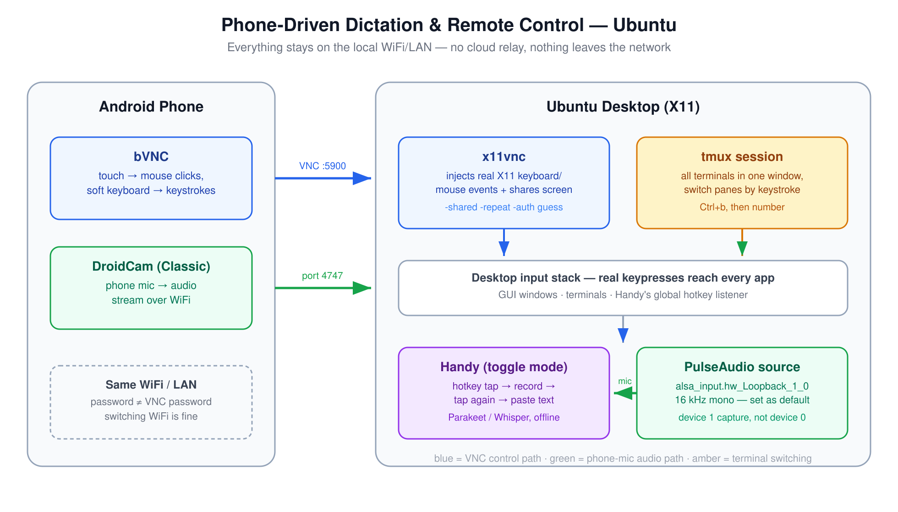

# Run Your Desk From the Couch — Free Voice Dictation + Remote Control, Set Up Once

> Typing rations context. You compress the message, drop the caveat, skip the background — then spend three turns re-adding what you cut. Speaking removes that tax.

A build's running upstairs. You're on the couch, not working, mostly resting — and a thought worth acting on shows up: reply to that message, nudge the agent that's mid-task, check whether the tests actually passed. None of that needs you to get up and sit back down at a desk. It needs your voice and a phone, pointed at a machine that's already on.

That's the actual shape of this setup once it's running: **occasional, light touches on real work, from wherever you already are** — another room, the couch, bed, mid-chore. Not a full workstation replacement, not "work from anywhere all day." Just the ability to close the gap between *having a thought worth acting on* and *acting on it*, without that gap costing you a walk to the desk every time.

This is also where AI-assisted work actually earns its keep. The boring part — typing out a careful prompt, re-explaining context you already have in your head, walking over just to type three words — is exactly the part worth deleting. What's left is the part that still needs you: judgment, taste, deciding what's worth saying and when to step in. Voice plus remote control doesn't automate that away — it just removes the friction between deciding and doing, so you spend your attention on the decision, not the mechanics of delivering it.

**The setup cost is a weekend, once. The payoff doesn't expire.** Everything below is free, runs offline, and — once wired — needs nothing further from you: no subscription to keep paying, no cloud account to manage, no model to retrain. Set it up on a Saturday, and every day after that, the couch is a valid place to get something done.

## What it actually looks like

- **Mid-rest, an AI agent needs a nudge.** Tap the phone, say "looks good, continue" or "stop, redo the auth part" — it lands as a real keypress in the real terminal, same as if you'd walked over and typed it.
- **A build's running, you want to know without getting up.** Pull up the phone, glance at the terminal over the mirrored screen, done. No SSH session to remember, no separate monitoring app.
- **A reply is worth sending now, not in twenty minutes.** Dictate it — into Slack, an email, a commit message — from wherever you're sitting, at roughly 3x typing speed, and without the usual tax of compressing the thought to make typing it bearable.
- **You're doing something else entirely** — cooking, stretching, half-watching something — and a stray thought about the code is worth capturing before it's gone. Say it. It's text on the screen before you've even sat back down.

Two tools make this work, both free and offline: **[Handy](https://github.com/cjpais/Handy)** for the voice-to-text part (dictation lands in any focused app, terminal included), and a small **phone-as-remote-control** rig (VNC + a mic relay) for reaching the desktop itself from another room. How each piece gets wired — once — is the rest of this post; the next section maps the route.

---

## The route this post takes

Four parts, in the order they're meant to be read:

1. **Part 1 — Handy, the dictation engine.** Install it *on the desk* and tune the model and hotkey. macOS and Ubuntu each get their own subsection; nothing remote happens here yet.
2. **Part 2 — The Ubuntu rig.** Turn the phone into a screen + keyboard + mic for the Ubuntu machine: `x11vnc` shares and drives the session, **bVNC** is the phone client, DroidCam carries the phone's mic in as a system input, tmux keeps terminals thumb-friendly. Troubleshooting and the daily-use scripts live at the end of this part.
3. **Part 3 — The macOS rig.** The same three jobs, built from what the Mac already ships: built-in **Screen Sharing**, **RealVNC Viewer** on the phone, AudioRelay → BlackHole for the mic — or an iPhone's Continuity mic, no extra apps at all. Includes troubleshooting and stop/start/teardown.
4. **Part 4 — Driving either rig from the phone.** Modifier-key toggles, the hotkey choice that matters on a touchscreen, gestures. This is VNC-client behavior, not OS behavior — one section serves both rigs.

Read Part 1, then *your* machine's part, then Part 4 — and skip the other rig entirely; each one is self-contained.

One split worth stating before anything else, because it's the classic confusion: **bVNC belongs to the Ubuntu rig, RealVNC Viewer to the macOS rig.** bVNC can't negotiate a Mac's authentication handshake (there's no security-type override in its UI), so it never connects to a Mac — and RealVNC isn't needed on Ubuntu. One box, one client, one saved entry:

| The job | Ubuntu rig (Part 2) | macOS rig (Part 3) |
|---|---|---|
| Share + control the screen | x11vnc | built-in Screen Sharing |
| Phone VNC client | **bVNC** (Android) | **RealVNC Viewer** (Android) |
| Phone mic → system input | DroidCam + PulseAudio loopback | AudioRelay + BlackHole — or iPhone Continuity mic |
| Switch default input | `pactl set-default-source` | `SwitchAudioSource -t input -s …` or Sound settings |
| Terminals by keystroke | tmux | tmux — same reasoning, no Mac-specific parts |

Security and license notes for every tool close the post.

---

## Part 1 — Handy: the dictation engine (macOS and Ubuntu)

Handy runs natively on both macOS and Ubuntu — same app, same models, same settings structure. Set it up at the desk first; everything remote later depends on it working locally.

### macOS — install

- Official Homebrew cask: `brew install --cask handy` — confirmed it's maintained in the `homebrew-cask` repo itself, not a third-party tap, before running it.
- The app bundle is small, ~40 MB, before any model download.
- First launch asks for two one-time OS permissions (Microphone, Accessibility) — click-through, no config editing.
- It works system-wide by design: hold the shortcut, speak, release, text pastes wherever the cursor currently is. Terminal included.

### macOS — model choice: multilingual (English + Bangla)

Handy's default model, Parakeet, only covers 25 European languages — no Bangla yet (an open feature request, unresolved). Whisper covers Bangla among 99 languages, from a single multilingual model file — no swapping per language, it detects (or can be pinned to) whichever one you're speaking.

- **Whisper Medium** (~492 MB) — good English quality, decent-enough Bangla for daily use. Set as default.
- **Whisper Large** (~1.1 GB) — a one-click model swap from Settings if Bangla accuracy needs it later, no reinstall.

Two decoding concepts worth knowing if you're picking a model yourself: **transcribe vs translate** — transcribe outputs the language you spoke, translate always outputs English regardless of input (skips a separate translation step, but Handy doesn't expose a UI toggle for it yet). And **auto-detect vs pinned language** — auto-detect guesses per clip (Whisper only; Parakeet-family models don't detect at all and silently default to English), pinning skips that step for speed and avoids misdetection on short clips.

### macOS — speed fix: switch to a streaming model

Whisper Medium (picked for Bangla) felt slow for everyday English dictation. Handy added streaming model support in v0.9.0 — **Parakeet Unified EN (0.6B)** is the streaming-capable engine, now Handy's recommended default: English-only, ~160ms latency, live preview while you're still speaking. Set that as the daily driver, and switch to Whisper Medium/Large only for the occasional Bangla session — same one-click swap, no reinstall.

### macOS — tuning that mattered

- **Custom vocabulary**: Settings → Advanced → Transcription → Custom Words — a `misheard → corrected` pair list for names and jargon the model gets wrong (e.g. "nerd devs" → "NerdDevs"). For cleanup beyond a fixed word list, Experimental → Post-Processing runs a second AI pass over the transcript, at the cost of a bit more latency.
- **RAM**: idle process measured **~823 MB RSS** with a model resident in memory. Noticeable if you keep it always-on on an 8 GB machine — Settings → Advanced → Unload Model frees that after a configurable idle timeout, at the cost of first-word latency on the next dictation.
- **Shortcut conflict**: default `Option+Space` clashed with Spotlight's own binding. Switched to Right Option held alone (not a macOS system action by itself, no collision). Alternative that's popular in Handy's own docs: hold `Fn`, with System Settings → Keyboard → "Press Globe key to…" → *Do Nothing* so its default tap-action doesn't also fire.

### Ubuntu — install, and the Wayland question

Check the session type first — the Wayland notes below only apply if you're actually on Wayland:

```bash
echo $XDG_SESSION_TYPE   # "x11" or "wayland"
```

On Ubuntu 22.04 GNOME, logging in via the **"Ubuntu on Xorg"** option (still offered at the login screen) gives X11, and Handy needs none of the tuning below under X11 — it worked out of the box.

#### Install (`.deb`, works on both X11 and Wayland)

```bash
curl -fL -o /tmp/Handy_amd64.deb \
  https://github.com/cjpais/Handy/releases/latest/download/Handy_0.9.5_amd64.deb
sudo apt install -y /tmp/Handy_amd64.deb
```

Swap `amd64` for `arm64` on ARM; `.rpm` and `.AppImage` builds are published too.

**Gotcha**: `apt` downloads/verifies as the unprivileged `_apt` user, which needs execute permission on every directory in the file's path. A `.deb` sitting in a locked-down tmp dir (e.g. `chmod 700`) fails with `couldn't be accessed by user '_apt'` even though the file itself is readable. Fix is downloading into a world-traversable path like `/tmp`, not loosening the original directory's permissions.

#### If you're on Wayland (GNOME default, 22.04+)

Wayland breaks Handy's default paste/typing out of the box, with known fixes:

- `sudo apt install ydotool`, run the `ydotoold` daemon, then set **Advanced → Keyboard Implementation → ydotool** — Wayland blocks the default typing method entirely.
- **Advanced → Overlay Position → None** — the overlay steals focus from the target window under Wayland, breaking paste.
- **Paste method → Direct**.
- Avoid the `Handy Keys` backend on Wayland — it re-injects keystrokes via ydotool and can loop, flooding the focused window with garbage text.
- Avoid bare single-key shortcuts (F13, Fn alone) — they can silently fail to fire on Wayland. Use a modifier combo instead, e.g. `Ctrl+Alt+Space`. Right Alt is commonly reserved as AltGr on Linux layouts — use Right Ctrl if you're carrying over a Mac Right-Option habit.
- Escape hatch: log in via "Ubuntu on Xorg" instead — none of the above tuning is needed under X11.

Model choice carries over unchanged: Parakeet Unified EN as the daily default, Whisper for occasional Bangla.

---

## Part 2 — The Ubuntu rig: x11vnc + bVNC + DroidCam

This part started as a convenience for dictation and turned into a general-purpose remote desktop: full mouse/keyboard control of the machine from the phone — switching between running apps, checking on a long build, dismissing a notification, replying to something — with dictation through the *phone's* mic as one capability riding on top, all over the local network, no cloud relay.

<div align="center">
  
  <br/>
  <sub>Two independent paths over the same LAN: VNC carries control (blue), DroidCam carries audio (green) — Handy never knows the input isn't local.</sub>
</div>

### Why plain SSH isn't enough

Handy has no always-listening mode — it needs a real keypress on its global hotkey to start recording, and that hotkey is a listener hooked into the desktop's own input stack (X11 here). An SSH text session never reaches that hook. VNC's remote keyboard/mouse *does* synthesize real input events on the desktop, so a VNC-triggered hotkey fires Handy exactly like a physical keypress would. (The macOS rig in Part 3 uses VNC for exactly the same reason.)

Handy also has no in-app microphone picker — it just uses whatever the OS default input device is. That's what makes swapping in the phone's mic possible without touching a single Handy setting.

### The pieces

- **x11vnc** — screen-shares the existing X11 session. Lets the phone both see the desktop and inject real keyboard/mouse events into it.
- **tmux** — alt-tabbing between separate GUI terminal windows by touch is fiddly on a phone. Keeping everything in one tmux session and switching panes/windows by keystroke (`Ctrl+b` + number) is far easier to drive from a soft keyboard.
- **DroidCam** (Android app + Linux client) — streams the phone's mic over WiFi into a virtual PulseAudio source on Ubuntu. Since Handy just follows the system default input device, setting that virtual source as default *is* the entire integration.

### Check what's already installed

Ubuntu ships `tmux` on some images but not others, and x11vnc is never preinstalled — check before assuming either way:

```bash
command -v tmux x11vnc || echo "missing one or both — install below"
```

### Install

```bash
sudo apt install -y x11vnc tmux
```

`droidcam` is **not** an apt package — it ships its own installer from dev47apps.com. Keep it in a separate command from apt installs: bundling a real package name with a nonexistent one fails the *whole* `apt install` transaction atomically.

```bash
cd /tmp && wget -O droidcam.zip https://files.dev47apps.net/linux/droidcam_2.1.5.zip
unzip -o droidcam.zip -d droidcam && cd droidcam
sudo ./install-client   # main app
sudo ./install-sound    # ALSA loopback — needed for mic-as-input-device
sudo ./install-video    # required even for audio-only, see below
```

Three gotchas here, in the order they'll actually bite:

1. **`install-video` isn't optional for mic-only use.** `droidcam-cli -a <ip> <port>` (audio-only flag) still hard-fails with `Error: Missing video device` without the `v4l2loopback-dc` kernel module — the client checks for a video device unconditionally, flags or not. Needs `linux-headers-$(uname -r)`, `gcc`, `make` (present on a normal desktop install).
2. **Flag order is not cosmetic.** `droidcam-cli <ip> <port> -a` (trailing flag) silently ignores `-a` — the parser stops scanning for flags at the first non-flag token and falls back to video-only. It prints `Video: /dev/video0`, no `Audio:` line, and exits clean — nothing *looks* wrong. Flags go **before** the IP: `droidcam-cli -a <ip> <port>`. Correct output for audio-only:
   ```
   Audio: hw:2,1,0
   ```
3. **Two DroidCam Android apps exist, only one works here.** "DroidCam Webcam (Classic)" is what `droidcam-cli` is built for. The OBS-companion variant connects fine for video but sends silent audio — the handshake answers, no mic samples ever flow. If both are installed, force-close both and open only Classic; they also fight over port 4747.

### Audio-only mode — worth it for phone battery

`-v` streams the camera continuously (capture, encode, WiFi upload) for the entire session, which drains the phone noticeably faster than audio alone — if all you want is the mic, skip it. `-a` alone is a *separate* code path in the client (its own `AudioThreadProc` thread, independent of the video path — confirmed reading `droidcam-cli.c`), so it doesn't need `-v` running alongside it to work:

```bash
droidcam-cli -a <phone-lan-ip> 4747
```

The `install-video` step from above is still required once at setup time regardless — the client checks that the `v4l2loopback-dc` kernel module exists at startup and refuses to run without it, even when you never pass `-v`. That's a one-time install-time dependency, not an ongoing battery cost — once the module's installed, `-a` alone never touches the camera or the video path at runtime. If `-a` alone doesn't produce audio on your setup after the loopback-source fix below, add `-v` back as a fallback (some app-version combinations reportedly need it to keep the mic thread alive) — but confirm with the `parecord`/`sox` check further down before assuming you need it.

### Wiring the mic through correctly

After `install-sound`, PulseAudio claims the new "Loopback" ALSA card in full duplex (`output:analog-stereo+input:analog-stereo`) — but `droidcam-cli` needs to open the playback side itself, so free it:

```bash
pactl list cards short   # find the loopback card's exact name
pactl set-card-profile alsa_card.platform-snd_aloop.0 input:analog-stereo
```

That fixes the connection — but not the audio. The PulseAudio source udev auto-creates for that card reads the *wrong* half of the loopback: `droidcam-cli` plays into ALSA device 0 playback, and `snd_aloop` cross-wires that onto device **1** capture, not device 0 capture (which is what the auto-created source listens to). Every recording from the wrong source measures a flat `0.000000` amplitude — connection and handshake both look healthy, the data just lands on a device nobody's reading. The fix is one line droidcam's own installer prints at the end (easy to miss, it scrolls past):

```bash
pactl load-module module-alsa-source device=hw:Loopback,1,0
pactl set-default-source alsa_input.hw_Loopback_1_0
```

The new source runs at 16 kHz mono — a useful tell that it's the right one (that's the phone-mic format). Verify before trusting it:

```bash
parecord --device=alsa_input.hw_Loopback_1_0 -d 5 /tmp/t.wav   # speak for the full 5s
sox /tmp/t.wav -n stat 2>&1 | grep -i amplitude                # > 0 means real audio
```

### Running x11vnc

```bash
tmux new -s vnc
x11vnc -display :<real-display-number> -auth guess -usepw -shared -repeat -forever
```

Find `<real-display-number>` with `who` (look for `<user>  :N  <date>`) from a terminal that's actually part of the graphical session.

- First run is interactive: no password file exists yet, so `-usepw` prompts you to set one. Always do this — never run x11vnc without auth.
- `-forever` keeps listening after the first client disconnects.
- **`-shared` matters.** Without it, x11vnc allows exactly one client at a time — a stale half-open connection from a WiFi blip or app switch makes every reconnect fail with `refusing new client ... Not shared & existing client` until you restart the server. With it, reconnects just work.
- **`-repeat` matters too.** x11vnc turns *off* the X server's key autorepeat by default while a client keyboard is active — its log even says so (`active keyboard: turning X autorepeat off`). Without this flag, holding an arrow key (or any key) from the phone does nothing beyond the first tap — no repeat, one character per touch, forever. `-repeat` keeps autorepeat on so a held key behaves like a physical one. Only drop it if your specific client does its own repeat and you start seeing doubled characters.
- **`-auth guess`** (x11vnc ≥0.9.9) finds the right Xauthority cookie itself. Modern GNOME/gdm sessions often keep it at `/run/user/<uid>/gdm/Xauthority`, not the default `~/.Xauthority` — hardcoding the default path is a common source of a silent auth failure.
- There's no `-localhost=no` flag — that's not real; `-localhost` (no value) *restricts* to loopback, and passing `=no` gets rejected as unrecognized. Allowing LAN connections is the default when you omit the flag entirely.
- Scope the port to your LAN: `sudo ufw allow from <your-subnet> to any port 5900` — never expose it to the internet. If you've never touched `ufw` before and only use SSH *outbound* to other machines (not inbound into this one), you don't need `sudo ufw allow OpenSSH` — that rule only matters for a device that accepts incoming SSH connections; ufw's default policy already allows all outbound traffic regardless of any inbound rule you add.

**What the VNC password actually is** — easy to conflate with the WiFi password, but it's a separate thing: it's set by you via `x11vnc -storepasswd` (not your router), it controls who can drive *this* desktop once already on the network (not who can join the network), and it doesn't change when you switch WiFi networks — phone and desktop just need to be on the *same* network at connection time, whichever one that is.

**Persisting across reboots — the actual autostart file**: there's no separate script to write here — GNOME (and most desktops) autostarts anything dropped as a `.desktop` file in `~/.config/autostart/`, once per graphical login, which is the earliest point a display actually exists to serve. Set the password once first (`x11vnc -storepasswd`), then create this file:

```ini
# ~/.config/autostart/x11vnc.desktop
[Desktop Entry]
Type=Application
Name=x11vnc
Exec=x11vnc -display :<N> -auth guess -rfbauth /home/<you>/.vnc/passwd -shared -repeat -forever
X-GNOME-Autostart-enabled=true
```

`<N>` is your real display number from `who` (see above); `<you>` is your Linux username — `Exec=` needs the absolute path, `~` isn't expanded there. `X-GNOME-Autostart-enabled=true` is what actually flips it on; a `.desktop` file without that line sits inert. Verify it's live any time with `pgrep -af x11vnc` after a fresh login — no separate "did it start" step needed beyond that.

The corrected PulseAudio source needs the same treatment, since `pactl load-module` doesn't survive a restart either — add it to `~/.config/pulse/default.pa`:

```
# ~/.config/pulse/default.pa
.include /etc/pulse/default.pa
set-card-profile alsa_card.platform-snd_aloop.0 input:analog-stereo
load-module module-alsa-source device=hw:Loopback,1,0
```

(A user `default.pa` *replaces* the system one, so the `.include` line matters. On systems running PipeWire instead, this file is ignored — check `pactl info | grep -i server`.)

### tmux, if you've never used it

Everything below starts with the prefix `Ctrl+b`, released, *then* the next key — it's tapped in sequence, not held together.

| Want to... | Keys |
|---|---|
| New named session | `tmux new -s <name>` |
| Reattach later | `tmux attach -t <name>` |
| List sessions | `tmux ls` |
| **Detach** (leave running) | `Ctrl+b` then `d` |
| New window | `Ctrl+b` then `c` |
| Switch to window N | `Ctrl+b` then `<number>` |
| Next / previous window | `Ctrl+b` then `n` / `p` |
| Split pane | `Ctrl+b` then `%` (vertical) / `"` (horizontal) |
| **Close a pane/window** | `exit` or `Ctrl+d` — an ordinary shell command, not a tmux shortcut |
| **Kill a whole session** | `tmux kill-session -t <name>` |
| Scroll back | `Ctrl+b` then `[`, arrow keys, `q`/`Esc` to exit |

The thing that trips people up: there's no tmux-specific "close" shortcut. You close a pane exactly like you'd close a normal terminal. `Ctrl+b`-prefixed shortcuts only *navigate* — they never end a session.

Scrolling by typing `Ctrl+b [` on a touch keyboard is annoying — turn on mouse mode instead so the VNC client's own two-finger swipe scrolls the pane directly:

```bash
tmux set -g mouse on          # or add "set -g mouse on" to ~/.tmux.conf permanently
```

That's the whole server side. Troubleshooting and the daily-use scripts follow — then Part 4 covers the phone-side skills, most of which apply to both rigs.

### Ubuntu troubleshooting

**"Connection refused"** — port 5900 has nothing listening, x11vnc either never started or died on launch:

```bash
pgrep -af x11vnc     # nothing = not running
ss -tln | grep 5900  # nothing = nothing listening
```

If it's not running, re-run it and actually read what it prints. x11vnc fails fast on a bad flag or auth error and drops straight back to a clean-looking shell prompt — nothing visually distinguishes "crashed instantly" from "idle and fine" unless you read the output (`tmux capture-pane -p -t <session>` if it's not currently on screen). The two causes that hit here:

- **Wrong display number.** `-display :0` failed with an Xauthority error on a session that was actually `:1`. Check with `who` (`<user>  :1  <date>` — the number after the colon) from a terminal that's part of the actual graphical session, not an unrelated SSH shell.
- **Xauthority not at the default path.** Modern GNOME/gdm often keeps it at `/run/user/<uid>/gdm/Xauthority` instead of `~/.Xauthority`. `-auth guess` finds it automatically; the explicit fallback is `-auth /run/user/<uid>/gdm/Xauthority`.

If it's still refused after that: check `ufw status verbose` actually shows the port-5900 rule as active, confirm phone and desktop are on the *same* WiFi (not a guest network or mobile data), and re-check the desktop's LAN IP hasn't drifted from a DHCP re-lease (`ip -4 -o addr show scope global`).

**"Busy with another client" right after restarting droidcam**: the phone holds the old connection open for a few seconds after the desktop client is killed. Kill it, wait ~5s, reconnect.

### Daily use on Ubuntu

Everything below assumes x11vnc autostarts at login and the corrected PulseAudio source is already in `default.pa` — only DroidCam needs a manual start each session. Rather than retyping the two commands every time, save them as a script:

```bash
# ~/bin/dictation-remote-start.sh
#!/usr/bin/env bash
set -euo pipefail

PHONE_IP="${1:?Usage: dictation-remote-start.sh <phone-lan-ip>}"

if ! pgrep -x x11vnc >/dev/null; then
  echo "x11vnc isn't running — start it manually first (see 'Running x11vnc' above)"
  exit 1
fi

tmux has-session -t dc 2>/dev/null && tmux kill-session -t dc   # clear a stale session first
tmux new -d -s dc
tmux send-keys -t dc "droidcam-cli -a ${PHONE_IP} 4747" Enter
sleep 3

if pactl list sources short | grep -q "Loopback.*RUNNING"; then
  pactl set-default-source alsa_input.hw_Loopback_1_0
  echo "phone mic live — connect bVNC and dictate"
else
  echo "loopback source not RUNNING yet — check: tmux capture-pane -p -t dc"
fi
```

```bash
chmod +x ~/bin/dictation-remote-start.sh
~/bin/dictation-remote-start.sh <phone-lan-ip>
```

Open the Classic DroidCam app on the phone *before* running it. The script's own check covers the same verification you'd otherwise do by hand — the loopback can look connected while silently dead, which is why it greps for `RUNNING`, not just presence:

```bash
pactl list sources short | grep Loopback   # want: alsa_input.hw_Loopback_1_0 ... 16000Hz ... RUNNING
```

**Dictate**: connect from the phone's VNC client → focus a text field → tap Handy's hotkey (toggle: tap to start, tap to stop) → speak into the phone → tap again → text pastes at the cursor.

**Switch mic, phone ↔ desktop** — both exist as PulseAudio sources side by side; Handy just uses whichever is currently default:

```bash
pactl set-default-source alsa_input.hw_Loopback_1_0                    # phone mic
pactl set-default-source alsa_input.pci-0000_2d_00.4.analog-stereo     # desktop mic
```

Find the desktop mic's exact name with `pactl list sources short` — it's the `pci-...` one, not a `.monitor`. `pavucontrol` → Input Devices gives the same switch with a click instead of a command.

**Stop cleanly:**

```bash
# ~/bin/dictation-remote-stop.sh
#!/usr/bin/env bash
set -euo pipefail

DESKTOP_MIC="${1:?Usage: dictation-remote-stop.sh <desktop-mic-source-name>}"

tmux kill-session -t dc 2>/dev/null || true
pactl set-default-source "${DESKTOP_MIC}"
echo "phone mic session stopped, desktop mic restored"
```

```bash
chmod +x ~/bin/dictation-remote-stop.sh
~/bin/dictation-remote-stop.sh alsa_input.pci-0000_2d_00.4.analog-stereo
```

DroidCam's phone app stops streaming on its own once the client disconnects.

#### Common real-life scenarios

| Scenario | What to do |
|---|---|
| Starting the day | x11vnc is already running (autostart) — just start DroidCam (script above), then connect bVNC. |
| Done for now / stepping away | Run the stop script. Leave x11vnc running — it's fine indefinitely, low overhead — just stop DroidCam so it's not holding your phone's mic and battery for nothing. |
| Need the desktop mic back quickly (e.g. a call) | `pactl set-default-source <desktop-mic>` — instant, no need to stop DroidCam first. |
| WiFi drops and reconnects | bVNC: just reconnect — `-shared` means a dead old connection won't block the new one. DroidCam: the client process usually needs a manual restart — rerun the start command. |
| Phone's IP changed (DHCP re-lease) | Check the new IP on the DroidCam app screen, kill the `dc` tmux session, reconnect with the new IP. |
| Long idle session, phone screen off | Android's battery optimization can throttle or kill a backgrounded app's mic stream over time — exclude DroidCam from battery optimization if you're leaving this running for hours; for a quick check-in it won't matter. |
| Desktop reboots or loses power | x11vnc's autostart only fires **after graphical login** — if it reboots to a lock screen, nothing's listening yet, and there's no way to VNC in before that first login happens. Someone has to log in locally once after a reboot. |
| Away from home / different WiFi | Nothing to do — x11vnc is firewalled to your home subnet, so it's simply unreachable from outside it. That's the intended behavior, not a setting to flip. |
| Quick "is this actually working" check | `pgrep -x x11vnc && pactl list sources short \| grep Loopback` — both should return something, the source line should say `RUNNING`. |

---

## Part 3 — The macOS rig: Screen Sharing + RealVNC Viewer + AudioRelay

Same three jobs as the Ubuntu rig — see the screen, drive the keyboard, feed the phone's mic in — but the Mac ships with the biggest piece already installed, so this is mostly a matter of turning things on. This part was shaken down live on a Sequoia Mac with an Android phone in hand: Screen Sharing answering on 5900, a phone client driving the screen, and the phone's mic arriving as a real system input — everything marked "tested live" below came off that machine. The two pieces that remain secondhand (the Sequoia client-friction reports, the iPhone Continuity route) say so.

<div align="center">
  
  <br/>
  <sub>Same two paths as the Ubuntu rig: VNC carries control (blue), AudioRelay carries audio (green) — Handy just follows the default input.</sub>
</div>

### Screen sharing: one toggle, no x11vnc equivalent needed

macOS's built-in Screen Sharing speaks VNC, so the phone clients that reach x11vnc mostly reach a Mac — with one tested exception (bVNC), covered in the auth notes below:

1. **System Settings → General → Sharing → Screen Sharing** — flip it on. Keep it plain Screen Sharing: if **Remote Management** is the enabled one instead, legacy-VNC clients get served the login window even while you're logged in, and typing into that over VNC drops focus (tested live — Remote Management off, Screen Sharing on, and the phone landed straight on the desktop; logging in over VNC works too, for the after-reboot case).
2. For a *third-party* client (bVNC, RealVNC — anything not Apple's own Screen Sharing app), click the ⓘ next to Screen Sharing and enable **"VNC viewers may control screen with password"**, then set that password. Without it, macOS expects Apple's own authentication handshake and most phone clients fail to connect at all.
3. Connect from the phone to `<mac-lan-ip>:5900`, password = the VNC password from step 2. Same separate-from-WiFi-password logic as x11vnc's.

Or skip the GUI for step 1: `sudo launchctl load -w /System/Library/LaunchDaemons/com.apple.screensharing.plist` — but step 2 has no equally clean CLI path, so most of this toggle lives in System Settings either way. There's also a CLI for the whole thing (`.../ARDAgent.app/Contents/Resources/kickstart -activate -configure -access -on -clientopts -setvnclegacy -vnclegacy yes -setvncpw <pw> -restart -agent -privs -all`), but on Sequoia it sets privileges and the password while **refusing to actually open the service** — it prints *"Screen Sharing or Remote Management must be enabled from System Settings or via MDM"* and the port stays closed until you flip the GUI toggle once. Count on ending in System Settings regardless.

Two auth behaviors worth knowing before a phone client rejects a correct-looking password:

- **The VNC password is effectively 8 characters.** System Settings happily accepts a longer one, but legacy VNC auth is a DES challenge-response capped at 8 — if the client keeps rejecting the password you set, the first 8 characters are the password.
- **macOS serves two auth types side by side**: Mac account auth (a username + your Mac login password, Apple's ARD-style handshake) *and* the legacy VNC password. A client looping on "enter VNC credentials" is often answering the wrong one — the server offers both, and which one you get depends on the client's negotiation. Note Screen Sharing and Remote Management each have their **own** VNC-password setting; only the one for the service you actually enabled is consulted.
- **Client choice matters on macOS, tested live**: **bVNC negotiates Apple's DH-based handshake against a Mac and fails even with the correct password stored** (it pops a username+password dialog and rejects both credential sets — there's no security-type override in its UI to force legacy VNC). **RealVNC Viewer** connects with the plain VNC password, username blank. So: bVNC for the Ubuntu host, RealVNC Viewer for the Mac host — each box keeps one saved entry and the working client for it. If you want to verify the stored password server-side without a phone, a ~40-line Python script speaking the RFB DES challenge-response against `127.0.0.1:5900` will tell you `ACCEPTED`/`REJECTED` per candidate password — worth doing before blaming the client.

What you *don't* need, relative to Part 2: no display-number hunting (`who`, `:0` vs `:1`), no `-auth guess` Xauthority chase, no `.desktop` autostart file, no `-shared`/`-repeat` flag tuning — Apple's server handles reconnects and key repeat correctly by default. And one genuine upgrade: Screen Sharing is a system daemon that serves the **login window** too, so after a reboot you can VNC in and log in remotely — the Ubuntu autostart can't do that (x11vnc only starts after a graphical login).

Two caveats worth knowing before you debug blind:

- **Much of the "Sequoia is rough on third-party VNC clients" chatter traces back to the Remote Management behavior in step 1**, not the OS itself — with plain Screen Sharing and the VNC password, RealVNC Viewer connected cleanly through reboots and IP changes. Reports of screen-recording/share permissions demanding roughly-monthly reauthorization do exist; if the phone client won't connect, first try Apple's own Screen Sharing app from another Mac to isolate server-toggle vs client.
- **The lock screen is the other trap** — when the Mac auto-locks, the VNC view becomes a login window whose password field keeps dropping focus under phone-client keystrokes. Unlock at the Mac's own keyboard once, and for couch use set **System Settings → Lock Screen → Require password…** to a long interval so sessions don't lock under you mid-dictation.
- **Firewall**: macOS's application firewall allows the signed system Screen Sharing service through by default — no `ufw`-style rule to add. The LAN-only hygiene advice still applies: don't port-forward 5900 out of your router, ever.

### Phone mic: two routes, one of them native

Handy's limitation is the same on both OSes — it uses whatever the system default input is — so the whole integration is "make the phone a default-able input device":

- **iPhone (the clean path)**: Continuity makes the iPhone's mic show up as a plain input device on the Mac — **System Settings → Sound → Input → iPhone Microphone** once the phone is nearby and unlocked. No driver install, no loopback wiring, no wrong-device-half bug to chase, because macOS treats it as a first-class input. Requirements: both devices on the same Apple ID, Bluetooth and Wi-Fi on, iOS 16+/macOS 13+. Set it as default input and Handy just follows. This is the entire setup.
- **Android (the tested path — AudioRelay + BlackHole)**: DroidCam publishes its standalone client for Windows and Linux only, so the Ubuntu recipe doesn't port. What works instead, tested end to end: **[AudioRelay](https://audiorelay.net/)** on the phone in **Microphone** mode streams over WiFi to the AudioRelay app on the Mac; point that app's output at **[BlackHole 2ch](https://existential.audio/)** — a free virtual audio device, `brew install --cask blackhole-2ch` — and BlackHole's far end shows up as a normal *input* device. Set it as the default input and Handy follows it, the same trick as Ubuntu's PulseAudio loopback. The BlackHole hop exists because macOS has no loopback module: an app receiving audio can only *play* it into an output device, and BlackHole is the virtual output whose other end is a recordable input. Gotchas hit live: the audio setup (output device) lives in the **Player** panel for the connected stream — if the phone doesn't auto-appear in the Mac app, **Connect by address** with the phone's IP (shown in the phone app) beats waiting on discovery; BlackHole only appears in device lists after `sudo killall coreaudiod` post-install; and if you script the input switch, `SwitchAudioSource -t input -s "BlackHole 2ch"` (from `brew install switchaudio-osx`) is the `pactl set-default-source` equivalent — note `-s` takes the device *name*, `-i` takes a numeric id. Verified with a 12-second spoken recording off the default input — clean signal, no clipping. AudioRelay is closed-source; read the security section below before running it anywhere beyond a home LAN.

### Switching input devices — the move you'll make daily

The two names that matter: `BlackHole 2ch` *is* the phone's mic (via AudioRelay), `MacBook Air Microphone` (or your Mac's model name) is the built-in one.

- **GUI**: **System Settings → Sound → Input** → click the device. Verify with the live level meter next to it — speak and watch the bar bounce on the device you picked; that meter is the fastest "is anything hearing me" check there is. Note Control Center's sound module switches *output* (speakers) only — input always lives in Sound settings, and mixing the two up is the classic "Handy stopped hearing me" cause.
- **CLI**: the `pactl set-default-source` equivalent is `SwitchAudioSource -t input -s "BlackHole 2ch"` (and `-s "MacBook Air Microphone"` to come back). `-c -t input` prints the current device, `-a -t input` lists them all.

### What carries over from Part 1

- **Handy**: identical install and settings as Part 1's macOS subsection. The toggle-mode requirement is *more* important here, not less — the Mac's VNC keyboard also sends instant press+release, so push-to-talk still can't work from a phone.
- **Hotkey rebind**: same advice — a single modifier-less key beats a combo on a soft keyboard, and the Spotlight/`Option+Space` conflict fix from Part 1 already handles the OS side. Two Mac-specific notes from testing: Mac keyboards have no dedicated `End` — it's `Fn`+`→`, and Handy registers the *keysym*, so `Fn`+`→` at the desk and `End` in the client's key panel both trigger it. And don't pick a bare *modifier* like right-Option just because it's comfy locally — VNC soft keyboards can't send side-specific modifiers, so it will never fire from the phone.
- **tmux**: nothing Mac-specific, but the reasoning transfers fully — switching tmux windows by keystroke beats alt-tabbing between GUI terminal windows by touch, on any OS (cheat sheet in Part 2).
- **Readline editing, modifier toggles, tap/long-press/drag gestures**: VNC behavior, not OS behavior — everything in Part 4 below works the same against a Mac, with GNOME's hot corner swapped for macOS's own hot corners (System Settings → Desktop & Dock → Hot Corner, e.g. top-left → Mission Control) and `Super+A` swapped for `Cmd+Tab`.

### Session realities on macOS (tested across a reboot)

- **Everything server-side comes back after a reboot** — Screen Sharing, the AudioRelay player, Handy, and the BlackHole default-input setting all survived a full shutdown. The phone side does not: reopen AudioRelay → Microphone → Start each session.
- **The Mac's LAN IP can re-lease** — ours moved between `.148` and `.196` on one reboot. If the saved phone entry stops connecting, recheck with `ipconfig getifaddr en0` and edit the entry, or give the Mac a DHCP reservation in the router.
- **Multiple displays arrive as one wide canvas** — pinch out in the client and pan; VNC has no per-monitor concept, so both screens sit side by side in a single framebuffer.

### macOS troubleshooting quick reference

- **Phone won't connect** — check in order: the Mac's IP (`ipconfig getifaddr en0` — DHCP moves it), the password (first 8 characters — legacy VNC truncates), and that **Screen Sharing**, not Remote Management, is the enabled service.
- **Phone sees a login window you can't type into** — either Remote Management is serving legacy clients the login window (switch to plain Screen Sharing), or the Mac auto-locked (unlock at the Mac once; lengthen Lock Screen's "Require password").
- **Dictation went silent** — the input is still on BlackHole with no stream behind it. Switch the input back to the built-in mic, or restart the phone's AudioRelay stream (Microphone → Start).
- **Suspect the stored password** — the RFB DES challenge-response script from the auth notes above answers ACCEPTED/REJECTED without touching the phone.

### Stopping, resuming, and removing it all

**Stop for the evening.** The one step people get wrong (we did): switch the **input**, not just the speakers. Quitting AudioRelay and putting output back to `MacBook Air Speakers` still leaves the *input* on BlackHole — which now delivers silence, so dictation mysteriously "stops hearing you" while everything looks configured.

1. Phone: stop the AudioRelay mic stream; close RealVNC.
2. Mac: `SwitchAudioSource -t input -s "MacBook Air Microphone"` — or System Settings → Sound, Input; either way, it's the *input* side.
3. Optional: quit AudioRelay from its **menu-bar icon** — closing the window only hides it, the app keeps running.
4. Optional: System Settings → General → Sharing → Screen Sharing → off, if you don't want port 5900 open while nobody's using it.

**Start again** (post-setup, takes ~30 seconds):

1. Mac: AudioRelay open — the menu-bar icon is enough; use **Connect by address** if the phone doesn't auto-appear.
2. Phone: AudioRelay → **Microphone → Start**.
3. Mac: `SwitchAudioSource -t input -s "BlackHole 2ch"`.
4. Phone: RealVNC → connect to the Mac's IP (recheck with `ipconfig getifaddr en0` if the Mac rebooted — DHCP moves it).
5. Focus a text field → `End` → speak → `End`.

**Remove everything** (full teardown):

```bash
SwitchAudioSource -t input -s "MacBook Air Microphone"   # input off BlackHole FIRST
brew uninstall --cask blackhole-2ch audiorelay            # virtual device + player app
sudo killall coreaudiod                                   # flush the stale device entry
brew uninstall switchaudio-osx                            # optional CLI helper
sudo /System/Library/CoreServices/RemoteManagement/ARDAgent.app/Contents/Resources/kickstart \
  -deactivate -stop                                       # VNC server off
# ...then System Settings → General → Sharing → Screen Sharing → OFF
#   (the GUI toggle is authoritative on Sequoia — confirm it flipped)
# Handy: quit it, remove from Login Items, or `brew uninstall --cask handy`
#   its recordings/history live in ~/Library/Application Support/com.pais.handy
```

---

## Part 4 — Driving either rig from the phone

Everything here is VNC-client behavior, not OS behavior — it works the same against the Ubuntu rig and the macOS rig. Client-specific bits are labeled. The connection details for each rig, in one place:

| | Ubuntu rig (Part 2) | macOS rig (Part 3) |
|---|---|---|
| Client | **bVNC** (Android) | **RealVNC Viewer** (Android) |
| Address | `<ubuntu-lan-ip>:5900` | `<mac-lan-ip>:5900` |
| Password | the `x11vnc -storepasswd` one | the 8-character VNC password from Part 3 |

Both passwords are separate from your WiFi password and unaffected by switching networks — phone and desktop just need to be on the *same* network at connection time, whichever one that is. (On iOS, RealVNC's VNC Viewer app is the equivalent client for either rig.)

VNC just mirrors real mouse and keyboard input — there's no VNC-specific "select an app" step, it behaves exactly like sitting at the desktop:

- **Focus a window**: tap it directly in the mirrored screen — a real click.
- **Type**: tap the field to focus it, tap the keyboard icon to bring up the phone's soft keyboard. Everything typed sends as real keystrokes — no special "VNC mode."
- **Modifier combos** (Ctrl+key, Alt+key, Cmd+key — including Handy's own hotkey): use the client's extra-keys toolbar, the row of dedicated `Ctrl`/`Alt`/`Shift`/`Esc`/`Tab` buttons you tap to hold, then tap the other key.

### Switching between applications

Three ways, in the order actually worth trying on a phone:

- **The desktop's hot corner (no keys needed at all)**: on GNOME, tap the very top-left pixel of the mirrored screen, just under where "Activities" would show — the overview opens with every open window as a thumbnail; tap the one you want. macOS has the same feature: System Settings → Desktop & Dock → Hot Corner (e.g. top-left → Mission Control). This is the one to reach for first: it needs no modifier key, works even if your VNC client's extra-keys toolbar doesn't expose `Tab` (some builds don't), and is one tap instead of a hold-plus-tap combo.
- **Alt+Tab / Cmd+Tab, if your client has both keys**: hold `Alt` (or `Cmd` on the Mac rig) and tap `Tab` from the extra-keys toolbar to cycle, same as at a physical keyboard — same toggle-then-tap mechanism as the multi-key shortcuts below. Falls back to the hot corner if `Tab` isn't in your toolbar's default row.
- **Between terminals/shells specifically**: don't alt-tab or hot-corner between separate GUI terminal windows at all if you can help it — hunting for the right thumbnail among several is more taps than it's worth. Keep everything inside one tmux session instead and switch panes/windows by keystroke (`Ctrl+b` + number, see the cheat sheet in Part 2) — this is why tmux is one of the three pieces of the Ubuntu setup, not just a convenience. Works identically on the Mac.

All three are the same underlying trick as dictation: VNC sends real input events, so every desktop-level shortcut or gesture you'd use at the keyboard works identically from the phone.

### Multi-key shortcuts, e.g. `Super+A`

A touchscreen can't physically hold two keys down at once, so the extra-keys toolbar buttons don't work like a normal press-and-release key — they're **toggles**. Tapping a modifier arms it (it stays visually pressed/highlighted); tapping the next key sends both together as one combo, and the modifier releases automatically right after.

To fire `Super+A` (or any modifier combo — `Ctrl+Shift+T`, `Alt+F4`, `Cmd+Q` on the Mac rig):

1. Open the extra-keys toolbar (the keyboard/gear icon in the client's in-session toolbar).
2. Tap the **Super**/**Win**/**Cmd** key icon (labeled `Super`, `Win`, `Cmd`, or shown as a ⊞-style icon depending on client) — it stays highlighted, armed.
3. Tap `A` on the soft keyboard — the combo fires as `Super+A`, and the modifier releases on its own.

Same mechanism for stacking more than one modifier — tap `Ctrl`, tap `Shift`, then tap the letter key, and all three go through together. If the client's default extra-keys row doesn't show a Super/Win button, check its settings for a toolbar/keys customization option before assuming the key isn't supported — most VNC clients that expose Ctrl/Alt as toggles expose Super the same way.

### bVNC only: where's the Enter/Backspace key?

They're not special bVNC buttons — they're just the ordinary **Enter** and **Backspace** keys on Android's own soft keyboard, same as any other key you tap. bVNC's extra-keys toolbar (the icon strip you open from the in-session toolbar) exists specifically for keys a *normal* mobile keyboard doesn't have — Ctrl, Alt, Esc, Tab, arrows — because you can't reach those any other way from touch. Enter and Backspace are already on the standard keyboard, so there's nothing extra to add: type into the focused field/terminal and use them like you would in any Android app.

### Rebind the dictation hotkey for phone use

The default hotkey (`Option+Space` on Mac, whatever you set on Ubuntu) is fine at a physical keyboard, but it's the *worst* shape for VNC: it's a modifier combo, which means arming a toggle button and then tapping a second key every single time you want to dictate — two taps instead of one, on a touchscreen. Handy's hotkey is fully rebindable in **Settings → Shortcut** — click the field, press whatever you want it to be, done. For phone use, pick a **single key with no modifier**: `End`, `Insert`, `Home`, or `Page Up`/`Page Down` all work well — they're plain keys on the extra-keys toolbar (or the soft keyboard itself, depending on client), so triggering dictation is one tap, not an arm-then-tap sequence. Avoid anything that isn't a standard key a mobile soft keyboard or extra-keys row can actually send — media keys and vendor-specific function keys often just don't reach the desktop over VNC at all.

This is a separate setting from the OS-level shortcut-conflict fixes in Part 1 (Spotlight on Mac, Wayland's single-key restrictions on Ubuntu) — those are about the hotkey not colliding with something else or firing reliably at the OS level; this is about picking a hotkey that's actually *convenient* to fire with a thumb.

One thing this setup depends on getting right: **Handy has to be in toggle mode, not push-to-talk.** A VNC soft keyboard sends every key as an instant press+release — it physically cannot *hold* a key down. In push-to-talk mode, Handy sees the tap, flickers its recording indicator for a split second, and stops before anything is captured. Switch Handy's recording style to toggle (press once to start, press again to stop and transcribe) and single taps from the phone work exactly like a physical hold-and-release would.

**Editing text in a terminal** (faster than arrow-key nudging on touch, works on both rigs): standard readline bindings work over VNC exactly like they do locally — `Ctrl+A`/`Ctrl+E` jump to line start/end, `Ctrl+W` deletes the last word, `Ctrl+U` clears back to cursor.

### bVNC only: right-click / opening an application's options menu

**Mouse gestures** (bVNC): tap = left-click, drag = click-and-drag. But **right-click is not a plain long-press** — that's the one gesture people assume and get wrong.

To right-click something — a dock/taskbar icon, the desktop, a file — and get its context/options menu:

1. **Press and hold** one finger on the target (keep it down).
2. **Tap anywhere else** on the screen with a second finger.
3. Lift both — the right-click fires where the first finger sits, and the menu opens.

That hold-then-second-finger-tap gesture is bVNC's documented right-click in its default input modes (hold and *swipe* instead of tapping and you get a right-drag). Alternatives, in order of usefulness:

- **Single-Handed input mode**: long-press the target and a small panel pops up with a dedicated **right** button — tap it, lift, menu opens. The one-handed option; note long-press means *left-drag* in the other modes, it's only the chooser trigger here.
- **Touchpad-style modes**: gesture conventions shift to "one finger = left-click, two fingers together = right-click, three = middle-click."
- **Bluetooth mouse**: connect one and the actual right button just works.

Gestures aren't gated behind bVNC Pro — same input handling in the free version. Full per-mode reference lives in-app: Menu → More → Input Mode Help. (RealVNC Viewer exposes its own mouse mode for this — the gestures above are bVNC's.)

---

## Where this landed

Full chain confirmed working over LAN: bVNC view/control from the phone (window switching, multi-key shortcuts, full keyboard access), phone-mic audio reaching the desktop as a real PulseAudio source (16 kHz mono, verified non-silent), Handy pointed at that source in toggle mode. Ubuntu is confirmed on X11 — still untested on an actual Wayland session, where I'd fall back to **nerd-dictation** or **Vocalinux** if Handy proves too fiddly. The macOS walkthrough was shaken down live end to end on the same phone: RealVNC Viewer driving the Mac from across the room, the Android mic route (AudioRelay → BlackHole) delivering clean speech into the default input, and a full Handy dictation round-trip — toggle hotkey tapped from the phone's key panel, spoken sentence, transcription landing in the focused app. The iPhone Continuity route is the one piece still untested here.

The setup is more moving parts than a typical dictation write-up — a phone-mic relay and a remote desktop protocol is a lot of infrastructure for a keyboard shortcut. But each piece is free, each piece is offline, and what it buys is a full second input surface for the desktop: dictate into anything — a commit message, a Slack reply, a doc, an AI agent prompt — or just drive the machine outright, switch apps, run a shortcut, check on something, all from whatever's in your pocket, without a subscription and without a cloud service listening in.

---

## Tool info, licenses, and security

Every tool in this post, checked against primary sources — the repo's actual LICENSE file, not its README claim; CVE databases; and the vendor's own privacy policy. Two verdicts matter more than the rest and are called out below the table.

| Tool | What it is / link | Publisher | License (verified) | Open source | CVE history | Verdict |
|---|---|---|---|---|---|---|
| [Handy](https://github.com/cjpais/Handy) | Dictation (macOS/Ubuntu) | CJ Pais (solo) | MIT (name/logo excepted) | ✅ | None found | Acceptable — active (v0.9.5, Aug 2026), fully offline, no telemetry found; young solo-maintained project, no third-party audit |
| [tmux](https://github.com/tmux/tmux) | Terminal multiplexer | Nicholas Marriott et al. | ISC | ✅ | 1 real CVE (CVE-2020-27347, fixed in 3.1c); a 2022 one was disputed and rejected by MITRE | **Publicly trusted** — 20-year track record, no network surface |
| [x11vnc](https://github.com/LibVNC/x11vnc) | VNC server (Ubuntu) | LibVNC org | GPL | ✅ | Several (2018–2020, incl. CVE-2020-29074) — all addressed by 0.9.17 | Acceptable — actively maintained; use TLS/SSH on untrusted LANs (see below) |
| [bVNC](https://github.com/iiordanov/remote-desktop-clients) | VNC client (Android) | Iordan Iordanov | GPL-3.0 | ✅ (free = same code as Pro) | None specific; bundles libvncclient which has 2026 decoder CVEs (client-side, malicious-server scenario) | Acceptable — mature; SSH/TLS tunneling built in |
| [DroidCam](https://droidcam.app/) | Phone mic/camera → desktop | Dev47Apps | GPL-2.0 **Linux client only** — Android/desktop apps closed | ⚠️ partial | None found (weak evidence — closed source has no audit surface) | **Concerns** — see below |
| [AudioRelay](https://audiorelay.net/) | Phone mic → desktop (the macOS Android route) | Asapha Halifa (solo, France) | Closed | ❌ | None found (weak evidence) | **Concerns** — see below |
| [BlackHole](https://existential.audio/) | Virtual audio device (macOS) | Existential Audio Inc. | GPL-3.0 source (official installers proprietary; name trademarked) | ✅ source | None found; DriverKit userspace driver, no kext, no telemetry, no network code | **Publicly trusted** — active (v0.7.1); installers signed + notarized |
| [switchaudio-osx](https://github.com/deweller/switchaudio-osx) | CLI default-device switcher (macOS) | deweller/Honza Bambas | MIT | ✅ | None found | Acceptable — dormant since 2023 but a tiny no-network C CLI still packaged in homebrew-core; dormancy is a smell, not a finding |

**The two findings worth acting on:**

- **DroidCam's WiFi stream is plaintext with no authentication** — anyone on the same network can connect to the stream ([their own long-open issue #158](https://github.com/dev47apps/droidcam/issues/158)). AudioRelay is closed-source with a heavier-than-expected telemetry stack (Firebase Analytics, PostHog, Crashlytics/Sentry, advertising IDs, phone-state permission on Android per its [privacy policy](https://www.iubenda.com/privacy-policy/31266111)), and while its streams are designed to go LAN-direct, **stream encryption is officially undocumented** — an AES-256-GCM claim circulates from a developer comment but appears nowhere in official docs. Both tools are fine on a **trusted home LAN**; neither should touch a shared/office/public network. DroidCam's USB mode sidesteps the WiFi exposure entirely.
- **Legacy VNC passwords are weak by protocol** — the classic VNC auth this rig uses (x11vnc `-usepw`, macOS "VNC viewers may control screen with password") is a DES challenge-response **capped at 8 characters**. On a firewalled home LAN that's an acceptable trade; anywhere else, tunnel VNC through SSH (bVNC supports SSH tunnels natively) or use x11vnc's TLS/VeNCrypt options — and never port-forward 5900.

**Install-channel integrity**: on macOS, Homebrew casks pin a SHA-256 for every download and fail closed on mismatch — but the bits come from vendor CDNs (`dl.audiorelay.net`, `existential.audio`), so the checksum guarantees integrity against the cask snapshot, not the vendor's server hygiene. Locally installed apps verified: Handy and AudioRelay both carry notarized Developer IDs and pass `codesign --verify --deep --strict`.

---

## Appendix: other dictation tools considered

Handy won on a specific bar — free, fully offline, no account, no mode caps, works in a terminal. For reference, what else was on the table:

| Tool | Free tier | Offline model | macOS | Ubuntu |
|---|---|---|---|---|
| superwhisper | Free (tiny/base, 3 modes cap); Pro $8.49/mo unlocks large-v3 | Yes | Native | No |
| **Handy** | 100% free, MIT, no tiers | whisper.cpp + Parakeet, unlimited | Native | Native |
| VoiceInk | $25–49 one-time (GPLv3, buildable free) | Local Whisper | Native | No |
| [Epicenter](https://github.com/epicenter-so/epicenter) (formerly Whispering) | Free OSS; local via Speaches/whisper.cpp | Yes (AGPL-3.0 apps / MIT toolkit pkgs) | Yes | Yes |
| OpenWhispr | Free local; cloud tier adds paid quota | whisper.cpp + Parakeet | Yes | Yes |
| Wispr Flow | ~2,000 words/week free | **No offline mode** | Yes | No |

One naming gotcha: `apt search handy` on Ubuntu surfaces `libhandy-1-0`/`gir1.2-handy-1` first — an unrelated GTK widget library, same name, different project. The tool here always comes from `github.com/cjpais/Handy` releases directly.

---

## Let's Connect

Thank you for the time — genuinely. If you try any of this, I'd rather hear what broke than what worked:

- **Website**: [encryptioner.github.io](https://encryptioner.github.io)
- **LinkedIn**: [Mir Mursalin Ankur](https://www.linkedin.com/in/mir-mursalin-ankur)
- **GitHub**: [@Encryptioner](https://github.com/Encryptioner)
- **X (Twitter)**: [@AnkurMursalin](https://twitter.com/AnkurMursalin)
- **Technical Writing**: [Nerddevs](https://nerddevs.com/author/ankur/)
- **Support**: [SupportKori](https://www.supportkori.com/mirmursalinankur)
