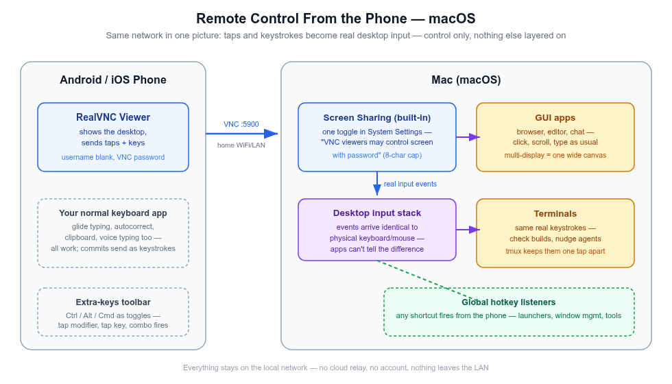
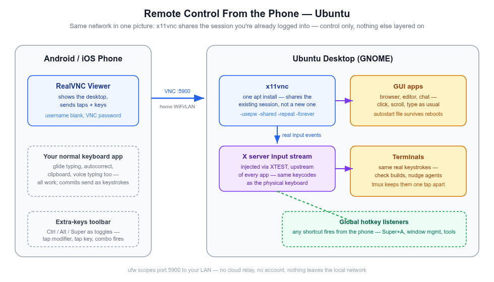
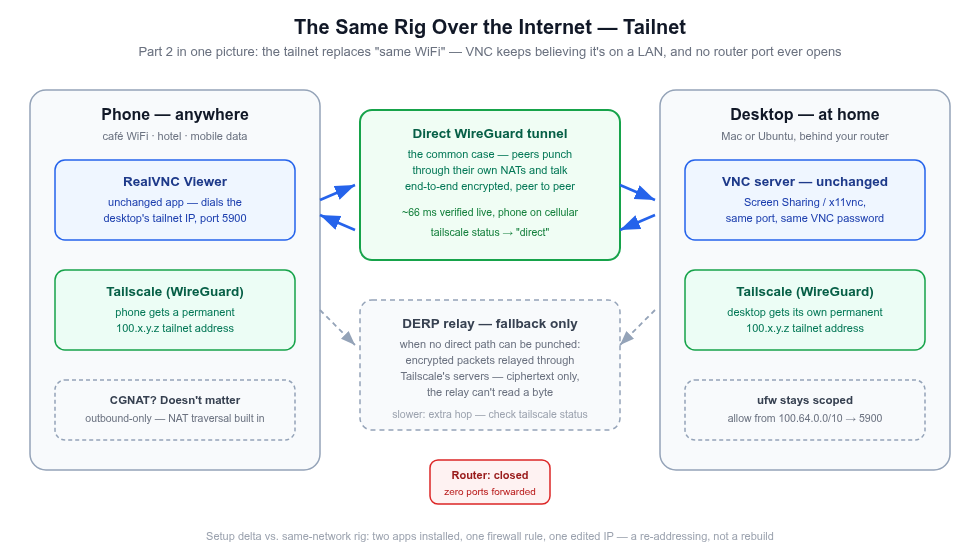
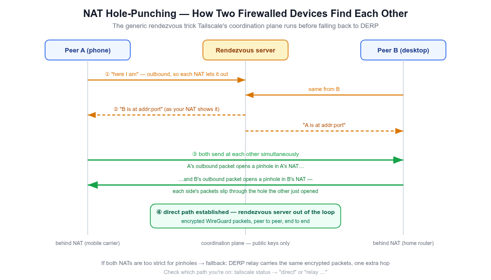

# Your Desk in Your Pocket — Free Remote Control for Mac & Ubuntu, Same Room or Anywhere on Earth

> The gap between having a thought worth acting on and acting on it shouldn't cost a walk to the desk — or a flight home.

A build's running upstairs. You're on the couch, mid-rest, and a thought worth acting on shows up: reply to that message, nudge the agent that's mid-task, check whether the tests actually passed. Later that week you're in a coffee shop, or on a train, and the same thought shows up — except now the machine is kilometers away and the "walk to the desk" is a commute.

None of that needs you to be physically at a keyboard. It needs a phone, pointed at a machine that's already on. That's the actual shape of this setup once it's running: **occasional, light touches on real work, from wherever you already are** — the couch, bed, a café on mobile data. Not a full workstation replacement, not "work from anywhere all day." Just the ability to act on a thought without the gap costing you a walk every time.

This post builds it in three parts, each one removing exactly one constraint:

- **Part 1 — Same network.** The phone becomes a real screen + keyboard + mouse for your desktop, over your home WiFi. macOS's built-in Screen Sharing, one `x11vnc` command on Ubuntu, and one VNC client app on the phone. This is the part to set up first; everything else builds on it.
- **Part 2 — Over the internet.** The same rig, working from a coffee shop, a hotel, or the back seat of a cab on mobile data — with nothing exposed to the open internet and nothing added to the bill. A mesh VPN does it, and the setup is a re-addressing, not a rebuild.
- **Part 3 — Deep dive.** What's actually happening on the wire: the protocol a VNC session speaks, why its password stops at 8 characters, why remote taps fire desktop shortcuts when an SSH session can't, and how two devices behind two different routers find each other at all.

**The setup cost is a weekend, once. The payoff doesn't expire.** Everything here is free, and — once wired — needs nothing further from you: no subscription to keep paying, no cloud account to manage. Set it up on a Saturday, and every day after that, the couch is a valid place to get something done — and so is another city.

And if your reason for wanting remote control was "typing paragraphs on a phone is painful" — the phone keyboard's own **voice typing works straight through this rig** (covered in Part 1), so dictation comes along for free without any extra layer.

## Topic flow

Each Part below splits in two: **build it** — read straight through, in order — then **Reference**, where the troubleshooting tables, gotchas, and security notes live. Skip straight to Reference when something breaks; skip it entirely on a first read.

```
PART 1 — SAME NETWORK (set up first)     PART 2 — OVER THE INTERNET          PART 3 — DEEP DIVE (the why)
───────────────────────────────────      ─────────────────────────────       ──────────────────────────────
Why VNC, not SSH                         The port-forward check,             RFB protocol + the 8-char
 ├─ macOS: Screen Sharing (built in)      and why it fails (CGNAT)            password cap
 └─ Ubuntu: x11vnc                       Why raw VNC-over-internet           Why VNC hotkeys fire
Phone client: RealVNC Viewer              is still wrong                       and SSH can't (XTEST)
Driving the desktop: gestures,           Tailscale: what, why, trustworthy   WireGuard, NAT traversal,
 modifiers, tmux cheat sheet             Desktop + phone setup               and DERP
Reference — troubleshooting & security   What changes vs. Part 1 (a table)   Reference — failure-mode map
                                         Reference — security & escape        (symptom → layer → check)
───────────────────────────────────      ─────────────────────────────       ──────────────────────────────
        └──► Read Part 1 to get it running today; Part 2 to take it anywhere;
             Part 3 when something breaks and you want to know why — or you just like knowing.
```

Read Part 1 fully (your own OS's subsection plus the phone skills), then Part 2 when the LAN starts feeling small. Part 3 is optional and self-contained. Skip the other OS wherever you like — each machine's route is independent.

## What it actually looks like

- **Mid-rest, an AI agent needs a nudge.** Tap the phone, type "looks good, continue" — or say it with the keyboard's voice typing — and it lands as a real keypress in the real terminal, same as if you'd walked over and typed it.
- **A build's running, you want to know without getting up.** Pull up the phone, glance at the terminal on the mirrored screen, done. No SSH session to remember, no separate monitoring app.
- **A reply is worth sending now, not in twenty minutes.** Type it from the phone's keyboard — glide typing, autocorrect, clipboard, all of it — into Slack, an email, a commit message.
- **Something needs a click, not a sentence.** Dismiss a dialog, pause a download, check a setting, switch a song — full mouse and keyboard, in your pocket.
- **You're in another city entirely.** Coffee shop WiFi, hotel Ethernet, phone hotspot — the same saved entry in the same app still reaches the machine at home, through an encrypted tunnel, with zero ports opened on your router.

One protocol makes all of it work — **VNC**, served by what your OS already ships (or one free package), driven by one free phone app. How it gets wired — once — is the rest of this post.

---

## The route this post takes

1. **Part 1 — Same network.** Why VNC (not SSH), then per-OS server setup: macOS's built-in Screen Sharing, Ubuntu's `x11vnc`. One phone client — **RealVNC Viewer** — for both. Then the phone-side skills: gestures, modifier keys, typing with your normal mobile keyboard, and a tmux cheat sheet for thumb-friendly terminals.
2. **Part 2 — Over the internet.** Why "just port-forward 5900" is the wrong answer (and often an impossible one), what a mesh VPN actually does, and the Tailscale build that swaps every LAN IP for a permanent private one — the whole Part 1 rig unchanged in shape.
3. **Part 3 — Deep dive.** The RFB protocol and why the VNC password stops at 8 characters, why VNC input triggers global hotkeys when an SSH session can't, and how WireGuard NAT traversal gets two firewalled devices talking.

The one table worth internalizing before anything else — **the same phone app drives both machines**, one saved entry per box:

| The job | Ubuntu machine | macOS machine |
|---|---|---|
| Share + control the screen | x11vnc | built-in Screen Sharing |
| Phone VNC client | **RealVNC Viewer** (Android/iOS) | **RealVNC Viewer** — same app, second entry |
| Address (Part 1) | `<ubuntu-lan-ip>:5900` | `<mac-lan-ip>:5900` |
| Address (Part 2) | tailnet IP, permanent | tailnet IP, permanent |
| Password | the `x11vnc -storepasswd` one | the 8-character VNC password |
| Terminals by keystroke | tmux | tmux — same reasoning, no Mac-specific parts |

Security and license notes for every tool close the post.

---

# Part 1 — Same network: the phone drives the desktop

## Why VNC, and not just SSH

If you've remoted into a machine before, it was probably SSH — and SSH can't do this job. An SSH session drops you into a *new* text shell: it can't show you the desktop you left running, can't click anything, can't type into the apps already open, and can't fire global hotkeys. It's a parallel door into the basement.

VNC is a mirror plus a hand: the phone sees the **actual desktop** — your apps, your windows, exactly as you left them — and every tap and keystroke is injected as a **real input event**, indistinguishable to every app and every hotkey listener from sitting at the keyboard. That single property is what makes the whole rig work: switch apps, run shortcuts, check a build, drag a slider — all with the same mechanism you'd use in person.

Both halves are standard: macOS and Ubuntu can each serve VNC with built-in or one-command-free tooling, and any standards-compliant client can connect. That's why one phone app is enough for both machines.

## The macOS machine: Screen Sharing, already installed

The Mac ships with the VNC server — this is mostly a matter of turning it on. This route was shaken down live on a Sequoia Mac with an Android phone in hand: Screen Sharing answering on port 5900, a phone client driving the screen, everything below marked "tested live" came off that machine.

<div align="center">
  
  <br/>
  <sub>The macOS control path — the server is already installed; one toggle and a VNC password turn it on.</sub>
</div>

1. **System Settings → General → Sharing → Screen Sharing** — flip it on. Keep it plain Screen Sharing: if **Remote Management** is the enabled one instead, legacy-VNC clients get served the login window even while you're logged in, and typing into that over VNC drops focus (tested live — Remote Management off, Screen Sharing on, and the phone landed straight on the desktop; logging in over VNC works too, for the after-reboot case).
2. For a *third-party* client (RealVNC Viewer — anything not Apple's own Screen Sharing app), click the ⓘ next to Screen Sharing and enable **"VNC viewers may control screen with password"**, then set that password. Without it, macOS expects Apple's own authentication handshake and most phone clients fail to connect at all.
3. Connect from the phone to `<mac-lan-ip>:5900`, password = the VNC password from step 2. Same separate-from-WiFi-password logic as below on Ubuntu — it controls who can drive the Mac, not who can join the network.

Or skip the GUI for step 1: `sudo launchctl load -w /System/Library/LaunchDaemons/com.apple.screensharing.plist` — but step 2 has no equally clean CLI path, so most of this toggle lives in System Settings either way. There's also a CLI for the whole thing (`.../ARDAgent.app/Contents/Resources/kickstart -activate -configure -access -on -clientopts -setvnclegacy -vnclegacy yes -setvncpw <pw> -restart -agent -privs -all`), but on Sequoia it sets privileges and the password while **refusing to actually open the service** — it prints *"Screen Sharing or Remote Management must be enabled from System Settings or via MDM"* and the port stays closed until you flip the GUI toggle once. Count on ending in System Settings regardless.

Three auth behaviors worth knowing before a phone client rejects a correct-looking password:

- **The VNC password is effectively 8 characters.** System Settings happily accepts a longer one, but legacy VNC auth is a [DES challenge-response](https://datatracker.ietf.org/doc/html/rfc6143#section-7.2.2) capped at 8 — if the client keeps rejecting the password you set, the first 8 characters are the password. (Part 3 opens up the mechanism, for the curious.)
- **macOS serves two auth types side by side**: Mac account auth (a username + your Mac login password, Apple's ARD-style handshake) *and* the legacy VNC password. A client looping on "enter VNC credentials" is often answering the wrong one — the server offers both, and which one you get depends on the client's negotiation. Note Screen Sharing and Remote Management each have their **own** VNC-password setting; only the one for the service you actually enabled is consulted.
- **RealVNC Viewer connects with the plain VNC password, username blank** — tested live. That's the configuration this post standardizes on, and it's why the same app works against the Ubuntu box too.

What you *don't* need, relative to Ubuntu below: no display-number hunting, no Xauthority chase, no autostart file, no reconnect/key-repeat flag tuning — Apple's server handles those correctly by default. And one genuine upgrade: Screen Sharing is a system daemon that serves the **login window** too, so after a reboot you can VNC in and log in remotely — the Ubuntu route can't do that (x11vnc only starts after a graphical login).

## The Ubuntu machine: x11vnc

x11vnc shares and drives the **existing** desktop session — the one you're actually logged into, with your apps already open — rather than spawning a fresh virtual one. It's in the standard repos:

<div align="center">
  
  <br/>
  <sub>The Ubuntu control path — x11vnc turns the desktop session you're already logged into into a VNC server.</sub>
</div>

```bash
sudo apt install -y x11vnc tmux
```

(`tmux` rides along here because it's part of making terminals phone-drivable — see the cheat sheet further down. Ubuntu ships it on some images but not others.)

### Run it

```bash
tmux new -s vnc
x11vnc -display :<real-display-number> -auth guess -usepw -shared -repeat -forever
```

Find `<real-display-number>` with `who` (look for `<user>  :N  <date>`) from a terminal that's actually part of the graphical session.

- First run is interactive: no password file exists yet, so `-usepw` prompts you to set one. Always do this — never run x11vnc without auth.
- `-forever` keeps listening after the first client disconnects.
- **`-shared` matters.** Without it, x11vnc allows exactly one client at a time — a stale half-open connection from a WiFi blip or app switch makes every reconnect fail with `refusing new client ... Not shared & existing client` until you restart the server. With it, reconnects just work.
- **`-repeat` matters too.** x11vnc turns *off* the X server's key autorepeat by default while a client keyboard is active — its log even says so (`active keyboard: turning X autorepeat off`). Without this flag, holding an arrow key (or any key) from the phone does nothing beyond the first tap — no repeat, one character per touch, forever. `-repeat` keeps autorepeat on so a held key behaves like a physical one. Only drop it if your specific client does its own repeat and you start seeing doubled characters.
- **`-auth guess`** (x11vnc ≥0.9.9) finds the right Xauthority cookie itself. Modern GNOME/gdm sessions often keep it at `/run/user/<uid>/gdm/Xauthority`, not the default `~/.Xauthority` — hardcoding the default path is a common source of a silent auth failure.
- There's no `-localhost=no` flag — that's not real; `-localhost` (no value) *restricts* to loopback, and passing `=no` gets rejected as unrecognized. Allowing LAN connections is the default when you omit the flag entirely.
- Scope the port to your LAN: `sudo ufw allow from <your-subnet> to any port 5900` — never expose it to the internet. If you've never touched `ufw` before and only use SSH *outbound* to other machines (not inbound into this one), you don't need `sudo ufw allow OpenSSH` — that rule only matters for a device that accepts incoming SSH connections; ufw's default policy already allows all outbound traffic regardless of any inbound rule you add.

**What the VNC password actually is** — easy to conflate with the WiFi password, but it's a separate thing: it's set by you via `x11vnc -storepasswd` (not your router), it controls who can drive *this* desktop once already on the network (not who can join the network), and it doesn't change when you switch WiFi networks — phone and desktop just need to be on the *same* network at connection time, whichever one that is. Like the Mac's, it's capped at 8 effective characters by the classic VNC auth protocol.

### Persist across reboots — the autostart file

There's no separate script to write here — GNOME (and most desktops) autostarts anything dropped as a `.desktop` file in `~/.config/autostart/`, once per graphical login, which is the earliest point a display actually exists to serve. Set the password once first (`x11vnc -storepasswd`), then create this file:

```ini
# ~/.config/autostart/x11vnc.desktop
[Desktop Entry]
Type=Application
Name=x11vnc
Exec=x11vnc -display :<N> -auth guess -rfbauth /home/<you>/.vnc/passwd -shared -repeat -forever
X-GNOME-Autostart-enabled=true
```

`<N>` is your real display number from `who` (see above); `<you>` is your Linux username — `Exec=` needs the absolute path, `~` isn't expanded there. `X-GNOME-Autostart-enabled=true` is what actually flips it on; a `.desktop` file without that line sits inert. Verify it's live any time with `pgrep -af x11vnc` after a fresh login — no separate "did it start" step needed beyond that.

One consequence of the after-login design: if the machine reboots (or loses power) and sits at a lock screen, nothing's listening yet — someone has to log in locally once before the phone can reach it. The Mac's Screen Sharing doesn't have that limitation; this is the one thing it does better.

## The phone client: RealVNC Viewer (one app, both machines)

**[RealVNC Viewer](https://www.realvnc.com/en/connect/download/viewer/)** (free on Android and iOS) is the client this post standardizes on, for one reason that matters more than any feature list: **it speaks the classic VNC authentication that both servers above serve**, so the same app — the same UI, the same gestures, the same saved-entries list — drives the Mac and the Ubuntu box. Two entries, one muscle memory. On the Mac side that's live-tested end to end; against x11vnc it's the same standard handshake (the one `x11vnc -storepasswd` sets), so it connects the same way.

Worth knowing where the line sits: RealVNC the *company* sells a cloud-connected ecosystem (account, device list, "connect from anywhere"). None of that is needed here — the Viewer app connects **directly**, machine-to-machine over your LAN, with no account and nothing routed through anyone's cloud. Don't sign in; just add an address and connect. The same company's download page markets a comparison table implying classic direct connections to third-party servers are unsupported — the Mac test above (direct LAN, Apple's server, plain VNC password) says otherwise, and that's the configuration this post uses. (On iOS, RealVNC's VNC Viewer app is the equivalent client for either machine.)

**Try it now — first win.** Server on (either machine), Viewer installed: add an entry with the machine's LAN IP and port `5900`, connect, enter the VNC password with the username blank. Your desktop should fill the phone's screen, and a tap anywhere should move the real cursor. If it does, the rig works — everything left in this part is technique. If it doesn't, the Reference section's troubleshooting tables are ordered by likelihood; start at the top.

## Driving the desktop from the phone

Everything here is VNC-client behavior, not OS behavior — it works the same against the Ubuntu machine and the Mac. The connection details, in one place:

| | Ubuntu machine | macOS machine |
|---|---|---|
| Client | **RealVNC Viewer** | **RealVNC Viewer** — same app |
| Address | `<ubuntu-lan-ip>:5900` | `<mac-lan-ip>:5900` |
| Password | the `x11vnc -storepasswd` one | the 8-character VNC password |

Both passwords are separate from your WiFi password and unaffected by switching networks — phone and desktop just need to be on the *same* network at connection time, whichever one that is.

VNC just mirrors real mouse and keyboard input — there's no VNC-specific "select an app" step, it behaves exactly like sitting at the desktop:

- **Focus a window**: tap it directly in the mirrored screen — a real click.
- **Type**: tap the field to focus it, tap the keyboard icon to bring up the phone's soft keyboard. Everything typed sends as real keystrokes — no special "VNC mode."
- **Modifier combos** (Ctrl+key, Alt+key, Cmd+key): use the client's extra-keys toolbar, the row of dedicated `Ctrl`/`Alt`/`Shift`/`Esc`/`Tab` buttons you tap to hold, then tap the other key.

### Switching between applications

Three ways, in the order actually worth trying on a phone:

- **The desktop's hot corner (no keys needed at all)**: on GNOME, tap the very top-left pixel of the mirrored screen, just under where "Activities" would show — the overview opens with every open window as a thumbnail; tap the one you want. macOS has the same feature: System Settings → Desktop & Dock → Hot Corner (e.g. top-left → Mission Control). This is the one to reach for first: it needs no modifier key, works even if your VNC client's extra-keys toolbar doesn't expose `Tab` (some builds don't), and is one tap instead of a hold-plus-tap combo.
- **Alt+Tab / Cmd+Tab, if your client has both keys**: hold `Alt` (or `Cmd` on the Mac) and tap `Tab` from the extra-keys toolbar to cycle, same as at a physical keyboard — same toggle-then-tap mechanism as the multi-key shortcuts below. Falls back to the hot corner if `Tab` isn't in your toolbar's default row.
- **Between terminals/shells specifically**: don't alt-tab or hot-corner between separate GUI terminal windows at all if you can help it — hunting for the right thumbnail among several is more taps than it's worth. Keep everything inside one tmux session instead and switch panes/windows by keystroke (`Ctrl+b` + number, see the cheat sheet below). Works identically on the Mac.

All three are the same underlying trick: VNC sends real input events, so every desktop-level shortcut or gesture you'd use at the keyboard works identically from the phone.

### Multi-key shortcuts, e.g. `Super+A`

A touchscreen can't physically hold two keys down at once, so the extra-keys toolbar buttons don't work like a normal press-and-release key — they're **toggles**. Tapping a modifier arms it (it stays visually pressed/highlighted); tapping the next key sends both together as one combo, and the modifier releases automatically right after.

To fire `Super+A` (or any modifier combo — `Ctrl+Shift+T`, `Alt+F4`, `Cmd+Q` on the Mac):

1. Open the extra-keys toolbar (the keyboard/gear icon in the client's in-session toolbar).
2. Tap the **Super**/**Win**/**Cmd** key icon (labeled `Super`, `Win`, `Cmd`, or shown as a ⊞-style icon depending on client) — it stays highlighted, armed.
3. Tap `A` on the soft keyboard — the combo fires as `Super+A`, and the modifier releases on its own.

Same mechanism for stacking more than one modifier — tap `Ctrl`, tap `Shift`, then tap the letter key, and all three go through together. If the client's default extra-keys row doesn't show a Super/Win button, check its settings for a toolbar/keys customization option before assuming the key isn't supported — most VNC clients that expose Ctrl/Alt as toggles expose Super the same way.

### Right-click, and where Enter/Backspace live

**Right-click** in RealVNC Viewer: **tap with two fingers at once**. One finger tap = left click, two fingers = right, three = middle — and the click lands where the mouse cursor sits, not where your fingers touch (default mode drags the cursor with one finger, offset so you can see it). Two other gestures from the same official table worth knowing: two fingers dragged up/down = scroll, and **double-tap + hold + drag** = select text or drag-and-drop. ([RealVNC's gesture reference](https://help.realvnc.com/hc/en-us/articles/360018541231-Using-RealVNC-Viewer-for-Mobile-to-control-a-remote-device).) If you're doing anything right-click-heavy, a **Bluetooth mouse** pairs to the phone and its actual right button just works.

**Enter and Backspace** — not special VNC buttons, just the ordinary keys on Android's own soft keyboard, same as any other key you tap. The extra-keys toolbar exists specifically for keys a *normal* mobile keyboard doesn't have — Ctrl, Alt, Esc, Tab, arrows.

### The everyday actions: new tab, Ctrl+C, close

The four things you'll do a hundred times, in one place. Modifier mechanics are the toggles from the multi-key section above — tap the modifier, it arms, tap the key, the combo fires:

| Everyday action | How, from the phone |
|---|---|
| **Open a new terminal tab** on the desktop | Same combo as at the desk: `Ctrl+Shift+T` (Ubuntu's GNOME Terminal) — tap Ctrl, tap Shift, tap T. Mac Terminal: `Cmd+T` (Super toggle, then T). Inside tmux it's one modifier instead: `Ctrl+b` then `c` — a new window, the "tab" that survives disconnects |
| **Right-click** | Tap with two fingers at once (section above) |
| **Stop a running command (`Ctrl+C`)** | Tap **Ctrl** in the extra-keys row (it arms, stays highlighted), tap `c` → sends `Ctrl+C`, which **interrupts the foreground process**. It closes nothing — not the tab, not the session |
| **Close the tab / end the shell** | `exit`, or `Ctrl+D` (Ctrl toggle + `d`) — the thing people wrongly reach for `Ctrl+C` to do. Different key, different job |
| **Done — end the phone session** | Just disconnect from the toolbar; everything keeps running on the desktop. In tmux, detach first — `Ctrl+b` then `d` — and the next session's `tmux attach` lands exactly where you left off |

The pair worth memorizing: **`Ctrl+C` stops a program, `Ctrl+D` ends the shell.** C is "interrupt what's running," D is "I'm leaving" — and neither ever touches the VNC session itself. (Running bVNC against the Ubuntu box instead of RealVNC Viewer? Same plays — its Ctrl toggle arms the same way, and its right-click is a hold-then-second-finger-tap gesture.)

More of the everyday, grouped by who's holding the phone — every row uses the same three mechanics already covered (modifier toggles, the extra-keys row, touch gestures), just combined:

**If you're developing:**

| Action | From the phone |
|---|---|
| Copy / paste in a terminal | Double-tap, hold the second tap, drag to select, then `Ctrl+Shift+C` / `Ctrl+Shift+V` — the terminal is the one app that needs the Shift; everywhere else plain `Ctrl+C`/`Ctrl+V` |
| Reopen a browser tab you closed by accident | `Ctrl+Shift+T` — the same three-tap combo as "new terminal tab," but in the browser it resurrects the dead tab |
| New / close browser tab | `Ctrl+T` / `Ctrl+W` |
| Jump to the address bar (or type a file path) | `Ctrl+L` — browser address bar, and GNOME Terminal's "type a path" prompt |
| Run the last command again | `↑` from the extra-keys row, then Enter — no modifier needed |
| Search shell history by fragment | `Ctrl+R`, type a fragment of the command, Enter |
| Close the focused app window | `Alt+F4` (Linux) / `Cmd+Q` (Mac) |
| Lock the screen when you walk away | `Super+L` (GNOME) / `Ctrl+Cmd+Q` (Mac) — client stays connected |

**If you're exploring the machine:**

| Action | From the phone |
|---|---|
| Middle-click paste (Linux's best-kept secret) | Tap with three fingers at once — RealVNC's native middle click (or a Bluetooth mouse's middle button) |
| Zoom the remote screen | Pinch — client-side zoom, sharp on a phone's high-DPI panel, touches nothing on the desktop |
| Scroll a terminal | Two-finger swipe (with tmux mouse mode on) |
| Move a window | Touch mode: drag its title bar like a real finger would |
| Dismiss a dialog / cancel a popup | `Esc` from the extra-keys row — one tap, no modifiers |

**If you're just using the computer:**

| Action | From the phone |
|---|---|
| Passwords | The phone keyboard's **autofill** — your password manager fills straight into the desktop login field, nothing to type |
| Emoji into a desktop chat | The phone keyboard's own emoji panel — arrives as real keystrokes, no desktop setup |
| Play / pause video | `Space` — a key the phone keyboard already has |
| Long text (URLs, messages) | Copy on the phone, paste with the keyboard's paste button — or dictate it (mic button, section below) |

That's the quiet point of the whole rig: if the phone's keyboard can produce it, the desktop receives it — and everything else is one armed modifier away.

### Editing text in a terminal

Faster than arrow-key nudging on touch, works on both machines: standard readline bindings work over VNC exactly like they do locally — `Ctrl+A`/`Ctrl+E` jump to line start/end, `Ctrl+W` deletes the last word, `Ctrl+U` clears back to cursor.

### Typing on the desktop with your phone keyboard — including voice typing

The soft keyboard that appears when you tap the keyboard icon is your phone's **normal keyboard app** — whatever you already use, nothing new installed. Everything the keyboard app is good at carries over, because VNC just receives whatever the keyboard commits and sends it as real keystrokes:

- **Glide typing / swipe input** — drag through the letters, same as texting.
- **Autocorrect and next-word prediction** — actively helpful in chat and email apps on the desktop.
- **Long-press for numbers and symbols** — long-press the top-row letters, same as anywhere.
- **Clipboard** — copy on the phone (from anywhere), paste into the desktop app with the keyboard's paste button. Copy on the desktop, read it on the phone.
- **Multilingual typing** — your keyboard's per-language or multi-language modes work as usual; typing Bangla or any other language into a desktop app needs no desktop-side setup beyond the app accepting text.
- **One-handed / floating mode** — shrink the keyboard to a thumb-zone corner for couch use.
- **Voice typing — the built-in speech-to-text** (tested live): any keyboard with a mic button (Gboard, SwiftKey, Samsung Keyboard) works over VNC. Tap the mic, speak, and the transcribed text arrives as committed keystrokes in whatever desktop app is focused — a commit message, a Slack reply, a doc — no extra rig, no second app, no setup. The honest trade-off: nearly every phone keyboard dictates through its maker's cloud speech service (Google/Microsoft/Samsung servers do the transcribing), so it's "free and zero-setup," not "offline." For most people, most dictation, that's the right trade — just know which way it cuts before dictating anything sensitive.

Two cautions from the terminal-shaped parts of this rig:

- **Autocorrect + terminals don't mix.** Suggestions will happily "fix" flags, paths, and `git` subcommands. Your keyboard app's settings (its own toolbar, or Settings → System → Languages & input) usually offer a suggestions/autocorrect toggle — disable it when a terminal is focused, or type flags carefully and proofread before Enter. There's no desktop-side guard; the keystrokes arrive already "corrected."
- **Voice typing lands wherever the cursor is.** Same rule as autocorrect, stronger stakes: check the focused window before you speak, because the words land as keystrokes the instant the keyboard commits them.

### tmux, if you've never used it

tmux is the answer to "alt-tabbing between GUI terminal windows by touch is fiddly" — keep everything in one terminal window, switch by keystroke. Everything below starts with the prefix `Ctrl+b`, released, *then* the next key — it's tapped in sequence, not held together.

| Want to... | Keys |
|---|---|
| New named session | `tmux new -s <name>` |
| Reattach later | `tmux attach -t <name>` |
| List sessions | `tmux ls` |
| **Detach** (leave running) | `Ctrl+b` then `d` |
| New window | `Ctrl+b` then `c` |
| Switch to window N | `Ctrl+b` then `<number>` |
| Next / previous window | `Ctrl+b` then `n` / `p` |
| Split pane | `Ctrl+b` then `%` (vertical) / `"` (horizontal) |
| **Close a pane/window** | `exit` or `Ctrl+d` — an ordinary shell command, not a tmux shortcut |
| **Kill a whole session** | `tmux kill-session -t <name>` |
| Scroll back | `Ctrl+b` then `[`, arrow keys, `q`/`Esc` to exit |

The thing that trips people up: there's no tmux-specific "close" shortcut. You close a pane exactly like you'd close a normal terminal. `Ctrl+b`-prefixed shortcuts only *navigate* — they never end a session.

Scrolling by typing `Ctrl+b [` on a touch keyboard is annoying — turn on mouse mode instead so the VNC client's own two-finger swipe scrolls the pane directly:

```bash
tmux set -g mouse on          # or add "set -g mouse on" to ~/.tmux.conf permanently
```

### A note on global hotkeys

Any app that listens for a global hotkey (a launcher, a window manager action, a screenshot tool, an app-specific shortcut utility) can be triggered from the phone — VNC delivers the key to the desktop's real input stack, and the listener fires. The practical rule for *which* hotkey to pick for phone use: a **single key with no modifier** (`End`, `Insert`, `Home`, `Page Up/Down`) beats any combo, because a combo means arming a toggle button and then tapping a second key — two taps instead of one, every single time.

## Part 1 — Reference: troubleshooting & security

Everything above gets the phone driving either machine. What follows is what to check when a step doesn't behave, plus the security notes for Part 1 — read now, or bookmark it for later.

### If the phone client won't connect (macOS)

Every failure below was either hit live on this rig or traced to a documented server behavior — check symptoms in order:

| Symptom | Cause | Fix |
|---|---|---|
| Client loops on "enter VNC credentials" with a password you know is right | One of the two auth types being served (Mac-account vs VNC-password) is being answered with the wrong credential — or the password is longer than 8 characters and got silently truncated (DES cap) | Enter the **VNC password**, username blank; if longer than 8 chars, the first 8 are the real password |
| Nothing can connect at all | "VNC viewers may control screen with password" never enabled — macOS is waiting for Apple's own auth | Enable it via the ⓘ next to Screen Sharing (step 2 in the macOS setup above), set the password, retry |
| Connects but lands on the **login window** instead of your desktop; typing into it drops focus | **Remote Management** is the enabled service, not plain Screen Sharing — legacy-VNC clients get served the login window under Remote Management (tested live) | System Settings → General → Sharing → disable Remote Management, enable **Screen Sharing**; reconnect and you land on the desktop |
| Worked yesterday, won't connect today (after a reboot) | The Mac's LAN IP re-leased to a different address | Recheck with `ipconfig getifaddr en0`, update the saved entry — or set a DHCP reservation in the router |
| **Times out** — "but I'm on the same WiFi" | Traffic never arrived: phone silently off the LAN, router guest/AP isolation, or a VPN on the phone — not a Mac-side failure | Check the phone's WiFi details page (SSID + gateway match the router); watch `log stream --predicate 'process == "screensharingd"' --info` while tapping Connect — nothing logged = it never arrived. **"Refused"** = arrived, nothing listening → the server rows above |
| VNC view freezes/blank after the Mac sits idle | The Mac auto-locked; the lock screen's password field fights phone-client keystrokes for focus | Unlock once at the Mac's keyboard; for couch sessions set Lock Screen → "Require password…" to a long interval |
| Client rejects the correct password, non-RealVNC app | Not every Android/iOS client can complete classic VNC auth against a Mac — some negotiate Apple's DH handshake and fail it with no override | Standardize on **RealVNC Viewer** (tested live against a Mac); verify the two auth-type behaviors above before blaming the password |

Two closing notes on the macOS side. First, much of the "Sequoia is rough on third-party VNC clients" chatter traces back to the Remote Management behavior in the table above, not the OS itself — with plain Screen Sharing and the VNC password, RealVNC Viewer connected cleanly here through reboots and IP changes. Reports of screen-recording/share permissions demanding roughly-monthly reauthorization do exist; if a client won't connect, first try Apple's own Screen Sharing app from another Mac to isolate server-toggle vs client. Second, **firewall**: macOS's application firewall allows the signed system Screen Sharing service through by default — no `ufw`-style rule to add. The LAN-only hygiene advice still applies: don't port-forward 5900 out of your router, ever. Third: the timeout-vs-refused split from the Ubuntu section below applies to the Mac unchanged — "refused" is the server rows in this table, "timed out" is the phone's network path — and the Mac's ten-second instrument is `log stream --predicate 'process == "screensharingd"' --info`, watched live while you tap Connect (it's the unified-log equivalent of Ubuntu's `journalctl` watch: silence = the traffic never arrived).

Session realities (tested across a reboot): everything server-side comes back after a restart, but the Mac's LAN IP can re-lease (ours changed on one reboot — if the saved phone entry stops connecting, recheck with `ipconfig getifaddr en0`, or give the Mac a DHCP reservation in the router). And multiple displays arrive as one wide canvas — pinch out in the client and pan; VNC has no per-monitor concept.

### If the phone won't connect (Ubuntu)

**"Connection refused"** — port 5900 has nothing listening, x11vnc either never started or died on launch:

```bash
pgrep -af x11vnc     # nothing = not running
ss -tln | grep 5900  # nothing = nothing listening
```

If it's not running, re-run it and actually read what it prints. x11vnc fails fast on a bad flag or auth error and drops straight back to a clean-looking shell prompt — nothing visually distinguishes "crashed instantly" from "idle and fine" unless you read the output (`tmux capture-pane -p -t <session>` if it's not currently on screen). The two causes that hit here:

- **Wrong display number.** `-display :0` failed with an Xauthority error on a session that was actually `:1`. Check with `who` (`<user>  :1  <date>` — the number after the colon) from a terminal that's part of the actual graphical session, not an unrelated SSH shell.
- **Xauthority not at the default path.** Modern GNOME/gdm often keeps it at `/run/user/<uid>/gdm/Xauthority` instead of `~/.Xauthority`. `-auth guess` finds it automatically; the explicit fallback is `-auth /run/user/<uid>/gdm/Xauthority`.

If it's still refused after that: check `ufw status verbose` actually shows the port-5900 rule as active, and re-check the desktop's LAN IP hasn't drifted from a DHCP re-lease. The one-glance version of that check is `hostname -I` — every IPv4 on one line; ignore the `172.x.x.x` ones (Docker and virtual-machine bridges) and read the `192.168.x.x` or `10.x.x.x` one.

**A timeout is a different animal than "refused" — and the phone's exact error text tells you which you have.** "Refused" means the phone's packets *reached* the desk and nothing was listening — the server-side territory above. "Timed out" means the packets never arrived at all, which is almost always phone-side or network-side:

- **The phone isn't actually on the same network.** Check the phone's WiFi details page, not just the icon: the SSID must match, and the *gateway* should be your router's LAN address (ours is `192.168.68.1`). A mismatched gateway — or a silent fallback to mobile data — puts the phone on a different path entirely.
- **Guest network or AP/client isolation.** Many routers isolate guests (and sometimes a separate 2.4 GHz network) from main-network devices: both phones connect to "the WiFi," neither can see the other. If the router admin panel calls it AP isolation, client isolation, or guest access, that's the switch to check.
- **A VPN running on the phone** can intercept or route away LAN traffic — turn it off for the LAN path (you only need it for the Part 2 path).

**The instrument that settles all of it in ten seconds** — watch the server log live while you tap Connect on the phone:

```bash
journalctl --user -f | grep -i x11vnc
```

Nothing appears while the phone churns = traffic isn't arriving — work the list above. `Got connection from client <ip>` followed by an auth failure = the network is fine, it's the password. A connection that appears and instantly drops = server-side — read what it prints (the `-shared` lockout in the flags section above looks exactly like this).

### Part 1 security recap

- **Keep port 5900 LAN-scoped.** `ufw allow from <your-subnet> to any port 5900` on Ubuntu; on macOS the firewall already permits Screen Sharing — and on *both*, the rule that matters is at the router: never port-forward 5900 to the internet. If you ever need in from outside your LAN, that's a VPN job (Part 2 builds exactly that), not a port-forward job.
- **VNC passwords are weak by protocol.** Classic VNC auth is a DES challenge-response **capped at 8 characters** — both servers in this post use it. On a firewalled home LAN that's an acceptable trade; anywhere shared, tunnel VNC through SSH or use x11vnc's TLS/VeNCrypt options.
- **No cloud in the control path.** RealVNC Viewer connects direct, machine-to-machine; nothing in Part 1 routes through or requires anyone's servers.

That's the whole control rig: the phone can see and drive either machine, from anywhere in the house. One constraint remains — phone and desktop must share a network. Part 2 removes it.

---

# Part 2 — Over the internet: the same rig, anywhere

> *"Wait — this only works on my WiFi. What if I'm at a coffee shop? What if the desktop is at home and I'm not?"*

That's the question Part 1 leaves hanging. This part answers it: same phone, same desktop, same free tools — working from a coffee shop, a hotel room, or the back seat of a cab on mobile data, with nothing exposed to the open internet and nothing added to the bill.

## First, the check most people skip: can you even port-forward?

The traditional answer to "reach my home machine from outside" is: open the router's admin panel, forward port 5900 to the desktop, point the phone at your public IP. Before considering that path, run a five-minute check — because on a large share of modern connections it's dead on arrival:

1. Open the router admin panel (usually `192.168.1.1` or `192.168.0.1` — your gateway address) and note its **WAN IP**.
2. From the desktop, ask the internet what IP it sees: `curl ifconfig.me`.
3. Compare. **Same address** → your connection has a real public IP; port-forwarding is at least *possible*. **Different address**, or the router's WAN IP somewhere in `100.64.0.0`–`100.127.255.255` → you're behind [**CGNAT**](https://datatracker.ietf.org/doc/html/rfc6598) (Carrier-Grade NAT): your router's "public" side is itself a private address inside your ISP's shared NAT layer. Inbound port-forwards simply won't route to you — no router configuration changes that, because the NAT layer that drops the traffic belongs to the ISP, not you.

CGNAT is now standard on many fiber and 5G home connections, which is exactly why "just forward the port" advice from 2010 blog posts fails silently today: everything on your side is configured correctly, and the packets still never arrive.

## Even if you can port-forward, don't — not raw VNC

Suppose the check comes back clean and you *do* have a real public IP. Port 5900 open to the whole internet is still the wrong move:

- **Classic VNC auth is a single shared password** — no usernames, no rate limiting, no second factor, no lockout. A 1990s-era protocol assumption wearing modern exposure.
- **5900 is a top-tier scanning target.** Internet-wide scanners map the whole IPv4 space continuously; an open VNC port gets probed within hours. Every probe is a password-guess against an 8-character-effective secret (Part 3 explains the cap).
- **One password = one blast radius.** The VNC password doesn't just "view the screen" — it drives the desktop. A correct guess is a full remote session, as if the attacker sat down at your keyboard.

So the real goal was never "forward port 5900." It's this:

> **Put the phone and the desktop on the same private network no matter where either of them physically is — and let VNC keep believing it's on a LAN, exactly like Part 1.**

## The candidate approaches

| Approach | Setup effort | Ongoing cost | Survives CGNAT | Exposes anything raw to the internet |
|---|---|---|---|---|
| **Tailscale (mesh VPN)** | Low — install, log in, done | Free (personal plan) | Yes — NAT traversal built in, falls back to encrypted relay | No — nothing public-facing, no opened router ports |
| WireGuard, self-hosted rendezvous | Medium-high — you run a reachable relay yourself | Free if you own a suitable always-on box; else a cheap VPS | Only if the relay has a real public IP | The relay host does |
| SSH reverse tunnel to a VPS | Medium | ~$4–6/mo VPS or a free-tier instance | Yes — desktop initiates outbound | The VPS's SSH port (harden it) |
| Cloudflare Tunnel | Low-medium | Free tier | Yes — `cloudflared` runs outbound | No inbound port, but traffic transits Cloudflare's edge |
| Port forward + DDNS | Low *if* CGNAT check passes | Free | **No** — the one CGNAT kills outright | Yes, directly — the whole point of the approach |

The rest of this part builds the first row. The alternatives get a short honest treatment in the Reference section below ("Escape hatches") — worth knowing even if you never need them.

## Tailscale: what it is and why it fits

Tailscale is a **mesh VPN built on WireGuard**. You install it on each device, log them into the same account (a "tailnet"), and every device gets a stable private address in the `100.x.y.z` range. That address doesn't change when the device moves networks — laptop on café WiFi, phone on mobile data, desktop at home: same tailnet IPs, as if they were all plugged into one switch in your living room.

The properties that matter for this rig:

- **NAT traversal is handled for you.** Tailscale tries to establish a direct peer-to-peer WireGuard tunnel first (even through NAT layers); when no direct path can be punched — double-NAT on both ends, strict firewalls — it transparently relays through **DERP servers**, Tailscale's encrypted relays. Relayed traffic is still end-to-end encrypted; the relay carries ciphertext it cannot read.
- **Nothing is publicly exposed.** No router ports open, no public IP needed, inbound scanning finds nothing. The desktop's VNC port stays reachable only from inside the tailnet.
- **The protocols don't change.** VNC on 5900, same password, same client app — the rig's software never learns a VPN exists. This is a networking-layer swap; Part 1's setup survives untouched.

**The honest trade-off:** the LAN-only rig was "no cloud dependency" in the strictest sense. Tailscale adds a third-party *coordination* service — its control plane handles identity and connection setup. In the common direct-connection case, no VNC pixels ever touch Tailscale's servers; in the relay-fallback case their servers carry them, encrypted, unreadable in transit. If that trade-off ever stops being acceptable, [Headscale](https://github.com/juanfont/headscale) — the self-hosted, open-source control-plane replacement — is a documented exit that keeps everything else identical.

<div align="center">
  
  <br/>
  <sub>Part 2 in one picture: the tailnet replaces "same WiFi" — VNC keeps believing it's on a LAN.</sub>
</div>

### Is Tailscale safe to trust?

This deserves its own answer, not a hand-wave — the rig's VNC password would be one tailnet membership away from the desktop. The case, from [Tailscale's own security documentation](https://tailscale.com/security) and its public record:

- **The crypto is WireGuard's, not a home-rolled protocol.** Peer-reviewed, formally verified primitives (Curve25519 key exchange, ChaCha20-Poly1305); traffic is end-to-end encrypted between *your two devices only*. Private keys never leave the device they belong to — the coordination server only ever exchanges public keys, so neither Tailscale Inc nor their relays can decrypt what flows between your phone and desktop. Relay fallback carries ciphertext, by construction.
- **The parts that touch your data are open source.** Every client (Linux, macOS, Android, iOS, Windows) and even the DERP relay server code are on GitHub — auditable and forkable. The closed piece is the coordination/control plane, which sees metadata (which nodes exist, who connects to whom), never payloads.
- **Professionally audited, repeatedly.** Recurring third-party security reviews by [Latacora](https://www.latacora.com/), SOC 2 Type II certified, public security bulletins when issues surface — the disclosure pattern you want to see, not silence.
- **Publicly used at serious scale.** Millions of daily users across personal and enterprise tailnets; named customers include Duolingo, Instacart, Retool, Mercury, and Mercari. A two-device hobby rig is the smallest possible use of infrastructure battle-tested far beyond it.
- **The account side is defensible by default.** SSO/MFA on your identity provider, per-device approval, ACLs, and tailnet lock (pin which devices may join). The 8-character VNC password is no longer your outer wall — the tailnet is, and it's a modern one.

The remaining honest caveat is the one from the trade-off above: coordination is a third-party closed service. If that ever bothers you, Headscale swaps it for your own server and nothing else changes.

### On the desktop

Ubuntu and macOS both get the same one-liner or installer:

```bash
# Ubuntu
curl -fsSL https://tailscale.com/install.sh | sh
sudo tailscale up
# prints a login URL → open it → authenticate with your account
tailscale ip -4   # note this: the desktop's permanent 100.x.y.z address
```

macOS: install from the Mac App Store or `brew install --cask tailscale` (or `brew install tailscale` for the CLI variant), log in from the menu-bar app, read the address from the menu bar or `tailscale ip -4`.

Then one firewall change on Ubuntu. The Part 1 rule was LAN-scoped:

```bash
sudo ufw allow from 192.168.68.0/24 to any port 5900 proto tcp   # LAN-only (Part 1)
```

The tailnet version keeps the same *shape* — port 5900 reachable only from a network the phone is on — just against Tailscale's address space:

```bash
sudo ufw allow from 100.64.0.0/10 to any port 5900 proto tcp     # any tailnet device
# or tighter, once the phone's tailnet IP is stable:
sudo ufw allow from 100.<phone-tailnet-ip> to any port 5900 proto tcp
```

(That `100.64.0.0/10` range is CGNAT address space by spec, which is exactly why Tailscale picked it — those addresses are never routable on the public internet, so tailnet traffic can't collide with anything real.)

`x11vnc` itself: **no change.** Same command, same flags, same `~/.vnc/passwd`. macOS Screen Sharing: **no change.** Same toggle, same VNC password. macOS's firewall needs no rule either — it permits Screen Sharing by default no matter which interface the traffic arrives on.

### On the phone

1. Install **Tailscale** from the Play Store, log into the same account, toggle it on. Read the phone's tailnet IP from the app (or the admin console).
2. **RealVNC Viewer**: edit the saved connection, point it at the desktop's **tailnet IP** instead of the LAN IP. Port still 5900. Same VNC password.
3. That's it — no other app on the phone changes.

## What changes, what doesn't

| Piece | Part 1 (LAN) | Part 2 (internet) |
|---|---|---|
| x11vnc / Screen Sharing | running | **unchanged** |
| VNC port | 5900 | **unchanged** |
| VNC password | `~/.vnc/passwd` / Screen Sharing setting | **unchanged** |
| Phone client | RealVNC Viewer | **unchanged app** — new target IP |
| Desktop address phone dials | LAN IP, re-check after router re-leases | **tailnet IP — permanent** |
| ufw rule (Ubuntu) | `allow from 192.168.x.0/24` | `allow from 100.64.0.0/10` (or the phone's tailnet IP) |
| tmux, hotkeys, everything else | working | **unchanged** |

The one-line summary: **Part 2 is a re-addressing, not a rebuild.** Two new apps (Tailscale on each end), one firewall rule, one edited IP.

## Verified from cellular

The off-LAN control path isn't theory here — it was run live end to end: a phone on **mobile data** (WiFi off) drove the desktop over VNC through the tailnet, on a **direct** WireGuard path. `tailscale ping` to the phone answered in ~66 ms — not even the relay was needed on a carrier network. Screen updated, taps and keystrokes landed, everything from Part 1's skill set carried over unchanged.

**What's still honest to say:** the Ubuntu run above was one session on one carrier. The macOS side of the tailnet route has since been run live too: the rig's Mac joined the tailnet, and a phone on mobile data drove it over VNC through the **DERP relay fallback** — the first time the relayed path of Part 3's theory was observed working on this rig, at ~125 ms with a hint of cursor lag, fully usable. That round also live-verified the Mac's headless on/off (`launchctl load/unload`) and the `nc -vz` port check below. Still untested: the escape hatches (SSH reverse tunnel, Headscale, Cloudflare Tunnel). If the screen ever feels laggy off-LAN, check `tailscale status` first: a fallback to `relay "..."` plus packet loss is the transport degrading, not the rig breaking.

**When you verify it on your networks, verify the interaction, not just the connection.** "It connected" is not the test. From the off-LAN network, connect, tap the hot corner, open a terminal, type a line, fire a `Ctrl+key` combo from the extra-keys toolbar. Every one of those exercising the same real-input path is the proof the rig works — anything stuttery points at the transport, not the setup.

## Part 2 — Reference: security recap & escape hatches

The build above is everything needed to run off the LAN. What follows is what to keep in mind about the trust boundary, and where to look if Tailscale ever isn't the right fit.

### Security recap

- The VNC port is now reachable from **wherever your phone is** — the tailnet replaces "same WiFi" as the trust boundary. Keep the tailnet small: personal Tailscale plans allow a limited number of users and devices; use them for your devices only, not as a shared VPN for acquaintances.
- Tailscale's **ACLs** can pin it further: phone may talk to desktop on 5900, nothing else, nobody else. Locking a two-device tailnet down to exactly one rule is an afternoon's reading, not a project.
- Still true from Part 1: VNC auth is one shared password. Over the tailnet that's acceptable to many people — an attacker needs tailnet membership *first*, which means your Tailscale account, which has MFA and device approval. Layered, the 8-character cap stops being the outer wall.
- And the classic still applies: **never** port-forward 5900 on the router to "make Tailscale unnecessary." You'd be re-opening exactly what Part 2 closed.

### Escape hatches: if Tailscale ever isn't the answer

- **SSH reverse tunnel to a VPS** — the fallback that removes the VPN vendor entirely: `ssh -R 5900:localhost:5900 user@your-vps` (or a persistent `autossh`/systemd unit). Outbound-only, so CGNAT is irrelevant; the phone dials the VPS. Costs a VPS (~$4–6/mo or free tier), needs key-only SSH and careful `GatewayPorts`, and adds a box you must keep alive.
- **Headscale** — self-hosted Tailscale control plane, same clients, your server, your rules. The "nothing outside my control" property, at the price of running the coordination layer yourself.
- **Cloudflare Tunnel** — `cloudflared` outbound from the desktop; supports raw TCP (VNC included). Viable, but it's HTTP-shaped infrastructure repurposed for TCP, needs a domain and Access policies, and its trust model is "transits Cloudflare's edge." For two personal devices, Tailscale is the better-fitting tool.

---

# Part 3 — Deep dive: how the rig actually works

Part 1 said "trust me, taps become real keystrokes." Part 2 said "trust me, two devices behind two different NATs find each other, encrypted." This part cashes those checks. Nothing here is new setup — it's the working rig, opened up. Read it when something breaks and you want to know *why*, or because you just like knowing how things work.

## The wire protocol: RFB, and the 8-character password

VNC speaks [**RFB**](https://datatracker.ietf.org/doc/html/rfc6143) (Remote Framebuffer). A session is a short fixed conversation, and knowing its shape explains several behaviors you met in Part 1 without explanation:

<div align="center">
  
  <br/>
  <sub>The whole VNC session is this conversation — and step 3 is where the 8-character cap lives.</sub>
</div>

1. **Version handshake** — client and server exchange `RFB 003.008`-style strings and agree on a version.
2. **Security negotiation** — the server lists the auth types it will accept; the client picks one. This is where macOS offers *two at once* — Mac-account (Apple's ARD-style handshake) and the legacy VNC password — and where a client that can only speak one of them dies with a rejected-correct-password loop. It negotiated the wrong door, not the wrong key.
3. **Auth, then framebuffer negotiation** — pixel format, encodings, and from there a stream of framebuffer updates (server → client) and pointer/key events (client → server).

The 8-character cap: classic VNC authentication is a [**DES challenge-response**](https://datatracker.ietf.org/doc/html/rfc6143#section-7.2.2). The server sends a 16-byte challenge; the client encrypts it with DES using the *password itself* as the key — and DES keys are 8 bytes. Whatever you type beyond 8 characters never enters the computation. Every VNC implementation that speaks classic auth inherits the cap: the Mac's Screen Sharing password (Part 1's "first 8 are the real password" gotcha) and x11vnc's `-rfbauth` file alike. It's not a bug in either — it's the protocol wearing its age on its sleeve.

## Why VNC triggers hotkeys when SSH can't

Part 1's rule was: "global hotkeys fire from the phone." Here's the mechanism underneath.

<div align="center">
  
  <br/>
  <sub>Same keystroke, two doors: VNC injects at the X server level (XTEST); SSH hands bytes to one process's stdin.</sub>
</div>

When the phone's keyboard commits text, RealVNC Viewer sends RFB key events. On the desktop, x11vnc turns those into calls to [**XTEST**](https://www.x.org/releases/X11R7.7/doc/xextproto/xtest.html) — the X11 extension written for automated testing that injects input at the *server* level, upstream of any application. XTEST-synthesized events enter the X server's input stream and are dispatched exactly like events from the physical keyboard driver: same keycodes, same grabs, same global hotkey listeners.

That's the whole trick the rig rests on:

- A terminal sees keystrokes → typing works.
- The window manager sees key combos → `Super`-shaped shortcuts work.
- Any global hotkey hook sees a real key event → launchers, screenshot tools, window-manager actions all fire from the phone.
- SSH, by contrast, delivers bytes to *one process's stdin*. Nothing about an SSH keystroke is a keyboard event as far as the OS is concerned — no window manager, no listeners, no GUI. That's "the real reason this rig is VNC-based, not SSH-based," now with its gears visible.

macOS runs the same play with different plumbing: Screen Sharing injects events through the window server's event path — equivalent to a physical event to every listener, which is why the same hotkey rule held on the Mac (verified live: shortcuts fired from the phone exactly as from the keyboard).

## Part 2's layer: WireGuard, NAT traversal, and DERP

The internet build adds one more layer to trace, and its mental model is small:

- [**WireGuard**](https://www.wireguard.com/) is the encryption: each pair of tailnet devices shares cryptographic keys; traffic between them is a sealed UDP envelope no relay can open.
- **NAT traversal** is the connection problem: both endpoints are (usually) behind NATs that reject unsolicited inbound packets. Tailscale's coordination plane tells each side what the other's observable address:port is, and the two sides simultaneously send packets *at each other* — each side's outbound packet opens the pinhole in its own NAT that the other's inbound packets then slip through. That's "direct connection," and it's the common case.
- [**DERP**](https://tailscale.com/blog/how-tailscale-works#encrypted-tcp-relays-derp) is the fallback for when no pinhole works (symmetric NAT on both ends, hostile firewalls): encrypted packets relayed through Tailscale's servers. Slower — an extra hop, and hop distance matters — but the payload stays end-to-end encrypted, so the relay is a post office, not a listener.

<div align="center">
  
  <br/>
  <sub>The generic version of the same trick Tailscale's coordination plane runs before falling back to DERP.</sub>
</div>

You can see which path you're on: `tailscale status` on the desktop prints, per peer, `direct` or `relay "..."` — worth checking once when you set up, because it explains the latency you feel.

## Part 3 — Reference: failure-mode map

The mechanics above explain *why* the rig works. This table is for when it doesn't — symptom to layer, so a broken rig debugs in the right order instead of by guesswork:

| Symptom | Suspect layer | Check |
|---|---|---|
| Phone can't connect to desktop at all (off-LAN) | Tailnet | `tailscale status` on both devices — is each online and showing the other? Then `tailscale ping <desktop-tailnet-ip>` |
| Same WiFi, correct IP, still times out (on-LAN) | Phone network path | Watch live while tapping Connect: `journalctl --user -f \| grep -i x11vnc` (Ubuntu) / `log stream --predicate 'process == "screensharingd"'` (Mac) — nothing logged = traffic never arrived: phone's WiFi details (SSID + gateway match the router?), router AP/client isolation, or a VPN on the phone. `Got connection` + auth failure = password, not network |
| Tailnet up, VNC refuses | Firewall / server | Is x11vnc running? Does the ufw rule cover `100.64.0.0/10`? (Mac: `sudo lsof -iTCP:5900 -sTCP:LISTEN` — empty = Screen Sharing off.) `tailscale ping` works but 5900 times out = firewall |
| VNC connects, password rejected | Auth | 8-character DES cap (first 8 are real); Mac: VNC password, username blank |
| Screen connects but input feels laggy (off-LAN) | Transport | `tailscale status` — relayed instead of direct? Relayed + packet loss = transport, not the rig |
| Everything connects, nothing types | Client keyboard plumbing | Does the client send key events for text (IME commits)? RealVNC Viewer does (tested live); a client that injects nothing won't — try its key panel |
| Works on LAN, never off-LAN | Tailnet membership | Both devices logged into the *same* tailnet? Phone's Tailscale toggle actually on? (Android kills VPNs quietly — check the key icon) |
| Ubuntu unreachable after a power cut | x11vnc autostart | x11vnc starts only after graphical login — someone must log in locally once (the Mac serves its login window over VNC; Ubuntu can't) |

---

## Quick start after first setup

The setup above happens once. This is the 30-second checklist for every session after — or for any "suddenly won't connect" moment. Run these on the desk.

### 1. Find the desk's addresses

```bash
hostname -I
# All IPv4s on one line. Ignore 172.x.x.x (Docker/VM bridges). You want:
#   LAN:       192.168.x.x or 10.x.x.x   <- changes sometimes (DHCP)
#   Tailscale: 100.x.x.x                 <- never changes
```

Explicit variant, showing which interface carries which (interface names vary per machine — don't memorize them):

```bash
ip -4 -o addr show scope global
```

On a Mac, the one-glance version is even shorter:

```bash
ipconfig getifaddr en0    # Wi-Fi IP, nothing else; empty = not on Wi-Fi (desktop Macs: try en1)
```

### 2. Tailscale side

```bash
tailscale ip -4      # the desk's permanent address — what the phone should dial
tailscale status     # every tailnet device + its IP; the phone's line must NOT say "offline"
```

A phone showing `offline, last seen …` = its Tailscale VPN is off (Android's battery optimization kills it quietly) — nothing off-LAN will connect until it's back on.

### 3. Is the server up?

```bash
pgrep -af x11vnc     # expect: x11vnc -display :N -auth guess ... -shared -repeat -forever
ss -tln | grep 5900  # expect: LISTEN 0.0.0.0:5900
```

On a Mac, the server is `screensharingd` — one command answers both questions:

```bash
sudo lsof -iTCP:5900 -sTCP:LISTEN   # expect: screensharingd LISTEN
```

Empty on either = the server side is down — Ubuntu: re-login graphically (autostart fires on login) or start it in a tmux session; Mac: System Settings → General → Sharing → Screen Sharing got flipped off — flip it back on (and re-check the "VNC viewers may control screen with password" setting).

### 4. What the phone should dial

| Situation | Address in RealVNC Viewer |
|---|---|
| Phone on the **same WiFi** as the desk | `<lan-ip>:5900` (e.g. `192.168.1.42:5900` — example only) |
| Anywhere else (cellular, other WiFi) | `<tailscale-ip>:5900` |

Rule of thumb: **just use the Tailscale address always** — it works on the same WiFi too, and it never changes.

### 5. Watch it live while the phone retries

```bash
journalctl --user -f | grep -i x11vnc        # Ubuntu
log stream --predicate 'process == "screensharingd"' --info   # Mac — same read
```

Run it, hit Connect on the phone, read the outcome: **nothing appears** → traffic isn't arriving (Tailscale off, wrong address, wrong WiFi, firewall — steps 1, 2, 4) · **"Got connection" then auth failure** → connection is fine, wrong password · **phone says "refused"** → right network, wrong IP — the LAN IP changed.

Even faster, from any machine that can already reach the desktop (tailnet or LAN) — the ten-second port check, no logs and no phone needed:

```bash
nc -vz <desktop-ip> 5900
```

An instant **"refused"** means the packets arrived and nothing is listening — server off, start it (on the Mac, check the Screen Sharing toggle; on Ubuntu, `pgrep -af x11vnc`). **Silence, then timeout** means a path problem — VPN down, firewall, wrong network. **"succeeded"** means go: the phone will connect. `nc` is the built-in on macOS (there's no `telnet` there anymore); on Ubuntu it ships with the default `netcat-openbsd` package. Verified live on the Mac's internet route — it's the single command worth remembering from this whole section.

### 6. Why the LAN IP drifts, and the fix

The router hands out LAN IPs by DHCP — after a router reboot or lease expiry the desk can get a new one, and the phone's saved entry keeps dialing the old address. Two permanent fixes:

1. **DHCP reservation** in the router settings ("always give this MAC this IP") — pins the LAN IP.
2. **Use the Tailscale IP** — it never changes, and works from anywhere, not just home WiFi.

Option 2 is the better default: save `<tailscale-ip>:5900` as the primary entry and this whole class of breakage disappears.

### 7. Phone error text → cause

| Phone shows | Meaning | Fix |
|---|---|---|
| **The connection timed out** | Packets never arrived: Tailscale off on the phone, wrong network, AP isolation, or firewall | Check the phone's Tailscale/WiFi details (SSID + gateway), verify the address |
| **Connection refused** | Network reachable, but no server at that address — almost always a stale LAN IP | Re-check current IPs (step 1); prefer the Tailscale IP |
| **Authentication failed / wrong password** | Connection fine, VNC password mismatch | Re-enter it, or reset on the desk: `x11vnc -storepasswd` then restart (Ubuntu); System Settings → General → Sharing → Screen Sharing ⓘ (Mac) |

---

# Where this landed

Full chain confirmed working: VNC view and control from the phone on the home network — RealVNC Viewer against the Mac end to end (window switching, multi-key shortcuts, full keyboard including voice typing, through reboots and IP re-leases), the same standard handshake against x11vnc on Ubuntu — and the same control path verified live from a phone on **mobile data**, over a direct WireGuard path through the tailnet. The Mac's internet route has since run live as well, phone on cellular over the **DERP relay** (~125 ms, fully usable) with the `launchctl` on/off and `nc -vz` port check proven on Sequoia. Still honestly untested on this rig: only the escape-hatch alternatives (SSH reverse tunnel, Headscale, Cloudflare Tunnel); the verification steps in Part 2 are how to check them on yours.

The rig is deliberately small: two servers you mostly already have (one built into the Mac, one `apt install` on Ubuntu), one phone app, and — only when you want off the LAN — one mesh VPN. No subscription, no cloud account in the control path, no ports opened to the internet. What it buys is a full second seat at the desk: see the actual screen, drive the actual apps, from the couch or from another city — and, when you'd rather talk than thumb-type, the keyboard's voice-typing mic button is right there in your pocket's own keyboard.

---

## Tools & licenses

| Tool | Role | License / cost |
|---|---|---|
| [x11vnc](https://github.com/LibVNC/x11vnc) | VNC server, Ubuntu | GPL-2.0; actively maintained; past CVEs addressed by 0.9.17 |
| macOS Screen Sharing | VNC server, macOS | Built-in |
| [RealVNC Viewer](https://www.realvnc.com/en/connect/download/viewer/) | Phone client, both OSes | Free for personal use; used here in direct-connection mode with no account — nothing routed via the vendor's cloud |
| [Tailscale](https://tailscale.com/) | Mesh VPN (Part 2) | Free personal plan; open clients ([Android](https://github.com/tailscale/tailscale-android), [iOS](https://github.com/tailscale/tailscale-ios), [macOS/CLI](https://github.com/tailscale/tailscale)); coordination service is closed; WireGuard end-to-end, SOC 2 Type II |
| [Headscale](https://github.com/juanfont/headscale) | Self-hosted control plane (escape hatch) | Open source, BSD-3 |
| [tmux](https://github.com/tmux/tmux) | Terminal multiplexer | ISC; 20-year track record, no network surface |

Security notes worth acting on: classic VNC auth is a DES challenge-response capped at 8 characters (Part 3 explains why) — fine behind a LAN rule or a tailnet, never fine exposed to the internet; and never port-forward 5900, on either OS, for any reason. The whole point of Part 2's design is that you never have to.

---

## Let's Connect

Thank you for the time — genuinely. If you try any of this, I'd rather hear what broke than what worked:

- **Website**: [encryptioner.github.io](https://encryptioner.github.io)
- **LinkedIn**: [Mir Mursalin Ankur](https://www.linkedin.com/in/mir-mursalin-ankur)
- **GitHub**: [@Encryptioner](https://github.com/Encryptioner)
- **X (Twitter)**: [@AnkurMursalin](https://twitter.com/AnkurMursalin)
- **Technical Writing**: [Nerddevs](https://nerddevs.com/author/ankur/)
- **Support**: [SupportKori](https://www.supportkori.com/mirmursalinankur)
