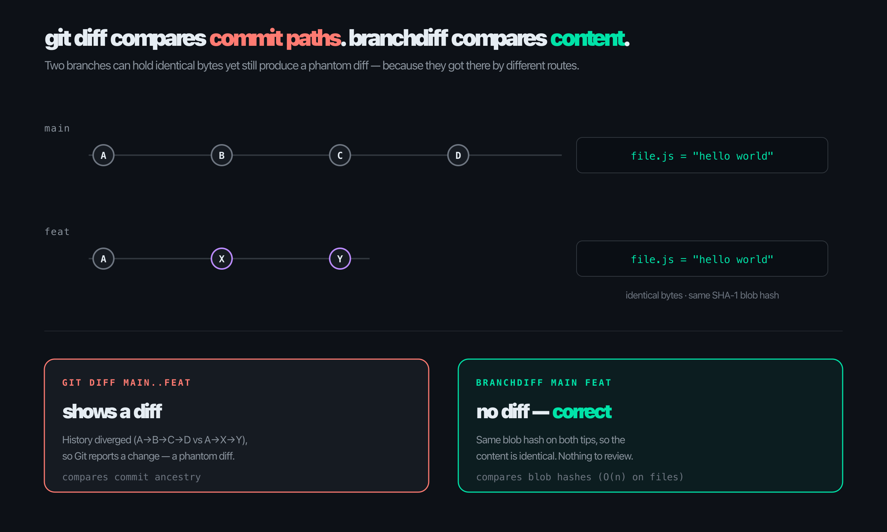
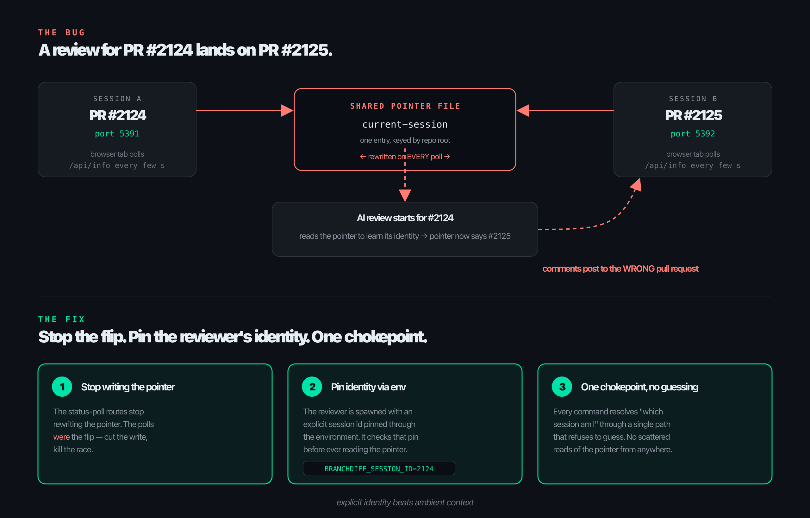
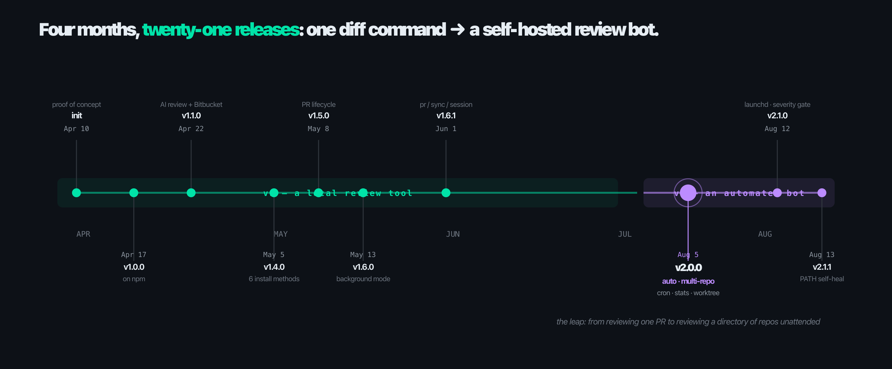

# How branchdiff Grew Up — One Diff Tool's Journey From a Proof of Concept to a Self-Hosted Review Bot

Here is a sentence that sounds made up but is not: for the first four months I built a tool, and almost every meaningful feature in it came from something that annoyed me on a Tuesday. Not from a roadmap. Not from user research. From me, sitting in front of a pull request, thinking *there has to be a faster way to do this*.

This is the story of how branchdiff went from one command that fixed a lie `git diff` was telling me, to a self-hosted bot that reviews pull requests across a whole directory of repos while I sleep. It is not a feature tour — there are six other posts for that. This is the build story: why each piece exists, the bugs that nearly broke it, and what building it did to how I think about software.

---

## The diff that lied

branchdiff started with a small, annoying discovery. Run this:

```bash
git diff main..feat
```

and Git will happily show you a wall of changes. But sometimes that wall is a lie.

Git's two-dot diff compares *commit history*, not file content. If `main` and `feat` arrived at identical file contents through different commit paths — a rebase, a cherry-pick, a squash — Git still reports a "change" where there is none. The two branches contain the exact same bytes, and `git diff` insists on showing you a phantom diff anyway. On GitHub, after a rebase, this shows up as entire files lighting up red and green for no reason.

That phantom diff is the whole reason branchdiff exists.



The fix leans on a detail of how Git stores things under the hood: every version of every file is stored as a blob with a SHA-1 hash. **Same content means the same hash, no matter which commits brought it there.** So instead of asking "did the history diverge," you ask "do these two branches hold blobs with different hashes?" — and you only fetch the actual file content for the handful of files where the hashes differ. Comparing two maps of hashes is cheap. It runs in time proportional to the number of files, not the size of the history.

That was the entire idea. One insight, sitting in an afternoon. I wrote `init: proof of concept` on April 10th, inspired by a lovely little tool called Diffity that renders git diffs in the browser. By the end of that same day I had five phases working: a local web page that read the diff from disk and showed the whole file, in place, with every hunk surrounded by its real context.

---

## Day one: a proof of concept, not a product

The first version was deliberately small. Four flags. That was it.

```bash
branchdiff                 # interactive prompt, tab-completion
branchdiff feat            # current branch vs feat
branchdiff main feat       # two branches
branchdiff main feat --mode git      # commit-history diff
```

The original default was `--mode file` — compare actual content, the thing Git's own diff gets wrong. Tab-completion came free from Node's built-in readline; no extra dependency. The whole thing was Express serving a page that loaded diff2html from a CDN. Ugly, but it worked, and it made the phantom-diff problem disappear.

A week later it was on npm as `v1.0.0`. I renamed it to `@encryptioner/branchdiff` and, after some thought, switched the license to Commons Clause plus MIT — free to use, not free to resell as a hosted product. That decision is worth its own post; the short version is that I wanted to keep it open without handing a turnkey SaaS to the first reseller who came along.

---

## Every feature was a personal itch

Here is the part I want you to notice. I did not sit down and design a "code review platform." I kept stubbing my toe on the same steps of my own workflow, and each toe-stub became a version.

The release notes I wrote along the way are embarrassingly honest about this. They read less like marketing and more like a diary of things that irritated me.

**Comments had to land on real lines.** The browser diff was nice, but reviewing meant typing comments into a text box with no connection to the code. So I added inline comment threads that pin to exact lines — and, because I review my own branches before opening the PR, an AI pass that drops its comments on those same real lines. That was `v1.1.0`.

**My local work had to reach the remote PR.** I would review a teammate's PR locally, write twelve careful comments, and then… retype them into GitHub. So I built two-way sync: local comments push to the PR, PR comments pull back down. That was `v1.2.0`.

**You should not need Node to read a diff.** branchdiff was a Node CLI, and every time I told someone to try it, the reply was *I don't have Node installed.* So I shipped it everywhere — npm, PyPI, Homebrew, Scoop, apt, standalone binaries. The Python package does not require Node at all. That was `v1.4.0`, and it is the release that made the tool actually reach people.

**I wanted to approve and merge without leaving the terminal.** The full PR lifecycle — approve, request changes, merge, close, reopen, mark ready — landed as CLI commands. No browser tab. That was `v1.5.0`.

Then came the big one.

---

## The itch that became version 2

I keep about ten side projects going at once. Each one has its own repo, and each repo occasionally has an open pull request. Here is a thing I wrote in the v2.0.0 release notes, almost verbatim, because it is the real reason `auto` exists:

> The unit of work people have is "my open PRs," not "this checkout's open PRs." Someone with a directory of ten side projects wants one command, one candidate list, and one answer about what happened — not ten terminals to reconcile by hand.

That is the whole pitch for `branchdiff auto`. You point it at a directory, and it finds every open PR in every repo underneath, reviews only the ones with new commits since last time, and streams each session's URL as it goes.

```bash
cd ~/work && branchdiff auto --tool claude
```

That single line replaced an entire morning of context-switching. Point it at `~/work`, get one numbered list of every PR that needs eyes, review them one after another.

The shape of the command came from more toes being stubbed:

- *The 900-file lockfile bump wastes a review pass. So does the one-word typo fix.* Size is the cheapest signal for both. So: `--max-files 200 --max-lines 4000` skips the giants and leaves them to a human.
- *I never want to review my own PR by accident.* `--skip-author`.
- *A foreground terminal only reviews while it stays open.* No good for a headless box or a fixed daily window. So `auto` learned to detach into the background and to schedule itself:

```bash
branchdiff auto --detach --review --tool claude --repo-paths ~/work --yes
branchdiff auto cron add --start "0 9 * * 1-5" --tool claude --review --repo-paths ~/work
```

- *I had no idea how much the tool had actually done for me.* No telemetry, no summary, no "look how much this helped." So `stats` was born — a dashboard that reads every local review database and shows you the numbers.

```bash
branchdiff stats
```

You can see the shape of it. None of these came from a planning meeting. Each one is a sentence that starts with *I keep having to…* and ends with a flag.

---

## The bug that taught me about identity

Every project has a bug that rewrites how you think about it. branchdiff's arrived while I was building `auto`.

Here is the setup. You can run more than one branchdiff session on the same repo at once — say, PR #2124 open on one port, PR #2125 on another. One day an AI review I started against #2124 posted all its comments onto #2125. The wrong pull request. On a real repository, with real reviewers watching, that is the kind of thing that makes you close the laptop and stare at the wall.

The cause was a single file. branchdiff kept one `current-session` pointer, keyed by the repo, that said "this is the session every command acts on." Harmless, except that *the pointer got rewritten every time a browser tab polled the server for status.* The other PR's tab, polling in the background, was enough to flip the pointer mid-review. The reviewer had no identity of its own. It just read whatever the file said at that instant, and the file was a liar that changed its mind every few seconds.

The fix was three moves, and the shape of it matters more than the code:

1. **Stop the flip at its source.** The status-poll routes stopped writing the pointer. Those polls *were* the flip; cutting the write killed the race.
2. **Give the reviewer its own identity.** When the AI runs, it gets pinned to its session by an explicit value passed through the environment — `this review belongs to session 2124, full stop` — and it checks that pin *before* it ever looks at the shared pointer.
3. **Force everything through one chokepoint.** One place resolves "which session am I," and it refuses to guess. No scattered reads of the pointer file from a dozen call sites.



The lesson stuck with me far beyond this bug: **explicit identity beats ambient context.** Any time a component figures out "who am I" by reading a shared, mutable thing that someone else can change, you have a race condition pretending to be a feature. Hand the identity in directly. Make it the component's own property, not a global it eavesdrops on. I now reach for that instinct in unrelated codebases, and it has saved me from at least three bugs I would otherwise have shipped.

---

## Other bugs, other lessons

A few more deserve a mention, because each one left a habit behind.

**The time it hung people's machines.** Early on, the hot-path Git calls used synchronous execution — the kind that blocks the single Node thread while Git runs. On a big repo that meant the server stopped responding, and on some setups it hung the whole device on sleep or shutdown. The fix was asynchronous execution and argument arrays instead of shell strings (which also closed a shell-injection door). The habit: *never block the event loop on the hot path, and never build a command string by hand when you can pass an array of args.* That release also bound the server to `127.0.0.1` instead of `0.0.0.0`, tightened CORS, and patched a path-traversal hole in static file serving. Local-first is a security posture, not just a privacy slogan.

**The time cron silently did nothing on macOS.** This one is almost funny. `auto cron` wrote crontab entries, and on Linux that worked beautifully. On macOS, since Catalina, the system blocks `cron` from running a user job unless `cron` itself has been granted Full Disk Access — and it fails silently. No log, no mail, no error from branchdiff. The scheduled review just… never ran. The fix was to stop fighting the OS: on macOS, `auto` now writes per-user launch agents and loads them through `launchctl`, sidestepping the permission gate entirely. The habit: *the platform's defaults will betray you, and "works on my Linux box" is not a test.* Always validate on the real target OS, especially for anything scheduled.

**The time export and import were both broken and nobody knew.** A subtle one. The server was shipping review bundles tagged as version 2; the import screen was rejecting anything that wasn't version 1. The only live path through the feature was silently broken end to end. It worked in neither direction, and because it failed quietly, nobody reported it. The habit: *version your contracts, and when two components agree on a version number, make sure they agree out loud.* A UI and a server silently disagreeing on a bundle version is an integration bug wearing a costume.

**The time "Request Changes" did nothing on Bitbucket.** The reviewer state never flipped to "changes requested" — only a text comment appeared. Turned out the code was posting to the comments endpoint instead of the dedicated request-changes endpoint. A wrong URL, a feature that looked like it worked. The habit: *verify the side effect, not the call.* "I sent the request" is not "the state changed." Go look at the resulting state.

---

## Where it landed

So what does branchdiff look like after all those Tuesdays?

It is a self-hosted code reviewer. Point `auto` at a directory of repos and it will, on a schedule, find every open pull request, skip the ones with no new commits and the ones too big to be useful, run an AI review on the rest, and push the comments back to GitHub or Bitbucket. You bring your own model — Claude, Codex, Gemini, Cursor, opencode, anything that reads review context on stdin and prints structured comments on stdout. You gate the verdict: only auto-approve if nothing crosses your severity threshold. You watch the whole thing in `stats`.



It works across both of the forges I actually use — GitHub and Bitbucket Cloud. (Not GitLab, not Azure DevOps. I built what I needed and no more; those can come if the need becomes real.)

The part I am proudest of is not any single feature. It is that the same command that reviews one PR reviews a hundred of them across thirty repos, and the only difference is which directory you point it at. The unit of work is "my open PRs," exactly like I wrote in those release notes.

---

## Then the AI needed orientation too

Once `auto` was running unattended, I started noticing something that took me a minute to name. I would watch a review session start, and the first thing the AI did — every time — was spend real effort, and real tokens, figuring out which of the forty changed files actually mattered and how they connected to each other before it could say anything useful about the change itself. That is the exact same problem branchdiff was built to solve on day one — a wall of hunks with no context — except this time the thing squinting at the wall was not a human. It was the model.

So I did the same thing I did the first time around: stopped asking it to figure that out and started handing it the answer. branchdiff now computes a change map locally and deterministically before any AI ever sees the diff — no AI tokens spent finding out what could just be computed. It works out which areas of the diff moved and by how much, which areas are wired together by imports (and where it can tell, it labels the wiring with the actual symbols the diff introduced, not just an import count), whether what you're looking at is one coherent change or several unrelated ones bundled into a single PR, and which areas are brand new. Then it renders a diagram per wired section — mermaid where mermaid will render, ASCII where it won't. It gets appended automatically once a diff crosses a size threshold — 3 files or 80 changed lines — and there's a toolbar button that pulls the same map up on demand, for a human, without starting a review at all. Same orientation, now available to whichever one of us needs it.

The second itch was smaller but stung in a familiar way. Once AI reviews were running all day, unattended, across every open PR in every repo, I realized I had no idea what any of it actually cost. So `stats` learned to track tokens and cost per pass, accumulated per session, split by tool, split by repo — the same instinct that built `stats` in the first place, back when the itch was "I have no idea how much this tool has done for me." If a tool works for you silently, you eventually stop trusting the silence, and letting something run while you sleep is fine right up until you have no idea what it's spending to do it.

Both fixes are the same shape, really. The reviewer needed to be told who it was instead of guessing off a shared pointer. The AI needed to be told what was connected instead of guessing off a wall of hunks. Stop asking something to infer context you could just hand it.


---

## What building it taught me

I want to be honest about this part, because it is the real payoff of a side project and it is the part nobody puts on the README.

**Ship the itch you actually have.** Every feature that found its way into branchdiff started with a sentence that began "I keep having to…". The features I planned in advance, the clever ones, mostly did not survive contact with how I really work. The features that scratched a real, recurring annoyance are the ones people thank me for. If you are deciding what to build next, pay attention to what annoys you, not what impresses you.

**Explicit identity beats ambient context.** That wrong-PR bug rewired me. Whenever I see a component reading a global to decide who it is, I get suspicious. Pass the identity in. Make it a property of the thing, not a fact about the world it has to guess at.

**Never block the hot path.** If a request has to wait for a subprocess, it waits asynchronously or it does not wait at all. The synchronous version always feels simpler when you write it and always hurts someone later.

**Version your contracts out loud.** When two parts of a system agree on a version, make that agreement explicit and checked. Silent disagreement is the worst kind of bug — it looks alive and is dead.

**Distrust the platform's defaults.** macOS cron, Node's synchronous APIs, `0.0.0.0` bindings — the convenient default is frequently the wrong default. "Works on my machine" is a confession, not a defense.

**Meet people where they are.** "I don't have Node" was not a comment about Node. It was a comment about how a tool dies the moment the first instruction is an obstacle. Shipping to six package managers was tedious. It was also the difference between a toy and a tool.

**Reuse your own commands.** The biggest version of branchdiff, the one with `auto`, was largely built by composing the commands that already existed — running them as child processes instead of reimplementing them. Less code, fewer bugs, and every new feature inherited the fixes from the old ones for free. When you are tempted to rewrite, ask whether you could just call.

And one more, maybe the most important: **writing the "why" forced me to earn the feature.** Every release note I wrote started with a justification — *why does this need to exist?* If I could not answer that in a sentence, the feature was not ready, and usually it was the wrong feature. The discipline of explaining yourself, on paper, before you ship, is a better filter than any roadmap.

branchdiff is not finished. There are more Tuesdays coming, and more toes to stub, and each one will probably become a flag. But four months in, from one diff command to a review bot that runs while I sleep, the throughline is the same: build the thing that removes the friction you personally feel, over and over, until the friction is gone. The product is just the accumulation of those removals.

If you want to follow along or try it, the command is the same one I typed on day one, just with four months of Tuesdays packed into it:

```bash
branchdiff main feat
```

It still does exactly what it did on April 10th — show you the real diff, not the phantom one. Everything else grew up around that single, stubborn idea.
