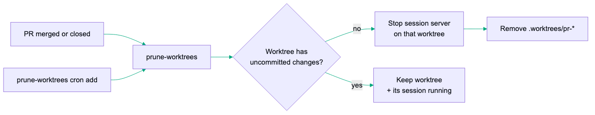

# Manage the Whole PR Lifecycle Without Leaving the Terminal - branchdiff's pr, sync, and session Commands

Your Claude Code skill just finished a review pass. It read the diff, posted three `[must-fix]` comments and two `[suggestion]`s via `branchdiff agent comment`, and decided — based on your own gating rules — that the PR is clean enough to ship. Now what? Without a terminal path for those last steps, "now what" means tabbing over to GitHub, finding the PR, clicking Approve, then clicking Merge — the agent that can read a 40-file diff and reason about severity tags cannot press the one button that matters.

That gap is not cosmetic. It is the difference between "an AI that helps me review" and "an AI that can actually run a review-to-merge pipeline unattended." A script wired to a Claude Code skill, a CI job that wants to auto-merge dependency bumps once checks pass, an agent working through a queue of PRs overnight — none of that works if the last step requires a human with a mouse. The diff viewer, the comment API, the whole `branchdiff agent` surface was genuinely useful, but it stopped exactly at the point where the loop needed to close.

branchdiff closes it. Every mutation the browser UI can perform — approve, merge, close, reopen, mark ready, push comments to the remote, pull them back, manage sessions — has a CLI command behind it. This post walks through the four command groups that make that possible: `pr`, `sync`, `session`, and four `agent` subcommands for cleaning up comments an agent created earlier.

---

## Why this gap mattered

On the reviewing side, `branchdiff agent` covered reading and commenting: `agent diff`, `agent comment`, `agent resolve`, `agent dismiss`, `agent reply`. Enough to run a full review pass headlessly. But the moment a review pass concluded "this is good, approve it" or "this is done, merge it," the pipeline hit a wall — those actions lived only in the browser. Same for comment sync: pushing local threads to the remote PR, or pulling remote comments into a local session, meant opening the sync dialog and clicking buttons.

For a human using branchdiff interactively, that was a minor inconvenience — you were probably in the browser anyway. For a script or an agent driving the whole thing, it was a hard stop. You could not write a shell script that reviews, decides, and merges. You could not point `branchdiff auto` (or a custom loop) at a queue of PRs and have it act on its own verdict. Every full-lifecycle workflow needed a human in the loop at the exact step that mattered most.

---

## `branchdiff pr` — the PR lifecycle from the terminal

`branchdiff pr` ships 11 subcommands: `info`, `create`, `merge`, `approve`, `request-changes`, `close`, `reopen`, `draft`, `ready`, `edit`, `comment`. Each one talks HTTP to a running branchdiff instance — the same server your browser tab is pointed at — and platform (GitHub or Bitbucket) is auto-detected from the repo's remote, overridable with `--platform` if you need to force it. This is the group your gating script calls the moment it decides a PR is done — everything below picks up right where the review pass left off.

```bash
$ branchdiff pr info
PR #482: Add retry logic to webhook delivery
Status: OPEN  Mergeable: yes
Head: a3f9c21b3d0e
Opened: 2026-07-30
Comments: 2
Reviewers: 1  (0 approved, 0 requested changes)
  · alice
URL: https://github.com/acme/api/pull/482

$ branchdiff pr approve --comment "Reviewed via branchdiff agent — no open must-fix threads."
Approved PR #482 (github:acme/api)

$ branchdiff pr merge --strategy squash
Merged PR #482 (github:acme/api)
```

(`merge --strategy squash` did what it says — the confirmation line just names the repo, not the strategy.)

`pr info` also takes `--json` — the form a script or an AI agent actually parses to decide whether approving or merging is safe (is it a draft? are there unresolved reviewers?).

```bash
$ branchdiff pr info --json
{
  "prNumber": 482,
  "prTitle": "Add retry logic to webhook delivery",
  "state": "OPEN",
  "isDraft": false,
  "headSha": "a3f9c21b3d0e...",
  "reviewers": [{ "username": "alice", "state": "commented" }],
  "prUrl": "https://github.com/acme/api/pull/482"
}
```

The other eight subcommands cover the rest of what the browser's PR panel can do — `close`/`reopen`, `draft`/`ready` for flipping draft status, `request-changes` as the negative counterpart to `approve`, `create` for opening a brand-new PR from the CLI, `edit` for title/description changes, and `comment` for posting a general (non-inline) PR comment without going through `agent comment`.

---

## `branchdiff sync` — comment sync from the terminal

This is what your gating script calls right after the agent finishes posting comments — before `pr approve` runs, so the remote PR shows the same findings the local decision was based on. `branchdiff sync` has three subcommands: `push` (local comment threads → remote PR), `push-thread <id>` (a single thread by id or 8-char prefix), and `pull` (remote PR comments → local session). Each reports exactly what happened — posted, already present, or skipped — so a script can tell whether the sync actually did anything.

```bash
$ branchdiff sync push
Pushed to PR (github:acme/api)
  Comments: 3 posted, 1 already present

$ branchdiff sync pull
Pulled from PR (github:acme/api)
  New threads: 2  New replies: 0  Skipped: 5
```

This is the CLI equivalent of the browser's Sync All button — scriptable, so both directions are one command. A pass can push its freshly-posted comments to the actual PR, or pull in what a human reviewer added on GitHub since your last local pass. `sync push-thread` pushes just one thread without syncing everything else pending.

---

## `branchdiff session` — session management

Four subcommands: `current`, `archive`, `history`, `delete`.

```bash
$ branchdiff session current
  Session a3f9c21b
  Ref: main...feature/webhook-retry
  Type: branch_pair
  Archived: 2 previous sessions

$ branchdiff session archive
Archived session a3f9c21b
  New session: 7c02fe19

$ branchdiff session history
  a3f9c21b  archived 2026-07-28T09:14  12 threads, 9 resolved
  e88d0a44  archived 2026-06-14T16:02  4 threads

  View one: branchdiff review threads --session <id> --status all
```

`session archive` is what `--new` does interactively when you start a fresh review pass over an old branch pair — it puts the old session's comment history somewhere queryable (`session history`, or `branchdiff review threads --session <id>`) instead of deleting it. `session delete --id <id>` is the destructive version, for when you actually want a session gone.

---

## Cleaning up after `--worktree` reviews

Running `branchdiff <b1> <b2> --worktree` for a batch of PRs leaves a `.worktrees/pr-*` checkout and a session server behind for each one. `branchdiff prune-worktrees` already removed the stale checkouts; it now also stops the session server running on each one before removing it — scoped correctly, so a worktree named `pr-482` in one repo never stops a session belonging to an unrelated repo's own `pr-482` worktree. A worktree kept back because it still has uncommitted changes keeps its session running too — pruning only touches what it's actually about to delete.

```bash
$ branchdiff prune-worktrees
Stopped session for .worktrees/pr-482 (port 5391)
Removed .worktrees/pr-482
Kept .worktrees/pr-510 (uncommitted changes)
Pruned 1 worktree, kept 1
```

It also picked up its own cron scheduling, same shape as `auto cron`: `prune-worktrees cron add/list/remove/removeall` schedules recurring prunes in their own namespace, shown alongside `auto`'s schedules in the Stats dashboard (a script polling that dashboard can ask for just the relevant slice with `branchdiff stats --json --sections sessions` instead of paying for the full aggregate). For a script or agent driving `--worktree` reviews at scale, this is the other half `--worktree` was missing — cleanup now tidies the session state, not just the checkout on disk.



---

## `branchdiff export` / `import` — taking a session off the machine

Archiving keeps history queryable on *this* machine. Handing a review off to a teammate, moving a review-in-progress to a new machine, or backing up a repo's comment trail before it's decommissioned all need the history to actually leave — that's what `export`/`import` are for.

```bash
$ branchdiff export --all --output review-482.json
✓ Exported 3 sessions (+ 12 UI state rows) to review-482.json

$ branchdiff import review-482.json --conflict skip
```

`export [ids...] [--all] [--output <file>]` writes sessions to a portable JSON bundle (stdout if `--output` is omitted). `import <file> [--conflict merge|skip|overwrite] [--dry-run]` reads one back in — `merge` (the default) keeps whichever side changed more recently, `skip` leaves anything already present alone, `overwrite` always takes the bundle's version. `--dry-run` previews without writing anything.

---

## Agent thread/comment CRUD

Four more `agent` subcommands landed alongside `pr`/`sync`/`session`: `delete-thread`, `clear-threads`, `edit-comment`, `delete-comment`. Before this, an agent could create comments and resolve or dismiss them, but it could not clean up after itself — no way to delete a thread it posted in error, edit a comment's wording after the fact, or wipe a batch of stale threads before a fresh pass. Now it can fully manage the comments it created, not just add to them:

```bash
$ branchdiff agent edit-comment 91a2c4d8 --body "Missing signature verification before parsing body (updated: also applies to the retry path)"
Edited comment 91a2c4d8

$ branchdiff agent delete-thread a3f9c21b
Deleted thread a3f9c21b

$ branchdiff agent clear-threads --yes
Deleted 6 threads
```

`clear-threads` is all-or-nothing for the session — there's no filter to clear only dismissed or only resolved threads, it wipes every thread in the active session. `--yes` skips the confirmation prompt; running from a non-interactive shell (a script, a CI job) skips it automatically either way, same rule as everything else unattended in this piece.

---

## Multi-instance targeting

If you run branchdiff on more than one repo, or more than one ref-pair in the same repo, `pr`, `sync`, and `session` commands all need to know which running instance to talk to. Each accepts `--port` or `--pid` to target one directly; without either, they default to the current repo's running instance. If more than one matches, branchdiff lists them instead of guessing:

```bash
$ branchdiff pr approve
Error: Multiple branchdiff instances for this repo. Specify one:
  PORT 5391  pid 42117  main...feature/webhook-retry
  PORT 5392  pid 42210  main...feature/rate-limit-fix

  Example: branchdiff pr info --port 5391
```

This matters most in exactly the multi-agent scenario this post is about — several branchdiff sessions running concurrently for different PRs, each driven by its own script instance, none of them stepping on each other by accident.

---

## `branchdiff agent guide` — one reference for the whole surface

`branchdiff agent guide` prints a comprehensive CLI reference for AI agents, grouped by workflow: comments, PR lifecycle, sync, sessions, review pipeline. An agent can `cat` this once at the start of a session and learn the entire command surface — every subcommand, its flags, and what it does — instead of guessing at flag names or trial-and-erroring its way through `--help` output for a dozen subcommands.

It opens with a requirements table (which command groups need a live session vs. a running server) and a supported-refs section, then walks through each workflow with real bash examples — an excerpt from the PR Lifecycle section:

```bash
$ branchdiff agent guide | sed -n '/## 2. PR Lifecycle/,/^---/p'
## 2. PR Lifecycle (requires running instance)

Manage pull requests via the running branchdiff HTTP server. Platform (GitHub/Bitbucket) auto-detected.

# View PR status for current branch (--json for scripts / AI agents)
branchdiff pr info
branchdiff pr info --json

# Merge strategies
branchdiff pr merge
branchdiff pr merge --strategy squash

# Review actions
branchdiff pr approve --comment "LGTM"
branchdiff pr request-changes --comment "Fix X before merging"
```

Worth noting this is a different command from `review guide`, which covers only the review/resolve workflow (the skill-driven comment pass). `agent guide` is the full map — comments plus lifecycle plus sync plus sessions.

---

## End-to-end: an agent that reviews, syncs, approves, and merges

Here's the scenario this whole release is aimed at: a shell script wired to a Claude Code skill (or any AI CLI) that reviews a PR, decides it's good, and closes the loop entirely from the terminal.

One shortcut worth flagging before the walkthrough: `branchdiff <b1> <b2> --review --tool claude` (a PR URL works too) starts the session and runs one AI review pass in the same command — whether the session is freshly started or already running for that ref — carrying every review-pass flag (`--push`, `--approve`/`--request-changes`, `--stack`) plus token/cost tracking for tracked `--tool` presets. That collapses what the walkthrough below still does as two explicit steps (open the session, then run the review) into one call. The example spells out each step anyway, since that's what maps cleanly onto `pr`/`sync`/`session` piece by piece — but a production script driving this pipeline at scale would likely start from `--review` instead of step 1 alone.

```bash
# 1. Open the PR as a session and run the review skill
branchdiff https://github.com/acme/api/pull/482 --no-open
# in Claude Code: /branchdiff-review
# → posts inline comments via branchdiff agent comment, tags severity

# 2. Check what's still open
branchdiff agent list --status open
# [suggestion] src/webhook/retry.ts:88   Consider capping backoff at 5 attempts
# (no must-fix threads — script's gate gets to proceed)

# 3. Push any pending local comments to the remote PR
branchdiff sync push
# Pushed to PR (github:acme/api)
#   Comments: 1 posted, 0 already present

# 4. Approve
branchdiff pr approve --comment "Automated review: no must-fix findings."
# Approved PR #482 (github:acme/api)

# 5. Merge
branchdiff pr merge --strategy squash
# Merged PR #482 (github:acme/api)
```

Nothing here happens by default. `branchdiff agent`, `pr`, and `sync` are commands the operator's script explicitly calls, in an order the operator wrote — an installed skill does not decide on its own to approve or merge anything. The severity gate in step 2 ("only proceed if no `[must-fix]` threads") is logic the script author owns. This is opt-in scripting power: branchdiff exposes the primitives, you decide the policy that chains them together, the same way `branchdiff auto --approve`/`--request-changes` (a built-in version of a similar gate) only touches the remote PR state when you additionally pass `--push`.

---

## Where to stay skeptical

**Auto-merge is a policy decision, not a branchdiff opinion.** These commands make full automation *possible*. Whether "no open must-fix threads" is actually a safe bar for auto-merging is a call your team makes, not something the tool enforces for you. A script that merges on a shallow gate will merge shallow reviews.

**Platform auto-detection can be wrong in edge cases.** If a repo has multiple remotes, or a remote URL that doesn't match GitHub/Bitbucket's usual patterns, `--platform` should be passed explicitly rather than trusted blind, especially in a script running unattended.

**Sync is not automatic conflict resolution.** `sync pull` brings in what changed remotely, but if a human reviewer commented on a line your local session already resolved differently, that's a real disagreement for a person to look at — not something `sync` reconciles for you.

**Multi-instance targeting depends on you being specific.** In a busy multi-repo, multi-agent setup, always pass `--port` or `--pid` in scripts rather than relying on the "only one instance" default — a second stray session on the same repo is enough to make a script exit on the ambiguity prompt instead of running unattended.

**A failed `sync push` doesn't force a full re-review.** If `auto --push` posts comments locally but the push to the remote PR fails — rate limit, network blip — the next cycle retries only the publish step; it reuses the verdict comment from the failed attempt instead of duplicating it, and does not re-run the AI review. Worth knowing if your script chains `sync push` into `pr approve` the way the end-to-end example above does: a transient push failure is a reason to retry the sync, not to redo the review pass.

**These commands still require a running branchdiff instance.** `pr`, `sync`, and `session` all talk HTTP to a live server — they are not a standalone git/PR client. If the instance has exited, start one (`branchdiff <pr-url> --no-open`) before scripting against it.

---

## Quick start

Full install guide, changelog, and uninstall steps on the [branchdiff releases page](https://encryptioner.github.io/branchdiff-releases/).

```bash
npm install -g @encryptioner/branchdiff
# or: pip install branchdiff
# or: brew tap encryptioner/branchdiff https://github.com/encryptioner/branchdiff-releases \
#          && brew install branchdiff

branchdiff https://github.com/org/repo/pull/N --no-open   # open a PR session headlessly
branchdiff agent guide                                     # full CLI reference for agents
branchdiff agent list --status open                        # check what's still open
branchdiff sync push                                        # push local comments to the PR
branchdiff pr approve                                       # approve from the terminal
branchdiff pr merge --strategy squash                        # merge from the terminal
```

If your review workflow already lives in `branchdiff agent`, the missing half is one command group away. Try scripting the last step you were still doing by hand.

---

## Let's Connect

I am always excited to hear what you are building. If this guide helped, or if you have questions about building self-review habits into your workflow:

- **Website**: [encryptioner.github.io](https://encryptioner.github.io)
- **LinkedIn**: [Mir Mursalin Ankur](https://www.linkedin.com/in/mir-mursalin-ankur)
- **GitHub**: [@Encryptioner](https://github.com/Encryptioner)
- **X (Twitter)**: [@AnkurMursalin](https://twitter.com/AnkurMursalin)
- **Technical Writing**: [Nerddevs](https://nerddevs.com/author/ankur/)
- **Support**: [SupportKori](https://www.supportkori.com/mirmursalinankur)

*branchdiff releases, install guide, and changelog: [encryptioner.github.io/branchdiff-releases](https://encryptioner.github.io/branchdiff-releases/)*
