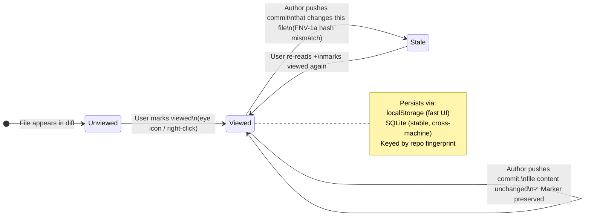
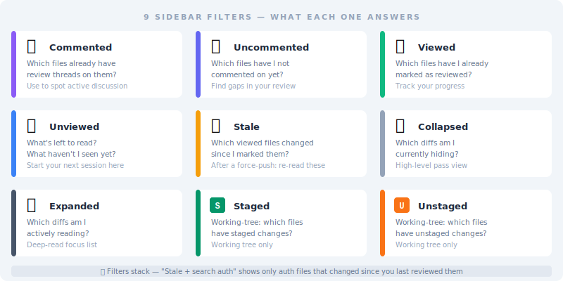
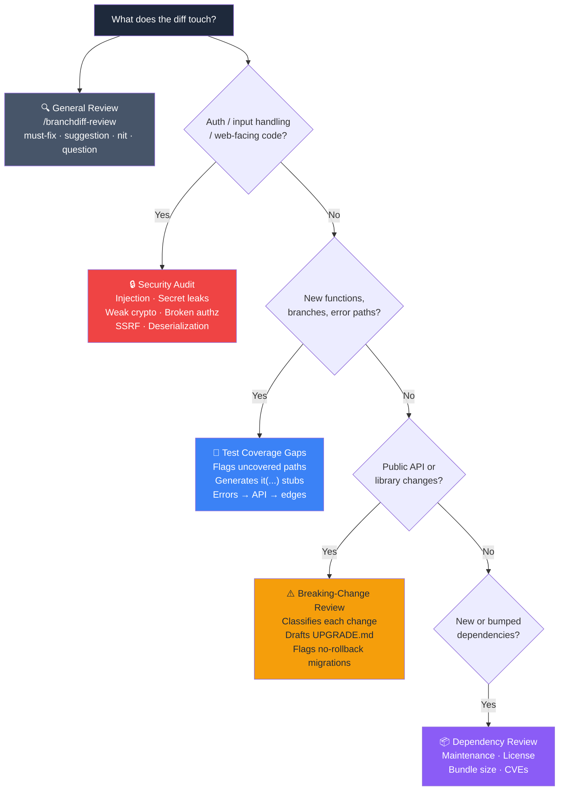
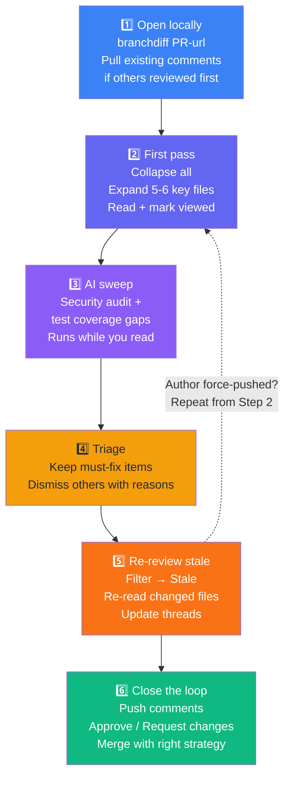

# Reviewing Teammates' PRs Faster — branchdiff Sessions, AI Passes, and Sync Back

You open the PR. Thirty-eight files changed. You have already reviewed this one twice this week — the author addressed most of the comments but force-pushed twice and now the diff is showing things you definitely already looked at. You scroll past the same unchanged files for the third time, trying to remember where you left off. Three tabs open: the PR, your editor, an AI assistant window you used to check that one regex. The PR description does not explain why this approach was chosen over the obvious alternative. You leave a comment asking. You tab-switch back to your editor to do something else while you wait.

This is code review for most engineers, most of the time. Not because the code is bad. Because the **mechanics around reading code** are poorly designed. Re-reading unchanged files, losing place after a force-push, copy-pasting between a diff view and an AI — none of that is the actual work of understanding intent. It is friction that accumulates until you give the PR an "LGTM" you do not mean, because you are tired and you have a meeting in ten minutes.

This post is about a workflow that keeps the mechanics out of your way so you can put your attention on the part that actually requires attention. The tool is **branchdiff**: a local browser app that opens beside your editor, reads the diff from disk, and talks to GitHub or Bitbucket through the same `gh` CLI or REST API you would use anyway. The canonical PR stays on the platform. branchdiff is just the cockpit.

---

## Step 1 — open the PR locally

```bash
branchdiff https://github.com/owner/repo/pull/123
# or
branchdiff https://bitbucket.org/workspace/repo/pull-requests/45
```

branchdiff fetches the PR head, opens a tab at `localhost:5391`, and shows the diff with split or unified view, syntax highlighting for 150+ languages, and a sidebar of changed files. The toolbar carries a `#123` badge with a state dot — green for open, purple for merged, red for closed/declined — so at a glance you know what kind of review you are about to do: fresh read, re-review, or post-merge audit.

Because this compares two named refs, the session is **persistent**. Comments survive new commits to either branch — stored locally in SQLite under `~/.branchdiff/`. If the author force-pushes mid-review, your view markers and draft comments are still there when you reopen. That single property is what makes branchdiff usable for reviews that take more than one sitting.

Multiple PRs at once is the default. Each ref pair opens on its own port — second session on `5392`, third on `5393` — so reviewing your colleague's PR while iterating on your own branch in another tab is just two browser tabs. `branchdiff list` shows everything running. Same ref pair revisited? branchdiff reuses the existing session so you do not fragment the review across ports.

If the PR already has comments from other reviewers, click `#123` → **Pull from PR**. Existing inline review comments come down as local threads anchored to the same lines, with author and timestamp preserved. Now you are reading the diff and the existing review in the same place, at the same time. That is the moment branchdiff stops feeling like a "diff viewer" and starts feeling like the actual review surface.

---

## Step 2 — track progress with viewed / stale markers

Big PRs are intimidating because progress is invisible. branchdiff borrows GitHub's "viewed" idea and makes it meaningfully smarter:



- **Mark a file viewed** with the eye icon in the file header, right-click → *Mark viewed*, or from the keyboard. The sidebar shows a checkmark.
- **A counter** — `12 / 38 viewed` — shows how far you are. On a forty-file PR, that counter is the difference between confident progress and the "I think I covered everything" feeling that produces "LGTM" comments written out of exhaustion.
- **Stale detection.** If the author pushes a commit that changes a file you already marked viewed, branchdiff flips it to *stale* with an amber dot. You only re-read the parts that actually changed.

Staleness uses an **FNV-1a hash of the file's diff signature** — content-based, not timestamp-based. A rebase that does not touch the file will not invalidate your work. A force-push that changes one line flips exactly that file to stale.

The state persists across sessions and machines via a stable **repo fingerprint** — branchdiff scans your remotes (upstream, then origin, then any other) to converge on a canonical ID across forks. `branchdiff info` prints the fingerprint and state-table size so you can audit what is being tracked.

There is also a **commit detail page** (v1.5.0). Click any commit in the history sidebar to open `/commit/:hash` with the full SHA, parent links, file list with `+N / -N` counts, and the same diff view. The back button returns you to the branch comparison without losing your position.

---

## Step 3 — narrow the file list with sidebar filters

The sidebar has nine filter chips that stack with the search box. Each one answers a specific question reviewers ask out loud:

| Filter         | The question it answers                                              |
| -------------- | -------------------------------------------------------------------- |
| **Commented**  | Which files already have review threads on them?                    |
| **Uncommented**| Which files have I not commented on yet?                            |
| **Viewed**     | Which files have I already marked as reviewed?                      |
| **Unviewed**   | What's left to read?                                                |
| **Stale**      | Which of my viewed files changed since I marked them?               |
| **Collapsed**  | Which diffs am I currently hiding?                                  |
| **Expanded**   | Which diffs am I actively reading?                                  |
| **Staged**     | Which working-tree files have staged changes?                       |
| **Unstaged**   | Which working-tree files have unstaged changes?                     |



Filters auto-hide when inapplicable — no `Staged` chip on a branch comparison, no `Commented` chip when nothing is commented yet. They stack with the search box, so *Filter → Stale + search "auth"* gives you exactly the auth files that changed since you last looked.

Two toolbar helpers work alongside the filters: **Collapse all** folds every file for a high-level pass; **Expand all** opens everything for a deep read. Files with open comment threads are force-expanded so threads are never hidden behind a collapsed diff.

For working-tree reviews, the **staged / unstaged toggle** flips between `git diff --staged` and `git diff` without re-running the command. File rows show inline status badges — **S** (staged), **U** (unstaged), amber dot (stale), checkmark (viewed and current).

A typical second-pass workflow: *Filter → Stale*, re-read those files, mark viewed; *Filter → Unviewed*, finish those; *Filter → Commented*, sanity-check the threads. The PR shrinks from "38 files" to a list of seven that need attention right now.

---

## Step 4 — full-file view with the change minimap

Inline diffs fall apart when the change depends on context far above or below the hunk — which describes most non-trivial changes. The toolbar's **Full-file view** opens a VS Code-style side-by-side rendering of the entire file:

- All hunks expanded in place inside the full file. You see the whole function, not three lines ripped out of context.
- A **minimap on the right** marking added, removed, and modified regions. Scan a 1,000-line file in a glance and click straight to a change. The question "is there anywhere else this pattern appears?" becomes answerable in two seconds.
- Inline review threads anchored to the same lines they live on in hunk view — comments do not disappear when you switch modes. (The `endLine` anchor was fixed in v1.5.0 to keep the two views consistent.)

For markdown files, v1.5.0 added a **Preview** toggle that renders both old and new sides as formatted markdown side-by-side. Documentation PRs become readable instead of a maze of `**`, `>`, and backtick noise.

Full-file view + minimap together transform a "scrolling through hunks" review into a "reading the file with annotations" review. For refactor PRs — the kind where GitHub's hunk view gives you fifty disconnected three-line windows — it is a genuinely different activity.

---

## Step 5 — let an AI take the first pass

Reading a 40-file PR by hand is necessary work. Running an AI pass *on top of* that read is additive: the AI is bad at understanding intent but good at the mechanical sweep that human readers skim past under cognitive load.

branchdiff exposes a small `branchdiff agent` command surface that any AI can drive — Claude Code via the `/branchdiff-review` skill, or any other model via the copy-paste prompt in the README, or a one-shot pipe:

```bash
branchdiff review context | claude -p "security audit"
branchdiff review run --exec "claude -p 'test coverage gaps'" --mode review
```



For somebody else's PR I usually run two passes:

- **Security audit** when the diff touches auth, input handling, or anything web-facing. Looks only for security issues — injection, secret leaks, weak crypto, broken authorisation, deserialisation traps, path traversal, SSRF, dependency risk — skips style entirely. A 200-line auth diff produces five precise comments instead of fifty.
- **Test coverage gaps** for new logic. Walks every new function and branch, checks the test directory for coverage, flags uncovered paths with a stub `it(...)` suggestion. Priority is error branches → new public API → edge cases → happy path.

For larger or riskier PRs I add **breaking-change review** or **dependency review**.

Two v1.5.0 improvements make these passes less noisy: **constructive tone** (comments lead with the problem, not a judgment) and **nth-time review awareness** (resolved and dismissed threads are not re-raised unless there is new evidence).

You read the AI's comments, decide which are real, dismiss the rest with reasons (`branchdiff agent dismiss <id> --reason "..."`), and keep the ones worth escalating. The AI is a first-pass filter — it lets you put your real attention on the parts that require understanding intent.

---

## Step 6 — push comments and act on the review

When you are happy with the threads, click the PR badge in the toolbar and choose **Push to PR**. Each single-comment thread is posted as an inline review comment on GitHub or Bitbucket. Duplicates (same file, line, body) are skipped. Threads with replies stay local — those conversations belong on the PR.

The toast tells you what happened: `Pushed 4, skipped 1 duplicate, skipped 2 multi-reply threads`. Failures keep the local thread intact so you can fix the anchor and retry.

The same dropdown carries every lifecycle action — Approve / Request Changes / Comment, Merge with strategy picker, Close / Reopen / Mark Draft / Mark Ready, Edit title and description. **Reviewer pills** in the dropdown header show every reviewer's latest state — approved, changes requested, commented, pending, or dismissed — at a glance. Errors stay inline in the confirm dialog so a typed comment is not lost when the network blips.

---

## A reasonable cadence for a 30-file PR



The total wall-clock time on a careful review goes down enough that you can afford to be more thorough on the parts that matter — flow control, contracts, edge cases, the "is this the right abstraction?" question — instead of burning attention on mechanics.

---

## Where it stops

- **No CI.** The platform's checks are still the gate.
- **No multi-reply thread push.** Back-and-forth conversations belong on the PR.
- **No cloud storage.** Wipe `~/.branchdiff/` and local drafts that have not been pushed are gone.
- **No branch protection bypass.** Merge actions still respect required reviews, status checks, and protected branches on the platform.
- **No full PR page replacement.** The PR description, linked issues, and CI block still live on the platform. *Open in browser* in the toolbar is one click away.

---

## Quick start

Full install guide, changelog, and uninstall steps on the [branchdiff releases page](https://encryptioner.github.io/branchdiff-releases/).

```bash
npm install -g @encryptioner/branchdiff
# or: pip install branchdiff
# or: brew tap encryptioner/branchdiff https://github.com/encryptioner/branchdiff-releases \
#          && brew install branchdiff

branchdiff https://github.com/your-org/your-repo/pull/123
```

Add `branchdiff skill add` if you want the Claude Code slash commands. Everything else is in the toolbar.

The next time a teammate posts a 40-file PR in Slack, try opening it locally. Mark a few files viewed. Run a security audit pass. Push the comments back. See whether the review felt different — and whether you have more attention left for the parts that need it.

---

## Let's Connect

I am always excited to hear what you are building. If this guide helped, or if you want to talk through AI-augmented code review strategies:

- **Website**: [encryptioner.github.io](https://encryptioner.github.io)
- **LinkedIn**: [Mir Mursalin Ankur](https://www.linkedin.com/in/mir-mursalin-ankur)
- **GitHub**: [@Encryptioner](https://github.com/Encryptioner)
- **X (Twitter)**: [@AnkurMursalin](https://twitter.com/AnkurMursalin)
- **Technical Writing**: [Nerddevs](https://nerddevs.com/author/ankur/)
- **Support**: [SupportKori](https://www.supportkori.com/mirmursalinankur)

*branchdiff releases, install guide, and changelog: [encryptioner.github.io/branchdiff-releases](https://encryptioner.github.io/branchdiff-releases/)*
