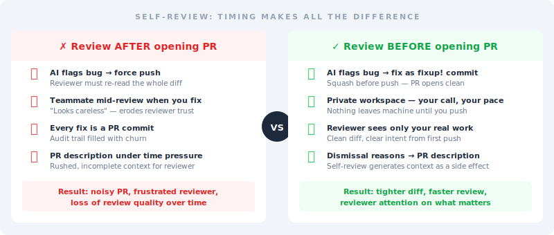
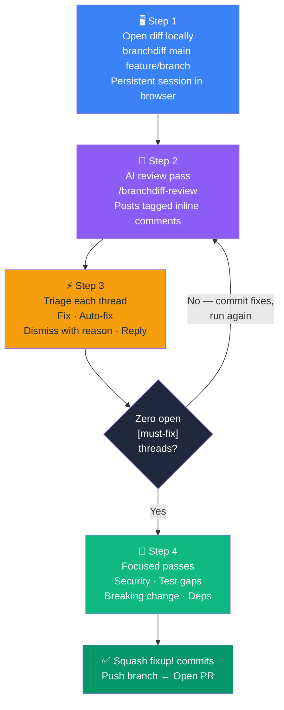
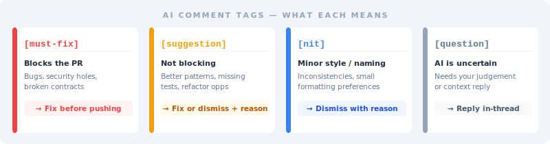
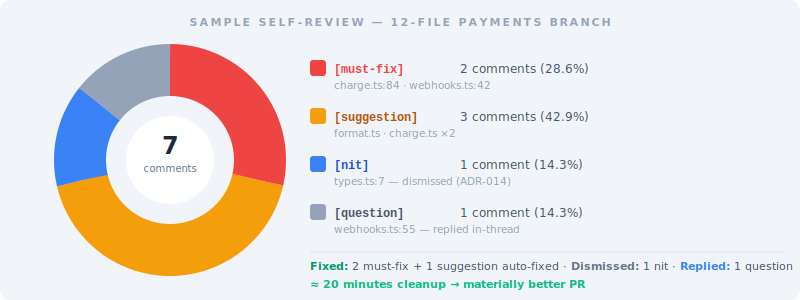

# Self-Review With AI Before You Open the PR — A Practical Workflow with branchdiff

You know the moment. You push the branch, open the PR, and immediately see it — the undefined return on the refund path, the token logged to the console, the TODO that was supposed to be temporary six weeks ago. The reviewer catches it four hours later and you reply "good catch, fixing now" as if someone else wrote that line.

The first reviewer on most pull requests should have been the author. Half the comments you will receive — the missing null check, the untested error branch, the duplicate logic that could be extracted, the import that now goes nowhere — are things you would have caught with one more careful read-through. You skip that read because you have been in the code for two days and your brain completes the sentences for you. You see what you meant to write, not what is on the page.

This post is about closing that gap with a structured AI-assisted self-review *before* the PR opens. Not to skip the human reviewer — to walk into the review with the obvious problems already gone, the test gaps already filled, and the PR description already written. So the reviewer's attention can land on what actually needs a second pair of eyes.

The tool is **branchdiff**: a local browser app that runs your diff on `localhost`, stores everything in `~/.branchdiff/`, and keeps the AI surface controlled through an explicit `branchdiff agent` command API. Nothing leaves your machine until you decide to push it.

---

## Why "before the PR" is the right moment



If you review *after* opening the PR, every AI fix becomes noise: a force-push, a re-read for your reviewer, another commit in the audit trail. If a teammate is already mid-review when you discover the bug, you look careless. The patch that should have been in the original push becomes a distraction for everyone downstream.

If you review *before* opening the PR, the AI's output is a private workspace. You act on what matters, commit the fixes into your own history (often as `fixup!` commits you squash before pushing), and the PR that goes up is cleaner from the first push. Reviewers see your real work, not your stream-of-consciousness corrections.

There is a subtler benefit too: **you learn from the dismissals**. Every time you push back on an AI comment with a real reason — "the wrapper handles null upstream", "this is intentionally synchronous because of write contention" — you are writing down the rationale you would otherwise leave implicit. That reason is exactly what the next reviewer needs in the PR description. The self-review session generates your PR description as a side effect.

---

## The workflow in 4 steps

Assume you have a `feature/payments` branch off `main` — twelve files changed, about three hundred lines added. You want to clean it up before requesting review.



### Step 1 — open your own diff locally

```bash
branchdiff main feature/payments
```

A browser tab opens at `http://localhost:5391`. Because you are comparing two named refs, this is a **persistent session** — comments you (or the AI) post here survive new commits to either branch. You can iterate across multiple rounds of fixes without losing the review trail. If you want a fresh start, `--new` archives the current session and creates a clean one; archived sessions stay queryable via `branchdiff review threads --session <id>`.

The diff renders with split or unified view, syntax highlighting for 150+ languages, a sidebar of changed files, and keyboard shortcuts (`j`/`k` for next/previous file, `n`/`p` for next/previous hunk).

### Step 2 — run an AI review pass

If you use Claude Code, install the skills once:

```bash
branchdiff skill add        # adds .claude/skills/branchdiff-{review,resolve}
```

Then in your Claude Code session:

```
/branchdiff-review main feature/payments
```

The skill calls `branchdiff agent diff` to read the full diff, then posts inline comments via `branchdiff agent comment --file <path> --line <n> --body "[tag] ..."`. Each comment carries a severity tag:



| Tag | Meaning | Typical action |
| --- | ------- | -------------- |
| `[must-fix]` | Bug, security issue, broken contract | Fix before pushing |
| `[suggestion]` | Better pattern, missing test, refactor opportunity | Fix or dismiss with reason |
| `[nit]` | Style, naming, minor inconsistency | Dismiss if low priority |
| `[question]` | AI is uncertain, needs context | Reply with explanation |

If you use a different AI, the README ships a copy-paste prompt that drives the same `branchdiff agent` command surface. Or pipe the context directly:

```bash
branchdiff review context | claude -p "review for security and breaking changes"
branchdiff review run --exec "claude" --mode review
```

Two improvements in v1.5.0 make this pass noticeably better:

- **Constructive tone.** The skill leads with the problem, not a judgment — "This returns `undefined` when `amount === 0`" rather than "This is wrong." Collaborative language. When AI comments read as observations rather than accusations, engineers actually fix the bug.
- **Nth-time review awareness.** Before commenting, the skill reads resolved and dismissed threads. Resolved threads are not re-raised; dismissed ones are only re-flagged if there is new evidence. You can run `/branchdiff-review` after every meaningful commit without re-litigating the same feedback.

### Step 3 — read, triage, decide

Open the browser. Each AI comment is anchored to a line in the diff, tag visible in the gutter, body inline. Four options per thread:

**Fix it** — make the change in your editor, then resolve the thread (`branchdiff agent resolve <id> --summary "added null guard"` or click *Resolve* in the UI). The summary is optional but worth writing — future review passes and future reviewers can see what was done and why.

**Auto-fix it** — if you are using Claude Code, `/branchdiff-resolve` reads open comments, applies mechanical fixes (rename, extract function, null check, missing test stub), and resolves threads with a summary. **Read the diff before committing** — the AI occasionally takes a suggestion more literally than you intended.

**Dismiss it** — the comment was wrong, out of scope, or already handled upstream. `branchdiff agent dismiss <id> --reason "..."` records why. That reason is what nth-time awareness uses so the same point is not re-raised next pass.

**Reply to it** — for `[question]` tags, `branchdiff agent reply <id> --body "..."` lets you answer in-thread. Useful when the AI flagged unclear behaviour and you want the rationale on record for the next reviewer.

The dismissal reason is the single most important habit to build. It keeps the AI honest across passes, and it leaves a paper trail you can point to when a reviewer asks "why is this line like that?"

### Step 3.5 — use the review tools that make long diffs tractable

The features that make a teammate's 40-file PR manageable pay equal dividends on your own branch:

**Viewed counter + stale detection.** Mark files viewed (eye icon or right-click) as you walk through. The sidebar shows `12 / 24 viewed`. Any file you marked viewed but later changed gets flipped to *stale* with an amber dot — staleness is detected via an FNV-1a hash on the diff signature, so a rebase that does not change the content does not invalidate your markers.

**Sidebar filters.** Nine filter chips — *Commented*, *Uncommented*, *Viewed*, *Unviewed*, *Stale*, *Collapsed*, *Expanded*, *Staged*, *Unstaged* — stack with the search box. On the second pass after a set of fixes: *Filter → Stale* shows exactly which files need re-reading.

**Collapse all / Expand all.** A quick high-level pass before diving in. Files with open comments are force-expanded so threads are never hidden behind a collapsed diff.

**Staged / unstaged toggle.** When reviewing your working tree before the first commit, flip between `git diff --staged` and `git diff` from the toolbar. File rows show inline status badges: **S** (staged) and **U** (unstaged).

**Full-file view + minimap.** The toolbar's *Full-file view* opens a VS Code-style rendering of the entire file with all hunks in place. A **minimap on the right** marks added, removed, and modified regions — scan a 1,000-line file at a glance and click straight to the change. Inline comments stay anchored when you switch from hunk view to full-file view. Markdown files get a **Preview** toggle (v1.5.0) that renders both sides as formatted markdown.

**Commit detail page.** Click any commit in the history sidebar to open `/commit/:hash` with the full SHA, parent links, file list with `+N / -N` counts, and the same diff view. The back button preserves your position.

### Step 4 — focused passes for the risky parts

The generalist review catches a wide range. These four pre-built workflows catch a narrower, deeper class of issue:

**Security audit** — looks only for injection (SQL, command, XSS, template, NoSQL, prompt), secret leaks, weak crypto, broken authorisation, deserialisation traps, path traversal, SSRF, and dependency risk. Skips style entirely. A 200-line auth diff produces five precise comments instead of fifty.

**Test coverage gaps** — for every new function, branch, or error path, checks the test directory and flags uncovered paths with a stub `it(...)` suggestion. Priority: error branches → new public API → edge cases → happy path.

**Breaking-change review** — classifies every change as breaking or non-breaking, drafts an UPGRADE.md snippet for breaking ones, flags schema migrations without a rollback path as `[must-fix]`.

**Dependency review** — flags added or major-bumped packages with maintenance status, license compatibility, bundle-size delta, first-party alternatives, and known CVEs.

---

## A realistic session on a 12-file payments branch

Here is what `branchdiff agent list --status open` might look like after the general review pass:

```
[must-fix]   src/billing/charge.ts:84      Refund path returns undefined when amount === 0
[must-fix]   src/api/webhooks.ts:42        Missing signature verification before parsing body
[suggestion] src/utils/format.ts:12        Replace toFixed(2) with Intl.NumberFormat for i18n
[suggestion] src/billing/charge.ts:140     No test covers partial-refund branch
[suggestion] src/billing/charge.ts:156     Extract retry logic — duplicated three times
[nit]        src/types.ts:7                Inconsistent enum casing
[question]   src/api/webhooks.ts:55        Should we 200 on duplicate webhook IDs or 409?
```



Two `[must-fix]` items, three improvements, one nit to dismiss, one question to answer. Twenty minutes of cleanup. The PR you push is materially better than the one you would have pushed before lunch.

The AI's general comment often summarises the change set in two or three sentences ready to paste into the PR description — that alone saves five minutes of staring at the PR form wondering how to explain what you did.

And the dismissal trail matters beyond this session. When you dismiss the `[nit]` with reason "team style is mixed casing for legacy enums — see ADR-014", that reason is on record. The next engineer who reads `src/types.ts` and wonders about the inconsistency has an answer one `branchdiff` session away.

---

## Where to stay skeptical

**AI is fallible.** It will flag non-issues and miss real bugs. The most common failure mode is confident-sounding wrong advice on async code — read those comments twice.

**Local context only.** The AI sees the diff and the files in your repo. It does not see runtime behaviour, production logs, or upstream service contracts. Those still need a human reviewer or an integration test.

**Token budget.** For a 200-file refactor, point the AI at the riskiest ten files first — you can always run a second pass with a different focus.

**Do not auto-resolve everything.** `/branchdiff-resolve` is convenient, but read the patches before committing. The AI will occasionally "fix" something by deleting code instead of correcting it.

**The AI does not replace understanding your own change.** If you do not understand a chunk of code well enough to review it, no AI pass magically fills that gap.

---

## Ship the PR

When the session is clean — open count at zero, threads resolved or dismissed with reasons attached — commit your fixes, squash any `fixup!` commits, and push. Either open the PR on the platform or use the *Open a Pull Request* button in the branchdiff toolbar (it appears automatically when no PR exists for the branch). The local session stays in `~/.branchdiff/` for your own reference; nothing from the AI pass needs to land on the PR unless you explicitly push it.

The reviewer who picks it up sees a tighter diff, fewer obvious bugs, a clearer description. Their attention can land on the parts that need real judgement: the architectural decision, the unclear contract, the edge case that matters in production but not in tests.

---

## Quick start

Full install guide, changelog, and uninstall steps on the [branchdiff releases page](https://encryptioner.github.io/branchdiff-releases/).

```bash
npm install -g @encryptioner/branchdiff
# or: pip install branchdiff
# or: brew tap encryptioner/branchdiff https://github.com/encryptioner/branchdiff-releases \
#          && brew install branchdiff

branchdiff skill add                         # one-time, for Claude Code
branchdiff main feature/your-branch          # opens local UI
# in Claude Code:  /branchdiff-review
# triage threads → fix → resolve → dismiss with reasons
# squash fixup! commits → push branch → open PR
```

Self-review is the part of the workflow you can improve without changing your team's process. Try it on the next branch you were about to push without looking at it again.

---

## Let's Connect

I am always excited to hear what you are building. If this guide helped, or if you have questions about building self-review habits into your workflow:

- **Website**: [encryptioner.github.io](https://encryptioner.github.io)
- **LinkedIn**: [Mir Mursalin Ankur](https://www.linkedin.com/in/mir-mursalin-ankur)
- **GitHub**: [@Encryptioner](https://github.com/Encryptioner)
- **X (Twitter)**: [@AnkurMursalin](https://twitter.com/AnkurMursalin)
- **Technical Writing**: [Nerddevs](https://nerddevs.com/author/ankur/)
- **Support**: [SupportKori](https://www.supportkori.com/mirmursalinankur)

*branchdiff releases, install guide, and changelog: [encryptioner.github.io/branchdiff-releases](https://encryptioner.github.io/branchdiff-releases/)*
