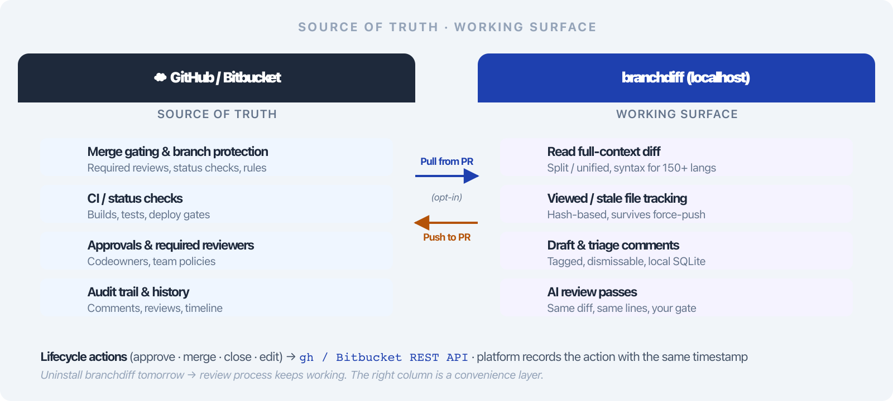
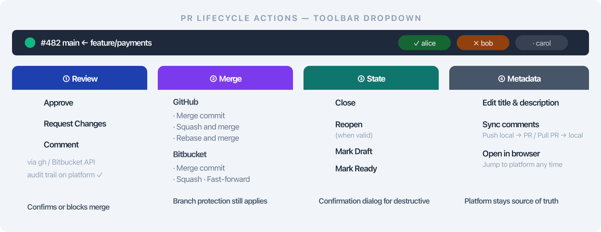
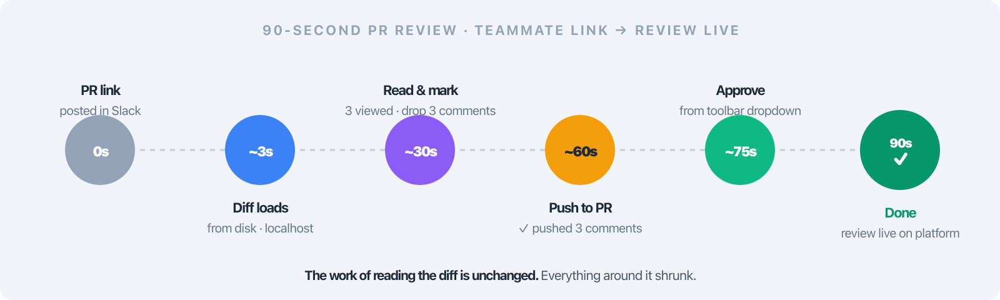

# branchdiff + GitHub & Bitbucket: A Local Lens for the Pull Request Workflow You Already Have

Here is a number nobody tracks but everyone feels: the number of tab switches in a single code review.

Open the PR. Switch to your editor to search for the function being changed. Switch back to the PR to find your place. Click a file in the sidebar. Scroll to the relevant hunk. The author pushes a fix commit — the diff resets to the top. Switch to Slack to tell them you were mid-read. Switch back. Find your place again. Copy a snippet into your AI assistant. Paste the AI's reply back as a comment. Tab-switch to the PR. Tab-switch back because you forgot which file you were on.

By the time you post your review, you have made twenty tab switches to do ten minutes of actual reading. That friction is not a big problem. It is a hundred small ones. And small frictions are the exact things that cause engineers to put review off until Friday afternoon when they are too tired to read carefully.

**branchdiff is not a replacement for GitHub or Bitbucket.** It is a local browser app that sits beside your editor and handles the reading, marking, commenting, and lifecycle actions — while every click that matters (merge gate, approval, audit trail, CI status) still happens on the platform, through the same APIs you would use anyway. The PR on the platform is still the source of truth. branchdiff is just a better cockpit for the part of review that does not benefit from being a cloud round-trip.

This post explains how those two layers fit together — what lives where, and why the seam is designed the way it is.

---

## The mental model: source of truth vs. working surface

Think of the PR on GitHub or Bitbucket as the **source of truth**. The review history, approvals, merge state, CI status, branch protection, and audit trail all live there. Nothing in branchdiff changes any of that. Your team's review process, your release process, and your compliance posture keep working exactly the way they always have.

branchdiff is the **working surface** for the part of review that is fundamentally local — reading the diff, marking files as you go, drafting comments, navigating between files, and running an AI pass. When you are ready, you sync the comments to the PR with one click and the platform takes over again.



The split in practice:

| Concern                              | GitHub / Bitbucket | branchdiff          |
| ------------------------------------ | :----------------: | :-----------------: |
| Merge gating, branch protection      | ✓                  |                     |
| CI / status checks                   | ✓                  |                     |
| Approvals & required reviewers       | ✓                  |                     |
| Final review comments                | ✓ (after sync)     | ✓ (drafted here)    |
| Reading the diff with full context   |                    | ✓                   |
| Marking files reviewed / stale       |                    | ✓                   |
| Running AI review or resolve         |                    | ✓                   |
| PR lifecycle clicks (approve, merge) | ✓ (canonical)      | ✓ (proxied via API) |

Everything in the right column is a convenience layer. Everything in the left column is still authoritative. Uninstall branchdiff tomorrow and your team's review process keeps working — you go back to clicking on the PR page. That is the design constraint the whole tool is built around.

---

## Opening any PR locally in seconds

Point branchdiff at a PR URL on either platform:

```bash
branchdiff https://github.com/owner/repo/pull/123
branchdiff https://bitbucket.org/workspace/repo/pull-requests/45
```

It resolves the base and head refs, runs `git fetch` if needed, and opens a browser tab at `http://localhost:5391` with the diff rendered — syntax highlighting for 150+ languages, split or unified view, a sidebar of changed files, keyboard navigation (`j`/`k` next/previous file, `n`/`p` next/previous hunk). The PR on the platform is untouched.

Named-ref comparisons (`main..feature`) get a **persistent review session** backed by a local SQLite file in `~/.branchdiff/`. Inline comments survive new commits — same idea as a GitHub PR thread, but stored on your machine, readable instantly, without a round-trip. If the author force-pushes mid-review, your view markers and drafts stay intact.

Multiple sessions are the default, not a workaround. Each unique ref pair opens on its own port — the second session on `5392`, the third on `5393`, and so on. Reviewing a teammate's PR while working on your own branch in another tab is just two browser tabs. `branchdiff list` shows everything running.

---

## PR lifecycle from the toolbar — a remote control, not a parallel database

The toolbar shows a dropdown for the open PR with the actions you would otherwise click on the platform. It is **not** a separate database of PR state. It is a remote control. Each action calls `gh` for GitHub or the Bitbucket REST API for Bitbucket, and the canonical PR records the action with the same timestamp it would have had if you had clicked on the website.



The dropdown groups four kinds of action:

**Review actions** — Approve, Request Changes, Comment. The Comment action posts a regular PR comment via `gh pr comment` (fixed in v1.5.1; the previous version mistakenly created a formal review object). Request Changes allows an optional comment; if you provide nothing, a default message is posted because both APIs require a review body.

**Merge action** — with a strategy picker. GitHub offers *Merge commit*, *Squash*, and *Rebase*; Bitbucket offers *Merge commit*, *Squash*, and *Fast-forward* (added in v1.5.1). Branch protection rules and required status checks still apply — if the PR cannot merge, the platform refuses and branchdiff surfaces the error inline.

**State actions** — Close, Reopen (only when valid), Mark as Draft, Mark Ready for Review.

**Metadata actions** — Edit title and description, Sync comments, Open in browser.

The dropdown header carries a **state dot** (green for open, purple for merged, red for closed) and a row of **reviewer pills** showing each reviewer's latest state — approved, changes requested, commented, pending, or dismissed. Destructive actions (merge, close, request changes) show a confirmation dialog; errors stay inline in the dialog so a typed message is not lost when the network blips.

---

## Comment sync — both directions, both opt-in

**Push local comments to the PR.** Draft comments in branchdiff (manually or via an AI pass), then click the PR badge in the toolbar and choose **Push to PR**. Each single-comment thread is posted as an inline review comment. Duplicates (same file, line, body) are skipped. Multi-reply threads stay local because the platform APIs do not map cleanly to them.

A status toast tells you what happened: `Pushed 3, skipped 1 duplicate, skipped 1 multi-reply thread`. Failures keep the local thread intact so you can fix the anchor and retry.

**Pull PR comments into branchdiff.** Same dialog, **Pull from PR**. Existing review comments come down as local threads anchored to the same lines, with author and timestamp preserved. This is what makes branchdiff practical for re-review — open the PR locally on day three, pull the comments, see every thread inline, mark them resolved as the author addresses them, push the resolutions back.

Sync requires your local HEAD to match the PR head and your working tree to be clean. branchdiff surfaces both constraints in the dialog with a one-line explanation (`git pull --rebase`, `git stash`).

This is the only cloud round-trip in the whole tool. No telemetry, no remote diff service. Wipe `~/.branchdiff/` and there is nothing in any backend with your data.

---

## A concrete 90-second flow



```bash
# Teammate posts: "PR is up — https://github.com/acme/api/pull/482"
branchdiff https://github.com/acme/api/pull/482
```

Browser opens in about three seconds. Toolbar shows `#482` with a green dot. Reviewer pills: one teammate already approved, one pending. You scroll the diff, mark a few files viewed, drop two `[suggestion]` comments and one `[must-fix]`. Click `#482` → **Push to PR**. Toast: "Pushed 3 comments." Click **Approve** in the dropdown. The toolbar updates to show your green pill.

Total wall-clock time: 90 seconds from "teammate posts link" to "PR has your review on it." The work of *reading* the diff is unchanged. Everything around it shrunk.

---

## Why this matters for AI-assisted review

AI is now part of almost every review, whether the team has formalised it or not. Engineers paste diffs into ChatGPT, run Copilot review, pipe `git diff` into `claude`. Done ad-hoc, that AI usage drifts — different people use different prompts, comments do not land on the right lines, and the context never makes it back to the PR.

branchdiff gives that AI usage a controlled, repeatable surface: the same diff the human is looking at, the same line numbers, the same comment threads, with explicit `branchdiff agent` commands so the AI cannot wander outside the review. Every AI comment lands on a real line, with a severity tag, in the same session as your manual comments. You can dismiss, resolve, or push selectively. The AI cannot post directly to the PR — it goes through the same command surface you use, and you stay the gate.

The next two posts in this series go deeper: self-review on your own branch before the PR opens, and AI-assisted review of teammates' PRs that syncs back to the canonical thread.

---

## What it honestly saves you

- **Fewer tab switches.** Diff, comments, AI assistant, and PR lifecycle all live on one local page that loads in milliseconds.
- **A consistent UX across GitHub and Bitbucket.** Review keystrokes are the same on either side — engineers who straddle both platforms stop having to learn two UIs.
- **No re-reading after a force-push.** Viewed / stale tracking remembers which files you have already looked at. You re-read only the parts that actually changed.
- **A predictable AI surface.** Systematic, tagged, dismissable. Not an ad-hoc paste-into-ChatGPT that leaves no trace.

---

## Where it stops

- **No CI.** The platform's checks are still the gate.
- **No cloud storage.** Wipe `~/.branchdiff/` and you lose local drafts that have not been pushed.
- **No multi-reply thread push.** Back-and-forth conversations belong on the PR.
- **No branch protection bypass.** Merge actions still respect required reviews and status checks on the platform.
- **No full PR page replacement.** The PR description, linked issues, and CI status block still live on the platform. *Open in browser* in the toolbar is one click away.

The tool is intentionally small. It does the part that benefits from being local, and gets out of the way of the part that benefits from being on the platform.

---

## Try it on a PR you already have open

Install from the [branchdiff releases page](https://encryptioner.github.io/branchdiff-releases/) — install instructions, changelogs, and uninstall steps are all there. Quickstart:

```bash
npm install -g @encryptioner/branchdiff
# or: pip install branchdiff
# or: brew tap encryptioner/branchdiff https://github.com/encryptioner/branchdiff-releases \
#          && brew install branchdiff

branchdiff https://github.com/your-org/your-repo/pull/123
```

Click the PR badge in the toolbar, watch the reviewer pills populate, push a comment back, check that it appears on the PR. The point is not "branchdiff vs. GitHub" — it is to see where your current review workflow keeps a tab open that does not need to be open.

---

## Let's Connect

I am always excited to hear what you are building. If you found this guide helpful, have questions, or just want to share your code review setup:

- **Website**: [encryptioner.github.io](https://encryptioner.github.io)
- **LinkedIn**: [Mir Mursalin Ankur](https://www.linkedin.com/in/mir-mursalin-ankur)
- **GitHub**: [@Encryptioner](https://github.com/Encryptioner)
- **X (Twitter)**: [@AnkurMursalin](https://twitter.com/AnkurMursalin)
- **Technical Writing**: [Nerddevs](https://nerddevs.com/author/ankur/)
- **Support**: [SupportKori](https://www.supportkori.com/mirmursalinankur)

*branchdiff releases, changelog, install & uninstall guide: [encryptioner.github.io/branchdiff-releases](https://encryptioner.github.io/branchdiff-releases/)*
