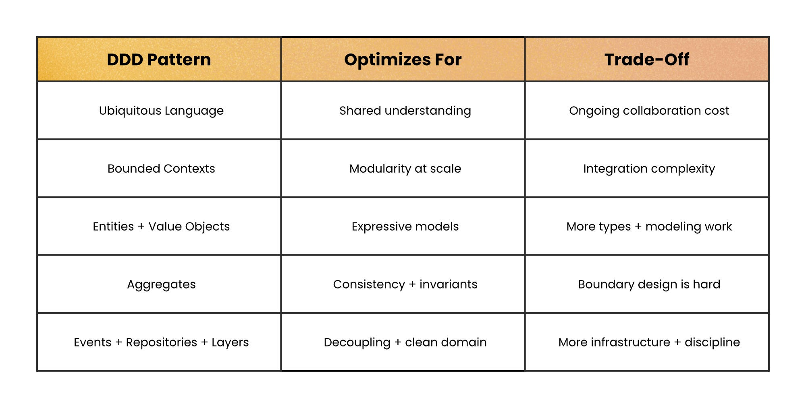
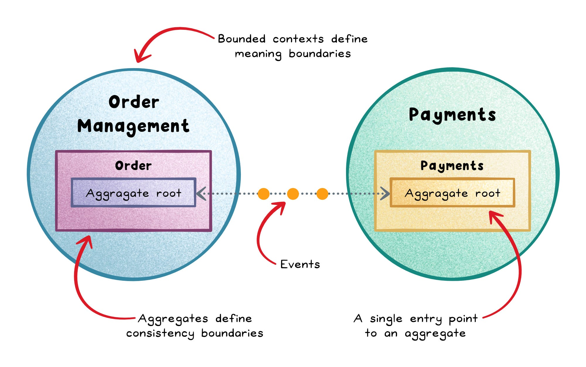

# Domain-Driven Design Deep Dive: Aggregates, Events, and Context Maps in Practice

> You don't adopt DDD by adding patterns. You adopt it by removing ambiguity.

This is the second of two posts on Domain-Driven Design. The [first post](./Domain-Driven%20Design%20for%20Beginners%20-%20What%20It%20Is%20and%20Why%20It%20Matters.md) covered the foundations — what a domain is, Ubiquitous Language, Bounded Contexts, Entities vs. Value Objects — using a bug caused by two teams disagreeing on what "Product" means. If any of those terms are unfamiliar, start there; this post assumes them.

Here, the same Order Management system keeps running, and hits four more real bugs — each one introduced before the pattern that fixes it, the same way as the first post. By the end, every pattern is wired together into a single request flow. A companion deck with the same content is available [here](../../../presentations/P-6-domain-driven-design/deep-dive.html).

---

## Quick Recap

| Pattern | Optimizes for | Trade-off |
|---|---|---|
| Ubiquitous Language | Shared understanding | Ongoing collaboration cost |
| Bounded Contexts | Modularity at scale | Integration complexity |
| Entities + Value Objects | Expressive models | More types + modeling work |
| **Aggregates** ← this post | Consistency + invariants | Boundary design is hard |
| **Events + Repositories** ← this post | Decoupling + clean domain | More infrastructure + discipline |

<div align="center">
  
  <br/>
  <sub>Source: Nikki Siapno, Level Up Coding — <a href="https://blog.levelupcoding.com/p/domain-driven-design-broken-down">"Domain-Driven Design, Broken Down"</a></sub>
</div>

The first three patterns give you vocabulary and boundaries. What follows is what makes those boundaries *safe to change* once real traffic and multiple teams are hitting them at once.

## The Bug: Two Code Paths, One Inconsistent Order

`Order` lives in the codebase as a plain data bag. Two different parts of the system are allowed to mutate it directly, with no single place enforcing what's actually allowed.

```ts
// order.ts — just a data shape, no rules attached
interface Order { id: string; status: "draft" | "placed"; lineItems: LineItem[]; }

// checkout-controller.ts
function addPromoItem(order: Order, item: LineItem) {
  order.lineItems.push(item);              // works even if the order was already placed
}

// admin-panel.ts — written by a different team, six months later
function forceAddItem(order: Order, item: LineItem) {
  order.lineItems.push(item);              // same mistake, independently
}
```

A customer support agent used the admin panel to "add a free gift" to an order that had *already shipped*. The warehouse re-picked the order, and that day's finance report no longer matched the shipped-items count. Two teams, zero communication between them, and the exact same underlying bug — because nothing in the code says an order can't change after it's been placed.

## Fix: Aggregates & the Aggregate Root

An **aggregate** is a cluster of domain objects treated as a single consistency boundary, controlled by one **aggregate root**. Outside code is only ever allowed to talk to the root — never to mutate the internals directly — so the rule ends up living in exactly one place instead of being re-implemented (or forgotten) by every caller.

```ts
class Order {                              // Aggregate Root — the only door in
  private lineItems: LineItem[] = [];
  private status: "draft" | "placed" = "draft";

  addLineItem(item: LineItem) {
    if (this.status !== "draft") {
      throw new Error("Cannot modify a placed order");   // the rule, enforced ONCE
    }
    this.lineItems.push(item);
  }

  place(): OrderPlaced {
    if (this.lineItems.length === 0) throw new Error("Cannot place an empty order");
    this.status = "placed";
    return new OrderPlaced(this.id, this.lineItems);      // see the next section
  }
}
```

Both `checkout-controller.ts` and `admin-panel.ts` now call `order.addLineItem(item)` — there is no other way to touch `lineItems`, so the "already shipped" bug is no longer something the code is even capable of expressing.

<div align="center">
  
  <br/>
  <sub>Source: Nikki Siapno, Level Up Coding — <a href="https://blog.levelupcoding.com/p/domain-driven-design-broken-down">"Domain-Driven Design, Broken Down"</a></sub>
</div>

**What you gain:** invariants live in exactly one place instead of being duplicated across controllers; transaction boundaries stop cleanly at the aggregate; the code reads like real business operations instead of database plumbing.
**What it costs:** choosing aggregate boundaries is genuinely hard — oversized aggregates become contention bottlenecks, undersized ones leak the very invariants they're supposed to protect. Workflows that cross aggregate boundaries need orchestration, which is exactly what the next pattern provides.

## The Bug: A Change in One Service Breaks Three Others

`OrderService.place()` looks harmless at first glance — until you look at everything it directly calls.

```ts
class OrderService {
  async place(order: Order) {
    const event = order.place();
    await inventoryService.reserveStock(event.lineItems);   // direct call
    await emailService.sendConfirmation(event.orderId);     // direct call
    await analyticsService.track("order_placed", event);    // direct call
    await loyaltyService.addPoints(event.orderId);           // direct call, added last sprint
  }
}
```

Every new subscriber to "an order was placed" means editing `OrderService` again, and now `OrderService` is coupled to four other teams' release schedules. When `inventoryService.reserveStock` was renamed during an unrelated refactor, `OrderService` broke in production — despite the change having nothing to do with placing an order.

## Fix: Domain Events

A **domain event** captures something meaningful that already happened in the domain, named in the past tense: `OrderPlaced`, `PaymentCompleted`. Inside its own context it's simply a fact; published outward, it becomes an **integration event** that other bounded contexts can subscribe to independently, without `OrderService` ever needing to know they exist.

```ts
class OrderPlaced {
  constructor(
    public readonly orderId: string,
    public readonly lineItems: LineItem[],
    public readonly occurredAt: Date = new Date()
  ) {}
}

class OrderService {
  async place(order: Order) {
    const event = order.place();
    eventBus.publish(event);      // ONE line — OrderService no longer knows who's listening
  }
}

// Each subscriber lives in its own context, wired independently:
eventBus.on(OrderPlaced, (e) => inventoryService.reserveStock(e.lineItems));
eventBus.on(OrderPlaced, (e) => emailService.sendConfirmation(e.orderId));
eventBus.on(OrderPlaced, (e) => loyaltyService.addPoints(e.orderId));
```

Renaming `reserveStock` tomorrow now only touches Inventory's own subscriber. `OrderService` never has to change again for a reason that has nothing to do with placing an order — new subscribers (shipping, fraud checks, whatever comes next) are added without touching it at all.

**What you gain:** lower coupling between contexts; a cleaner domain model that isn't cluttered with knowledge of every downstream consumer; infrastructure in one context can evolve independently of another.
**What it costs:** failures now surface later, since the reaction is asynchronous — and cross-context consistency needs deliberate design, because it's eventual rather than immediate.

## The Bug: SQL Buried Inside Business Logic

```ts
async function place(orderId: string) {
  const rows = await db.query(`SELECT * FROM orders WHERE id = $1`, [orderId]);
  const order = rows[0];
  if (order.status !== "draft") throw new Error("Cannot modify a placed order");
  await db.query(`UPDATE orders SET status = 'placed' WHERE id = $1`, [orderId]);
  // business rule and raw SQL string, tangled in the same function
}
```

A migration to a different column-naming convention broke every business-rule function that touched `orders`, simply because the rules and the SQL lived in the exact same place. Worse, nobody could unit test "can't place an empty order" without spinning up a real database first — the business rule and the infrastructure were inseparable.

## Fix: Repositories

A **repository** is a domain-facing interface for loading and saving aggregates — it hides persistence entirely behind domain vocabulary, so the domain model never has to import an ORM or embed a SQL string.

```ts
interface OrderRepository {
  findById(id: string): Promise<Order | null>;
  save(order: Order): Promise<void>;
}

// Domain / application layer — reads like business logic, not plumbing
async function placeOrder(orderId: string, repo: OrderRepository) {
  const order = await repo.findById(orderId);
  const event = order.place();      // Order.place() — pure business logic
  await repo.save(order);
  eventBus.publish(event);
}
```

Swap Postgres for DynamoDB, or rename every column in a migration — only the concrete `PostgresOrderRepository` implementation changes. `placeOrder` is now trivially unit-testable with an in-memory fake repository and zero database.

**What you gain:** persistence concerns never leak into business logic; the domain becomes directly, cheaply testable.
**What it costs:** one additional layer of indirection to write and keep honest — worth it exactly when the alternative is untestable business rules.

## The Bug: A Legacy Payment Gateway's Field Names, Everywhere

```ts
// scattered across 6 files, wherever a webhook happens to be handled
function handleWebhook(payload: any) {
  const orderId = payload.order_ref;                 // legacy snake_case
  const amount = payload.amt_cents / 100;             // legacy field, cents not dollars
  const currency = payload.cur;                       // legacy abbreviation
  // ...
}
```

The payment gateway vendor renamed `amt_cents` to `amount_minor_units` in a v2 API release. Six files broke, in six slightly different ways, because the vendor's own field naming had been allowed to leak directly into business logic scattered across the codebase.

## Fix: Context Mapping & the Anti-Corruption Layer

Bounded contexts don't exist in isolation forever — **context mapping** is the deliberate decision of how they integrate with each other, and with the outside world. Two shapes come up constantly:

- **Shared Kernel** — two contexts you control deliberately share a small, jointly-owned slice of the model (a common `Money` value object, say). Cheap to set up, but it couples both contexts to every future change in that slice.
- **Anti-Corruption Layer (ACL)** — a translation layer sitting at the boundary that converts an external system's model into your own, so a legacy system's or third party's assumptions never leak past that one boundary.

```ts
// payment-gateway-acl.ts — the ONLY file that knows the vendor's field names
function translateGatewayWebhook(payload: LegacyGatewayPayload): PaymentCompleted {
  return new PaymentCompleted(
    payload.order_ref,          // legacy snake_case, foreign field names
    Money.fromCents(payload.amt_cents, payload.cur)
  );
}
```

When the vendor ships their v2 API, exactly one function changes. The rule of thumb: reach for a Shared Kernel between two contexts your own team controls; reach for an ACL at the edge of anything you don't control — legacy systems, third-party APIs, or another team's service you can't fully trust to stay stable.

## It All Wires Together

```
Customer places an order
        │
        ▼
 ┌─────────────────┐   Order.place()         ┌──────────────────┐
 │ Order (Aggregate │ ───────────────────────▶│ OrderPlaced event │
 │      Root)       │   enforces invariants   └──────────────────┘
 └─────────────────┘                                   │
        │  OrderRepository.save()                      │  published on event bus
        ▼                                               ▼
 ┌─────────────────┐                          ┌───────────────────┐
 │   Persistence    │                          │ Inventory context  │
 │ (hidden by repo) │                          │ reserves stock     │
 └─────────────────┘                          └───────────────────┘
                                                          │
                                                          ▼
                                                ┌───────────────────┐
                                                │ Payments context   │
                                                │ (via ACL, external │
                                                │  gateway webhook)  │
                                                └───────────────────┘
```

Ubiquitous Language named every box the way the business itself would name it. Bounded Contexts stopped Order Management, Inventory, and Payments from fighting over what "Product" means. The Aggregate stopped the admin-panel bug from existing at all. The Event decoupled Inventory from Order's internals, so one rename no longer breaks four unrelated services. The Repository kept SQL out of the domain, so business rules became unit-testable. The Anti-Corruption Layer kept a vendor's v2 migration contained to a single file.

## Checklist: Take It Back to Your Codebase

- [ ] Find your biggest "plain data bag" — a type anyone in the codebase can mutate from anywhere. That's a missing aggregate root.
- [ ] Grep for a function name that gets called directly from three or more unrelated files. That's a missing domain event.
- [ ] Grep your domain or business-logic layer for `SELECT`, `UPDATE`, or an ORM import. That's a missing repository.
- [ ] At every integration with a system you don't control, check whether there's one translation file — or whether the vendor's field names are scattered everywhere. That's a missing Anti-Corruption Layer.

And the reminder that bears repeating from the first post: simple CRUD apps, no sustained access to domain experts, and short-lived or low-impact projects are exactly where DDD does *not* pay off. Reach for it where the domain — not the plumbing — is genuinely the hard part.

## Sources

- ByteByteGo — [Domain-Driven Design (DDD) Demystified](https://blog.bytebytego.com/p/domain-driven-design-ddd-demystified)
- Nikki Siapno, Level Up Coding — [Domain-Driven Design, Broken Down](https://blog.levelupcoding.com/p/domain-driven-design-broken-down)
- Level Up Coding — [LUC #77: Domain-Driven Design Demystified](https://blog.levelupcoding.com/luc-77-domain-driven-design-demystified-bridging-development-and-business-needs)
- Companion deck: [Deep Dive — Aggregates, Events, Context Maps](../../../presentations/P-6-domain-driven-design/deep-dive.html)
