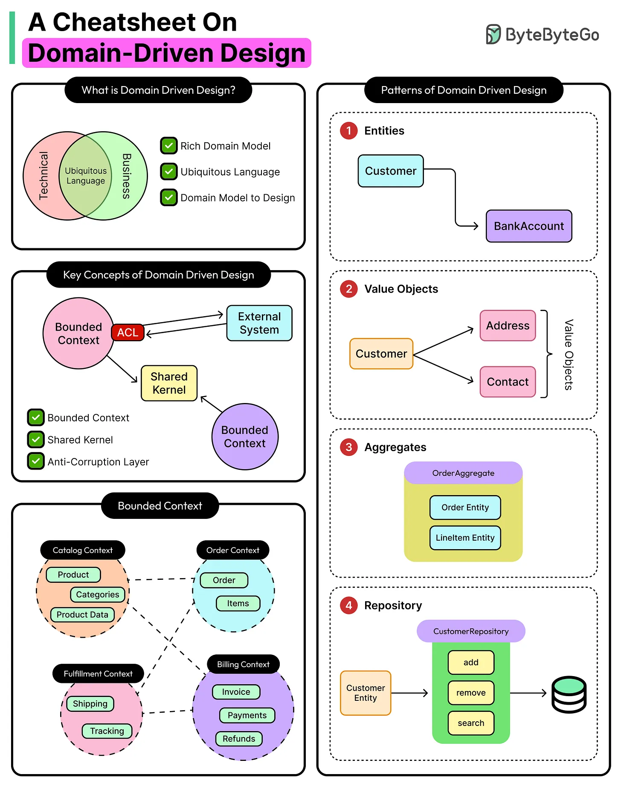
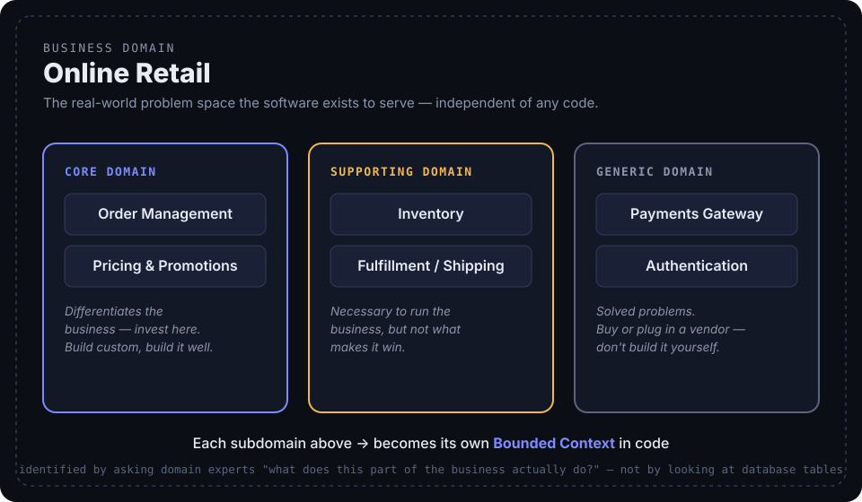
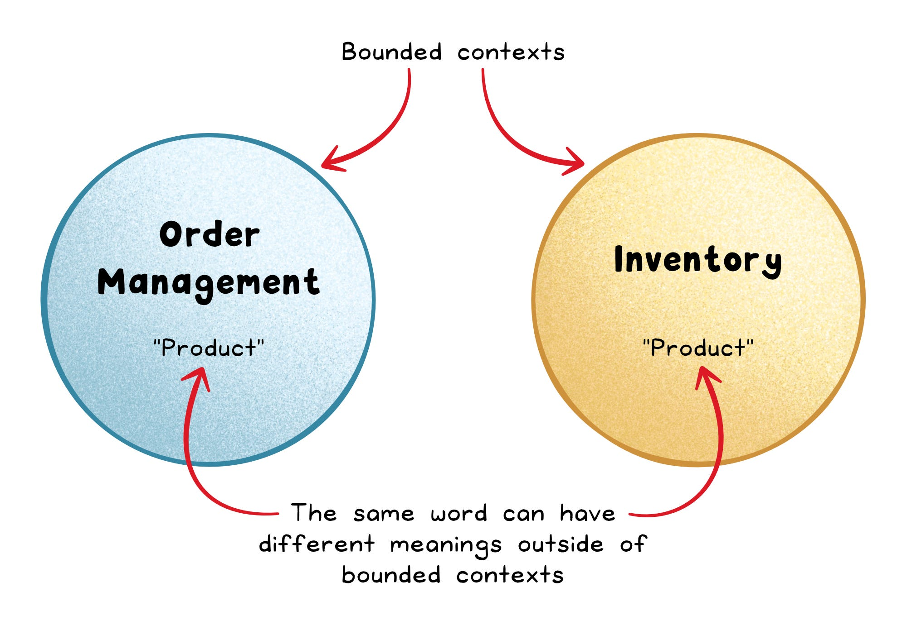
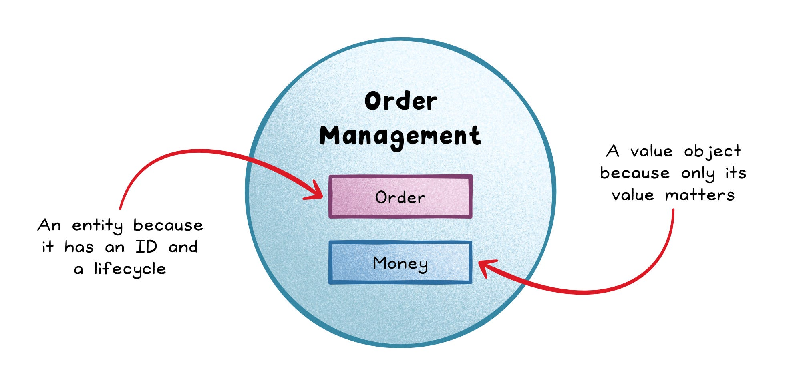

# Domain-Driven Design for Beginners: What It Is and Why It Matters

> Most software doesn't break because of syntax errors or flawed if-else logic. It breaks because teams lose alignment with the business problem they're supposed to solve.

Domain-Driven Design (DDD) has a reputation for being academic — a term you hear in architecture meetings, attached to diagrams full of circles and arrows, that never quite turns into something you can use on Monday morning. This post takes the opposite approach: it starts with a real bug, shows exactly why it happened, and only then names the pattern that would have prevented it. No new vocabulary before you've seen the problem it solves.

This is the first of two posts. This one covers the foundations — what a "domain" even is, and the three patterns that fix miscommunication between teams. The [deep dive](./Domain-Driven%20Design%20Deep%20Dive%20-%20Aggregates%2C%20Events%2C%20and%20Context%20Maps%20in%20Practice.md) picks up from here and covers Aggregates, Domain Events, Repositories, and Context Mapping — the patterns that keep a model safe to change once real traffic and multiple teams hit it.

A companion presentation deck (with the same examples, built for a 15-minute walkthrough) is available [here](../../../presentations/P-6-domain-driven-design/intro.html).

---

## The Bug: Two Teams, One Word, Two Meanings

Picture two small services inside an online store. Both use a type called `Product`. Neither team thinks there's a problem.

```ts
// InventoryService — "price" is the wholesale cost we pay the supplier
class Product { sku: string; price: number; stockCount: number; }

// OrderService — imports the SAME Product type from a shared "models" folder
// and charges the customer this "price" directly
function calculateTotal(product: Product, qty: number) {
  return product.price * qty;   // customer is charged supplier COST, not retail price
}
```

Nobody wrote a bug, exactly. Both teams used a perfectly reasonable field named `price`. The system still shipped a real one: **customers were charged wholesale cost** for weeks before anyone noticed margins had quietly collapsed.

There was no agreement on what "Product" — or "price" — actually means, and nothing in the codebase stopped one team's meaning from leaking into another team's logic. This is the exact failure mode Domain-Driven Design exists to prevent.

## Why This Keeps Happening

Early-stage systems rarely have this problem, and that's worth noticing: it's not a maturity issue, it's a *scale* issue.

- **Early systems succeed** because one or two people hold the entire mental model of the business in their head. There's no room for "Product" to mean two things — there's only one person deciding what it means.
- **Late-stage systems fail** because that model fractures. Teams grow, terminology drifts between groups that rarely talk to each other, and the code becomes a progressively worse translation of what the business actually does.
- Features get bolted on without anyone stepping back to ask whether the existing model still makes sense. Every new requirement piles another special case onto assumptions that were already stale.

This is rarely a tooling problem. Better linters and better frameworks would not have caught the wholesale/retail bug — it's a *modeling* problem, and that's exactly the moment DDD targets. As ByteByteGo puts it in their explainer on the topic: the hardest part of a complex product was never the codebase. It's agreeing on what the business is actually doing.

## What Is Domain-Driven Design?

Domain-Driven Design is an approach to software design that puts the **business domain** — not the database schema, not the framework du jour — at the center of every decision. It requires engineers to collaborate deeply and continuously with domain experts (the people who actually run the business), not just gather requirements once at kickoff and disappear into a backlog.

A few things worth being upfront about:

- **It's not a silver bullet.** DDD doesn't generate code, and it won't magically fix a legacy monolith by itself.
- **What it gives you instead** is clarity about what the system is supposed to do, and where it's actually safe to change something without breaking an unrelated part of the business.
- **It's architecture-agnostic.** DDD works whether you're building a monolith or a constellation of microservices — what matters is whether the model reflects real domain rules, and whether that model can evolve safely as the domain changes.

<div align="center">
  
  <br/>
  <sub>Source: <a href="https://blog.bytebytego.com/p/domain-driven-design-ddd-demystified">ByteByteGo — "Domain-Driven Design (DDD) Demystified"</a></sub>
</div>

## What Is a Domain, Actually?

Before any of the DDD-specific vocabulary makes sense, "domain" needs a plain, non-circular definition:

- **Domain** = the real-world subject matter and activity your software exists to serve, independent of any code. "Online retail," "flight booking," and "health insurance claims processing" are all domains.
- **Business domain** = the specific domain *your* organization operates in. For the running example in this post, the business domain is **Online Retail**.
- A business domain is made up of **subdomains** — distinct areas of responsibility that don't have to be treated equally:
  - **Core subdomain** — what makes the business money or wins the market. Invest here, and build it well, because it's your competitive advantage: *Order Management, Pricing & Promotions*.
  - **Supporting subdomain** — necessary to run the business, but not the differentiator: *Inventory, Fulfillment/Shipping*.
  - **Generic subdomain** — a solved problem that every business in this space needs. Buy it or plug in a vendor; don't spend engineering time reinventing it: *Payments Gateway, Authentication*.

**How to actually identify domains in a real system:** don't start by looking at your database tables — start by asking domain experts "what does this part of the business actually do?" Each distinct answer becomes a subdomain, and each subdomain typically becomes its own **Bounded Context** in code (more on that shortly).

<div align="center">
  
</div>

That mapping isn't just a diagram exercise — it shows up directly in how you organize code:

```
src/
├── order-management/   ← Core domain (Bounded Context)
│   ├── Order.ts
│   └── OrderRepository.ts
├── inventory/           ← Supporting domain (Bounded Context)
│   └── Product.ts
├── fulfillment/         ← Supporting domain (Bounded Context)
├── payments/            ← Generic domain — thin wrapper around a payment SDK
└── auth/                ← Generic domain — thin wrapper around Auth0 / Cognito
```

Notice what this buys you immediately: a new engineer can look at the folder structure and understand the shape of the business, not just the shape of the framework.

## Fix #1: Ubiquitous Language

Most teams *think* they share vocabulary. They usually don't. In meetings, everyone nods along when someone says "order" or "product" — in code, those same words quietly drift into something else, exactly as they did in the bug above.

**Ubiquitous language** is a shared vocabulary that developers and domain experts use everywhere: meetings, tickets, documentation, and code. There is only one term for a given concept — you stop translating "business terms" into "engineering terms," because there's no translation step left to skip.

Applied to the bug from earlier, the fix starts with a fifteen-minute glossary conversation, not a code review comment:

```ts
// After a 15-minute glossary conversation with the business:
// "price" the business pays a supplier is a WholesaleCost.
// "price" the customer pays is a RetailPrice. They are never the same field.
class Product { sku: string; wholesaleCost: Money; retailPrice: Money; stockCount: number; }

function calculateTotal(product: Product, qty: number) {
  return product.retailPrice.multiply(qty);   // unambiguous — reads like the business talks
}
```

| Without ubiquitous language | With ubiquitous language |
|---|---|
| Business says "cancel an order"; code has `deactivateRecord()` | Code has `order.cancel()` — same verb the business uses |
| New engineers reverse-engineer meaning from schema columns | New engineers read domain names and understand behavior directly |
| "Customer" means five different things across five services | "Customer" means one thing, enforced by a bounded context |

**What you gain:** shared meaning across the team, more readable code, and better decisions — because clear terms tend to expose missing rules, exactly like the wholesale/retail distinction did here.
**What it costs:** upfront workshop time with domain experts, and ongoing discipline — sloppy naming quietly breaks the whole benefit.

## Fix #2: Bounded Contexts

Renaming one field fixes one bug. It does not stop the *next* engineer from importing the wrong `Product` again next quarter, because there is still only one shared `Product` type serving two genuinely different meanings. Shared language breaks down at scale — not because people are careless, but because the business itself is not one single thing.

A **bounded context** is a clear boundary within which a particular model and language apply. Outside that boundary, the same word can legitimately mean something else. The fix is to give each meaning its own model entirely:

```ts
// inventory-context/Product.ts — Inventory's own model, not shared
class Product { sku: string; wholesaleCost: Money; stockCount: number; }

// order-context/Product.ts — Order Management's own model, not shared
class Product { sku: string; retailPrice: Money; }   // no wholesaleCost field even exists here
```

<div align="center">
  
  <br/>
  <sub>Source: Nikki Siapno, Level Up Coding — <a href="https://blog.levelupcoding.com/p/domain-driven-design-broken-down">"Domain-Driven Design, Broken Down"</a></sub>
</div>

There is no shared "models" folder to accidentally import from anymore — the two `Product`s are entirely different types living in different modules. The confusion isn't fixed by discipline this time; it's structurally impossible.

**What you gain:** one model no longer becomes a "big ball of mud" trying to mean everything at once; teams evolve their own contexts independently; local refactors stay local.
**What it costs:** you now have to deliberately design how contexts talk to each other when they do need to interact (covered in the deep-dive post); getting a boundary wrong creates duplicated logic.

## Building Blocks Inside a Context: Entities vs. Value Objects

Once you're inside a single bounded context, you still need to model the domain correctly rather than just moving the mess one level down. Two kinds of building blocks do most of the work:

- **Entity** — defined by identity and lifecycle. A `Customer` stays the same person even after their address changes. Entities are **mutable**.
- **Value Object** — defined only by its values, and usually immutable. `Money` has no identity of its own — two `Money` objects holding the same amount and currency *are* the same value, full stop. Value objects are **immutable**.

```ts
class Customer {                 // Entity — has an ID that outlives any single attribute
  constructor(public readonly id: string, private address: Address) {}
  relocate(newAddress: Address) { this.address = newAddress; } // same customer, new address
}

class Money {                    // Value Object — immutable, compared by value, no ID
  constructor(public readonly amount: number, public readonly currency: string) {}
  multiply(qty: number) { return new Money(this.amount * qty, this.currency); }
}
```

<div align="center">
  
  <br/>
  <sub>Source: Nikki Siapno, Level Up Coding — <a href="https://blog.levelupcoding.com/p/domain-driven-design-broken-down">"Domain-Driven Design, Broken Down"</a></sub>
</div>

**What you gain:** clearer intent in the code (identity and attributes stop being mixed together), fewer accidental bugs from shared mutable state, and domain behavior you can test directly.
**What it costs:** more types to write upfront, and the discipline not to slip into "anemic models" — plain data bags with no behavior — which throws away most of the benefit.

## When to Reach for DDD (and When Not To)

DDD is a tool, not a default. Reach for it when:

- The domain is complex and keeps evolving — think finance, healthcare, logistics, or large marketplaces.
- Multiple teams work on overlapping parts of the same system.
- The system needs to live and change safely for years, not months.

Skip it when:

- The app is mostly CRUD — DDD adds layers and coordination overhead you don't need.
- You can't get sustained access to domain experts — DDD becomes guesswork, and guesswork hardens into code faster than you'd expect.
- The project is short-lived or low-impact — the modeling investment won't pay itself back.

You don't adopt DDD by sprinkling in patterns for their own sake. You adopt it by removing ambiguity — starting with the words your team actually uses.

## What's Next

The wholesale/retail example isn't finished. In the [deep-dive post](./Domain-Driven%20Design%20Deep%20Dive%20-%20Aggregates%2C%20Events%2C%20and%20Context%20Maps%20in%20Practice.md), the same Order Management system runs into an inconsistent-total bug that **Aggregates** fix, a tightly-coupled service call that **Domain Events** fix, SQL leaking straight into business logic that **Repositories** fix, and a legacy payment gateway's field names leaking into the domain that the **Anti-Corruption Layer** fixes.

## Sources

- ByteByteGo — [Domain-Driven Design (DDD) Demystified](https://blog.bytebytego.com/p/domain-driven-design-ddd-demystified)
- Nikki Siapno, Level Up Coding — [Domain-Driven Design, Broken Down](https://blog.levelupcoding.com/p/domain-driven-design-broken-down)
- Companion deck: [Intro — DDD for Beginners](../../../presentations/P-6-domain-driven-design/intro.html)
